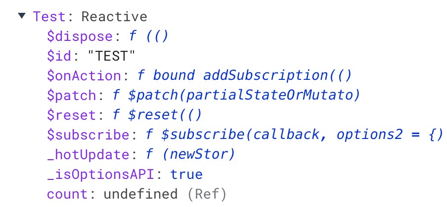

## State 是允许直接修改值的

```vue
<template>
     <div>
         <button @click="Add">加加加</button>
          <div>
             {{Test.count}}
          </div>
     </div>
</template>
 
<script setup lang='ts'>
import {useTestStore} from './store'
const Test = useTestStore()
const Add = () => {
    Test.count++
}
 
</script>
```

## 批量修改State的值

> 在store的实例上有`$patch`方法可以批量修改多个值



```vue
<template>
     <div>
         <button @click="Add">加加加</button>
          <div>
             {{Test.current}}
          </div>
          <div>
            {{Test.age}}
          </div>
     </div>
</template>
 
<script setup lang='ts'>
import {useTestStore} from './store'
const Test = useTestStore()
const Add = () => {
    Test.$patch({
       current:200,
       age:300
    })
}
 
</script>
```

### 批量修改函数形式

> 推荐使用函数形式，可以自定义修改逻辑

```vue
<template>
     <div>
         <button @click="Add">+</button>
          <div>
             {{Test.count}}
          </div>
     </div>
</template>
 
<script setup lang='ts'>
import {useTestStore} from './store'
const Test = useTestStore()
const Add = () => {
    Test.$patch((state)=>{
       state.count++;
    })
}
 
</script>
```

## 通过actions修改state

> 在actions 中直接使用this就可以指到state里面的值

```ts
import { defineStore } from 'pinia'
import { Names } from './store-naspace'
export const useTestStore = defineStore(Names.TEST, {
     state:()=>{
         return {
            count:1,
         }
     },
 
     actions:{
         setCount () {
             this.count++
         }
     }
})
```

在实例上直接调用

```vue
<template>
     <div>
         <button @click="Add">+</button>
          <div>
             {{Test.count}}
          </div>
     </div>
</template>
 
<script setup lang='ts'>
import {useTestStore} from './store'
const Test = useTestStore()
const Add = () => {
     Test.setCount()
}
 
</script>
```

## 通过原始对象修改整个实例

`$state`您可以通过将store的属性设置为新对象来替换store的整个状态

缺点就是必须修改整个对象的所有属性

```vue
<template>
     <div>
         <button @click="Add">+</button>
          <div>
             {{Test.current}}
          </div>
          <div>
            {{Test.age}}
          </div>
     </div>
</template>
 
<script setup lang='ts'>
import {useTestStore} from './store'
const Test = useTestStore()
const Add = () => {
    Test.$state = {
       current:10,
       age:30
    }    
}
 
</script>
```

