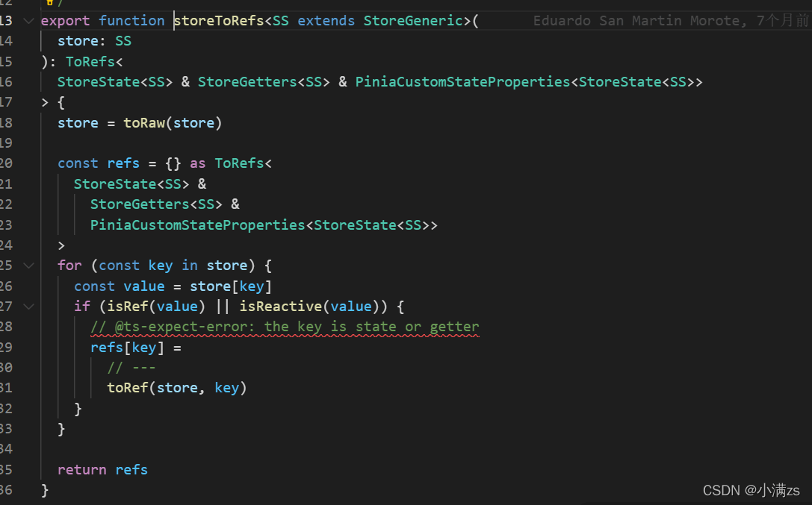

## 解构store

> 在Pinia是不允许直接解构是会失去响应性的

```ts
const Test = useTestStore()
 
const { current, name } = Test
 
console.log(current++, name); // 修改Test current 解构完之后的数据不会变
```

> 解决方案可以使用` storeToRefs`

```ts
import { storeToRefs } from 'pinia'
 
const Test = useTestStore()
 
const { current, name } = storeToRefs(Test)
```

其原理跟`toRefs` 一样的给里面的数据包裹一层`toref`

源码通过`toRaw`使store变回原始数据防止重复代理

循环store 通过 `isRef`, `isReactive` 判断，如果是响应式对象直接拷贝一份给refs 对象，将其原始对象包裹`toRef` 使其变为响应式对象

