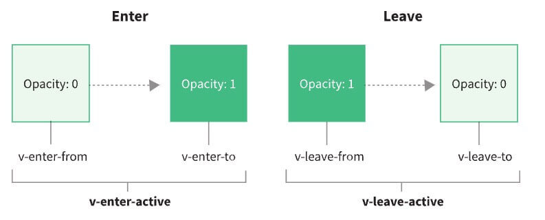

## 一、 v-for 中的 Ref 数组

### Vue 2.x

> 在 Vue 2 中，在 `v-for` 中使用的 `ref` attribute 会用 ref 数组填充相应的 `$refs` property

```vue
<template>
	<div v-for="item in list" ref="setItemRef"></div>
<template>
<script>
  export default {
    methods: {
      ItemRef() {
        console.log(this.$refs.setItemRef); // [div, div, div, ...]
      }
    }
  }
</script>
```

###  Vue 3.x

> 在 Vue 3 中，此类用法将不再自动创建 `$ref` 数组。要从单个绑定获取多个 ref，将 `ref` 绑定到函数上

**注意**：

- `itemRefs` 不必是数组：它也可以是一个对象，其 ref 可以通过迭代的 key 被设置。
- 如有需要，`itemRefs` 也可以是响应式的，且可以被侦听。

```vue
<template>
	<div v-for="item in list" :ref="setItemRef"></div>
<template>
```

```vue
<!-- 结合选项式 API -->
<script>
	export default {
  data() {
    return {
      itemRefs: []
    }
  },
  methods: {
    setItemRef(el) {
      if (el) {
        this.itemRefs.push(el)
      }
    }
  },
  beforeUpdate() {
    this.itemRefs = []
  },
  updated() {
    console.log(this.itemRefs) // Proxy {0: div, 1: div, .....}
  }
}
</script>
```

```vue
<!-- 结合组合式 AP -->
import { onBeforeUpdate, onUpdated } from 'vue'

export default {
  setup() {
    let itemRefs = []
    const setItemRef = el => {
      if (el) {
        itemRefs.push(el)
      }
    }
    onBeforeUpdate(() => {
      itemRefs = []
    })
    onUpdated(() => {
      console.log(itemRefs)
    })
    return {
      setItemRef
    }
  }
}
```

## 二、插槽统一

> **移除** **`this.$scopedSlots`**
>
> 将所有 `this.$scopedSlots` 替换为 **`this.$slots`**
>
> 将所有 `this.$slots.mySlot` 替换为 **`this.$slots.mySlot()`**

### 1. Vue 2.x

当使用渲染函数，即 `h` 时，2.x 曾经在内容节点上定义 `slot` 数据 property。

```js
// 2.x 语法
h(LayoutComponent, [
  h('div', { slot: 'header' }, this.header),
  h('div', { slot: 'content' }, this.content)
])
```

此外，可以使用以下语法引用作用域插槽：

```js
// 2.x 语法
this.$scopedSlots.header
```

#### 元素渲染方面

```vue
<template slot="t1" slot-scope="scope">
	<div>
    具名插槽t1，数据{{scope.data}}
  </div>
</template>
<!-- 或者v-slot -->
<template v-slot:t1="scope"> <!-- 简写：#t1="scope" -->
	<div>
    具名插槽t1，数据{{scope.data}}
  </div>
</template>
```

### 2. Vue 3.x

在 3.x 中，插槽以对象的形式定义为当前节点的子节点：

```js
// 3.x Syntax
h(LayoutComponent, {}, {
  header: () => h('div', this.header),
  content: () => h('div', this.content)
})
```

当你需要以编程方式引用作用域插槽时，它们现在被统一到 `$slots` 选项中了。

```js
// 2.x 语法
this.$scopedSlots.header

// 3.x 语法
this.$slots.header()
```

#### 元素渲染方面

> 移除 **`slot`** 和 **`slot-scope`**,仅仅保留使用 **`v-slot`**

```vue
<template v-slot:t1="scope"> <!-- 简写：#t1="scope" -->
	<div>
    具名插槽t1，数据{{scope.data}}
  </div>
</template>
```

#### 具名插槽

```vue
# 子组件
<div>
  <slot name="header"></slot>
  <slot></slot>
  <slot name="footer"></slot>
</div>

# 父组件
<Dialog>
  <template v-slot:header>
  	<div>1</div>
  </template>
  <template v-slot>
  	<div>2</div>
  </template>
  <template v-slot:footer>
		<div>3</div>
  </template>
</Dialog>
```

#### 作用域插槽

在子组件动态绑定参数 派发给父组件的slot去使用

```vue
<div>
  <slot name="header"></slot>
  <div>
    <div v-for="item in 100">
      <slot :data="item"></slot>
    </div>
  </div>
  <slot name="footer"></slot>
</div>
```

父组件结构取值

```vue
<Dialog>
  <template #header>
		<div>1</div>
  </template>
  <template #default="{ data }">
		<div>{{ data }}</div>
  </template>
  <template #footer>
		<div>3</div>
  </template>
</Dialog>
```

#### 动态插槽

插槽可以是一个变量名

```vue
<template>
	<Dialog>
  	<template #[name]>
    	<div>
      	23
  		</div>
		</template>
	</Dialog>
</template>
<script setup>
	const name = ref('header')
</script>
```


## 三、attribute 强制行为

### 2.x 和 3.x 行为的比较

| Attributes                                                   | `v-bind` 的值 2.x            | `v-bind` 的值 3.x   | HTML 输出 |
| ------------------------------------------------------------ | ---------------------------- | ------------------- | --------- |
| 2.x “枚举 attribute” 即 `contenteditable`、`draggable` 与 `spellcheck`。 | `undefined`                  | `undefined`, `null` | *被移除*  |
| `true`, `'true'`, `''`, `1`, `'foo'`                         | `true`, `'true'`             | `"true"`            |           |
| `null`, `false`, `'false'`                                   | `false`, `'false'`           | `"false"`           |           |
| 其他非布尔 attribute 如 `aria-checked`、`tabindex`、`alt` 等等。 | `undefined`, `null`, `false` | `undefined`, `null` | *被移除*  |
| `'false'`                                                    | `false`, `'false'`           | `"false"`           |           |

## 四、`$attrs`包含`class`&`style`

### Vue2.x

> `$attrs` 现在包含了*所有*传递给组件的 attribute，但不包括 **`class`** 和 **`style`**。

上述行为在使用 **`inheritAttrs: false`** 时会产生副作用：

- `$attrs` 中的 attribute 将不再被自动添加到根元素中，而是由开发者决定在哪添加。
- 但是 `class` 和 `style` 不属于 `$attrs`，它们仍然会被应用到组件的根元素中：

```vue
<template>
  <label>
    <input type="text" v-bind="$attrs" />
  </label>
</template>
<script>
export default {
  inheritAttrs: false
}
</script>
```

像这样使用时：

```html
<my-component id="my-id" class="my-class"></my-component>
```

将生成以下 HTML：

```html
<label class="my-class">
  <input type="text" id="my-id" />
</label>
```

### Vue3.x

> `$attrs` 现在包含了*所有*传递给组件的 attribute，包括 **`class`** 和 **`style`**。

`$attrs` 包含了*所有的* attribute，这使得把它们全部应用到另一个元素上变得更加容易了。现在上面的示例将生成以下 HTML：

```html
<label>
  <input type="text" id="my-id" class="my-class" />
</label>
```

## 五、自定义指令

### Vue 2.x

在 Vue 2 中，自定义指令通过使用下列钩子来创建，以对齐元素的生命周期，它们都是可选的：

- **bind** - 指令绑定到元素后调用。只调用一次。
- **inserted** - 元素插入父 DOM 后调用。
- **update** - 当元素更新，但子元素尚未更新时，将调用此钩子。
- **componentUpdated** - 一旦组件和子级被更新，就会调用这个钩子。
- **unbind** - 一旦指令被移除，就会调用这个钩子。也只调用一次。

#### **边界情况：访问组件实例**

在 Vue 2 中，必须通过 `vnode` 参数访问组件实例：

```js
bind(el, binding, vnode) {
  const vm = vnode.context
}
```

### Vue 3.x

> 在 Vue 3 中，统一生命周期
>
> - **created** - 新增！在元素的 **attribute** 或**事件监听器**被应用之前调用。
> - bind → **beforeMount**：当指令第一次绑定到元素并且在挂载父组件之前调用
> - inserted → **mounted**：在绑定元素的父组件被挂载前调用
> - **beforeUpdate**：新增！在元素本身被更新之前调用，与组件的生命周期钩子十分相似。
> - update → 移除！该钩子与 `updated` 有太多相似之处，因此它是多余的。改用 **`updated`**。
> - componentUpdated → **updated**：在包含组件的 VNode **及其子组件的 VNode** 更新后调用
> - **beforeUnmount**：新增！与组件的生命周期钩子类似，它将在元素被卸载之前调用(在卸载绑定元素的父组件之前调用)。
> - unbind -> **unmounted**：当指令与元素解除绑定且父组件已卸载时，只调用一次。

最终的 API 如下：

```js
const MyDirective = {
  created(el, binding, vnode, prevVnode) {}, // 新增
  beforeMount() {},
  mounted() {},
  beforeUpdate() {}, // 新增
  updated() {},
  beforeUnmount() {}, // 新增
  unmounted() {}
}
```

示例：

```html
<p v-highlight="'yellow'">以亮黄色高亮显示此文本</p>
```

```js
const app = Vue.createApp({})

app.directive('highlight', {
  beforeMount(el, binding, vnode) {
    el.style.background = binding.value
  }
})
```

在`setup`中定义局部指令

```js
// 注册一个局部的自定义指令，需要以小写v开头
const vFocus = {
	mounted(el) {
    // 获取input，并调用其focus()方法
    el.focus()
  }
}
```

#### **边界情况：访问组件实例**

在 Vue 3 中，实例现在是 `binding` 参数的一部分：

```js
mounted(el, binding, vnode) {
  const vm = binding.instance
}
```

#### 在组件中使用

和[非 prop 的 attribute](https://v3.cn.vuejs.org/guide/component-attrs.html) 类似，当在组件中使用时，自定义指令总是会被应用在组件的根节点上。

```vue-html
<my-component v-demo="test"></my-component>
```

```js
app.component('my-component', {
  template: `
    <div> // v-demo 指令将会被应用在这里
      <span>My component content</span>
    </div>
  `
})
```

> 和 attribute 不同，指令不会通过 **`v-bind="$attrs"`** 被传入另一个元素
>
> 有了[片段](https://v3.cn.vuejs.org/guide/migration/fragments.html#概览)的支持，组件可能会有多个根节点。当被应用于多根组件时，自定义指令将被忽略，并将抛出警告。

#### 函数简写

在 **`mounted`** 和 **`updated`** 时触发相同行为，而不关心其他的钩子函数。那么你可以通过将这个回调函数传递给指令来实现：

```js
app.directive('pin', (el, binding) => {
  el.style.position = 'fixed'
  const s = binding.arg || 'top'
  el.style[s] = binding.value + 'px'
})
```

#### 对象字面量

如果指令需要多个值，可以传入一个 JavaScript 对象字面量。记住，指令函数能够接受所有合法的 JavaScript 表达式。

```vue-html
<div v-demo="{ color: 'white', text: 'hello!' }"></div>
```

```js
app.directive('demo', (el, binding) => {
  console.log(binding.value.color) // => "white"
  console.log(binding.value.text) // => "hello!"
})
```

## 六、与自定义元素的互操作性

> - **非兼容**：检测并确定哪些标签应该被视为自定义元素的过程，现在会在模板编译期间执行，且应该通过编译器选项而不是运行时配置来配置。
> - **非兼容**：特殊的 `is` attribute 的使用被严格限制在保留的 `<component>` 标签中。
> - **新增**：为了支持 2.x 在原生元素上使用 `is` 的用例来处理原生 HTML 解析限制，我们用 `vue:` 前缀来解析一个 Vue 组件。

### 自主定制元素

想要在 Vue 外部定义添加自定义元素 (例如使用 Web Components API)，则需要“指示”Vue 将其视为自定义元素。让我们以下面的模板为例。

```html
<plastic-button></plastic-button>
```

#### Vue 2.x

在 Vue 2.x 中，通过 `Vue.config.ignoredElements` 将标签配置为自定义元素：

```js
// 这将使 Vue 忽略在其外部定义的自定义元素
// (例如：使用 Web Components API)

Vue.config.ignoredElements = ['plastic-button']
```

#### Vue 3.x

**在 Vue 3.0 中，此检查在模板编译期间执行**。要指示编译器将 `<plastic-button>` 视为自定义元素：

- 如果使用构建步骤：给 Vue 模板编译器传入 `isCustomElement` 选项。如果使用了 `vue-loader`，则应通过 `vue-loader` 的 `compilerOptions` 选项传递：

  ```js
  // webpack 中的配置
  rules: [
    {
      test: /\.vue$/,
      use: 'vue-loader',
      options: {
        compilerOptions: {
          isCustomElement: tag => tag === 'plastic-button'
        }
      }
    }
    // ...
  ]
  ```

- 如果使用动态模板编译，请通过 `app.config.compilerOptions.isCustomElement` 传递：

  ```js
  const app = Vue.createApp({})
  app.config.compilerOptions.isCustomElement = tag => tag === 'plastic-button'
  ```

### 定制内置元素 is属性

在 3.0 中，我们将 Vue 对 `is` attribute 的特殊处理限制在了 `<component>` 标签中。

- 在保留的 `<component>` 标签上使用时，它的行为将与 2.x 中完全相同；

- 在**普通组件**上使用时，它的行为将类似于普通 attribute：

  ```html
  <foo is="bar" />
  ```

  - 2.x 的行为：渲染 `bar` 组件。
  - 3.x 的行为：渲染 `foo` 组件，并将 `is` attribute 传递给它。

- 在**普通元素**上使用时，它将作为 `is` attribute 传递给 `createElement` 调用，并作为原生 attribute 渲染。这支持了自定义内置元素的用法。

  ```html
  <button is="plastic-button">点击我！</button>
  ```

  - 2.x 的行为：渲染 `plastic-button` 组件。

  - 3.x 的行为：通过调用以下函数渲染原生的 button

    ```js
    document.createElement('button', { is: 'plastic-button' })
    ```

### 使用 `vue:` 前缀来解决 <u>DOM 内模板解析</u> 问题

> 一些 HTML 元素，例如 `<ul>`、`<ol>`、`<table>` 和 `<select>` 对它们内部可以出现的元素有限制，以及一些像 `<li>`、`<tr>`、和 `<option>` 只能出现在特定的其他元素中。

#### Vue 2.x

在 Vue 2 中，在原生标签上使用 **`is`** attribute 来绕过这些限制：

```html
<table>
  <tr is="blog-post-row"></tr>
</table>
```

#### Vue 3.x

将元素解析为 Vue 组件需要添加一个 **`vue:`** 前缀：

```html
<table>
  <tr is="vue:blog-post-row"></tr>
</table>
```

## 七、Data 选项

### Data 声明

#### Vue 2.x

> 在 2.x 中，开发者可以通过 **`object`** 或者是 **`function`** 定义 `data` 选项。

```html
<!-- Object 声明 -->
<script>
  const app = new Vue({
    data: {
      apiKey: 'a1b2c3'
    }
  })
</script>

<!-- Function 声明 -->
<script>
  const app = new Vue({
    data() {
      return {
        apiKey: 'a1b2c3'
      }
    }
  })
</script>
```

#### Vue 3.x

> 在 3.x 中，`data` 选项已标准化为只接受返回 `object` 的 **`function`**。

### Mixin 合并行为变更

当来自组件的 `data()` 及其 mixin 或 extends 基类被合并时，合并操作现在将被*浅层次*地执行：

```js
const Mixin = {
  data() {
    return {
      user: {
        name: 'Jack',
        id: 1
      }
    }
  }
}

const CompA = {
  mixins: [Mixin],
  data() {
    return {
      user: {
        id: 2
      }
    }
  }
}
```

#### Vue 2.x

在 Vue 2.x 中，生成的 `$data` 是：

```json
{
  "user": {
    "id": 2,
    "name": "Jack"
  }
}
```

#### Vue 3.x

在 3.0 中，其结果将会是：

```json
{
  "user": {
    "id": 2
  }
}
```

## 八、函数式组件

- 在 3.x 中，2.x 带来的函数式组件的性能提升可以忽略不计，因此我们建议只使用有状态的组件
- 函数式组件只能由接收 **`props`** 和 **`context`** (即：`slots`、`attrs`、`emit`) 的普通函数创建
- **非兼容**：`functional` attribute 已从单文件组件 (SFC) 的 `<template>` 中移除
- **非兼容**：`{ functional: true }` 选项已从通过函数创建的组件中移除

在 Vue 2 中，函数式组件主要有两个应用场景：

- 作为性能优化，因为它们的初始化速度比有状态组件快得多
- 返回多个根节点

然而，在 Vue 3 中，有状态组件的性能已经提高到它们之间的区别可以忽略不计的程度。此外，有状态组件现在也支持返回多个根节点。

因此，函数式组件剩下的唯一应用场景就是简单组件，比如创建动态标题的组件。否则，建议你像平常一样使用有状态组件。

### Vue 2.x

使用 `<dynamic-heading>` 组件，负责提供适当的标题 (即：`h1`、`h2`、`h3` 等等)，在 2.x 中，这可以通过单文件组件编写：

```js
// Vue 2 函数式组件示例
export default {
  functional: true,
  props: ['level'],
  render(h, { props, data, children }) {
    return h(`h${props.level}`, data, children)
  }
}
```

或者，对于喜欢在单文件组件中使用 `<template>` 的用户：

```vue
<!-- Vue 2 结合 <template> 的函数式组件示例 -->
<template functional>
  <component
    :is="`h${props.level}`"
    v-bind="attrs"
    v-on="listeners"
  />
</template>

<script>
export default {
  props: ['level']
}
</script>
```

### Vue 3.x

在 Vue 3 中，所有的函数式组件都是用普通函数创建的。换句话说，不需要定义 `{ functional: true }` 组件选项。

它们将接收两个参数：`props` 和 `context`。`context` 参数是一个对象，包含组件的 `attrs`、`slots` 和 `emit` property。

此外，`h` 现在是全局导入的，而不是在 `render` 函数中隐式提供。

以前面提到的 `<dynamic-heading>` 组件为例，下面是它现在的样子。

```js
import { h } from 'vue'

const DynamicHeading = (props, context) => {
  return h(`h${props.level}`, context.attrs, context.slots)
}

DynamicHeading.props = ['level']

export default DynamicHeading
```

在 3.x 中，有状态组件和函数式组件之间的性能差异已经大大减少，并且在大多数用例中是微不足道的。因此，在单文件组件上使用 `functional` 的开发者的迁移路径是删除该 attribute，并将 `props` 的所有引用重命名为 `$props`，以及将 `attrs` 重命名为 `$attrs`。

以之前的 `<dynamic-heading>` 为例，下面是它现在的样子。

```vue
<template>
  <component
    v-bind:is="`h${$props.level}`"
    v-bind="$attrs"
  />
</template>

<script>
export default {
  props: ['level']
}
</script>
```

主要的区别在于：

1. 从 `<template>` 中移除 `functional` attribute
2. `listeners` 现在作为 `$attrs` 的一部分传递，可以将其删除

## 九、全局 API

> 一个新的全局 API：**`createApp`**

调用 `createApp` 返回一个*应用实例*。

```js
import { createApp } from 'vue'

const app = createApp({})
```

应用实例暴露了 Vue 2 全局 API 的一个子集，经验法则是，*任何全局改变 Vue 行为的 API 现在都会移动到应用实例上*，以下是 Vue2 全局 API 及其相应的实例 API 列表：

| 2.x 全局 API               | 3.x 实例 API (`app`)                       |
| -------------------------- | ------------------------------------------ |
| Vue.config                 | app.config                                 |
| Vue.config.productionTip   | **移除**                                   |
| Vue.config.ignoredElements | app.config.compilerOptions.isCustomElement |
| Vue.component              | app.component                              |
| Vue.directive              | app.directive                              |
| Vue.mixin                  | app.mixin                                  |
| Vue.use                    | app.use                                    |
| Vue.prototype              | app.config.globalProperties                |
| Vue.extend                 | **移除**                                   |

所有其他不全局改变行为的全局 API 现在都是具名导出，文档见[全局 API Treeshaking](https://v3.cn.vuejs.org/guide/migration/global-api-treeshaking.html)。

### 1. `config.productionTip` 移除

### 2. `config.ignoredElements` 替换为 `config.isCustomElement`

引入此配置选项的目的是为了支持原生自定义元素，因此重命名可以更好地传达它的意图。同时，新选项接受一个函数，相比旧的字符串或正则表达式来说能提供更高的灵活性：

```js
// 之前
Vue.config.ignoredElements = ['my-el', /^ion-/]

// 之后
const app = createApp({})
app.config.compilerOptions.isCustomElement = tag => tag.startsWith('ion-')
```

### 3. `Vue.prototype` 替换为 `config.globalProperties`

```js
// 之前 - Vue 2
Vue.prototype.$http = () => {}

// 之后 - Vue 3
const app = createApp({})
app.config.globalProperties.$http = () => {}
```

### 4. `Vue.extend` 移除

在 Vue 2.x 中，`Vue.extend` 曾经被用于创建一个基于 Vue 构造函数的“子类”，其参数应为一个包含组件选项的对象。在 Vue 3.x 中，我们已经没有组件构造器的概念了。应该始终使用 `createApp` 这个全局 API 来挂载组件：

```js
// 之前 - Vue 2

// 创建构造器
const Profile = Vue.extend({
  template: '<p>{{firstName}} {{lastName}} aka {{alias}}</p>',
  data() {
    return {
      firstName: 'Walter',
      lastName: 'White',
      alias: 'Heisenberg'
    }
  }
})
// 创建一个 Profile 的实例，并将它挂载到一个元素上
new Profile().$mount('#mount-point')
```

```js
// 之后 - Vue 3
const Profile = {
  template: '<p>{{firstName}} {{lastName}} aka {{alias}}</p>',
  data() {
    return {
      firstName: 'Walter',
      lastName: 'White',
      alias: 'Heisenberg'
    }
  }
}
Vue.createApp(Profile).mount('#mount-point')
```

### Provide / Inject

与在 2.x 根实例中使用 `provide` 选项类似，Vue 3 应用实例也提供了可被应用内任意组件注入的依赖项：

```js
// 在入口中
app.provide('guide', 'Vue 3 Guide')

// 在子组件中
export default {
  inject: {
    book: {
      from: 'guide'
    }
  },
  template: `<div>{{ book }}</div>`
}
```

在编写插件时使用 `provide` 将尤其有用，可以替代 `globalProperties`。

**响应式的provide**

默认情况下，`provide/inject` 绑定*并不是*响应式的。我们可以通过传递一个 `ref` property 或 `reactive` 对象给 `provide` 来改变这种行为。在我们的例子中，如果我们想对祖先组件中的更改做出响应，我们需要为 provide 的 `todoLength` 分配一个组合式 API `computed` property：

```js
app.component('todo-list', {
  // ...
  provide() {
    return {
      todoLength: Vue.computed(() => this.todos.length)
    }
  }
})

app.component('todo-list-statistics', {
  inject: ['todoLength'],
  created() {
    console.log(`Injected property: ${this.todoLength.value}`) // > 注入的 property: 5
  }
})
```

### 在应用之间共享配置

在应用之间共享配置 (如组件或指令) 的一种方法是创建工厂函数，如下所示：

```js
import { createApp } from 'vue'
import Foo from './Foo.vue'
import Bar from './Bar.vue'

const createMyApp = options => {
  const app = createApp(options)
  app.directive('focus' /* ... */)

  return app
}

createMyApp(Foo).mount('#foo')
createMyApp(Bar).mount('#bar')
```

现在，`Foo` 和 `Bar` 实例及其后代中都可以使用 `focus` 指令。

### 对全局API  Treeshaking

> 代码写了，但从未使用过。而死代码很难成为一个好的东西，尤其是在我们的客户端上下文中，每一个字节都很重要，所以需要对死代码Treeshaking

在 Vue 3 中，全局和内部 API 都经过了重构，并考虑到了 tree-shaking 的支持。因此，对于 **ES 模块构建版本（UMD 构建仍然包括所有特性，并暴露 Vue 全局变量上的所有内容 (编译器将生成适当的输出以从该全局变量上使用 API，而不是导入)）**来说，全局 API 现在通过具名导出进行访问。例如，我们之前的代码片段现在应该如下所示：

```js
import { nextTick } from 'vue'

nextTick(() => {
  // 一些和 DOM 有关的东西
})
```

Vue 2.x 中的这些全局 API 受此更改的影响：

- `Vue.nextTick`
- `Vue.observable` (用 `Vue.reactive` 替换)
- `Vue.version`
- `Vue.compile` (仅完整构建版本)
- `Vue.set` (仅兼容构建版本)
- `Vue.delete` (仅兼容构建版本)

## 十、`key`Attribute

- **新增**：对于`v-if`/ `v-else`/ `v-else-if` 的各分支项`key`将不再是必须的，因为现在 Vue 会自动生成唯一的`key`
  - **非兼容**：如果你手动提供 `key`，那么每个分支必须使用唯一的 `key`。你将不再能通过故意使用相同的 `key` 来强制重用分支。
- **非兼容**：`<template v-for>` 的 `key` 应该设置在 `<template>` 标签上 (而不是设置在它的子节点上)。

### 在条件分支中

在 Vue 2.x 中，建议在 `v-if`/`v-else`/`v-else-if` 的分支中使用 `key`。

```html
<!-- Vue 2.x -->
<div v-if="condition" key="yes">Yes</div>
<div v-else key="no">No</div>
```

这个示例在 Vue 3.x 中仍能正常工作。但是我们不再建议在 `v-if`/`v-else`/`v-else-if` 的分支中继续使用 `key` attribute，因为没有为条件分支提供 `key` 时，也会自动生成唯一的 `key`。非兼容变更体现在如果你手动提供了 `key`，那么每个分支都必须使用一个唯一的 `key`。

```html
<!-- Vue 3.x -->
<div v-if="condition">Yes</div>
<div v-else>No</div>
```

###  `<template v-for>`

#### Vue 2.x

`<template>` 标签不能拥有 `key`。不过，你可以为其每个子节点分别设置 `key`。

```html
<!-- Vue 2.x -->
<template v-for="item in list">
  <div :key="'heading-' + item.id">...</div>
  <span :key="'content-' + item.id">...</span>
</template>
<!-- 使用 v-if -->
<template v-for="item in list">
  <div v-if="item.isVisible" :key="item.id">...</div>
  <span v-else :key="item.id">...</span>
</template>
```

#### Vue 3.x

`key` 则应该被设置在 `<template>` 标签上。

```html
<!-- Vue 3.x -->
<template v-for="item in list" :key="item.id">
  <div>...</div>
  <span>...</span>
</template>
<!-- 使用 v-if -->
<template v-for="item in list" :key="item.id">
  <div v-if="item.isVisible">...</div>
  <span v-else>...</span>
</template>
```

## 十一、按键修饰符

- **非兼容**：不再支持使用数字 (即键码) 作为 `v-on` 修饰符
- **非兼容**：不再支持 `config.keyCodes`

### Vue 2.x

`keyCodes` 可以作为修改 `v-on` 方法的一种方式。

```html
<!-- 键码版本 -->
<input v-on:keyup.13="submit" />

<!-- 别名版本 -->
<input v-on:keyup.enter="submit" />
```

通过全局的 **`config.keyCodes`** 选项定义自己的别名:

```js
Vue.config.keyCodes = {
  f1: 112
}
```

```html
<!-- 键码版本 -->
<input v-on:keyup.112="showHelpText" />

<!-- 自定义别名版本 -->
<input v-on:keyup.f1="showHelpText" />
```

### Vue 3.x

对任何要用作修饰符的键使用 kebab-cased (短横线) 名称。

```html
<!-- Vue 3 在 v-on 上使用按键修饰符 -->
<input v-on:keyup.page-down="nextPage">

<!-- 同时匹配 q 和 Q -->
<input v-on:keypress.q="quit">

<!-- 语法的限制导致某些特定字符无法被匹配，比如 "、'、/、=、> 和 .。对于这些字符，你应该在监听器内使用 event.key 代替。-->
<input v-on:keypress.,="commaPress">
```

`config.keyCodes` 也已弃用

## 十二、在 prop 的默认函数中访问 `this`

生成 prop 默认值的工厂函数不再能访问 `this`。

取而代之的是：

- 组件接收到的原始 prop 将作为参数传递给默认函数；
- [inject](https://v3.cn.vuejs.org/guide/composition-api-provide-inject.html) API 可以在默认函数中使用。

```js
import { inject } from 'vue'

export default {
  props: {
    theme: {
      default (props) {
        // `props` 是传递给组件的、
        // 在任何类型/默认强制转换之前的原始值，
        // 也可以使用 `inject` 来访问注入的 property
        return inject('theme', 'default-theme')
      }
    }
  }
}
```

## 十三、渲染函数 API

此更改不会影响 `<template>` 用户。

以下是更改的简要总结：

- `h` 现在是全局导入，而不是作为参数传递给渲染函数
- 更改渲染函数参数，使其在有状态组件和函数组件的表现更加一致
- VNode 现在有一个扁平的 prop 结构 

### 渲染函数参数

#### Vue 2.x

在 2.x 中，`render` 函数会自动接收 `h` 函数 (它是 `createElement` 的惯用别名) 作为参数：

```js
// Vue 2 渲染函数示例
export default {
  render(h) {
    return h('div')
  }
}
```

#### Vue 3.x

在 3.x 中，`h` 函数现在是全局导入的，而不是作为参数自动传递。

```js
// Vue 3 渲染函数示例
import { h } from 'vue'

export default {
  render() {
    return h('div')
  }
}
```

### 渲染函数签名更改

#### Vue 2.x

在 2.x 中，`render` 函数自动接收参数，如 `h` 函数。

```js
// Vue 2 渲染函数示例
export default {
  render(h) {
    return h('div')
  }
}
```

#### Vue 3.x

在 3.x 中，由于 `render` 函数不再接收任何参数，它将主要在 `setup()` 函数内部使用。这还有一个好处：可以访问在作用域中声明的响应式状态和函数，以及传递给 `setup()` 的参数。

```js
import { h, reactive } from 'vue'

export default {
  setup(props, { slots, attrs, emit }) {
    const state = reactive({
      count: 0
    })

    function increment() {
      state.count++
    }

    // 返回渲染函数
    return () =>
      h(
        'div',
        {
          onClick: increment
        },
        state.count
      )
  }
}
```

### VNode Prop 格式化

#### Vue 2.x

在 2.x 中，`domProps` 包含 VNode prop 中的嵌套列表：

```js
// 2.x
{
  staticClass: 'button',
  class: { 'is-outlined': isOutlined },
  staticStyle: { color: '#34495E' },
  style: { backgroundColor: buttonColor },
  attrs: { id: 'submit' },
  domProps: { innerHTML: '' },
  on: { click: submitForm },
  key: 'submit-button'
}
```

#### Vue 3.x

在 3.x 中，整个 VNode prop 的结构都是扁平的。使用上面的例子，来看看它现在的样子。

```js
// 3.x 语法
{
  class: ['button', { 'is-outlined': isOutlined }],
  style: [{ color: '#34495E' }, { backgroundColor: buttonColor }],
  id: 'submit',
  innerHTML: '',
  onClick: submitForm,
  key: 'submit-button'
}
```

### 注册组件

#### Vue 2.x

在 2.x 中，注册一个组件后，把组件名作为字符串传递给渲染函数的第一个参数，它可以正常地工作：

```js
// 2.x
Vue.component('button-counter', {
  data() {
    return {
      count: 0
    }
  },
  template: `
    <button @click="count++">
      Clicked {{ count }} times.
    </button>
  `
})

export default {
  render(h) {
    return h('button-counter')
  }
}
```

#### Vue 3.x

在 3.x 中，由于 VNode 是上下文无关的，不能再用字符串 ID 隐式查找已注册组件。取而代之的是，需要使用一个导入的 `resolveComponent` 方法：

```js
// 3.x
import { h, resolveComponent } from 'vue'

export default {
  setup() {
    const ButtonCounter = resolveComponent('button-counter')
    return () => h(ButtonCounter)
  }
}
```

## 十四、transition组件过渡的 class 名更改

> 过渡类名 `v-enter` 修改为 `v-enter-from`、过渡类名 `v-leave` 修改为 `v-leave-from`

### Vue 2.x

在 v2.1.8 版本中，引入了 `v-enter-to` 来定义 enter 或 leave 变换之间的过渡动画插帧。然而，为了向下兼容，并没有变动 `v-enter` 类名：

```css
.v-enter,
.v-leave-to {
  opacity: 0;
}

.v-leave,
.v-enter-to {
  opacity: 1;
}
```

### Vue 3.x

```css
.v-enter-from,
.v-leave-to {
  opacity: 0;
}

.v-leave-from,
.v-enter-to {
  opacity: 1;
}
```

**`<transition>`** 组件的相关 prop 名称也发生了变化：

- **`leave-class`** 已经被重命名为 **`leave-from-class`** (在渲染函数或 JSX 中可以写为：**`leaveFromClass`**)
- **`enter-class`** 已经被重命名为 **`enter-from-class`** (在渲染函数或 JSX 中可以写为：**`enterFromClass`**)



## 十五、Transition 作为根节点

> **当使用 `<transition>` 作为根结点的组件从外部被切换时将不再触发过渡效果**

### Vue 2.x

在 Vue 2 中，通过使用 `<transition>` 作为一个组件的根节点，过渡效果存在从组件外部触发的可能性：

```html
<!-- 模态组件 -->
<template>
  <transition>
    <div class="modal"><slot/></div>
  </transition>
</template>

```

```html
<!-- 用法 -->
<modal v-if="showModal">hello</modal>
```

切换 `showModal` 的值将会在模态组件内部触发一个过渡效果。这是无意为之的，并不是设计效果。一个 `<transition>` 原本是希望被其子元素触发的，而不是 `<transition>` 自身。这个怪异的现象现在被移除了。

### Vue 3.x

换做向组件传递一个 prop 就可以达到类似的效果：

```vue
<template>
  <transition>
    <div v-if="show" class="modal"><slot/></div>
  </transition>
</template>
<script>
export default {
  props: ['show']
}
</script>
```

```html
<!-- 用法 -->
<modal :show="showModal">hello</modal>
```

## 十六、Transition Group 根元素

> **`<transition-group>` 不再默认渲染根元素，但仍然可以用 `tag` attribute 创建根元素**

### Vue 2.x

`<transition-group>` 像其它自定义组件一样，需要一个根元素。默认的根元素是一个 `<span>`，但可以通过 `tag` attribute 定制。

```html
<transition-group tag="ul">
  <li v-for="item in items" :key="item">
    {{ item }}
  </li>
</transition-group>
```

### Vue 3.x

在 Vue 3 中，我们有了[片段的支持](https://v3.cn.vuejs.org/guide/migration/fragments.html)，因此组件不再*需要*根节点。所以，`<transition-group>` 不再默认渲染根节点。

- 如果像上面的示例一样，已经在 Vue 2 代码中定义了 `tag` attribute，那么一切都会和之前一样
- 如果没有定义 `tag` attribute，*而且*样式或其它行为依赖于 `<span>` 根元素的存在才能正常工作，那么只需将 `tag="span"` 添加到 `<transition-group>`：

```html
<transition-group tag="span">
  <!-- -->
</transition-group>
```

## 十七、v-model

- **非兼容**：用于自定义组件时，`v-model` prop 和事件默认名称已更改：
  - prop：`value` -> `modelValue`；
  - 事件：`input` -> `update:modelValue`；
- **非兼容**：`v-bind` 的 `.sync` 修饰符和组件的 `model` 选项已移除，可在 `v-model` 上加一个参数代替；
- **新增**：现在可以在同一个组件上使用多个 `v-model` 绑定；
- **新增**：现在可以自定义 `v-model` 修饰符。

### Vue 2.x

在 2.x 中，在组件上使用 `v-model` 相当于绑定 `value` prop 并触发 `input` 事件：

```html
<ChildComponent v-model="pageTitle" />
<!-- 是以下的简写: -->
<ChildComponent :value="pageTitle" @input="pageTitle = $event" />
```

如果想要更改 prop 或事件名称，则需要在 `ChildComponent` 组件中添加 `model` 选项：

```html
<!-- ParentComponent.vue -->

<ChildComponent v-model="pageTitle" />
```

```js
// ChildComponent.vue

export default {
  model: {
    prop: 'title',
    event: 'change'
  },
  props: {
    // 这将允许 `value` 属性用于其他用途
    value: String,
    // 使用 `title` 代替 `value` 作为 model 的 prop
    title: {
      type: String,
      default: 'Default title'
    }
  }
}
```

所以，在这个例子中 `v-model` 是以下的简写：

```html
<ChildComponent :title="pageTitle" @change="pageTitle = $event" />
```

#### 使用 `v-bind.sync`

在某些情况下，我们可能需要对某一个 prop 进行“双向绑定”(除了前面用 `v-model` 绑定 prop 的情况)。为此，我们建议使用 `update:myPropName` 抛出事件。例如，对于在上一个示例中带有 `title` prop 的 `ChildComponent`，我们可以通过下面的方式将分配新 value 的意图传达给父级：

```js
this.$emit('update:title', newValue)
```

然后父组件可以在需要时监听该事件，并更新本地的 data property。例如：

```html
<ChildComponent :title="pageTitle" @update:title="pageTitle = $event" />
```

为了方便起见，我们可以使用 `.sync` 修饰符来缩写，如下所示：

```html
<ChildComponent :title.sync="pageTitle" />
```

### Vue 3.x

在 3.x 中，自定义组件上的 `v-model` 相当于传递了 `modelValue` prop 并接收抛出的 `update:modelValue` 事件：

```html
<ChildComponent v-model="pageTitle" />

<!-- 是以下的简写: -->

<ChildComponent
  :modelValue="pageTitle"
  @update:modelValue="pageTitle = $event"
/>
```

#### `v-model` 参数

若需要更改 `model` 的名称，现在我们可以为 `v-model` 传递一个*参数*，以作为组件内 `model` 选项的替代：

```html
<ChildComponent v-model:title="pageTitle" />
<!-- 是以下的简写: -->
<ChildComponent :title="pageTitle" @update:title="pageTitle = $event" />
```

这也可以作为 `.sync` 修饰符的替代，而且允许我们在自定义组件上使用多个 `v-model`。

```html
<ChildComponent v-model:title="pageTitle" v-model:content="pageContent" />

<!-- 是以下的简写： -->

<ChildComponent
  :title="pageTitle"
  @update:title="pageTitle = $event"
  :content="pageContent"
  @update:content="pageContent = $event"
/>
```

##### 示例

父组件

```vue
<template>
  <button @click="show = !show">开关{{show}} ----- {{title}}</button>
  <Dialog v-model:title='title' v-model="show"></Dialog>
</template>
 
<script setup lang='ts'>
import Dialog from "./components/Dialog/index.vue";
import {ref} from 'vue'
  
const show = ref(false)
const title = ref('我是标题')
</script>
```

子组件

```vue
<template>
     <div v-if='modelValue ' class="dialog">
         <div class="dialog-header">
             <div>标题---{{title}}</div><div @click="close">x</div>
         </div>
         <div class="dialog-content">
            内容
         </div>
         
     </div>
</template>
 
<script setup lang='ts'>
 
type Props = {
   modelValue:boolean,
   title:string
}
 
const propData = defineProps<Props>()
 
const emit = defineEmits(['update:modelValue','update:title'])
 
const close = () => {
     emit('update:modelValue',false)
     emit('update:title','我要改变')
}
 
</script>
 
<style lang='less'>
.dialog{
    width: 300px;
    height: 300px;
    border: 1px solid #ccc;
    position: fixed;
    left:50%;
    top:50%;
    transform: translate(-50%,-50%);
    &-header{
        border-bottom: 1px solid #ccc;
        display: flex;
        justify-content: space-between;
        padding: 10px;
    }
    &-content{
        padding: 10px;
    }
}
</style>
```

#### `v-model` 修饰符

除了像 `.trim` 这样的 2.x 硬编码的 `v-model` 修饰符外，现在 3.x 还支持自定义修饰符：

```html
<ChildComponent v-model.capitalize="pageTitle" />
```

我们可以在 [Custom Events](https://v3.cn.vuejs.org/guide/component-custom-events.html#处理-v-model-修饰符) 部分中了解有关自定义 `v-model` 修饰符的更多信息。

##### 自定义修饰符

> 添加到组件 `v-model` 的修饰符将通过 `modelModifiers` prop 提供给组件。
>
> 在下面的示例中，我们创建了一个组件，其中包含默认为空对象的 `modelModifiers` prop

```vue
<script setup lang='ts'>
 
type Props = {
    modelValue: boolean,
    title?: string,
    modelModifiers?: {
        default: () => {}
    }
    titleModifiers?: {
        default: () => {}
    }
 
}
 
const propData = defineProps<Props>()
 
const emit = defineEmits(['update:modelValue', 'update:title'])
 
const close = () => {
    console.log(propData.modelModifiers);
 
    emit('update:modelValue', false)
    emit('update:title', '我要改变')
}
```

## 十八、v-if 与 v-for 的优先级对比

### Vue 2.x

2.x 版本中在一个元素上同时使用 `v-if` 和 `v-for` 时，`v-for` 会优先作用。

### Vue 3.x

3.x 版本中 `v-if` 总是优先于 `v-for` 生效

## 十九、v-bind 合并行为

> **不兼容**：v-bind 的绑定顺序会影响渲染结果

在一个元素上动态绑定 attribute 时，同时使用 `v-bind="object"` 语法和独立 attribute 是常见的场景。然而，这就引出了关于合并的优先级的问题。

### Vue 2.x

在 2.x 中，如果一个元素同时定义了 `v-bind="object"` 和一个相同的独立 attribute，那么这个独立 attribute 总是会覆盖 `object` 中的绑定。

```html
<!-- 模板 -->
<div id="red" v-bind="{ id: 'blue' }"></div>
<!-- 结果 -->
<div id="red"></div>
```

### Vue 3.x

在 3.x 中，如果一个元素同时定义了 `v-bind="object"` 和一个相同的独立 attribute，那么绑定的声明顺序将决定它们如何被合并。换句话说，相对于假设开发者总是希望独立 attribute 覆盖 `object` 中定义的内容，现在开发者能够对自己所希望的合并行为做更好的控制。

```html
<!-- 模板 -->
<div id="red" v-bind="{ id: 'blue' }"></div>
<!-- 结果 -->
<div id="blue"></div>

<!-- 模板 -->
<div v-bind="{ id: 'blue' }" id="red"></div>
<!-- 结果 -->
<div id="red"></div>
```

## 二十、VNode 生命周期事件名

> 在 Vue 2 中，我们可以通过事件来监听组件生命周期中的关键阶段。这些事件名都是以 `hook:` 前缀开头，并跟随相应的生命周期钩子的名字。
>
> 在 Vue 3 中，这个前缀已被更改为 `vnode-`。额外地，这些事件现在也可用于 HTML 元素，和在组件上的用法一样。

### Vue 2.x

在 Vue 2 中，这些事件名和相应的生命周期钩子一致，并带有 `hook:` 前缀：

```html
<template>
  <child-component @hook:updated="onUpdated">
</template>
```

### Vue 3.x

在 Vue 3 中，事件名附带的是 `vnode-` 前缀：

```html
<template>
  <child-component @vnode-updated="onUpdated">
</template>
```

或者在驼峰命名法的情况下附带前缀 `vnode`：

```html
<template>
  <child-component @vnodeUpdated="onUpdated">
</template>
```

## 二十一、侦听数组

> **非兼容**: 当侦听一个数组时，只有当数组被替换时才会触发回调。如果你需要在数组被改变时触发回调，必须指定 `deep` 选项

### Vue 3.x

当使用 [`watch` 选项](https://v3.cn.vuejs.org/api/options-data.html#watch)侦听数组时，只有在数组被替换时才会触发回调。换句话说，在数组被改变时侦听回调将不再被触发。要想在数组被改变时触发侦听回调，必须指定 `deep` 选项。

```js
watch: {
  bookList: {
    handler(val, oldVal) {
      console.log('book list changed')
    },
    deep: true
  },
}
```
