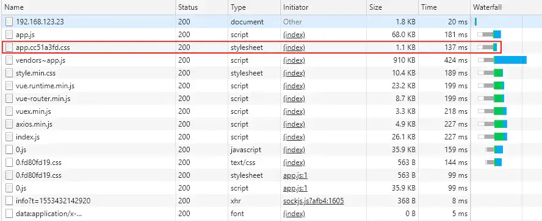

## 总体配置

```js
// vue.config.js
const path = require('path')
const resolve = dir => path.join(__dirname, dir)
const IS_PROD = ['production', 'prod'].includes(process.env.NODE_ENV)

module.exports = {
    publicPath: './',      // 编译后的地址，可以根据环境进行设置
    // assetsDir: 'assets',   // 静态文件目录
    // outputDir:"dist",   // 输出目录
    lintOnSave: true,      // 是否开启编译时是否不符合eslint提示
    productionSourceMap: !IS_PROD, // 生产环境的 source map
    parallel: require('os').cpus().length > 1,
    css: {
        extract: IS_PROD, // 提取css代码
        sourceMap: false,
    },
    chainWebpack: config => {
        // 代码压缩
        config.optimization.minimize(true)

        // 代码分割
        if (IS_PROD) {
            config.optimization.delete('splitChunks')
        }

        // 项目目录别名 ( src目录配置为@ )
        config.resolve.alias
            .set('@', resolve('src'))
            .set("vue$", "vue/dist/vue.esm.js")

        return config
    },
    configureWebpack: config => {
        if (IS_PROD) {
            config.optimization = {
                splitChunks: {
                    cacheGroups: {
                        common: {
                            name: "chunk-common",
                            chunks: "initial",
                            minChunks: 2,
                            maxInitialRequests: 5,
                            minSize: 0,
                            priority: 1,
                            reuseExistingChunk: true,
                            enforce: true
                        },
                        vendors: {
                            name: "chunk-vendors",
                            test: /[\\/]node_modules[\\/]/,
                            chunks: "initial",
                            priority: 2,
                            reuseExistingChunk: true,
                            enforce: true
                        },
                        elementUI: {
                            name: "chunk-elementui",
                            test: /[\\/]node_modules[\\/]element-ui[\\/]/,
                            chunks: "all",
                            priority: 3,
                            reuseExistingChunk: true,
                            enforce: true
                        },
                        echarts: {
                            name: "chunk-echarts",
                            test: /[\\/]node_modules[\\/](vue-)?echarts[\\/]/,
                            chunks: "all",
                            priority: 4,
                            reuseExistingChunk: true,
                            enforce: true
                        }
                    }
                }
            };
        }
    }
}
```

### 配置`development`、`production`环境变量

通过在 `package.json` 里的 `scripts` 配置项中添加`--mode xxx` 来选择不同环境

* 只有以 `VUE_APP` 开头的变量会被 `webpack.DefinePlugin` 静态嵌入到客户端侧的包中，代码中可以通过 `process.env.VUE_APP_XXXX` 访问
* `NODE_ENV` 和 `BASE_URL` 是两个特殊变量，在代码中始终可用`process.env.NODE_ENV`、`process.env.BASE_URL`

```js
{
  "scripts": {
    "serve": "vue-cli-service serve",
    "build": "vue-cli-service build",
    "crm": "vue-cli-service build --mode crm"
    "analyz": "vue-cli-service build --mode analyz",
    "lint": "vue-cli-service lint"
  }
}
```

在项目根目录中新建`.env,` `.env.production`, `.env.analyz`，`.env.crm` 等文件

- .env

  serve 默认的本地开发环境配置

```sh
NODE_ENV = "development"
BASE_URL = "./"
VUE_APP_PUBLIC_PATH = "./"
VUE_APP_API = "https://test.staven630.com/api"
```

- .env.production

  build 默认的环境配置（正式服务器）

```sh
NODE_ENV = "production"
BASE_URL = "https://prod.staven630.com/"
VUE_APP_PUBLIC_PATH = "https://prod.oss.com/staven-blog"
VUE_APP_API = "https://prod.staven630.com/api"

ACCESS_KEY_ID = "xxxxxxxxxxxxx"
ACCESS_KEY_SECRET = "xxxxxxxxxxxxx"
REGION = "oss-cn-hangzhou"
BUCKET = "staven-prod"
PREFIX = "staven-blog"
```

- .env.crm

  自定义 build 环境配置（预发服务器）

```sh
NODE_ENV = "production"
BASE_URL = "https://crm.staven630.com/"
VUE_APP_PUBLIC_PATH = "https://crm.oss.com/staven-blog"
VUE_APP_API = "https://crm.staven630.com/api"

ACCESS_KEY_ID = "xxxxxxxxxxxxx"
ACCESS_KEY_SECRET = "xxxxxxxxxxxxx"
REGION = "oss-cn-hangzhou"
BUCKET = "staven-crm"
PREFIX = "staven-blog"

IS_ANALYZE = true;
```

* `.env.analyz` 文件

  自定义 build 环境配置

```sh
NODE_ENV = 'production'
BASE_URL = 'https://prod.staven630.com/'
VUE_APP_PUBLIC_PATH = 'https://prod.oss.com/staven-blog'
VUE_APP_API = 'https://prod.staven630.com/api'

ACCESS_KEY_ID = 'xxxxxxxxxxxxx'
ACCESS_KEY_SECRET = 'xxxxxxxxxxxxx'
REGION = 'oss-cn-hangzhou'
BUCKET = 'staven-prod'
PREFIX = 'staven-blog'

IS_ANALYZE = true
```

### 基础配置

```js
const IS_PROD = ["production", "prod"].includes(process.env.NODE_ENV);

module.exports = {
  publicPath: IS_PROD ? process.env.VUE_APP_PUBLIC_PATH : "./", // 默认'/'，部署应用包时的基本 URL
  // outputDir: process.env.outputDir || 'dist', // 'dist', 生产环境构建文件的输出目录
  // assetsDir: "", // 相对于outputDir的静态资源(js、css、img、fonts)目录
  lintOnSave: false, // 控制项目的eslint的检验是否开启。true: 开启eslint检验 但不是强约束 代码保存时 界面上不会有eslint的错误提示，"error": 开启eslint检验 是强约束 代码保存时 界面上会有eslint的错误提示
  
  runtimeCompiler: true, // 是否使用包含运行时编译器的 Vue 构建版本
  productionSourceMap: !IS_PROD, // 生产环境的 source map
  parallel: require("os").cpus().length > 1,
  pwa: {}
};
```

### **代码压缩

```js
module.exports = {
  chainWebpack: config => {
    config.optimization.minimize(true); // 代码压缩
  }
}
```

### **提取css代码

因为js会动态的加载出css，所以js文件包会比较大，那么需要提取css代码到文件. 这里我们只需要将css配置一下:

```js
const IS_PROD = ['production', 'prod'].includes(process.env.NODE_ENV)
module.exports = {
  css: {
      extract: IS_PROD
  }
}
```

如图，`css`从`app.js`文件中单独分离出来



### **添加别名 alias

```js
const path = require("path");
const resolve = dir => path.join(__dirname, dir);
const IS_PROD = ["production", "prod"].includes(process.env.NODE_ENV);

module.exports = {
  chainWebpack: config => {
    // 添加别名
    config.resolve.alias
      .set("vue$", "vue/dist/vue.esm.js")
      .set("@", resolve("src"))
  }
};
```

### **利用 splitChunks 单独打包第三方模块

```js
const IS_PROD = ["production", "prod"].includes(process.env.NODE_ENV);

module.exports = {
  configureWebpack: config => {
    if (IS_PROD) {
      config.optimization = {
        splitChunks: {
          cacheGroups: {
            common: {
              name: "chunk-common",
              chunks: "initial",
              minChunks: 2,
              maxInitialRequests: 5,
              minSize: 0,
              priority: 1,
              reuseExistingChunk: true,
              enforce: true
            },
            vendors: {
              name: "chunk-vendors",
              test: /[\\/]node_modules[\\/]/,
              chunks: "initial",
              priority: 2,
              reuseExistingChunk: true,
              enforce: true
            },
            elementUI: {
              name: "chunk-elementui",
              test: /[\\/]node_modules[\\/]element-ui[\\/]/,
              chunks: "all",
              priority: 3,
              reuseExistingChunk: true,
              enforce: true
            },
            echarts: {
              name: "chunk-echarts",
              test: /[\\/]node_modules[\\/](vue-)?echarts[\\/]/,
              chunks: "all",
              priority: 4,
              reuseExistingChunk: true,
              enforce: true
            }
          }
        }
      };
    }
  },
  chainWebpack: config => {
    if (IS_PROD) {
      config.optimization.delete("splitChunks");
    }
    return config;
  }
};
```

### 开启 gzip 压缩

`npm i -D compression-webpack-plugin`

```js
const CompressionWebpackPlugin = require("compression-webpack-plugin");

const IS_PROD = ["production", "prod"].includes(process.env.NODE_ENV);
const productionGzipExtensions = /\.(js|css|json|txt|html|ico|svg)(\?.*)?$/i;

module.exports = {
  configureWebpack: config => {
    const plugins = [];
    if (IS_PROD) {
      plugins.push(
        new CompressionWebpackPlugin({
          filename: "[path].gz[query]",
          algorithm: "gzip",
          test: productionGzipExtensions,
          threshold: 10240,
          minRatio: 0.8
        })
      );
    }
    config.plugins = [...config.plugins, ...plugins];
  }
};
```

还可以开启比 gzip 体验更好的 Zopfli 压缩详见https://webpack.js.org/plugins/compression-webpack-plugin

`npm i -D @gfx/zopfli brotli-webpack-plugin`

```js
const CompressionWebpackPlugin = require("compression-webpack-plugin");
const zopfli = require("@gfx/zopfli");
const BrotliPlugin = require("brotli-webpack-plugin");

const IS_PROD = ["production", "prod"].includes(process.env.NODE_ENV);
const productionGzipExtensions = /\.(js|css|json|txt|html|ico|svg)(\?.*)?$/i;

module.exports = {
  configureWebpack: config => {
    const plugins = [];
    if (IS_PROD) {
      plugins.push(
        new CompressionWebpackPlugin({
          algorithm(input, compressionOptions, callback) {
            return zopfli.gzip(input, compressionOptions, callback);
          },
          compressionOptions: {
            numiterations: 15
          },
          minRatio: 0.99,
          test: productionGzipExtensions
        })
      );
      plugins.push(
        new BrotliPlugin({
          test: productionGzipExtensions,
          minRatio: 0.99
        })
      );
    }
    config.plugins = [...config.plugins, ...plugins];
  }
};
```


### 为 sass 提供全局样式，以及全局变量

可以通过在 main.js 中 `Vue.prototype.$src = process.env.VUE_APP_PUBLIC_PATH;`挂载环境变量中的配置信息，然后在js中使用$src 访问。

css 中可以使用注入 sass 变量访问环境变量中的配置信息

```js
const IS_PROD = ["production", "prod"].includes(process.env.NODE_ENV);

module.exports = {
  css: {
    extract: IS_PROD,
    sourceMap: false,
    loaderOptions: {
      scss: {
        // 向全局sass样式传入共享的全局变量, $src可以配置图片cdn前缀
        // 详情: https://cli.vuejs.org/guide/css.html#passing-options-to-pre-processor-loaders
        prependData: `
        @import "@scss/variables.scss";
        @import "@scss/mixins.scss";
        @import "@scss/function.scss";
        $src: "${process.env.VUE_APP_OSS_SRC}";
        `
      }
    }
  }
};
```

在 scss 中引用

```css
.home {
  background: url($src+"/images/500.png");
}
```

### 为 less 提供全局样式，以及全局变量

`npm i -D less less-loader`

在`src/assets/less`目录下新建`variables.less`文件，并定义全局`less`变量

`vue.config.js`中为其添加相应`less `配置:

```js
const path = require('path')
const fs = require('fs')
const postcss = require('postcss')
const resolve = dir => path.resolve(__dirname, dir)

const IS_PROD = ['prod', 'production'].includes(process.env.NODE_ENV)

function getLessVaribles(fileUrl, list = {}) {
  if (!fs.existsSync(fileUrl)) return {};
  let lessFile = fs.readFileSync(fileUrl, 'utf8');
  return postcss.parse(lessFile).nodes.reduce((acc, curr) => {
    acc[`${curr.name.replace(/\:/, '')}`] = `${curr.params}`;
    return acc;
  }, list);
}

const modifyVars = getLessVaribles(resolve('./src/assets/less/variables.less'));

module.exports = {
  css: {
    extract: IS_PROD,
    // sourceMap: false,
    loaderOptions: {
      less: {
        modifyVars,
        javascriptEnabled: true,
      }
    }
  }
}
```

### 为 stylus 提供全局变量

`npm i -D style-resources-loader`

```js
const path = require("path");
const resolve = dir => path.resolve(__dirname, dir);
const addStylusResource = rule => {
  rule
    .use("style-resouce")
    .loader("style-resources-loader")
    .options({
      patterns: [resolve("src/assets/stylus/variable.styl")]
    });
};
module.exports = {
  chainWebpack: config => {
    const types = ["vue-modules", "vue", "normal-modules", "normal"];
    types.forEach(type =>
      addStylusResource(config.module.rule("stylus").oneOf(type))
    );
  }
};
```


### 配置 proxy 代理解决跨域问题

  假设 mock 接口为https://www.easy-mock.com/mock/5bc75b55dc36971c160cad1b/sheets/1

```js
module.exports = {
  // webpack-dev-server 所有的配置
  devServer: {
    // overlay: { // 让浏览器 overlay 同时显示警告和错误
    //   warnings: true,
    //   errors: true
    // },
    // open: false, // 是否打开浏览器
    // host: "localhost",
    // port: "8080", // 代理断就
    // https: false,
    // hotOnly: false, // 热更新
    proxy: {
      "/api": {
        target:
          "https://www.easy-mock.com/mock/5bc75b55dc36971c160cad1b/sheets", // 目标代理接口地址
        secure: false,
        changeOrigin: true, // 开启代理，在本地创建一个虚拟服务端
        // ws: true, // 是否启用websockets
        pathRewrite: {
          "^/api": "/"
        }
      }
    }
  }
};
```

访问

```vue
<script>
import axios from "axios";
export default {
  mounted() {
    axios.get("/api/1").then(res => {
      console.log('proxy:', res);
    });
  }
};
</script>
```

### 添加打包分析

```js
const BundleAnalyzerPlugin = require("webpack-bundle-analyzer").BundleAnalyzerPlugin;

module.exports = {
  chainWebpack: config => {
    // 打包分析
    if (IS_PROD) {
      config.plugin("webpack-report").use(BundleAnalyzerPlugin, [
        {
          analyzerMode: "static"
        }
      ]);
    }
  }
};
```

### 外部库使用CDN加载 ( 配置 externals)

防止将某些 import 的包(package)打包到 bundle 中，而是在运行时(runtime)再去从外部获取这些扩展依赖

```js
module.exports = {
  configureWebpack: config => {
    config.externals = {
      vue: "Vue",
      "element-ui": "ELEMENT",
      "vue-router": "VueRouter",
      vuex: "Vuex",
      axios: "axios"
    };
  },
  chainWebpack: config => {
    const cdn = {
      // 访问https://unpkg.com/element-ui/lib/theme-chalk/index.css获取最新版本
      css: ["//unpkg.com/element-ui@2.10.1/lib/theme-chalk/index.css"],
      js: [
        "//unpkg.com/vue@2.6.10/dist/vue.min.js", // 访问https://unpkg.com/vue/dist/vue.min.js获取最新版本
        "//unpkg.com/vue-router@3.0.6/dist/vue-router.min.js",
        "//unpkg.com/vuex@3.1.1/dist/vuex.min.js",
        "//unpkg.com/axios@0.19.0/dist/axios.min.js",
        "//unpkg.com/element-ui@2.10.1/lib/index.js"
      ]
    };

    // 如果使用多页面打包，使用vue inspect --plugins查看html是否在结果数组中
    config.plugin("html").tap(args => {
      // html中添加cdn
      args[0].cdn = cdn;
      return args;
    });
  }
};
```

在html中添加

```html
<!-- 使用CDN的CSS文件 -->
<% for (var i in htmlWebpackPlugin.options.cdn &&
htmlWebpackPlugin.options.cdn.css) { %>
<link rel="stylesheet" href="<%= htmlWebpackPlugin.options.cdn.css[i] %>" />
<% } %>

<!-- 使用CDN的JS文件 -->
<% for (var i in htmlWebpackPlugin.options.cdn &&
htmlWebpackPlugin.options.cdn.js) { %>
<script
  type="text/javascript"
  src="<%= htmlWebpackPlugin.options.cdn.js[i] %>"
></script>
<% } %>
```

### 删除 moment 语言包

删除 moment 除 zh-cn 中文包外的其它语言包，无需在代码中手动引入 zh-cn 语言包

```js
const webpack = require("webpack");

module.exports = {
  chainWebpack: config => {
    config
      .plugin("ignore")
      .use(
        new webpack.ContextReplacementPlugin(/moment[/\\]locale$/, /zh-cn$/)
      );

    return config;
  }
};
```


### 压缩图片

`npm i -D image-webpack-loader`

在某些版本的 OSX 上安装可能会因缺少 libpng 依赖项而引发错误。可以通过安装最新版本的 libpng 来解决。

```js
brew install libpng
module.exports = {
  chainWebpack: config => {
    if (IS_PROD) {
      config.module
        .rule("images")
        .use("image-webpack-loader")
        .loader("image-webpack-loader")
        .options({
          mozjpeg: { progressive: true, quality: 65 },
          optipng: { enabled: false },
          pngquant: { quality: [0.65, 0.9], speed: 4 },
          gifsicle: { interlaced: false }
          // webp: { quality: 75 }
        });
    }
  }
};
```

### 预渲染 prerender-spa-plugin

`npm i -D prerender-spa-plugin`

```js
const PrerenderSpaPlugin = require("prerender-spa-plugin");
const path = require("path");
const resolve = dir => path.join(__dirname, dir);
const IS_PROD = ["production", "prod"].includes(process.env.NODE_ENV);

module.exports = {
  configureWebpack: config => {
    const plugins = [];
    if (IS_PROD) {
      plugins.push(
        new PrerenderSpaPlugin({
          staticDir: resolve("dist"),
          routes: ["/"],
          postProcess(ctx) {
            ctx.route = ctx.originalRoute;
            ctx.html = ctx.html.split(/>[\s]+</gim).join("><");
            if (ctx.route.endsWith(".html")) {
              ctx.outputPath = path.join(__dirname, "dist", ctx.route);
            }
            return ctx;
          },
          minify: {
            collapseBooleanAttributes: true,
            collapseWhitespace: true,
            decodeEntities: true,
            keepClosingSlash: true,
            sortAttributes: true
          },
          renderer: new PrerenderSpaPlugin.PuppeteerRenderer({
            // 需要注入一个值，这样就可以检测页面当前是否是预渲染的
            inject: {},
            headless: false,
            // 视图组件是在API请求获取所有必要数据后呈现的，因此我们在dom中存在“data view”属性后创建页面快照
            renderAfterDocumentEvent: "render-event"
          })
        })
      );
    }
    config.plugins = [...config.plugins, ...plugins];
  }
};
```

mounted()中添加 `document.dispatchEvent(new Event('render-event'))`

```js
new Vue({
  router,
  store,
  render: h => h(App),
  mounted() {
    document.dispatchEvent(new Event("render-event"));
  }
}).$mount("#app");
```

**为自定义预渲染页面添加自定义 title、description、content**

- 删除 public/index.html 中关于 description、content 的 meta 标签。保留 title 标签
- 配置 router-config.js

```js
module.exports = {
  "/": {
    title: "首页",
    keywords: "首页关键词",
    description: "这是首页描述"
  },
  "/about.html": {
    title: "关于我们",
    keywords: "关于我们页面关键词",
    description: "关于我们页面关键词描述"
  }
};
```

 vue.config.js

```js
const path = require("path");
const PrerenderSpaPlugin = require("prerender-spa-plugin");
const routesConfig = require("./router-config");
const resolve = dir => path.join(__dirname, dir);
const IS_PROD = ["production", "prod"].includes(process.env.NODE_ENV);

module.exports = {
  configureWebpack: config => {
    const plugins = [];

    if (IS_PROD) {
      // 预加载
      plugins.push(
        new PrerenderSpaPlugin({
          staticDir: resolve("dist"),
          routes: Object.keys(routesConfig),
          postProcess(ctx) {
            ctx.route = ctx.originalRoute;
            ctx.html = ctx.html.split(/>[\s]+</gim).join("><");
            ctx.html = ctx.html.replace(
              /<title>(.*?)<\/title>/gi,
              `<title>${
                routesConfig[ctx.route].title
              }</title><meta name="keywords" content="${
                routesConfig[ctx.route].keywords
              }" /><meta name="description" content="${
                routesConfig[ctx.route].description
              }" />`
            );
            if (ctx.route.endsWith(".html")) {
              ctx.outputPath = path.join(__dirname, "dist", ctx.route);
            }
            return ctx;
          },
          minify: {
            collapseBooleanAttributes: true,
            collapseWhitespace: true,
            decodeEntities: true,
            keepClosingSlash: true,
            sortAttributes: true
          },
          renderer: new PrerenderSpaPlugin.PuppeteerRenderer({
            // 需要注入一个值，这样就可以检测页面当前是否是预渲染的
            inject: {},
            headless: false,
            // 视图组件是在API请求获取所有必要数据后呈现的，因此我们在dom中存在“data view”属性后创建页面快照
            renderAfterDocumentEvent: "render-event"
          })
        })
      );
    }

    config.plugins = [...config.plugins, ...plugins];
  }
};
```

### 添加 IE 兼容

在 main.js 中添加

```js
import 'core-js/stable'; 
import 'regenerator-runtime/runtime';
```

配置 babel.config.js

```js
const plugins = [];

module.exports = {
  presets: [["@vue/app", { useBuiltIns: "entry" }]],
  plugins: plugins
};
```

### 去掉 console.log

方法一：

`npm i -D babel-plugin-transform-remove-console`

在 babel.config.js 中配置

```js
const IS_PROD = ["production", "prod"].includes(process.env.NODE_ENV);

const plugins = [];
if (IS_PROD) {
  plugins.push("transform-remove-console");
}

module.exports = {
  presets: ["@vue/app", { useBuiltIns: "entry" }],
  plugins
};
```

方法二：

```js
const UglifyJsPlugin = require("uglifyjs-webpack-plugin");
module.exports = {
  configureWebpack: config => {
    if (IS_PROD) {
      const plugins = [];
      plugins.push(
        new UglifyJsPlugin({
          uglifyOptions: {
            compress: {
              warnings: false,
              drop_console: true,
              drop_debugger: false,
              pure_funcs: ["console.log"] //移除console
            }
          },
          sourceMap: false,
          parallel: true
        })
      );
      config.plugins = [...config.plugins, ...plugins];
    }
  }
};
```

如果使用 uglifyjs-webpack-plugin 会报错，可能存在 node_modules 中有些依赖需要 babel 转译。

而 vue-cli 的[transpileDependencies](https://cli.vuejs.org/zh/config/#transpiledependencies)配置默认为[], babel-loader 会忽略所有 node_modules 中的文件。如果你想要通过 Babel 显式转译一个依赖，可以在这个选项中列出来。配置需要转译的第三方库

### 开启 stylelint 检测scss, css语法

`npm i -D stylelint stylelint-config-standard stylelint-config-prettier stylelint-webpack-plugin`

在文件夹创建`stylelint.config.js`,详细配置在[这里](https://stylelint.io/user-guide/configuration)

```js
module.exports = {
  ignoreFiles: ["**/*.js", "src/assets/css/element-variables.scss", "theme/"], 
  extends: ["stylelint-config-standard", "stylelint-config-prettier"],
  rules: {
    "no-empty-source": null,
    "at-rule-no-unknown": [
      true,
      {
        ignoreAtRules: ["extend"]
      }
    ]
  }
};
```

启用webpack配置

```js
const StylelintPlugin = require("stylelint-webpack-plugin");

module.exports = {
  configureWebpack: config => {
    const plugins = [];
    if (IS_DEV) {
      plugins.push(
        new StylelintPlugin({
          files: ["src/**/*.vue", "src/assets/**/*.scss"],
          fix: true //打开自动修复（谨慎使用！注意上面的配置不要加入js或html文件，会发生问题，js文件请手动修复）
        })
      );
    }
    config.plugins = [...config.plugins, ...plugins];
  }
}
```

### 修复 HMR(热更新)失效

  如果热更新失效，如下操作：

```js
module.exports = {
  chainWebpack: config => {
    config.resolve.symlinks(true); // 修复HMR
  }
};
```

###  修复 Lazy loading routes Error： Cyclic dependency [vuejs/vue-cli#1669](https://github.com/vuejs/vue-cli/issues/1669)

```js
module.exports = {
  chainWebpack: config => {
    // 如果使用多页面打包，使用vue inspect --plugins查看html是否在结果数组中
    config.plugin("html").tap(args => {
      // 修复 Lazy loading routes Error
      args[0].chunksSortMode = "none";
      return args;
    });
  }
};
```

### 自动生成雪碧图

默认 src/assets/icons 中存放需要生成雪碧图的 png 文件。首次运行 npm run serve/build 会生成雪碧图，并在跟目录生成 icons.json 文件。再次运行命令时，会对比 icons 目录内文件与 icons.json 的匹配关系，确定是否需要再次执行 webpack-spritesmith 插件。

`npm i -D webpack-spritesmith`

```js
let has_sprite = true;
let files = [];
const icons = {};

try {
  fs.statSync(resolve("./src/assets/icons"));
  files = fs.readdirSync(resolve("./src/assets/icons"));
  files.forEach(item => {
    let filename = item.toLocaleLowerCase().replace(/_/g, "-");
    icons[filename] = true;
  });

} catch (error) {
  fs.mkdirSync(resolve("./src/assets/icons"));
}

if (!files.length) {
  has_sprite = false;
} else {
  try {
    let iconsObj = fs.readFileSync(resolve("./icons.json"), "utf8");
    iconsObj = JSON.parse(iconsObj);
    has_sprite = files.some(item => {
      let filename = item.toLocaleLowerCase().replace(/_/g, "-");
      return !iconsObj[filename];
    });
    if (has_sprite) {
      fs.writeFileSync(resolve("./icons.json"), JSON.stringify(icons, null, 2));
    }
  } catch (error) {
    fs.writeFileSync(resolve("./icons.json"), JSON.stringify(icons, null, 2));
    has_sprite = true;
  }
}

// 雪碧图样式处理模板
const SpritesmithTemplate = function(data) {
  // pc
  let icons = {};
  let tpl = `.ico { 
  display: inline-block; 
  background-image: url(${data.sprites[0].image}); 
  background-size: ${data.spritesheet.width}px ${data.spritesheet.height}px; 
}`;

  data.sprites.forEach(sprite => {
    const name = "" + sprite.name.toLocaleLowerCase().replace(/_/g, "-");
    icons[`${name}.png`] = true;
    tpl = `${tpl} 
.ico-${name}{
  width: ${sprite.width}px; 
  height: ${sprite.height}px; 
  background-position: ${sprite.offset_x}px ${sprite.offset_y}px;
}
`;
  });
  return tpl;
};

module.exports = {
  configureWebpack: config => {
    const plugins = [];
    if (has_sprite) {
      plugins.push(
        new SpritesmithPlugin({
          src: {
            cwd: path.resolve(__dirname, "./src/assets/icons/"), // 图标根路径
            glob: "**/*.png" // 匹配任意 png 图标
          },
          target: {
            image: path.resolve(__dirname, "./src/assets/images/sprites.png"), // 生成雪碧图目标路径与名称
            // 设置生成CSS背景及其定位的文件或方式
            css: [
              [
                path.resolve(__dirname, "./src/assets/scss/sprites.scss"),
                {
                  format: "function_based_template"
                }
              ]
            ]
          },
          customTemplates: {
            function_based_template: SpritesmithTemplate
          },
          apiOptions: {
            cssImageRef: "../images/sprites.png" // css文件中引用雪碧图的相对位置路径配置
          },
          spritesmithOptions: {
            padding: 2
          }
        })
      );
    }

    config.plugins = [...config.plugins, ...plugins];
  }
};
```

### SVG 转 font 字体

`npm i -D svgtofont`

根目录新增 `scripts` 目录，并新建 `svg2font.js` 文件:

```js
const svgtofont = require("svgtofont");
const path = require("path");
const pkg = require("../package.json");

svgtofont({
  src: path.resolve(process.cwd(), "src/assets/svg"), // svg 图标目录路径
  dist: path.resolve(process.cwd(), "src/assets/fonts"), // 输出到指定目录中
  fontName: "icon", // 设置字体名称
  css: true, // 生成字体文件
  startNumber: 20000, // unicode起始编号
  svgicons2svgfont: {
    fontHeight: 1000,
    normalize: true
  },
  // website = null, 没有演示html文件
  website: {
    title: "icon",
    logo: "",
    version: pkg.version,
    meta: {
      description: "",
      keywords: ""
    },
    description: ``,
    links: [
      {
        title: "Font Class",
        url: "index.html"
      },
      {
        title: "Unicode",
        url: "unicode.html"
      }
    ],
    footerInfo: ``
  }
}).then(() => {
  console.log("done!");
});
```

添加 package.json scripts 配置：

```
"prebuild": "npm run font",
"font": "node scripts/svg2font.js",
```

  执行：

```
npm run font
```

### 使用 SVG 组件

`npm i -D svg-sprite-loader`

新增 SvgIcon 组件:

```vue
<template>
  <svg class="svg-icon"
       aria-hidden="true">
    <use :xlink:href="iconName" />
  </svg>
</template>

<script>
export default {
  name: 'SvgIcon',
  props: {
    iconClass: {
      type: String,
      required: true
    }
  },
  computed: {
    iconName() {
      return `#icon-${this.iconClass}`
    }
  }
}
</script>

<style scoped>
.svg-icon {
  width: 1em;
  height: 1em;
  vertical-align: -0.15em;
  fill: currentColor;
  overflow: hidden;
}
</style>
```

  在 src 文件夹中创建 icons 文件夹。icons 文件夹中新增 svg 文件夹（用来存放 svg 文件）与 index.js 文件：

```js
import SvgIcon from "@/components/SvgIcon";
import Vue from "vue";

// 注册到全局
Vue.component("svg-icon", SvgIcon);

const requireAll = requireContext => requireContext.keys().map(requireContext);
const req = require.context("./svg", false, /\.svg$/);
requireAll(req);
```

  在 main.js 中导入 icons/index.js

```
import "@/icons";
```

  修改 vue.config.js

```js
const path = require("path");
const resolve = dir => path.join(__dirname, dir);

module.exports = {
  chainWebpack: config => {
    const svgRule = config.module.rule("svg");
    svgRule.uses.clear();
    svgRule.exclude.add(/node_modules/);
    svgRule
      .test(/\.svg$/)
      .use("svg-sprite-loader")
      .loader("svg-sprite-loader")
      .options({
        symbolId: "icon-[name]"
      });

    const imagesRule = config.module.rule("images");
    imagesRule.exclude.add(resolve("src/icons"));
    config.module.rule("images").test(/\.(png|jpe?g|gif|svg)(\?.*)?$/);
  }
};
```

### 去除多余无效的 css

> 谨慎使用。可能出现各种样式丢失现象。

- 方案一：

```js
npm i -D postcss-import @fullhuman/postcss-purgecss
```

更新 `postcss.config.js`

```js
const autoprefixer = require("autoprefixer");
const postcssImport = require("postcss-import");
const purgecss = require("@fullhuman/postcss-purgecss");
const IS_PROD = ["production", "prod"].includes(process.env.NODE_ENV);
let plugins = [];
if (IS_PROD) {
  plugins.push(postcssImport);
  plugins.push(
    purgecss({
      content: [
        "./layouts/**/*.vue",
        "./components/**/*.vue",
        "./pages/**/*.vue"
      ],
      extractors: [
        {
          extractor: class Extractor {
            static extract(content) {
              const validSection = content.replace(
                /<style([\s\S]*?)<\/style>+/gim,
                ""
              );
              return (
                validSection.match(/[A-Za-z0-9-_/:]*[A-Za-z0-9-_/]+/g) || []
              );
            }
          },
          extensions: ["html", "vue"]
        }
      ],
      whitelist: ["html", "body"],
      whitelistPatterns: [
        /el-.*/,
        /-(leave|enter|appear)(|-(to|from|active))$/,
        /^(?!cursor-move).+-move$/,
        /^router-link(|-exact)-active$/
      ],
      whitelistPatternsChildren: [/^token/, /^pre/, /^code/]
    })
  );
}
module.exports = {
  plugins: [...plugins, autoprefixer]
};
```

- 方案二：

`npm i -D glob-all purgecss-webpack-plugin`

```js
const path = require("path");
const glob = require("glob-all");
const PurgecssPlugin = require("purgecss-webpack-plugin");
const resolve = dir => path.join(__dirname, dir);
const IS_PROD = ["production", "prod"].includes(process.env.NODE_ENV);

module.exports = {
  configureWebpack: config => {
    const plugins = [];
    if (IS_PROD) {
      plugins.push(
        new PurgecssPlugin({
          paths: glob.sync([resolve("./**/*.vue")]),
          extractors: [
            {
              extractor: class Extractor {
                static extract(content) {
                  const validSection = content.replace(
                    /<style([\s\S]*?)<\/style>+/gim,
                    ""
                  );
                  return (
                    validSection.match(/[A-Za-z0-9-_/:]*[A-Za-z0-9-_/]+/g) || []
                  );
                }
              },
              extensions: ["html", "vue"]
            }
          ],
          whitelist: ["html", "body"],
          whitelistPatterns: [
            /el-.*/,
            /-(leave|enter|appear)(|-(to|from|active))$/,
            /^(?!cursor-move).+-move$/,
            /^router-link(|-exact)-active$/
          ],
          whitelistPatternsChildren: [/^token/, /^pre/, /^code/]
        })
      );
    }
    config.plugins = [...config.plugins, ...plugins];
  }
};
```

### 多页面打包 multi-page

多入口页面打包，建议在 src 目录下新建 pages 目录存放多页面模块。

- pages.config.js

   配置多页面信息。src/main.js 文件对应 main 字段，其他根据参照 pages 为根路径为字段。如下:

```js
module.exports = {
  'admin': {
    template: 'public/index.html',
    filename: 'admin.html',
    title: '后台管理',
  },
  'mobile': {
    template: 'public/index.html',
    filename: 'mobile.html',
    title: '移动端',
  },
  'pc/crm': {
    template: 'public/index.html',
    filename: 'pc-crm.html',
    title: '预发服务',
  }
}
```

- vue.config.js

  vue.config.js 的 pages 字段为多页面提供配置

```js
const glob = require("glob");
const pagesInfo = require("./pages.config");
const pages = {};

glob.sync('./src/pages/**/main.js').forEach(entry => {
  let chunk = entry.match(/\.\/src\/pages\/(.*)\/main\.js/)[1];
  const curr = pagesInfo[chunk];
  if (curr) {
    pages[chunk] = {
      entry,
      ...curr,
      chunk: ["chunk-vendors", "chunk-common", chunk]
    }
  }
})

module.exports = {
  chainWebpack: config => {
    // 防止多页面打包卡顿
    config => config.plugins.delete("named-chunks");
    return config;
  },
  pages
};
```

如果多页面打包需要使用 CDN，使用 vue inspect --plugins 查看 html 是否在结果数组中的形式。上例中 plugins 列表中存在'html-main','html-pages/admin','html-pages/mobile'， 没有'html'。因此不能再使用 config.plugin("html")。

```js
const path = require("path");
const resolve = dir => path.join(__dirname, dir);
const IS_PROD = ["production", "prod"].includes(process.env.NODE_ENV);

const glob = require("glob");
const pagesInfo = require("./pages.config");
const pages = {};

glob.sync('./src/pages/**/main.js').forEach(entry => {
  let chunk = entry.match(/\.\/src\/pages\/(.*)\/main\.js/)[1];
  const curr = pagesInfo[chunk];
  if (curr) {
    pages[chunk] = {
      entry,
      ...curr,
      chunk: ["chunk-vendors", "chunk-common", chunk]
    }
  }
});

module.exports = {
  publicPath: IS_PROD ? process.env.VUE_APP_PUBLIC_PATH : "./", //
  configureWebpack: config => {
    config.externals = {
      vue: "Vue",
      "element-ui": "ELEMENT",
      "vue-router": "VueRouter",
      vuex: "Vuex",
      axios: "axios"
    };
  },
  chainWebpack: config => {
    const cdn = {
      // 访问https://unpkg.com/element-ui/lib/theme-chalk/index.css获取最新版本
      css: ["//unpkg.com/element-ui@2.10.1/lib/theme-chalk/index.css"],
      js: [
        "//unpkg.com/vue@2.6.10/dist/vue.min.js", // 访问https://unpkg.com/vue/dist/vue.min.js获取最新版本
        "//unpkg.com/vue-router@3.0.6/dist/vue-router.min.js",
        "//unpkg.com/vuex@3.1.1/dist/vuex.min.js",
        "//unpkg.com/axios@0.19.0/dist/axios.min.js",
        "//unpkg.com/element-ui@2.10.1/lib/index.js"
      ]
    };

    // 防止多页面打包卡顿
    config => config.plugins.delete("named-chunks");

    // 多页面cdn添加
    Object.keys(pagesInfo).forEach(page => {
      config.plugin(`html-${page}`).tap(args => {
        // html中添加cdn
        args[0].cdn = cdn;

        // 修复 Lazy loading routes Error
        args[0].chunksSortMode = "none";
        return args;
      });
    });
    return config;
  },
  pages
};
```

### 静态资源自动打包上传阿里 oss、华为 obs

开启文件上传 ali oss，需要将 publicPath 改成 ali oss 资源 url 前缀,也就是修改 VUE_APP_PUBLIC_PATH。具体配置参见[阿里 oss 插件 webpack-oss](https://github.com/staven630/webpack-oss)、[华为 obs 插件 huawei-obs-plugin](https://github.com/staven630/huawei-obs-plugin)

```
npm i -D webpack-oss
```

```js
const AliOssPlugin = require("webpack-oss");
const IS_PROD = ["production", "prod"].includes(process.env.NODE_ENV);

const format = AliOssPlugin.getFormat();

module.exports = {
  publicPath: IS_PROD ? `${process.env.VUE_APP_PUBLIC_PATH}/${format}` : "./", // 默认'/'，部署应用包时的基本 URL
  configureWebpack: config => {
    const plugins = [];

    if (IS_PROD) {
      plugins.push(
        new AliOssPlugin({
          accessKeyId: process.env.ACCESS_KEY_ID,
          accessKeySecret: process.env.ACCESS_KEY_SECRET,
          region: process.env.REGION,
          bucket: process.env.BUCKET,
          prefix: process.env.PREFIX,
          exclude: /.*\.html$/,
          format
        })
      );
    }
    config.plugins = [...config.plugins, ...plugins];
  }
};
```

