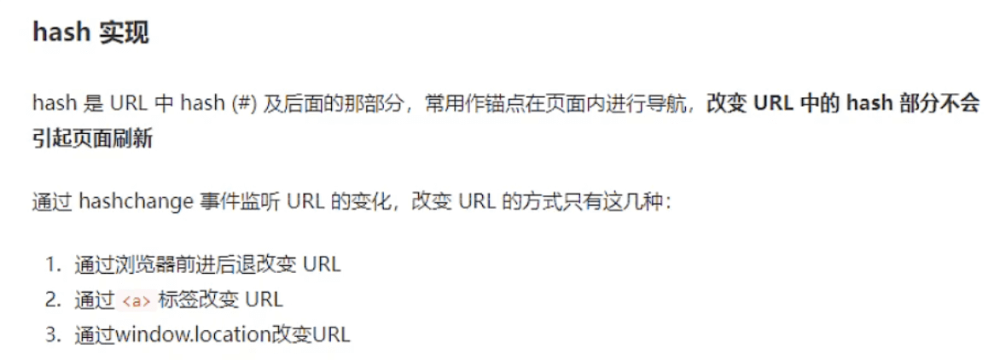
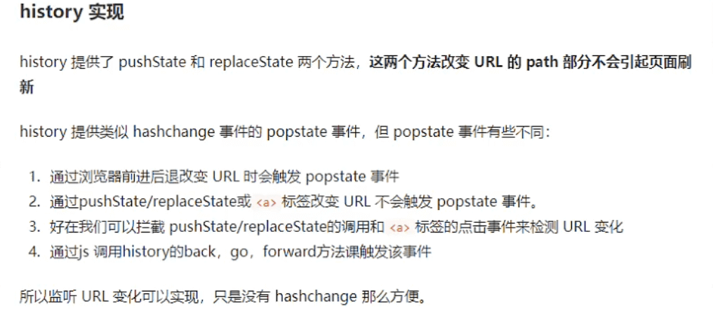

## 构建路由

在src目录下面新建router 文件，然后在router 文件夹下面新建 `index.ts`

```ts
//引入路由对象
import { createRouter, createWebHistory, createWebHashHistory, createMemoryHistory, RouteRecordRaw } from 'vue-router'
 
//vue2 mode history vue3 createWebHistory
//vue2 mode  hash  vue3  createWebHashHistory
//vue2 mode abstact vue3  createMemoryHistory
 
//路由数组的类型 RouteRecordRaw
// 定义一些路由
// 每个路由都需要映射到一个组件。
const routes: Array<RouteRecordRaw> = [{
    path: '/',
    component: () => import('../components/a.vue')
},{
    path: '/register',
    component: () => import('../components/b.vue')
}]
 
 
 
const router = createRouter({
    history: createWebHistory(),
    routes
})
 
//导出router
export default router
```

**main.ts 挂载**

```ts
import { createApp } from 'vue'
import App from './App.vue'
import router from './router'
createApp(App).use(router).mount('#app')
```

### `router-view`

`router-view` 将显示与 url 对应的组件。你可以把它放在任何地方，以适应你的布局。

App.vue

```vue
<template>
  <div>
    <div>
    <!--使用 router-link 组件进行导航 -->
    <!--通过传递 `to` 来指定链接 -->
    <!--`<router-link>` 将呈现一个带有正确 `href` 属性的 `<a>` 标签-->
      <router-link tag="div" to="/">跳转a</router-link>
      <router-link tag="div" style="margin-left:200px" to="/register">跳转b</router-link>
    </div>
    <hr />
    <!-- 路由出口 -->
    <!-- 路由匹配到的组件将渲染在这里 -->
    <router-view></router-view>
  </div>
</template>
```

## `Hash`的实现



## `history`的实现


