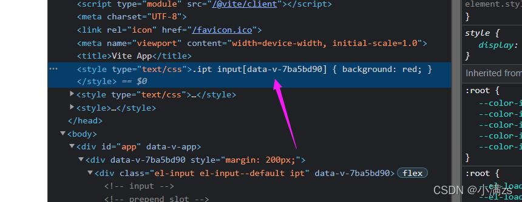
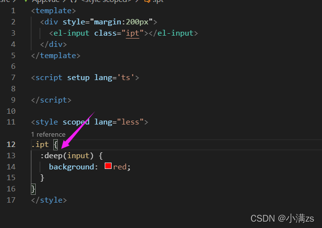
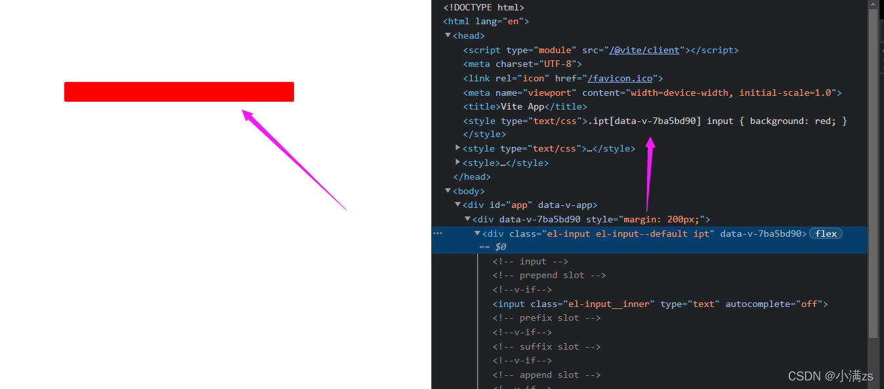

## 详解Scoped和样式 穿透

### scoped的原理

> vue中的`scoped `通过在**DOM结构**以及**css样式**上加唯一不重复的标记[**`data-v-hash`**](https://so.csdn.net/so/search?q=hash&spm=1001.2101.3001.7020)的方式，以保证唯一（而这个工作是由过`PostCSS`转译实现的），达到样式私有化模块化的目的。

scoped三条渲染规则：

1. 给HTML的DOM节点加一个不重复data属性(形如`data-v-123`)来表示他的唯一性
2. 在每句css选择器的末尾（编译后的生成的css语句）加一个当前组件的data属性选择器（如[data-v-123]）来私有化样式
3. 如果组件内部包含有其他组件，只会给其他组件的最外层标签加上当前组件的data属性

[PostCSS](https://so.csdn.net/so/search?q=PostCSS&spm=1001.2101.3001.7020)会给一个组件中的所有dom添加了一个独一无二的动态属性`data-v-xxxx`，然后，给CSS选择器额外添加一个对应的属性选择器来选择该组件中dom，这种做法使得样式只作用于含有该属性的dom——组件内部dom, 从而达到了'样式模块化'的效果.


使用Scoped ，在进行PostCss转化的时候把元素选择器默认放在了最后



Vue 提供了样式穿透`:deep() `他的作用就是用来改变 属性选择器的位置





### `:slotted` 插槽选择器

A 组件定义一个插槽

```vue
<template>
    <div>
        我是插槽
        <slot></slot>
    </div>
</template>
 
<script>
export default {}
</script>
 
<style scoped>
 
</style>
```

在App.vue 引入

```vue
<template>
    <div>
        <A>
            <div class="a">....</div>
        </A>
    </div>
</template>
 
<script setup>
import A from "@/components/A.vue"
</script>
 
<style lang="less" scoped>
</style>
```

在A组件修改class **a** 的颜色，**无效果**

```vue
<style scoped>
.a{
    color:red
}
</style>
```

**默认情况下，作用域样式不会影响到 `<slot/>` 渲染出来的内容，因为它们被认为是父组件所持有并传递进来的。**

解决方案 slotted

```css
<style scoped>
 :slotted(.a) {
    color:red
}
</style>
```

### `:global`全局选择器

在之前我们想加入全局样式，通常都是新建一个style 标签，不加scoped。

```vue
<style>
 div{
     color:red
 }
</style>
 
<style lang="less" scoped>
 
</style>
```

现在有更优雅的解决方案

```vue
<style lang="less" scoped>
:global(div){
    color:red
}
</style>
```

### 动态 CSS

单文件组件的 `<style>` 标签可以通过 `v-bind` 这一 CSS 函数将 CSS 的值关联到动态的组件状态上：

```vue
<template>
    <div class="div">
       ....
    </div>
</template>
 
<script lang="ts" setup>
import { ref } from 'vue'
const red = ref<string>('red')
const blue = ref({
    color:'blue'
})
</script>
 
<style lang="less" scoped>
  .div{
    color:v-bind(red);
    background: v-bind('blue.color'); /* 是对象 v-bind 加引号 */
  }
</style>
```

### css `module`

 `<style module>`标签会被编译为 [CSS Modules](https://github.com/css-modules/css-modules)  并且将生成的 CSS 类作为 `$style` 对象的键暴露给组件

```vue
<template>
    <div :class="$style.red">
        ...
    </div>
</template>
 
<style module>
.red {
    color: red;
    font-size: 20px;
}
</style>
```

自定义注入名称（多个可以用数组），通过给 `module` attribute 一个值来自定义注入的类对象的 property 键

```vue
<template>
    <div :class="[zs.red,zs.border]">
        小满是个弟弟
    </div>
</template>
 
<style module="zs">
.red {
    color: red;
    font-size: 20px;
}
.border{
    border: 1px solid #ccc;
}
</style>
```

#### 与组合式 API 一同使用

> 使用场景一般用于`TSX` 和 `render 函数` 居多

注入的类可以通过 [useCssModule](https://v3.cn.vuejs.org/api/global-api.html#usecssmodule) API 在 `setup()` 和 `<script setup>` 中使用。对于使用了自定义注入名称的 `<style module>` 模块，`useCssModule` 接收一个对应的 `module` attribute 值作为第一个参数

```vue
<template>
    <div :class="[zs.red,zs.border]">
        ...
    </div>
</template>
 
<script setup lang="ts">
import { useCssModule } from 'vue'
const css = useCssModule('zs')
</script>
 
<style module="zs">
.red {
    color: red;
    font-size: 20px;
}
.border{
    border: 1px solid #ccc;
}
</style>
```

