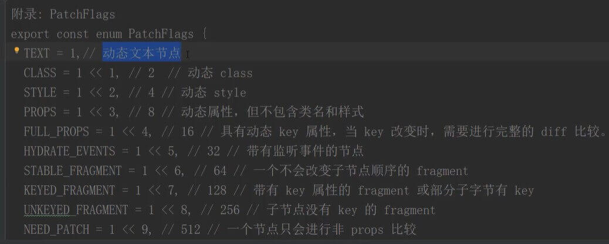

## vue3.0 diff

> 与vue2.x 全量比较 不同的是，vue3.0在创建虚拟DOM的时候，会根据DOM中的内容，会发生变化的，添加静态标记.


```html
<!-- 编译前 -->
<div>
    <p>哈哈</p>
    <p>哈哈</p>
    <p>{{msg}}</p>
</div>
```

```js
// 编译后
export function render(_ctx, _cache, $props, $setup, $data, $options){
    return (_openBlock(), _createBlock("div", null, [
        _createBlock("p", null, "哈哈"),
        _createBlock("p", null, "哈哈"),
        _createBlock("p", null, _toDisplayString(_ctx.msg) + "}", 1 /* TEXT */)
    ]))
}
```



