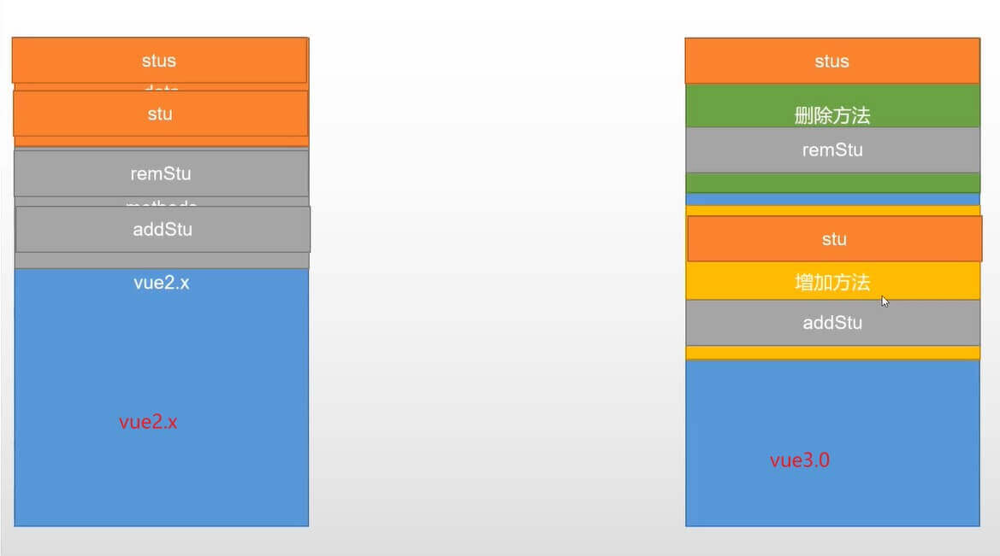

## Composition API: 组合API(类似React Hooks)

> 为vue应用提供更好的逻辑复用和代码组织

### setup

```vue
<script>
    // ref函数只能监听简单类型的变化，不能监听复杂类型的变化(对象/数组)shuj
    // isRef/isReactive分别监听是否为ref、reactive声明的数据对象
import { ref, reactive, isRef, isReactive } from "vue";
export default {
  // setup函数是组合API的入口函数,setup在beforeCreate生命钩子之前调用，所以无法使用data和methods，所以setup函数中this修改成了undefined
  setup() {
    // let count = 0; // 这样定义则数据不是响应式的
    let count = ref(0); // 定义了一个名叫count的变量，该变量初始值为0，该变量改变之后，vue自动更新UI
      //ref的本质还是reactive，当我们给ref传递一个值后，ref函数底层会自动将ref转换为reactive
      // ref(0) 变为 reactive({value:0}),所以赋值时应为 count.value = xx;
      
      
    // 在组合API中，如果想定义方法，不用定义到methods中，直接定义即可
    function mf() {
      count.value += 1;
    }
     let state = reactive({
         stus:[]
     })
    // 注意：在组合API中定义的变量/方法，要想在外界中使用，必须通过return {xxx} 暴露出去
    return { count, mf, stus };
  }
};
</script>
```



## Composition API和Options API(vue2.x中的使用方式)的混合使用

```vue
<script>
    export default{
        data:function(){
            return{}
        },
        methods:{
            
        },
        setup(){
            // 本质上setup中定义的数据会被注入到data、methods中
            return {...};
        }
    }
</script>
```

