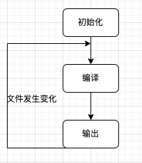
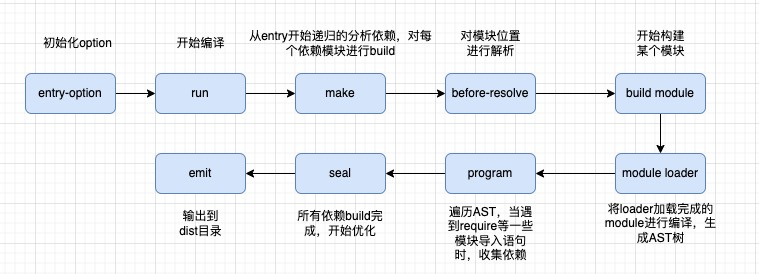

> `webpack`的运行流程是一个串行流程，它的工作流程就是将各个插件串联起来。在运行的过程中会广播事件，插件只需要监听它所关心的事件，就能加入到`webpack`机制中，去改变`webpack`的运作。

从启动到结束会依次执行三大步骤：

1. **初始化**

   从配置文件和`shell`语句中读取与合并参数，并初始化需要使用的插件和配置插件等执行环境所需要的参数

2. **编译构建**

   从`Entry`出发，针对每个`Module`串行调用对应的`Loader`去翻译文件内容，再找到该`Module`依赖的`Module`，递归地进行编译 处理

3. **输出**

   对编译后的`Module`组合成`Chunk`，把`Chunk`转换成文件，输出到文件系统



## 1. 初始化

从`配置文件`(默认是`webpack.config.js`，也可以通过命令的形式指定配置文件)和`shell`语句中读取与合并参数，用得到的最终参数初始化`Compiler`编译对象(该对象只进行一些调度工作)。

> `webpack`将`webpack.config.js`中的各个配置项合并到`options`对象中，并加载用户配置的`plugins`

```js
// Compiler继承自Tapable，初始化时定义了很多钩子函数
class Compiler extends Tapable {
    constructor(context) {
        super();
        this.hooks = {
            run: new AsyncSeriesHook(['compiler']), // 开始运行编译器
            entryOption: new SyncBailHook(['context', 'entry']), // 在entry选项被读取处理后触发。
            beforeCompile: new AsyncSeriesHook(['params']),
            compile: new SyncHook(['params']), // beforeCompile 之后立即调用，但在一个新的 compilation 创建之前。
            afterCompile: new AsyncSeriesHook(['compilation']),
            make: new AsyncParallelHook(['compilation']), // compilation 结束之前执行
            emit: new AsyncSeriesHook(['compilation']), // 输出 asset 到 output 目录之前执行。
            afterEmit: new AsyncSeriesHook(['compilation']), // 输出 asset 到 output 目录之后执行
            done: new AsyncSeriesHook(['stats']), // 在编译器执行完成时触发
            // 定义了很多不同类型的钩子
        };
    }
}
function webpack (options) {
    let compiler = new Compiler(options.context);
    ... // 检查options，若watch字段为true，则开启watch线程
    return compiler;
}
```

## 2. 编译构建

根据配置文件(`webpack.config.js`)中的`entry`找出所有入口文件：

```js
module.exports = {
  entry: "./src/file.js"
}
```

初始化完成后会调用`Compiler`的`run`方法来真正启动`webpack`编译构建流程，主要流程如下：

1. `compile`(compiler钩子) 开始编译

   执行了`run`方法后会触发`compile`方法来生成一个`compilation`对象，这个对象是编译阶段的主要执行者，会依次执行：

   1. **模块创建**
   2. **依赖收集**
   3. **分块**
   4. **打包**

2. `make`(compiler钩子) 编译模块

   在完成`compilation`对象后，就从入口点`entry`分析读取(主要执行`_addModuleChain`函数)模块及其依赖的模块，创建这些模块对象

3. `build module`(compilation钩子)  构建模块 （完成模块编译）

   这里调用配置的`loaders`，将我们的模块转成标准的JS模块。

   在用`Loader`对一个模块转换完后，使用`acorn`解析转换后的内容，输出对应的抽象语法树(`AST`)，以便`webpack`对代码的分析。

   从配置的入口模块开始，分析其`AST`，当遇到`require`、`import`等导入模块语句时，便将其加入到依赖的模块列表，同时对新找出的依赖模块递归分析，最终搞清楚所有模块的依赖关系。

## 3.输出

4. `seal` (compilation钩子)封装构建结果，输出资源

   `seal`方法主要生成`chunks`，对`chunks`进行一系列的优化操作，并生成要输出的代码。

   `webpack`中的`chunk`，可以理解为配置在`entry`中的模块，或者动态引入的模块。

   根据入口和模块之间的依赖关系，组装成一个个包含多个模块的`chunk`，再把每个`chunk`转换成一个单独的文件加入到输出列表。

5. `emit` (compiler钩子) 把各个`chunk`输出到结果文件

   在确定好输出内容后，根据配置确定输出的路径和文件名

   ```json
   module.exports = {
   	output: {
       path: path.resolve(__dirname, 'build'),
       filename: '[name].js'
     }
   }
   ```

   从`compiler`开始生成文件之前，钩子`emit`会被执行，这是我们修改最终文件的最后一个机会，从而`webpack`整个打包过程就结束了。



## 总结

1. `webpack`的打包流程主要分为三个主要步骤：**初始化流程**、**构建编译流程**、**输出流程**。
2. 从配置文件(`webpack.config.js`)和`shell`语句中读取合并参数，用最终得到的参数初始化`compiler`对象，并执行该对象的`run`方法开始构建流程
3. [`make`] 从`entry`入口点开始递归分析模块及其依赖的模块，创建这些模块对象
4. [`build module`] 调用配置好的`loader`把这些模块转译成标准的JS模块，并生成对应的`AST`语法树。再从入口模块开始，分析其`AST`，当遇到`require`、`import`等导入语句时，将其加入到模块依赖列表，对依赖模块递归分析，最终搞清楚所有模块的依赖关系。
5. [`seal`] 根据入口和模块之间的依赖关系，组成一个个包含多个模块的`chunk`，再把每个`chunk`转换成一个单独文件加入到输出列表。
6. [`emit`] 根据配置文件确定每个`chunk`的文件名，并把它们输出到导出目录中。