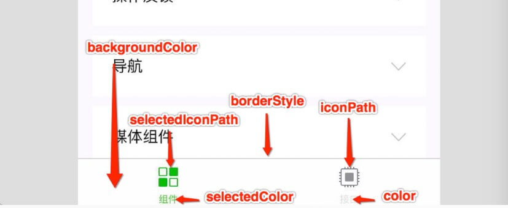

## `app.json`(全局页面配置)

> `app.json` 是小程序的**全局配置**，包括了小程序的**所有页面路径**、**界面表现**、**网络超时时间**、**底部 tab** 等。

### 必填项

```json
{
  /* sitemapLocation、pages字段为必填 */
  "sitemapLocation":"sitemap.json", // 指明 sitemap.json 的位置
  "pages":[ 
    // 用于描述小程序所有页面路径，这是为了让微信客户端知道当前你的小程序页面定义在哪个目录。
    // 小程序中新增/减少页面，都需要对 pages 数组进行修改。 
    // 未指定 entryPagePath 时，数组的第一项代表小程序的初始页面（首页）
    "pages/index/index",
    "pages/logs/logs"
  ],
}
```

### 非必填项

#### `window`配置

```json
{
    // 1.定义小程序所有页面的状态栏、导航条、标题、窗口背景色等
  "window":{ 
    "backgroundTextStyle":"light",
    "navigationBarBackgroundColor": "#fff", // 导航栏背景颜色,默认#000000
    "navigationBarTitleText": "Weixin", // 导航栏标题文字内容
    "navigationBarTextStyle":"black", // 导航栏标题颜色，仅支持 black / white。 默认white
    "navigationStyle":"default", // 导航栏样式，仅支持以下值：default 默认,custom 自定义导航栏，只保留右上角胶囊按钮。
    "backgroundColor":"#ffffff", // 窗口的背景色
    "backgroundTextStyle":"dark", // 下拉 loading 的样式，仅支持 dark / light
    "backgroundColorTop":"#ffffff", //顶部窗口的背景色，仅 iOS 支持
    "backgroundColorBottom": "#ffffff", // 底部窗口的背景色，仅 iOS 支持
    "enablePullDownRefresh": false, // 是否开启全局的下拉刷新, 详见 Page.onPullDownRefresh
    "onReachBottomDistance": 50, //页面上拉触底事件触发时距页面底部距离，单位为 px。详见 Page.onReachBottom
    "pageOrientation": "portrait", // 屏幕旋转,支持 auto / portrait(竖) / landscape(横)
    "restartStrategy": "homePage", // 重新启动策略,'homePage'下次将从首页冷启动;'homePageAndLatestPage'如果从这个页面退出小程序，下次冷启动后立刻加载这个页面，页面的参数保持不变（不可用于 tab 页）
    "initialRenderingCache": "static", // 启用所有页面初始渲染缓存
  },
}
```

#### `tabBar`配置

```json
{
  // 2.底部/顶部 tab 栏的表现
  "tabBar": {
    "custom": false, // 自定义 tabBar
    "color":"#000", // tab 上的文字默认颜色
    "selectedColor":"#eee", // tab 上的文字选中时的颜色
    "backgroundColor":"#fff", // tab 的背景色
    "borderStyle":"black", // tabbar 上边框的颜色， 仅支持 black / white
    "position": "bottom",  // tabBar 的位置，仅支持 bottom / top
    "list": [{ // tab 的列表，最少 2 个、最多 5 个 tab
      "pagePath": "pages/index/index", // 页面路径
      "text": "首页", // tab 上按钮文字
      "iconPath": "", // 图片路径，icon 大小限制为 40kb，建议尺寸为 81px * 81px，不支持网络图片。当 position 为 top 时，不显示 icon
      "selectedIconPath":"", // 选中时的图片路径
    }, {
      "pagePath": "pages/logs/index",
      "text": "日志"
    }]
  },
}
```

#### `networkTimeout` 网络请求配置

```json
{
  // 3.网络请求的超时时间
  "networkTimeout": {
    "request": 10000, // wx.request 的超时时间,默认60000
    "connectSocket":10000, // wx.connectSocket 的超时时间,默认60000
    "downloadFile": 10000, // wx.downloadFile 的超时时间,默认60000
    "uploadFile":10000 // wx.uploadFile 的超时时间,默认60000
  },
}
```

#### `permission`小程序接口权限相关配置

```json
{
  // 小程序接口权限相关设置
  "permission":  {
    "scope.userLocation": { // 位置相关权限声明
      "desc": "你的位置信息将用于小程序位置接口的效果展示" // 高速公路行驶持续后台定位
    },
	}, 
}
```

#### 主题配置

```json
{
  // 表示当前小程序可适配 DarkMode，所有基础组件均会根据系统主题展示不同的默认样式. 
	// 配置后，请根据DarkMode 适配指南自行完成基础样式以外的适配工作
	"darkmode": true, 
	"themeLocation": "/path/to/theme.json",  // 自定义 theme.json 的路径，当配置"darkmode":true时，当前配置文件为必填项
}
```

#### 其他

```json
{
  /* 以下字段选填 */
  // 默认小程序默认启动首页
  "entryPagePath":"pages/index/index", 

  // 在 iPad 上运行的小程序可以支持屏幕旋转,注意不能单独配置某个页面是否支持屏幕旋转
  "resizable": true, 
  
  // 在开发者工具中开启 debug 模式,调试信息以 info 的形式给出
  "debug": true, 
  
  "navigateToMiniProgramAppIdList": [
    "wxe5f52902cf4de896"
  ],
	
  //插件所有者小程序需要设置这一项来启用插件功能页
  "functionalPages": , 
  
  // 启用分包加载(按需加载)时，声明项目分包结构
  "subpackages": , 
  
  // 声明分包预下载的规则
  "preloadRule": , 
  
  // 通常情况下，在小程序启动期间，所有页面及自定义组件的代码都会进行注入，当前页面没有使用到的自定义组件和页面在注入后其实并没有被使用.所以小程序支持有选择地注入必要的代码，以降低小程序的启动时间和运行时内存
  "lazyCodeLoading":"requiredComponents", 
  
  // 使用 Worker 处理 多线程任务 时，设置 Worker 代码放置的目录
  "workers": "workers", 
  
  // 申明需要后台运行的能力。目前支持 audio(后台音乐播放)、location(后台定位)。
  // 开发版和体验版上可以直接生效，正式版还需通过审核
  "requiredBackgroundModes": ["audio", "location"], 

	// 声明小程序需要使用的插件
	"plugins": , 

	// 在此处声明的自定义组件视为全局自定义组件，在小程序内的页面或自定义组件中可以直接使用而无需再声明。
	"usingComponents": , 
	
	// 启用新版的组件样式,涉及的组件有 button icon radio checkbox switch slider
	"style": "v2", 
	
	// 指定需要引用的扩展库。目前支持 kbone、weui
  "useExtendedLib": { 
    "kbone": true,
    "weui": true
  },


  // 聊天位置消息用打车类小程序打开
  "entranceDeclare":{ 
    "locationMessage": {
      "path": "pages/index/index",
      "query": "foo=bar"
    }
  },

	// 单页模式相关配置，目前 分享到朋友圈 (Beta) 后打开会进入单页模式
	"singlePage": { 
    // 默认自动调整，若原页面是自定义导航栏，则为 float，否则为 squeezed。
    // 导航栏与页面的相交状态，值为 float 时表示导航栏浮在页面上，与页面相交；
    // 值为 squeezed 时表示页面被导航栏挤压，与页面不相交
  	"navigationBarFit": "float或者squeezed" 
	}, 
}
```




