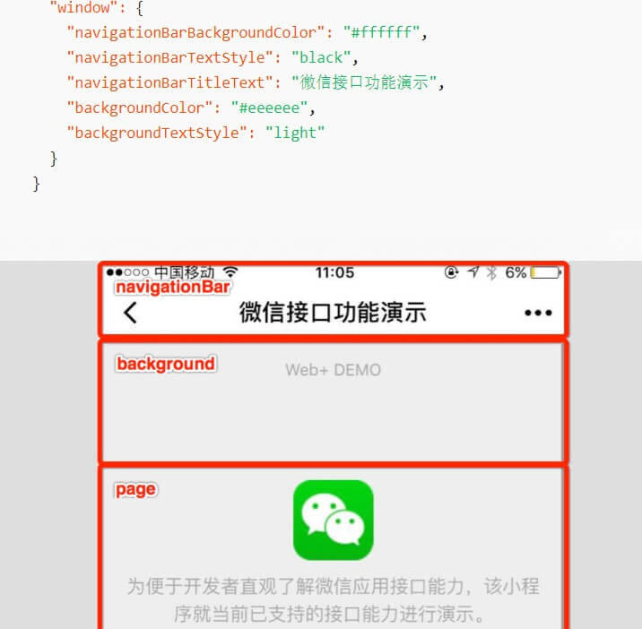

## `page.json`（单独页面配置）

如果你整个小程序的风格是蓝色调，那么你可以在 `app.json` 里边声明顶部颜色是蓝色即可。实际情况可能不是这样，可能你小程序里边的每个页面都有不一样的色调来区分不同功能模块，因此我们提供了 `page.json`，让开发者可以独立定义每个页面的一些属性，例如刚刚说的顶部颜色、是否允许下拉刷新等等。

每一个小程序页面使用 **同名 `xxx.json`** 文件来对本页面的窗口表现进行配置。

> 页面配置中**只能设置 `app.json` 中 `window` 对应的配置项**，以决定本页面的窗口表现，**所以无需写 `window` 这个属性**。

```json
{
    "navigationBarBackgroundColor": "#000000", // 导航栏背景颜色
    "navigationBarTextStyle": "white", //导航栏标题颜色，仅支持 black / white
    "navigationBarTitleText": "微信接口功能演示", // 导航栏标题文字内容
    "navigationStyle": "default", //导航栏样式，仅支持以下值：default 默认样式、custom 自定义导航栏，只保留右上角胶囊按钮
    "backgroundColor": "#eeeeee", // 窗口的背景色
    "backgroundTextStyle": "light", // 下拉 loading 的样式，仅支持 dark / light
    "backgroundColorTop": "#ffffff", // 顶部窗口的背景色，仅 iOS 支持
    "backgroundColorBottom": "#ffffff", // 底部窗口的背景色，仅 iOS 支持
    "enablePullDownRefresh": false, //是否开启当前页面下拉刷新。
    "onReachBottomDistance": 50, // 页面上拉触底事件触发时距页面底部距离，单位为px。
    "pageOrientation": "auto", // 屏幕旋转设置，支持 auto / portrait / landscape
    "disableScroll": false, // 设置为 true 则禁止页面整体上下滚动。只在页面配置中有效，无法在 app.json 中设置
    "usingComponents":{}, // 页面自定义组件配置
    "initialRenderingCache": , //页面初始渲染缓存配置
    "style": "default", // 启用新版的组件样式
    "singlePage": {} // 单页模式相关配置
		"initialRenderingCache": "static", // 启用该页面初始渲染缓存
}
```

