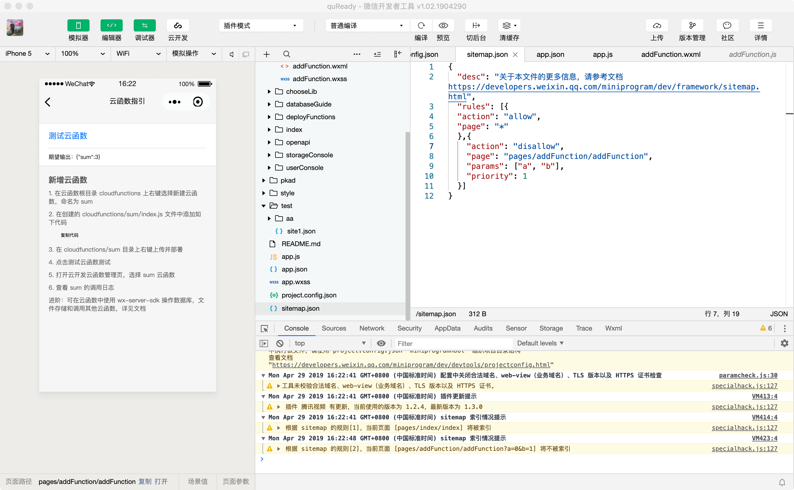

## `sitemap.json`(网站地图)

> `sitemap.json` 文件用于配置**小程序**及**其页面**是否允许被**微信索引**，文件内容为一个 JSON 对象，如果没有 `sitemap.json` ，则默认为所有页面都允许被索引

当开发者允许微信索引时，微信会通过爬虫的形式，为小程序的页面内容建立索引。当用户的搜索词条触发该索引时，小程序的页面将可能展示在搜索结果中。 爬虫访问小程序内页面时，会携带特定的 **user-agent：`mpcrawler`** 及[场景值](https://developers.weixin.qq.com/miniprogram/dev/reference/scene-list.html)：**`1129`**。

需要注意的是，若小程序爬虫发现的页面数据和真实用户的呈现不一致，那么该页面将不会进入索引中。

**注：`sitemap` 的索引提示是默认开启的，如需要关闭 `sitemap` 的索引提示，可在小程序项目配置文件 `project.config.json` 的 `setting` 中配置字段 `checkSiteMap` 为 `false`**

**注: `sitemap` 文件内容最大为 5120 个 UTF8 字符**

**注：没有 `sitemap.json` 则默认所有页面都能被索引**

**注：`{"action": "allow", "page": "\*"}` 是优先级最低的默认规则，未显式指明 "` disallow`" 的都默认被索引**

```json
{
    "rules":[{
        "action": "allow", // 只有"allow"、"disallow"两个值，命中该规则的页面是否能被索引,
        "page": "path/to/page", // 取值："*"、页面的路径。* 表示所有页面，不能作为通配符使用
        "params": ["a", "b"], // 当 page 字段指定的页面在被本规则匹配时可能使用的页面参数名称的列表（不含参数值）
        "matching": "exact", // 当 page 字段指定的页面在被本规则匹配时，此参数说明 params 匹配方式
        "priority": 1  // 优先级.  值越大则规则越早被匹配，否则默认从上到下匹配
    }, {
        "action": "disallow",
        "page": "path/to/page",
        "priority": 2
    }]
}
```

### ` matching` 取值说明:

| 值        | 说明                                                       |
| --------- | ---------------------------------------------------------- |
| exact     | 当小程序页面的参数列表**等于** params 时，规则命中         |
| inclusive | 当小程序页面的参数列表**包含** params 时，规则命中         |
| exclusive | 当小程序页面的参数列表与 params **交集为空**时，规则命中   |
| partial   | 当小程序页面的参数列表与 params **交集不为空**时，规则命中 |

#### `exact`举例：

```json
{
  "rules":[{
    "action": "allow",
    "page": "path/to/page",
    "params": ["a", "b"],
    "matching": "exact"
  }, {
    "action": "disallow",
    "page": "path/to/page"
  }]
}
```

- `path/to/page?a=1&b=2` => 优先索引
- `path/to/page` => 不被索引
- `path/to/page?a=1` => 不被索引
- `path/to/page?a=1&b=2&c=3` => 不被索引
- 其他页面都会被索引

#### `inclusive`举例：

```json
{
  "rules":[{
    "action": "allow",
    "page": "path/to/page",
    "params": ["a", "b"],
    "matching": "inclusive"
  }, {
    "action": "disallow",
    "page": "path/to/page"
  }]
}
```

- `path/to/page?a=1&b=2` => 优先索引
- `path/to/page?a=1&b=2&c=3` => 优先索引
- `path/to/page` => 不被索引
- `path/to/page?a=1` => 不被索引
- 其他页面都会被索引

#### `exclusive`举例：

```json
{
  "rules":[{
    "action": "allow",
    "page": "path/to/page",
    "params": ["a", "b"],
    "matching": "exclusive"
  }, {
    "action": "disallow",
    "page": "path/to/page"
  }]
}
```

- `path/to/page` => 优先索引
- `path/to/page?c=3` => 优先索引
- `path/to/page?a=1` => 不被索引
- `path/to/page?a=1&b=2` => 不被索引
- 其他页面都会被索引

#### `partial`举例：

```json
{
  "rules":[{
    "action": "allow",
    "page": "path/to/page",
    "params": ["a", "b"],
    "matching": "partial"
  }, {
    "action": "disallow",
    "page": "path/to/page"
  }]
}
```

- `path/to/page?a=1` => 优先索引
- `path/to/page?a=1&b=2` => 优先索引
- `path/to/page` => 不被索引
- `path/to/page?c=3` => 不被索引
- 其他页面都会被索引




