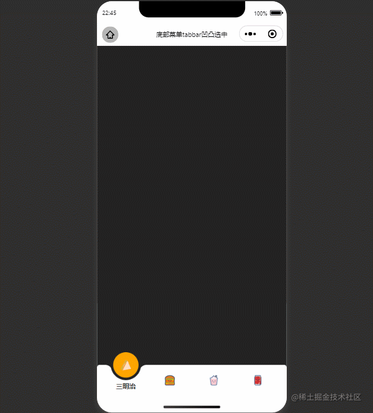
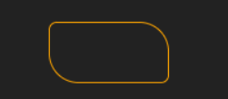
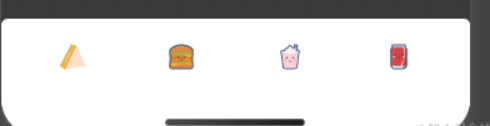
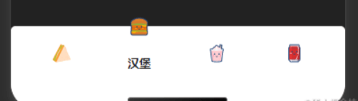
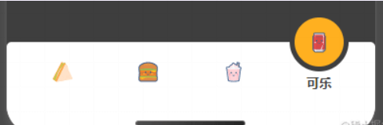
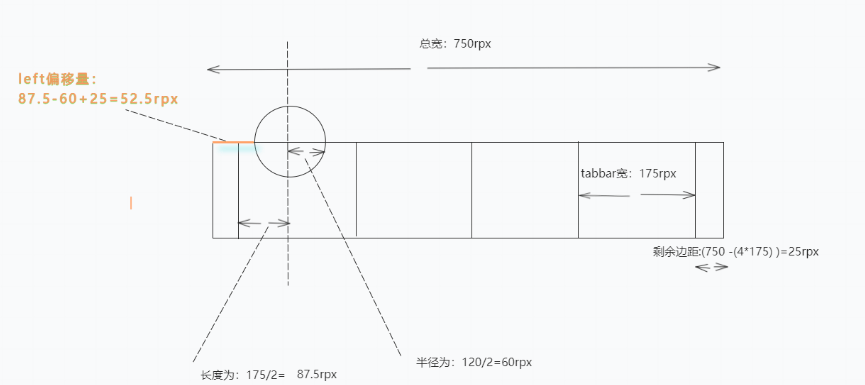
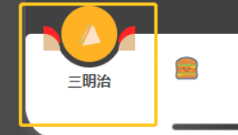
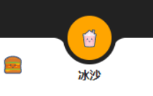

## 实现效果



## 实现原理

### 一、引入阿里巴巴矢量图标

### 二、定义`css`变量

`css`的`var`函数：[**`var(custom-property-name, value)`**](https://link.juejin.cn/?target=https%3A%2F%2Fwww.runoob.com%2Fcssref%2Ffunc-var.html)：`var()` 函数用于插入自定义的属性值，如果一个属性值在多处被使用，该方法就很有用

- `custom-property-name`：必需。自定义属性的名称，必需以 `--` 开头。
- `value`：可选。备用值，在属性不存在的时候使用。

```css
page {
  --color: #222;
  background: var(--color);
  --bg: orange;
  --w: 175rpx;
}
```

### 三、`ios`底部安全距离

> 苹果官方推荐：使用`env()`，`constant()`来进行底部安全距离适配。
>
> iOS11 新增特性，Webkit 的一个 CSS 函数，用于设定**安全区域**与**边界**的距离，有四个预定义的变量： 
>
> - `safe-area-inset-left`：安全区域距离左边边界的距离
> - `safe-area-inset-right`：安全区域距离右边边界的距离
> - `safe-area-inset-top`：安全区域距离顶部边界的距离
> - `safe-area-inset-bottom` ：安全距离底部边界的距离
>
> ***一般情况下，关注`safe-area-inset-bottom`即可。***

***使用前提：***

- 网页需设置`viewport-fit=cover`，小程序总默认为`viewport-fit=cover`
- IOS11.2之前使用`constant()`函数，IOS11.2之后使用`env()`
- `constant()`和`env()`需要同时存在，并且`constant()`在前，顺序不能改变

### 四、`css`属性`transition`

> [CSS3 transition 属性](https://link.juejin.cn/?target=https%3A%2F%2Fwww.runoob.com%2Fcssref%2Fcss3-pr-transition.html)*：transition 属性设置元素当过渡效果。*注：始终指定`transition-duration`属性，否则持续时间为`0`，`transition`不会有任何效果。

格式：`transition: property duration timing-function delay;`

- `transition-property`：指定CSS属性的`name`，`transition`效果
- `transition-duration`：`transition`效果需要指定多少秒或毫秒才能完成
- `transition-timing-function`：指定`transition`效果的转速曲线
- `transition-delay`：定义`transition`效果开始的时候

### 五、box-shadow

> [CSS3 box-shadow 属性](https://link.juejin.cn?target=https%3A%2F%2Fwww.runoob.com%2Fcssref%2Fcss3-pr-box-shadow.html)：可以设置一个或多个下拉阴影的框。 `boxShadow `属性把一个或多个下拉阴影添加到框上。该属性是一个用逗号分隔阴影的列表，每个阴影由 2-4 个长度值、一个可选的颜色值和一个可选的 inset 关键字来规定。省略长度的值是 0。

格式：`box-shadow: h-shadow v-shadow blur spread color inset;`

- `h-shadow`：必需的。水平阴影的位置。允许负值
- `v-shadow`：必需的。垂直阴影的位置。允许负值
- `blur`：可选。模糊距离
- `spread`：可选。阴影的大小
- `color`：可选。阴影的颜色。
- `inset`：可选。从外层的阴影（开始时）改变阴影内侧阴影

### 六、border-radius

> [CSS3 border-radius 属性：](https://link.juejin.cn/?target=https%3A%2F%2Fwww.runoob.com%2Fcssref%2Fcss3-pr-border-radius.html)border-radius 允许你设置元素的外边框圆角。当使用**一个半径**时确定一个圆形，当使用**两个半径**时确定一个椭圆。这个(椭)圆与边框的交集形成圆角效果。

格式：`border-radius: 1-4 length|% / 1-4 length|%;`

*注：每个半径的四个值的顺序是：左上角，右上角，右下角，左下角。如果省略左下角，右上角是相同的。如果省略右下角，左上角是相同的。如果省略右上角，左上角是相同的。*



```css
view{
  margin: 50px auto;
  border-radius: 15rpx 50rpx;
  width: 200rpx;
  height: 100rpx;
  border: 1px solid orange;
}
```

## 实现步骤

### 1. 实现底部 tabbar

1. flex横向布局并居中，实现4个 tabbar，fixed定位居于底部，并设置ios底部安全距离

   

2. 设置`currIndex`参数，表示当前选中tabbar的索引，`currIndex==index`设置激活样式

   

3. 为当前选中的tabbar添加选中背景，背景基于整个底部栏设置`absolute`定位，根据tabbar宽，背景度，页面总宽得出定位`left`偏移距离，`top`设置为底部栏高度的`-50%`

   

   - `left`偏移距离的计算：

   

   - 使用`var`函数计算：

     ```css
     page {
       --w: 175rpx;//tabbar宽度
       --t: 750rpx;//总宽度
       --c: 120rpx;//选中背景宽度
       /* 注意：env()和constant()需要同时存在，且constant()在前 */
       padding-bottom: calc(constant(safe-area-inset-bottom) +140rpx);
       padding-bottom: calc(env(safe-area-inset-bottom) + 140rpx);
     }
     ```

     ```css
     -left-pad: calc(var(--t) - (4 * var(--w)));
      left: calc((var(--left-pad) / 2) + (var(--w) / 2) - (var(--c) / 2));
     ```

   - `top`偏移距离的计算： `top`设置为底部栏高度的`-50%`，需要配合`ios`底部安全距离使用，即：

     ```css
     top: calc(-50% + constant(safe-area-inset-bottom) / 2);
     top: calc(-50% + env(safe-area-inset-bottom) / 2);
     ```

   - 当选中的`currIndex`变化，`tabbar`背景设置`transform`偏移

     ```css
       transform: translateX(calc(var(--w) * var(--n)));
       //--w:tabbar宽度，--n对应currIndex
     ```

### 2.tabbar 背景凹凸圆角

1. `伪元素+box-shadow`实现凹凸圆角

   

2. 修改伪元素背景颜色为`transparent`，设置`box-shadow`设置与页面整体背景一致

   

   ```css
   .active-tabbar-box::before,
   .active-tabbar-box::after {
     content: "";
     position: absolute;
     top: 50%;
     width: 30rpx;
     height: 30rpx;
     background: transparent;
   }
   .active-tabbar-box::before {
     left: -33rpx;
     border-radius: 0 30rpx 0 0;
     box-shadow: 0 -15rpx 0 0 var(--color);
   }
   .active-tabbar-box::after {
     right: -33rpx;
     border-radius: 30rpx 0 0 0;
     box-shadow: 0 -15rpx 0 0 var(--color);
   }
   ```

## 实现代码

```html
<view class="tabbar-box">
  <block wx:for="{{menu}}" wx:key="list">
    <view class="menu-item {{currIndex==index && 'active'}}" catchtap="tabClick" data-index="{{index}}">
      <view class="iconfont {{item.icon}}"></view>
      <text>{{item.name}}</text>
    </view>
  </block>
  <view class="active-tabbar-box" style="--n:{{currIndex}}"></view>
</view>
```

```js
Page({
  data: {
    currIndex: 0,
    menu: [
      {
        name: "三明治",
        icon: "icon-susua-2-53"
      },
      {
        name: "汉堡",
        icon: "icon-susuhanbao"
      },
      {
        name: "冰沙",
        icon: "icon-susubingsha"
      },
      {
        name: "可乐",
        icon: "icon-susukele"
      },
    ]
  },
  tabClick(e) {
    let {
      index
    } = e.currentTarget.dataset;
    this.setData({
      currIndex: index,
    })
  },
})
```

```css
@import "../utils/icon-font.wxss";
page {
  --color: #222;
  background: var(--color);
  --bg: orange;
  --w: 175rpx;
  --t: 750rpx;
  --c: 120rpx;
  /* 注意：env()和constant()需要同时存在，且constant()在前 */
  padding-bottom: calc(constant(safe-area-inset-bottom) +140rpx);
  padding-bottom: calc(env(safe-area-inset-bottom) + 140rpx);
}
.tabbar-box {
  background: #fff;
  border-radius: 10rpx 10rpx 0 0;
  position: relative;
  height: 120rpx;
  width: var(--t);
  display: flex;
  align-items: center;
  justify-content: center;
  position: fixed;
  left: 0;
  bottom: 0;
  z-index: 10;
  padding-bottom: constant(safe-area-inset-bottom);
  padding-bottom: env(safe-area-inset-bottom);
}
.menu-item {
  display: flex;
  align-items: center;
  justify-content: center;
  flex-direction: column;
  width: var(--w);
  height: 100%;
  -webkit-tap-highlight-color: rgba(0, 0, 0, 0);
}
.menu-item .iconfont {
  font-size: 40rpx;
  color: var(--color);
  transition: 0.5s all;
  position: relative;
  z-index: 9;
}
.menu-item text {
  position: absolute;
  font-size: 26rpx;
  font-weight: bold;
  color: #222;
  transition: 0.5s all;
  opacity: 0;
  transform: translateY(50rpx);
}
.menu-item.active .iconfont {
  transform: translateY(-60rpx);
}
.menu-item.active text {
  opacity: 1;
  transform: translateY(22rpx);
}
.active-tabbar-box {
  box-sizing: border-box;
  position: absolute;
  width: var(--c);
  height: var(--c);
  background: var(--bg);
  --left-pad: calc(var(--t) - (4 * var(--w)));
  left: calc((var(--left-pad) / 2) + (var(--w) / 2) - (var(--c) / 2));
  top: calc(-50% + constant(safe-area-inset-bottom) / 2);
  top: calc(-50% + env(safe-area-inset-bottom) / 2);
  border-radius: 50%;
  border: 10rpx solid var(--color);
  transition: 0.5s all;
}
.active-tabbar-box::before,
.active-tabbar-box::after {
  content: "";
  position: absolute;
  top: 50%;
  width: 30rpx;
  height: 30rpx;
  background: transparent;
}
.active-tabbar-box::before {
  left: -33rpx;
  border-radius: 0 30rpx 0 0;
  box-shadow: 0 -15rpx 0 0 var(--color);
}
.active-tabbar-box::after {
  right: -33rpx;
  border-radius: 30rpx 0 0 0;
  box-shadow: 0 -15rpx 0 0 var(--color);
}
.active-tabbar-box {
  transform: translateX(calc(var(--w) * var(--n)));
}
```

