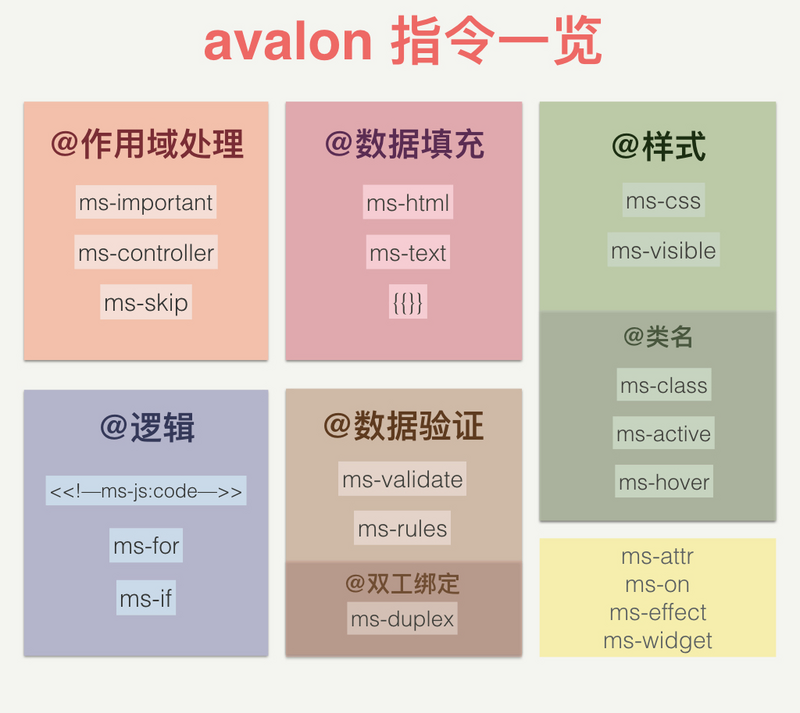
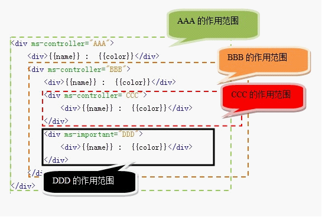

# 基本使用方式

在HTML中添加绑定，在JS中用`avalon.define`定义ViewModel，再调用`avalon.scan`方法，它就能动了！

## avalon.define()、avalon.scan()

* **avalon.scan是一个非常重要的方法，它有两个可选参数，第一个是扫描的起点元素，默认是HTML标签，第2个是VM对象。**

  ```js
  //源码
  avalon.scan = function(elem, vmodel) {
      elem = elem || root
      var vmodels = vmodel ? [].concat(vmodel) : []
      scanTag(elem, vmodels)
  }
  ```

* **视图模型通过 `avalon.define` 方法进行定义。生成的对象会默认放到 `avalon.vmodels` 对象上。 每个VM在定义时必须指定 `$id`。如果你有某些属性不想监听，可以直接将此属性名放到``$skipArray`数组中**

  ```js
  var vm = avalon.define({
      $id: "test",
      a: 111,
      b: 222,
      $skipAarray: ["b"],
      $c: 333,
      firstName: "司徒",
      lastName: "正美",
      fullName: {// 一个包含set或get的对象会被当成PropertyDescriptor，
          set: function(val) {// 里面必须用this指向scope，不能使用scope
              var array = (val || "").split(" ");
              this.firstName = array[0] || "";
              this.lastName = array[1] || "";
          },
          get: function() {
              return this.firstName + " " + this.lastName;
          }
      },
      array: [1,2,3],
      array2:[{e: 1}, {e: 2}]
      d: {
      	k: 111,
      	f: 2222
      	$skipArray: ["f"],
      }
  })
  ```

  - **$id**， 每个VM都有$id，**如果VM的某一个属性是对象（并且它是可监控的），也会转换为一个VM**，这个子VM也会默认加上一个$id。 但只有用户添加的那个最外面的$id会注册到avalon.vmodels对象上。

    **注意：**在IE6-8下，M（原始数据）转换为VM会添加了许多属性与方法，因此不能直接将VM赋给VM，而是用M赋给VM。VM中有一个$model对象，就是它当前的原始数据。

  - **监控属性**，一般地，VM中的属性都会转换为此种属性，**简单数据类型（string, boolean, number）或Date类型**以**`vm.aaa = yyy`**这种形式更改其值时，就会同步到视图上的对应位置上。

    如果是**数组**，以**``vm.simpleArray.set(0, 1000)** 这种形式更改其值。

    如果要更新**对象**，直接赋给它一个对象，注意不能将一个VM赋给它，可以到VM的$model赋给它（要不会在IE6-8中报错）

    ```js
    vm.object = {
        aaaa: "aaaa",
        bbbb: "bbbb",
        cccc: "cccc",
        dddd: "dddd"
    }
    ```

  - **计算属性**，定义时为一个对象，并且只存在**set**,**get**两个函数或只有一个get一个函数。它是监控属性的高级形式，表示它的值是通过函数计算出来的，是依赖于其他属性合成出来的。

  - **监控数组**，定义时为一个数组，它会添加了许多新方法，但一般情况下与普通数组无异，但调用它的push, unshift, remove, pop等方法会同步视图。

  - **非监控属性**，这包括框架添加的$id属性，以$开头的属性，放在$skipArray数组中的属性，值为函数、元素节点、文本节点的属性，总之，改变它们的值不会产生同步视图的效果。

  $skipArray 是一个字符串数组，只能放当前对象的直接属性名，想禁止子对象的某个属性的监听，在那个子对象上再添加一个$skipAray数组就行了。

  视图里面，我们可以**使用ms-controller, ms-important指定一个VM的作用域**。

  此外，在**ms-each**, **ms-with**，**ms-repeat**绑定属性中，它们会创建一个临时的VM，我们称之为代理VM， 用于放置**$key, $val, $index, $last, $first, $remove**等变量或方法。

  另外，avalon不允许在VM定义之后，再追加新属性与方法

## 指令



```html
<li ms-attr="[{'pval':pd.proid},{'issingle':pd.isSingle}, {'id': pd.proid}, {'index': pd.position}, pd.position>0 ? {'class':'productmsg childOption'}:{'class': 'productmsg'}]" ms-click="@showHideIncome(pd,$event)" ms-mouseenter="@showChildEnter($event)" ms-mouseleave="@showLeaveEnter($event)" ms-for="($index,pd) in item.data_list">
```

* **ms-*绑定属性**，它们的格式大概是这样划分的*"ms" + type + "-" + param1 + "-" + param1 + "-" + param2 + ... + number = value*

  ```js
  ms-skip                //这个绑定属性没有值
  ms-controller="expr"   //这个绑定属性没有参数
  ms-if="expr"           //这个绑定属性没有参数
  ms-if-loop="expr"       //这个绑定属性有一个参数
  ms-repeat-el="array"    //这个绑定属性有一个参数
  ms-attr-href="xxxx"    //这个绑定属性有一个参数
  ms-attr-src="xxx/{{a}}/yyy/{{b}}"   //这个绑定属性的值包含插值表达式，注意只有少部分表示字符串类型的属性可以使用插值表达式
  ms-click-1="fn"       //这个绑定属性的名字最后有数字，这是方便我们绑定更多点击事件 ms-click-2="fn"  ms-click-3="fn"  
  ms-on-click="fn"     //只有表示事件与类名的绑定属性的可以加数字，如这个也可以写成  ms-on-click-0="fn"    
  ms-class-1="xxx" ms-class-2="yyy" ms-class-3="xxx" //数字还表示绑定的次序
  ms-css-background-color="xxx" //这个绑定属性有两个参数，但在css绑定里，相当于一个，会内部转换为backgroundColor 
  ms-duplex-aaa-bbb-string="xxx"//这个绑定属性有三个参数，表示三种不同的拦截操作 
  ```

  * **data-xxx-yyy="xxx"**，辅助指令，比如ms-duplex的某一个辅助指令为data-duplex-event="change"，ms-repeat的某一个辅助指令为data-repeat-rendered="yyy"

  * ### 作用域绑定(ms-controller, ms-important)

    ```js
    # ViewModel
    avalon.ready(function() {
        avalon.define({
            $id: "AAA",
            name: "liger",
            color: "green"
        });
        avalon.define({
            $id: "BBB",
            name: "sphinx",
            color: "red"
        });
        avalon.define({
            $id: "CCC",
            name: "dragon" //不存在color
        });
        avalon.define({
            $id: "DDD",
            name: "sirenia" //不存在color
        });
        avalon.scan()
    })
    ```

    

    **ms-important就相当于CSS的important语句，强制这个区域使用此ViewModel，不再往上查找同名属性或方法！:**

    