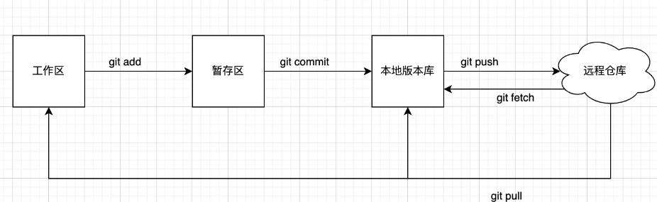

## 基础概念

`git`有三个分区，分别是：

- 工作区（**Working Directory**）：开发者直接编辑的地方，只要文件发生了更改，在这就会显示出来，包含追踪与未追踪文件。通过`git add`将工作区文件添加到暂存区。
- 暂存区（**Stage | Index**）：数据暂时存放的区域，通过`git commit`将暂存区文件添加到本地版本库。
- 本地版本库（**Local Commit History**）：存放所有已经提交的数据，通过`git push`推送到远程仓库。

### 放弃工作区所作的修改

* `git restore <file>...`:放弃特定文件的修改
* `git checkout .`：放弃所有文件的修改

## branch 分支操作

### 创建新分支

1. `git branch <branch-name>`

2. `git branch <new-branch> <base-branch>`

   基于**某个分支**开出新分支

3. `git branch <new-branch> commit_hash`

   基于**某个提交**开出新分支

4. `git branch <new-branch> v1.1`

   基于**某个tag**开出有新分支

### 删除分支

* 删除**本地**分支：`git branch -d <branch-name>`
* 删除**远程**分支：`git push -d origin <branch-name>`