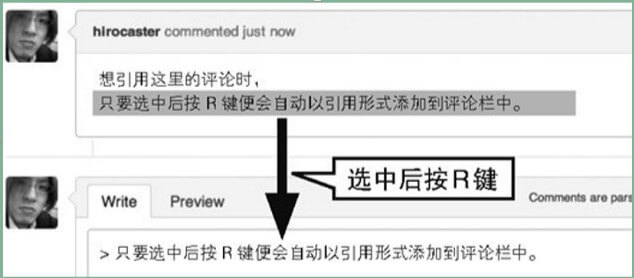
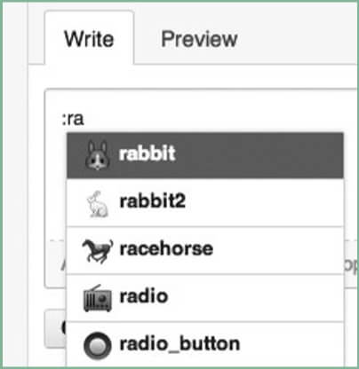

# Pull Request

>  Pull Request 是用户修改代码后向对方仓库发送采纳请求的功能。

## **获取** **diff** **格式与** **patch** **格式的文件**

以 diff 格式文件和 patch 格式文件的形式来处理 Pull Request，

假设Pull Request 的 URL是 `https://github.com/用户名/仓库名/pulls/28`

获取 diff 格式的文件，只要像下面这样在 URL 末尾添加 .diff 即可:

`https://github.com/用户名/仓库名/pulls/28.diff`

## **引用评论**

在 Conversation 中引用某个人的评论。选中想引用的评论然后按 R 键，被选择的部分就会自动以评论语法写入评论文本框,该快捷键在 Issue 中同样有效



在 **Commits 标签页**中，按时间顺序列表显示了与当前 Pull Request 相关的提交，标签上的数字为提交的次数。每个提交右侧的哈希值可以连接到该提交的代码

在评论中输入**“:”（冒号）**便会启动表情自动补全功能



**Files Changed 标签页**中可以查看当前 Pull Request 更改的文件内容以及前后差别。标签上的数字表示新建及被更改的文件数。默认情况下系统会将空格的不同也高亮显示，所以在空格有改动的情况下会难以阅读。这时只要在 URL 的末尾添加“?w=1”就可以不显示空格的差别。将鼠标指针放到被更改行行号的左侧，我们会看到一个加号。点击这个加号可以在代码中插入评论。

## 流程

1. 在对方仓库中点击 Fork 按钮创建自己的仓库，新建的仓库名 为“自己的账户名 /first-pr”

2. 克隆到本地：git clone …

3. 查看一下 clone 出的仓库的分支：git branch -a

   ​	开头加了“remotes/origin/”的是 GitHub 端仓库的分支

4. 创建一个分支，用来发送 Pull Request

   `**git checkout -b** **分支名、****git branch -a**`

5. 修改代码，并用 git diff 命令查看修改是否已经正确进行

6. 确认添加的代码，提交至本地仓库：

   ```sh
   $ git add index.html
   $ git commit -m "Add my impression"
   ```

7. 创建远程分支，要从 GitHub 发送 Pull Request，GitHub 端的仓库中必须有一个包含了修改后代码的分支：

   ```sh
   $ git push origin work
   $ git branch -a
   ```

8. 登录 GitHub 并切换至 该分支，点击分支名左侧的绿色按钮，会跳转至查看分支间差别的页面。确认想要发送的 Pull Request 的内容差别无误后，请点击 **Create Pull Request**。

   确认没有问题后，点击 **Send pull request 按钮**。这样一来，Pull Request 的目标仓库中就会新建 Pull Request 和 Issue，同时该仓库的管理者会接到通知。

## 接收采纳Pull Request

1. 将接收方的本地仓库更新至最新状态

   ​		将 Pull Request 接收方的仓库 clone 到本地开发环境中

   ```sh
   $ git clone git@github.com:ituring/first-pr.git
   ```

2. 将 Pull Request 发送方的仓库设置为本地仓库的远程仓库，获取发送方仓库的数据

   ```sh
   $ git remote add PR发送者 git@github.com:PR发送者/first-pr.git
   $ git fetch PR发送者
   ```

3. 创建用于检查的分支

   ```SH
   $ git checkout -b pr1
   ```

4. 合并，将已经 fetch 完毕的“PR 发送者 /work”的修改内容与 pr1 分支进行合并

   ```SH
   $ git merge PR发送者/work
   ```

5. 删除分支，检查结束后 pr1 分支就没用了，可以直接删除

   ```sh
   $ git branch -D pr1
   ```

6. ​	6. 采纳 Pull Request，完成上述内容后，如果 Pull Request 的内容没有问题，大可打开浏览器找出相应的 Pull Request 页面，点击 **Merge pull request 按钮**，随后 Pull Request 的内容会自动合并至仓库

**手动**

1. 合并到主分支

   ```sh
   $ git checkout 主分支
   $ git merge PR送信者/work
   ```

2. 查看本地与 GitHub 端仓库内代码的差别

   ```sh
   $ git diff origin/gh-pages
   ```

3. 确认没有目的之外的差别后，进行 push

   ```sh
   $ git push
   ```

   用这种方法处理后，仓库的 Pull Request 会自动从 Open 状态变为 Close 状态