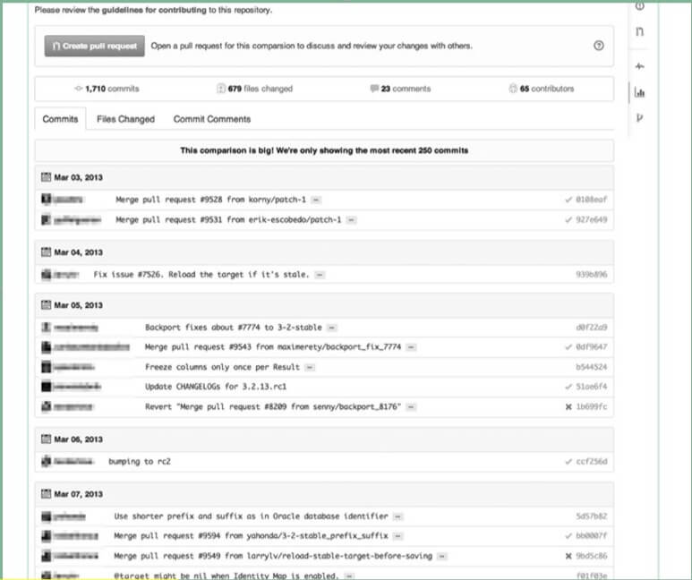

# 查看代码差别

在 GitHub 上，直接修改 URL 就可以让用户以多种形式查看差别。

如`https://github.com/rails/rails/`，查看 4-0-stable 分支与 3-2-stable 分支之间的差别，可以像下面这样将分支名加到 URL 里：

`https://github.com/rails/rails/compare/4-0-stable...3-2-stable`

**查看与几天前的差别:**

如查看 master 分支在最近 7 天内的差别，可以像下面这样这样将时间加入 URL，

`https://github.com/rails/rails/compare/master@{7.day.ago}...master`

- day
- week
- month
- year

**查看与指定日期之间的差别:**

如查看 master 分支 2013 年 1 月 1 日与现在的区别，可以将日期加入 URL：

`https://github.com/rails/rails/compare/master@{2013-01-01}...master`