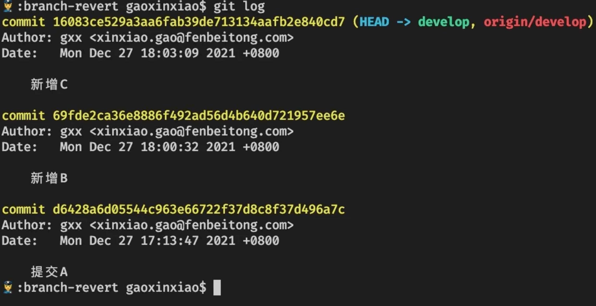

# 代码回滚

> 在日常的代码回滚中常用的有两种方式`git revert`和`git reset`来进行回滚

## reset

1. `reset`的作用是当你希望提交的`commit`从历史记录中完全消失就可以用

2. 比如你在`master`分支提交了`A-->B-->C`提交了三个记录，这个时候如果**C记录**有问题你想回滚到**B**就可以用`git reset`进行

3. 这个命令大概率的情况都是用在我们主分支的，因为我们上线的分支一般是`master`分支然后从`develop`进行功能开发

4. 开发完成之后将分支合并到`master`，如果在上线之前发现合并的分支用问题可以将`develop`合并过来的分支进行回滚

5. 说白了就是取消`develop`的本次合并

6. 但是有一种情况就是协作开发的时候大家都合并到`master`之后就不能用`reset`强行回滚`commit`因为这样会把其他人的提交记录给冲掉，这时候就可以用`revert`来进行操作我们在下面说

**操作一下reset来感受一下**

1.我们将`develop`分支的代码合并到`master`，切换到`master`分支 执行`git merge develop`

2.我们在master分支使用`git log`查看commit记录找到B记录，准备回滚这一条，回滚的时候不需要输入全部的commid一般是前7位就够用

3.重点来了我们使用`git reset 69fde2c`进行回滚，这个时候查看log记录发现最后一条`新增c`记录没有了，这里还有个问题如果直接使用`git push`推送会有以下提示。

> 这是因为本地的记录因为我们的回滚已经落后于仓库的代码了，这个使用需要使用`git push -f`进行强制提交

4.这个时候master分支就剩下A和B的commit记录了，到这里就是一次完整的reset回滚记录，之后我们还是可以继续正常把develop分支合并到master的

## revert

1. `revert`的原理是，在当前提交后面，新增一次提交，抵消掉上一次提交导致的所有变化。它不会改变过去的历史，所以是首选方式，没有任何丢失代码的风险

2. `revert`可以抵消上一个提交，那么如果想要抵消多个需要执行 `git revert 倒数第一个commit id 倒数第二个commit`

3. 这个就常用于当你提交了一次`commit`之后发现提交的可能有问题就可以用到`revert`

4. 还有一种情景是已经有很多人提交过代码，但是想改之前的某一次`commit`记录又不想影响后面的也可以使用`revert`，他会把你后面提交的记录都放到工作区只是合并的时候需要注意一点

**我们来模拟一下环境**

1. 切到develop分支现在该分支有三个`commit`记录

   

2. 我们使用rever进行回滚试一下`git revert 16083ce`，如果你也用的是`vs code`可以看到工作区的变化，并且在控制台可以提交默认的`commit`

   

3. 看一下log记录，可以看到新增了一个记录`Revert 新增C`，并且原来的`新增C`还是在的

   