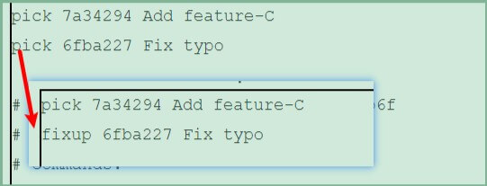

# 更改提交的操作

Git 的另一特征便是可以灵活操作历史版本。借助分散仓库的优势，可以在不影响其他仓库的前提下对历史版本进行操作。

| **git reset** **--hard** **目标时间点的哈希值** | **回溯历史版本，让仓库的** **HEAD****、暂存区、当前工作树回溯到指定状态。哈希值只要输入** **4** **位以上就可以执行** |
| ----------------------------------------------- | ------------------------------------------------------------ |
| **git commit --amend**                          | **修改上一条提交信息**                                       |
| **git rebase -i**                               | **压缩历史**                                                 |
| **git commit -am**                              | 小小的变更(如修改拼写错误)就没必要先执行 `git add `命令再执行 `git commit `命令了，用 `git commit -am` 命令来一次完成这两步操作。 错字漏字等失误称作 typo，所以我们将提交信息记为 " Fix typo" |
| **git rebase -i HEAD~2**                        | 更改历史(健全的历史记录不需要拼写修改等)，该命令把最近2次提交修改为一次完美的提交 HEAD最新提交，2为最近2条历史记录  |

