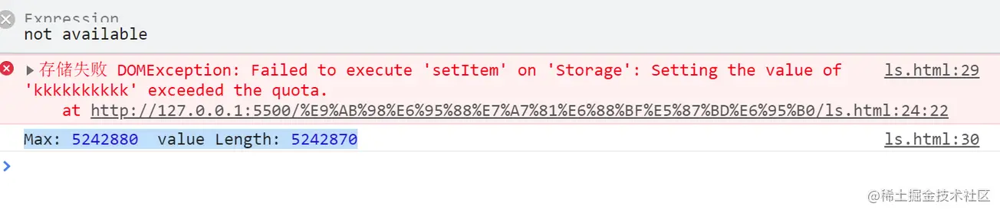
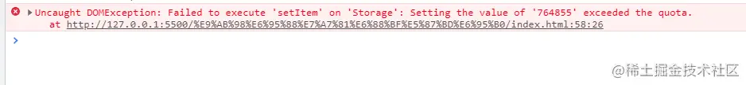
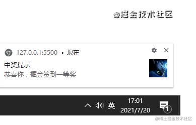

## 字符串或十六进制转换为rgba颜色

```typescript
/**
 * 转换为rgba颜色
 * @param HexOrString 
 * @param alpha 
 * @returns 
 */
export const HexOrStringToRgba = (HexOrString: string, alpha = 0.2) => {
    HexOrString = HexOrString.trim();
    let r, g, b;
    if (HexOrString.startsWith('#')) {
        // 如果是十六进制格式，移除可能的#号
        HexOrString = HexOrString.slice(1);

        // 检查颜色值的长度，如果是缩写形式则展开
        if (HexOrString.length === 3) {
            HexOrString = HexOrString.split('').map(char => char + char).join('');
        }
        // 解析十六进制颜色值为整数
        const bigint = parseInt(HexOrString, 16);

        // 提取R、G、B分量
        r = (bigint >> 16) & 255;
        g = (bigint >> 8) & 255;
        b = bigint & 255;
    } else {
        // 创建一个临时Canvas
        const canvas = document.createElement("canvas");
        const context = canvas.getContext("2d") as CanvasRenderingContext2D;

        // 设置颜色
        context.fillStyle = HexOrString;

        // 画一个透明矩形并获取其颜色
        context.fillRect(0, 0, 1, 1);
        const colorData = context.getImageData(0, 0, 1, 1).data;

        // 获取颜色分量
        r = colorData[0];
        g = colorData[1];
        b = colorData[2];
    }


    // 验证透明度
    alpha = alpha >= 0 && alpha <= 1 ? alpha : 1;

    // 返回RGBA格式字符串
    return `rgba(${r}, ${g}, ${b}, ${alpha})`;
}
```


## localStorage的已使用空间

在较新的chrome上测试，localStorage的存储是**按照字符个数来算的。 包含键和值的**。
 所以在测试代码中，你把`a`修改`啊`，不会影响存储的数量。 **但是键的长度，会影响存储的数量。**

**代码**

```js
function getLSUsedSpace() {
    return Object.keys(localStorage).reduce((total, curKey) => {
        if (!localStorage.hasOwnProperty(curKey)) {
            return total;
        }
        total += localStorage[curKey].length + curKey.length;
        return total;
    }, 0)
}
```

**示例**

```js
localStorage.clear();
localStorage.a = "啊";
console.log(getLSUsedSpace()); // 2
```

**溢出测试**：

`key`的值为长度为10的 `kkkkkkkkkk`:
 输出结果： Max: 5242880  value Length: 5242870
 当你把`key`修改长度为1的`k`:
 输出结果：Max: 5242880  value Length: 5242879

```js
localStorage.clear();
let valLength = 0
try {
    let str = Array.from({ length: 5242800 }, () => "啊").join("");
    valLength = str.length;
    for (let i = 0; i < 10000000000000; i++) {
        str += "a"
        valLength += 1;
        localStorage.setItem(`kkkkkkkkkk`, str);
    }

} catch (err) {
    console.error("存储失败", err);
    console.log("Max:", getLSUsedSpace(), " value Length:", valLength)
}
```



**注意**

1. 超过存储上线是会报错的：



1. 如何捕获错误,可以参考 MDN [testing_for_availability](https://link.juejin.cn?target=https%3A%2F%2Fdeveloper.mozilla.org%2Fen-US%2Fdocs%2FWeb%2FAPI%2FWeb_Storage_API%2FUsing_the_Web_Storage_API%23testing_for_availability)

大致是对Error的错误码和name进行判断

```js
e instanceof DOMException && (
            // everything except Firefox
            e.code === 22 ||
            // Firefox
            e.code === 1014 ||
            // test name field too, because code might not be present
            // everything except Firefox
            e.name === 'QuotaExceededError' ||
            // Firefox
            e.name === 'NS_ERROR_DOM_QUOTA_REACHED') &&
            // acknowledge QuotaExceededError only if there's something already stored
            (storage && storage.length !== 0);

复制代码
```

**参考引用**
 [calculating-usage-of-localstorage-space](https://link.juejin.cn?target=https%3A%2F%2Fstackoverflow.com%2Fquestions%2F3027142%2Fcalculating-usage-of-localstorage-space)
 [what-is-the-max-size-of-localstorage-values](https://link.juejin.cn?target=https%3A%2F%2Fstackoverflow.com%2Fquestions%2F2989284%2Fwhat-is-the-max-size-of-localstorage-values%2F25812530%2325812530)
 [Test of localStorage limits/quota](https://link.juejin.cn?target=https%3A%2F%2Farty.name%2Flocalstorage.html)

## 带图带事件的**桌面通知**

网页也可以以桌面弹框的形式进行通知，先看个效果图：
 有头像，有标题，有文本，**点击消息通知还能让窗体聚焦**，真帅。



**代码**

```js
function doNotify(title, options = {}, events = {}) {
    const notification = new Notification(title, options);
    for (let event in events) {
        notification[event] = events[event];
    }
}

function notify(title, options = {}, events = {}) {
    if (!("Notification" in window)) {
        return console.error("This browser does not support desktop notification");
    }
    else if (Notification.permission === "granted") {
        doNotify(title, options, events);
    } else if (Notification.permission !== "denied") {
        Notification.requestPermission().then(function (permission) {           
            if (permission === "granted") {
                doNotify(title, options, events);
            }
        });
    }
}
复制代码
```

**示例**
 tag还可以用去重消息。

```js
     notify("中奖提示", {
            icon: "https://sf1-ttcdn-tos.pstatp.com/img/user-avatar/f1a9f122e925aeef5e4534ff7f706729~300x300.image",
            body: "恭喜你，掘金签到一等奖",
            tag: "prize"
        }, {
            onclick(ev) {
                console.log(ev);
                ev.target.close();
                window.focus();
            }
        })
```

**参考引用**
 [notification](https://link.juejin.cn?target=https%3A%2F%2Fdeveloper.mozilla.org%2Fzh-CN%2Fdocs%2FWeb%2FAPI%2Fnotification)
 [使用 Web Notifications](https://link.juejin.cn?target=https%3A%2F%2Fdeveloper.mozilla.org%2Fzh-CN%2Fdocs%2FWeb%2FAPI%2FNotifications_API%2FUsing_the_Notifications_API)

## 原生30行代码实现视频截图

基本原理就是把视频画到Canvas里面，然后调用`toDataURL`或者`toBlob`，再利用a标签模拟点击，download属性指定名字。

看一下效果：

 

```js
     function captureVideo(videoEl) {
            let canvasEl;
            let dataUrl;
            try {
                const cps = window.getComputedStyle(videoEl);
                const width = +cps.getPropertyValue("width").replace("px", "");
                const height = +cps.getPropertyValue("height").replace("px", "");

                canvasEl = document.createElement("canvas");
                canvasEl.style.cssText = `position:fixed;left:-9999px`;
                canvasEl.height = height;
                canvasEl.width = width;

                document.body.appendChild(canvasEl);
                
                const ctx = canvasEl.getContext("2d");
                ctx.drawImage(videoEl, 0, 0, width, height);
                // const image = canvas.toDataURL("image/png");
                dataUrl = canvasEl.toDataURL();

                document.body.removeChild(canvasEl);
                canvasEl = null;
                return dataUrl;
            } finally {
                if (canvasEl) {
                    document.body.removeChild(canvasEl);
                }
                if (dataUrl) {
                    return dataUrl;
                }
            }
        }
```

**示例**
 注意添加`crossorigin="anonymous"`，不然转为图片会失败。

```js
  <video id="videoEL" controls autoplay crossorigin="anonymous"
        src="https://api.dogecloud.com/player/get.mp4?vcode=5ac682e6f8231991&userId=17&ext=.mp4" width="500"></video>

function download(url) {
    const aEl = document.createElement("a");
    aEl.href = url;
    aEl.download = "视频.png";
    aEl.click();
}


function doCaptureVideo() {
    const url = captureVideo(videoEL);
    download(url);
}

doCaptureVideo()
```

## 基于`URLSearchParams`或`URL`获取queryString的值

常用的方式是使用正则或者`split`方法，其实不然，`URLSearchParams`和`URL`都能很好的实现功能。

**代码**

```js
const urlSP = new URLSearchParams(location.search);
function getQueryString(key){
    return urlSP.get(key)
}

const urlObj = new URL(location.href);
function getQueryString(key){
    return urlObj.searchParams.get(key)
}
```

**示例**

```js
测试地址： /index.html?pid=10

const log = console.log;
getQueryString

log("pid", getQueryString("pid"));  // pid 10
log("cid", getQueryString("cid"));  // cid null
```

**参考引用**
 MDN文献：[URLSearchParams-MDN](https://link.juejin.cn?target=https%3A%2F%2Fdeveloper.mozilla.org%2Fen-US%2Fdocs%2FWeb%2FAPI%2FURLSearchParams)
 CanIUse兼容性: [URLSearchParams: 95.63%](https://link.juejin.cn?target=https%3A%2F%2Fcaniuse.com%2F%3Fsearch%3DURLSearchParams)
 Polyfill: [url-search-params-polyfill](https://link.juejin.cn?target=https%3A%2F%2Fgithub.com%2Fjerrybendy%2Furl-search-params-polyfill)

## 基于`atob`和`btoa`的base64编码和解码

浏览器内置了base64编码和解码的能力，第三方库，不需要的。

**代码**

```js
function utf8_to_b64( str ) {
  return window.btoa(unescape(encodeURIComponent( str )));
}

function b64_to_utf8( str ) {
  return decodeURIComponent(escape(window.atob( str )));
}
```

**示例**

```js
utf8_to_b64('✓ à la mode'); // "4pyTIMOgIGxhIG1vZGU="
b64_to_utf8('4pyTIMOgIGxhIG1vZGU='); // "✓ à la mode"
```

**参考引用**
 MDN文献：[atob](https://link.juejin.cn?target=https%3A%2F%2Fdeveloper.mozilla.org%2Fen-US%2Fdocs%2FWeb%2FAPI%2FWindowOrWorkerGlobalScope%2Fatob), [btoa](https://link.juejin.cn?target=https%3A%2F%2Fdeveloper.mozilla.org%2Fen-US%2Fdocs%2FWeb%2FAPI%2FWindowOrWorkerGlobalScope%2Fbtoa)
 CanIUse兼容性: [btoa 99.68%](https://link.juejin.cn?target=https%3A%2F%2Fcaniuse.com%2F%3Fsearch%3Dbtoa)
 Polyfill: [MDN Polyfill](https://link.juejin.cn?target=https%3A%2F%2Fdeveloper.mozilla.org%2Fzh-CN%2Fdocs%2FWeb%2FAPI%2FWindowOrWorkerGlobalScope%2Fbtoa%23polyfill)
 [Base64](https://link.juejin.cn?target=https%3A%2F%2Fdeveloper.mozilla.org%2Fen-US%2Fdocs%2FGlossary%2FBase64)

## **非正则替换**的html代码encode和decode

常规的方式是使用正则替换，这里是另外一种思路。

**代码**

```js
function htmlencode(s){
    var div = document.createElement('div');
    div.appendChild(document.createTextNode(s));
    var result = div.innerHTML;
    div = null;
    return result;
}
function htmldecode(s){
    var div = document.createElement('div');
    div.innerHTML = s;
    var result = div.innerText || div.textContent;
    div = null;
    return result;
}
```

**示例**

```js
htmlencode("<div>3>5 & 666</div>"); // &lt;div&gt;3&gt;5 &amp; 666&lt;/div&gt;
htmldecode("&lt;div&gt;3&gt;5 &amp; 666&lt;/div&gt;") // <div>3>5 & 666</div>
```

## 相对地址转换为绝对地址

基于当前页面的相对地址转换为绝对地址。

**代码**

```js
function realativeToAbs(href) {
    let aEl = document.createElement("a");
    aEl.href = href;    

    const result = aEl.href;
    aEl = null;
    return result;
}
```

**示例**

```js
console.log("realativeToAbs", realativeToAbs("../a/b/b/index.html"));
// realativeToAbs http://127.0.0.1:5500/a/b/b/index.html
```

## 基于`URL`或者`Crypto.getRandomValues`生成UUID

基于[URL.createObjectURL](https://link.juejin.cn?target=https%3A%2F%2Fdeveloper.mozilla.org%2Fzh-CN%2Fdocs%2FWeb%2FAPI%2FURL%2FcreateObjectURL)或者[Crypto.getRandomValues](https://link.juejin.cn?target=https%3A%2F%2Fdeveloper.mozilla.org%2Fen-US%2Fdocs%2FWeb%2FAPI%2FCrypto%2FgetRandomValues)

URL.createObjectURL 产生的地址为 `blob:https://developer.mozilla.org/cb48b940-c625-400a-a393-176c3635020b`, 其后部分就是一个UUID

**代码**
 方式一：

```js
function genUUID() {
    const url = URL.createObjectURL(new Blob([]));
    // const uuid = url.split("/").pop();
    const uuid = url.substring(url.lastIndexOf('/')+ 1);
    URL.revokeObjectURL(url);
    return uuid;
}

genUUID() // cd205467-0120-47b0-9444-894736d873c7

```

方式二：

```js
function uuidv4() {
  return ([1e7]+-1e3+-4e3+-8e3+-1e11).replace(/[018]/g, c =>
    (c ^ crypto.getRandomValues(new Uint8Array(1))[0] & 15 >> c / 4).toString(16)
}

uuidv4() // 38aa1602-ba78-4368-9235-d8703cdb6037
```

**参考引用**
 [generating-uuids-at-scale-on-the-web-2877f529d2a2](https://link.juejin.cn?target=https%3A%2F%2Fmedium.com%2Fteads-engineering%2Fgenerating-uuids-at-scale-on-the-web-2877f529d2a2)
 [collisions-when-generating-uuids-in-javascript](https://link.juejin.cn?target=https%3A%2F%2Fstackoverflow.com%2Fquestions%2F6906916%2Fcollisions-when-generating-uuids-in-javascript)

## 基于`Array.from`的序列生成器

造有序数据，无序数据，等等。

**代码**

```js
const range = (start, stop, step) => Array.from(
    { length: (stop - start) / step + 1}, 
    (_, i) => start + (i * step)
);
```

**示例**

```js
range(0, 4, 1); // [0, 1, 2, 3, 4]
range(0, 9, 3); // [0, 3, 6, 9]
range(0, 8, 2.5) // [0, 2.5, 5, 7.5]
```

## 基于`sendBeacon`的安全的数据上报

[sendBeacon](https://link.juejin.cn?target=https%3A%2F%2Fdeveloper.mozilla.org%2Fzh-CN%2Fdocs%2FWeb%2FAPI%2FNavigator%2FsendBeacon) 异步地向服务器发送数据，同时不会延迟页面的卸载或影响下一导航的载入性能。

```js
function report(url, data) {
    if (typeof navigator.sendBeacon !== "function") {
        return console.error("sendBeacon不被支持");
    }
    navigator.sendBeacon(url, data);
}
```

**示例**

```js
window.addEventListener('unload', logData, false);
function logData() {
   report("/log", "被卸载了");
}
```

## 数字千分位

1. **正则**

   ```js
   export const formatMoney = num => num.toString().replace(/\B(?=(\d{3})+(?!\d))/g, ",");
   ```

2. **基于`toLocaleString`千分位**

   正则？ 遍历？ 不需要的。内置函数就解决。
    当然，如果是超大的数，可能是会有问题的。

   ```js
   function formatMoney(num){
       return (+num).toLocaleString("en-US");
   }
   ```

   **示例**

   ```js
   console.log(formatMoney(123456789));  // 123,456,789
   console.log(formatMoney(6781)) // 6,781
   console.log(formatMoney(5)) // 5
   
   // 超大的数
   formatMoney(19999999933333333333333) // 19,999,999,933,333,333,000,000
   ```

## 生成随机字符串ID

```js
const RandomId = len => Math.random().toString(36).substr(3, len);
const id = RandomId(10);
// id => "xdeguewg1f"
```

## Promise顺序执行

让Promise顺序的执行，并支持初始化参数和结果作为参数传递。

**代码**

```js
function runPromises(promiseCreators, initData) {
    return promiseCreators
        .reduce((promise, next) => promise
                .then((data) => next(data))
            , Promise.resolve(initData));
}
```

**示例**

```js
var promise1 = function (data = 0) {
    return new Promise(resolve => {
        resolve(data + 1000);
    });
}
var promise2 = function (data) {
    return new Promise(resolve => {
        resolve(data -500);
    });
}

runPromises([promise1, promise2], 1).then(res=>console.log(res));
```

## 延时执行delay

延时执行某函数，且只会执行一次。

**代码**

```js
function delay(fn = () => { }, delay = 5000, context = null) {
    let ticket = null;
    let runned = false;
    return {
        run(...args) {
            return new Promise((resolve, reject) => {
                if (runned === true) {
                    return;
                }
                runned = true;
                ticket = setTimeout(async () => {
                    try {
                        const res = await fn.apply(context, args);
                        resolve(res);
                    } catch (err) {
                        reject(err)
                    }
                }, delay)
            })
        },
        cancel: () => {
            clearTimeout(ticket);
        }
    }
}
```

**示例**

```js
delay(function () {
    console.log("你们好");
}).run();

const { run, cancel } = delay(function (name) {
    console.log("你好：", name);
});

run("吉他");
run("吉他");

// 你们好
// 你好： 吉他
```

## 进度值映射

进度映射，比较只有 10%的进度，确要显示50%的进度的场景。

**代码**

```typescript
function adjustProgress(progress: number, mapping: { real: number; target: number }[] = []) {
    if (progress <= 0) {
        return 0;
    }
    if (!mapping || mapping.length <= 0) {
        return progress;
    }
    // 第一个
    const f = mapping[0];
    if (progress <= f.real) {
        return progress * (f.target / f.real);
    }
    // 最后一个
    const l = mapping[mapping.length - 1];
    if (progress >= l.target) {
        return l.target;
    }
    const curIndex = mapping.findIndex(m => m.real >= progress);
    if (!curIndex) {
        return progress;
    }
    const cur = mapping[curIndex];
    const pre = mapping[curIndex - 1];
    //     原基数     +   实际进度/最大实际进度 * 期望间距
    return pre.target + (progress - pre.real) / (cur.real - pre.real) * (cur.target - pre.target);
}
```

**示例**

```js
const mapping = [{
    real: 0,
    target: 0,
}, {
    real: 30,
    target: 50
}, {
    real: 60,
    target: 80
}, {
    real: 100,
    target: 100
}];


console.log("15", adjustProgress(15, mapping));  // 15 25
console.log("25", adjustProgress(25, mapping)); // 25 41.66666666666667
console.log("50", adjustProgress(50, mapping)); // 50 70
console.log("60", adjustProgress(60, mapping)); // 60 80
console.log("100", adjustProgress(100, mapping)); // 100 100

```

## 滑滚动页面到顶部

**代码**

PC端滚动的根元素是`document.documentElement`,
 移动端滚动的的根元素是`document.body`,
 有一个更好的属性`document.scrollingElement`能自己识别文档的滚动元素， 其在PC端等于`document.documentElement`, 其在移动端等于`document.body`

```js
// smooth 选项在Safari上支持不好
function scrollToTop(){
    window.scrollTo({
        left: 0,
        top: 0,
        behavior: 'smooth
    })
}

function scrollToTop() {
    let scrollTop = document.documentElement.scrollTop || document.body.scrollTop;
    if (scrollTop > 0) {
        window.requestAnimationFrame(scrollToTop);
        window.scrollTo(0, scrollTop - scrollTop / 8);
    }
};
```

## 禁止选择和复制

```js
['contextmenu', 'selectstart', 'copy'].forEach(function(ev){
    document.addEventListener(ev, function(ev){
        ev.preventDefault();
        ev.returnValue = false;
    })
});
```

当然也有CSS方案

```css
body {
    -moz-user-select: none;
    -webkit-user-select: none;
    -ms-user-select: none;
    -khtml-user-select: none;
    user-select: none;
}
```

## 禁止图片拖拽

```js
['dragstart'].forEach(function(ev){
    document.addEventListener(ev, function(ev){
        ev.preventDefault();
        ev.returnValue = false;
    })
});
```

## 浏览器操作相关browser工具函数

### 获取url参数（第一种）

```js
/**
 * @param {*} name
 * @param {*} origin
 */

export function getUrlParam(name, origin = null) {
    let reg = new RegExp("(^|&)" + name + "=([^&]*)(&|$)");
    let r = null;
    if (origin == null) {
        r = window.location.search.substr(1).match(reg);
    } else {
        r = origin.substr(1).match(reg);
    }
    if (r != null) return decodeURIComponent(r[2]);
    return null;
}
```

### 获取url参数（第二种）

```js
/**
 * @param {*} name
 * @param {*} origin
 */
export function getUrlParams(name, origin = null) {
    let url = location.href;
    let temp1 = url.split('?');
    let pram = temp1[1];
    let keyValue = pram.split('&');
    let obj = {};
    for (let i = 0; i < keyValue.length; i++) {
        let item = keyValue[i].split('=');
        let key = item[0];
        let value = item[1];
        obj[key] = value;
    }
    return obj[name];
}
```

### 修改url中的参数

```js
/**
 * @param { string } paramName
 * @param { string } replaceWith
 */
export function replaceParamVal(paramName,replaceWith) {
    var oUrl = location.href.toString();
    var re=eval('/('+ paramName+'=)([^&]*)/gi');
    location.href = oUrl.replace(re,paramName+'='+replaceWith);
    return location.href;
}
```

### 删除url中指定的参数

```js
/**
 * @param { string } name
 */
export function funcUrlDel(name){
    var loca =location;
    var baseUrl = loca.origin + loca.pathname + "?";
    var query = loca.search.substr(1);
    if (query.indexOf(name)>-1) {
        var obj = {};
        var arr = query.split("&");
        for (var i = 0; i < arr.length; i++) {
            arr[i] = arr[i].split("=");
            obj[arr[i][0]] = arr[i][1];
        }
        delete obj[name];
        var url = baseUrl + JSON.stringify(obj).replace(/[\"\{\}]/g,"").replace(/\:/g,"=").replace(/\,/g,"&");
        return url
    }
}
```

### 获取窗口可视范围的高度

```js
export function getClientHeight() {
    let clientHeight = 0;
    if (document.body.clientHeight && document.documentElement.clientHeight) {
        clientHeight = (document.body.clientHeight < document.documentElement.clientHeight) ? document.body.clientHeight : document.documentElement.clientHeight;
    }
    else {
        clientHeight = (document.body.clientHeight > document.documentElement.clientHeight) ? document.body.clientHeight : document.documentElement.clientHeight;
    }
    return clientHeight;
}
```

### 获取窗口可视范围宽度

```js
export function getPageViewWidth() {
    let d = document,
        a = d.compatMode == "BackCompat" ? d.body : d.documentElement;
    return a.clientWidth;
}
```

### 获取窗口宽度

```js
export function getPageWidth() {
    let g = document,
        a = g.body,
        f = g.documentElement,
        d = g.compatMode == "BackCompat" ? a : g.documentElement;
    return Math.max(f.scrollWidth, a.scrollWidth, d.clientWidth);
}
```

### 获取窗口尺寸

```js
export function getViewportOffset() {
    if (window.innerWidth) {
        return {
            w: window.innerWidth,
            h: window.innerHeight
        }
    } else {
        // ie8及其以下
        if (document.compatMode === "BackCompat") {
            // 怪异模式
            return {
                w: document.body.clientWidth,
                h: document.body.clientHeight
            }
        } else {
            // 标准模式
            return {
                w: document.documentElement.clientWidth,
                h: document.documentElement.clientHeight
            }
        }
    }
}
```

### 获取滚动条距顶部高度

```js
export function getPageScrollTop() {
    let a = document;
    return a.documentElement.scrollTop || a.body.scrollTop;
}
```

### 获取滚动条距左边的高度

```js
export function getPageScrollLeft() {
    let a = document;
    return a.documentElement.scrollLeft || a.body.scrollLeft;
}
```

### 开启全屏

```js
export function launchFullscreen(element) {
    if (element.requestFullscreen) {
        element.requestFullscreen()
    } else if (element.mozRequestFullScreen) {
        element.mozRequestFullScreen()
    } else if (element.msRequestFullscreen) {
        element.msRequestFullscreen()
    } else if (element.webkitRequestFullscreen) {
        element.webkitRequestFullScreen()
    }
}
```

### 关闭全屏

```js
export function exitFullscreen() {
    if (document.exitFullscreen) {
        document.exitFullscreen()
    } else if (document.msExitFullscreen) {
        document.msExitFullscreen()
    } else if (document.mozCancelFullScreen) {
        document.mozCancelFullScreen()
    } else if (document.webkitExitFullscreen) {
        document.webkitExitFullscreen()
    }
}
```

### 返回当前滚动条位置

```js
export const getScrollPosition = (el = window) => ({
    x: el.pageXOffset !== undefined ? el.pageXOffset : el.scrollLeft,
    y: el.pageYOffset !== undefined ? el.pageYOffset : el.scrollTop
});
```

### 滚动到指定元素区域

```js
export const smoothScroll = element =>{
    document.querySelector(element).scrollIntoView({
        behavior: 'smooth'
    });
};
```

### 平滑滚动到页面顶部

```js
export const scrollToTop = () => {
    const c = document.documentElement.scrollTop || document.body.scrollTop;
    if (c > 0) {
        window.requestAnimationFrame(scrollToTop);
        window.scrollTo(0, c - c / 8);
    }
};
```

### http跳转https

```js
export const httpsRedirect = () => {
    if (location.protocol !== 'https:') location.replace('https://' + location.href.split('//')[1]);
};
```

### 检查页面底部是否可见

```js
export const bottomVisible = () =>{
    return document.documentElement.clientHeight + window.scrollY >=
        (document.documentElement.scrollHeight || document.documentElement.clientHeight);
};
```

### 打开一个窗口

```js
/**
 * @param { string } url
 * @param { string } windowName
 * @param { number } width
 * @param { number } height
 */
export function openWindow(url, windowName, width, height) {
    var x = parseInt(screen.width / 2.0) - width / 2.0;
    var y = parseInt(screen.height / 2.0) - height / 2.0;
    var isMSIE = navigator.appName == "Microsoft Internet Explorer";
    if (isMSIE) {
        var p = "resizable=1,location=no,scrollbars=no,width=";
        p = p + width;
        p = p + ",height=";
        p = p + height;
        p = p + ",left=";
        p = p + x;
        p = p + ",top=";
        p = p + y;
        window.open(url, windowName, p);
    } else {
        var win = window.open(
            url,
            "ZyiisPopup",
            "top=" +
            y +
            ",left=" +
            x +
            ",scrollbars=" +
            scrollbars +
            ",dialog=yes,modal=yes,width=" +
            width +
            ",height=" +
            height +
            ",resizable=no"
        );
        eval("try { win.resizeTo(width, height); } catch(e) { }");
        win.focus();
    }
}
```

### 自适应页面（rem）

```js
/**
 * @param { number } width
 */
export function AutoResponse(width = 750) {
    const target = document.documentElement;
    target.clientWidth >= 600
        ? (target.style.fontSize = "80px")
        : (target.style.fontSize = target.clientWidth / width * 100 + "px");
}
```

## 日期工具date工具函数

可以参考我的另一篇文章《[前端的各种日期操作](https://juejin.cn/post/6844904046076100622)》，或者直接到我的[GitHub](https://link.juejin.cn?target=https%3A%2F%2Fgithub.com%2FXmanLin%2FMyUtils)查看

### cookie 存贮

```js
/**
 * @param {String} key  属性
 * @param {*} value  值
 * @param { String } expire  过期时间,单位天
 */
export const cookieSet = (key, value, expire) => {
    const d = new Date();
    d.setDate(d.getDate() + expire);
    document.cookie = `${key}=${value};expires=${d.toUTCString()}`
};
```

### cookie 获取

```js
/**
 * @param {String} key  属性
 */
export const cookieGet = (key) => {
    const cookieStr = unescape(document.cookie);
    const arr = cookieStr.split('; ');
    let cookieValue = '';
    for (let i = 0; i < arr.length; i++) {
        const temp = arr[i].split('=');
        if (temp[0] === key) {
            cookieValue = temp[1];
            break
        }
    }
    return cookieValue
};
```

### cookie 删除

```js
/**
 * @param {String} key  属性
 */
export const cookieRemove = (key) => {
    document.cookie = `${encodeURIComponent(key)}=;expires=${new Date()}`
};
```

## 更多的工具函数

这里包含了平时可能常用的工具函数，包含数字，字符串，数组和对象等等操作。

### 数字千分位

```js
/**
 *  @param { number } num
 */
export const formatMoney = num => num.toString().replace(/\B(?=(\d{3})+(?!\d))/g, ",");
```

### 截取字符串并加身略号

```js
export function subText(str, length) {
    if (str.length === 0) {
        return '';
    }
    if (str.length > length) {
        return str.substr(0, length) + "...";
    } else {
        return str;
    }
}
```

### 获取文件base64编码

```js
/**
 * @param file
 * @param format  指定文件格式
 * @param size  指定文件大小(字节)
 * @param formatMsg 格式错误提示
 * @param sizeMsg   大小超出限制提示
 * @returns {Promise<any>}
 */
export function fileToBase64String(file, format = ['jpg', 'jpeg', 'png', 'gif'], size = 20 * 1024 * 1024, formatMsg = '文件格式不正确', sizeMsg = '文件大小超出限制') {
    return new Promise((resolve, reject) => {
        // 格式过滤
        let suffix = file.type.split('/')[1].toLowerCase();
        let inFormat = false;
        for (let i = 0; i < format.length; i++) {
            if (suffix === format[i]) {
                inFormat = true;
                break;
            }
        }
        if (!inFormat) {
            reject(formatMsg);
        }
        // 大小过滤
        if (file.size > size) {
            reject(sizeMsg);
        }
        // 转base64字符串
        let fileReader = new FileReader();
        fileReader.readAsDataURL(file);
        fileReader.onload = () => {
            let res = fileReader.result;
            resolve({base64String: res, suffix: suffix});
            reject('异常文件，请重新选择');
        }
    })
}
```

### B转换到KB,MB,GB并保留两位小数

```js
/**
 * @param { number } fileSize
 */
export function formatFileSize(fileSize) {
    let temp;
    if (fileSize < 1024) {
        return fileSize + 'B';
    } else if (fileSize < (1024 * 1024)) {
        temp = fileSize / 1024;
        temp = temp.toFixed(2);
        return temp + 'KB';
    } else if (fileSize < (1024 * 1024 * 1024)) {
        temp = fileSize / (1024 * 1024);
        temp = temp.toFixed(2);
        return temp + 'MB';
    } else {
        temp = fileSize / (1024 * 1024 * 1024);
        temp = temp.toFixed(2);
        return temp + 'GB';
    }
}
```

### base64转file

```js
/**
 *  @param { base64 } base64
 *  @param { string } filename 转换后的文件名
 */
export const base64ToFile = (base64, filename )=> {
    let arr = base64.split(',');
    let mime = arr[0].match(/:(.*?);/)[1];
    let suffix = mime.split('/')[1] ;// 图片后缀
    let bstr = atob(arr[1]);
    let n = bstr.length;
    let u8arr = new Uint8Array(n);
    while (n--) {
        u8arr[n] = bstr.charCodeAt(n)
    }
    return new File([u8arr], `${filename}.${suffix}`, { type: mime })
};
```

### base64转blob

```js
/**
 *  @param { base64 } base64
 */
export const base64ToBlob = base64 => {
    let arr = base64.split(','),
        mime = arr[0].match(/:(.*?);/)[1],
        bstr = atob(arr[1]),
        n = bstr.length,
        u8arr = new Uint8Array(n);
    while (n--) {
        u8arr[n] = bstr.charCodeAt(n);
    }
    return new Blob([u8arr], { type: mime });
};
```

### blob转file

```js
/**
 *  @param { blob } blob
 *  @param { string } fileName
 */
export const blobToFile = (blob, fileName) => {
    blob.lastModifiedDate = new Date();
    blob.name = fileName;
    return blob;
};
```

### file转base64

```js
/**
 * @param { * } file 图片文件
 */
export const fileToBase64 = file => {
    let reader = new FileReader();
    reader.readAsDataURL(file);
    reader.onload = function (e) {
        return e.target.result
    };
};
```

### 递归生成树形结构

```js
export function getTreeData(data, pid, pidName = 'parentId', idName = 'id', childrenName = 'children', key) {
    let arr = [];

    for (let i = 0; i < data.length; i++) {
        if (data[i][pidName] == pid) {
            data[i].key = data[i][idName];
            data[i][childrenName] = getTreeData(data, data[i][idName], pidName, idName, childrenName);
            arr.push(data[i]);
        }
    }

    return arr;
}
```

### 遍历树节点

```js
export function foreachTree(data, childrenName = 'children', callback) {
    for (let i = 0; i < data.length; i++) {
        callback(data[i]);
        if (data[i][childrenName] && data[i][childrenName].length > 0) {
            foreachTree(data[i][childrenName], childrenName, callback);
        }
    }
}
```

### 追溯父节点

```js
export function traceParentNode(pid, data, rootPid, pidName = 'parentId', idName = 'id', childrenName = 'children') {
    let arr = [];
    foreachTree(data, childrenName, (node) => {
        if (node[idName] == pid) {
            arr.push(node);
            if (node[pidName] != rootPid) {
                arr = arr.concat(traceParentNode(node[pidName], data, rootPid, pidName, idName));
            }
        }
    });
    return arr; 
}
```

### 寻找所有子节点

```js
export function traceChildNode(id, data, pidName = 'parentId', idName = 'id', childrenName = 'children') {
    let arr = [];
    foreachTree(data, childrenName, (node) => {
        if (node[pidName] == id) {
            arr.push(node);
            arr = arr.concat(traceChildNode(node[idName], data, pidName, idName, childrenName));
        }
    });
    return arr;
}
```

### 根据pid生成树形结构

```js
/**
 *  @param { object } items 后台获取的数据
 *  @param { * } id 数据中的id
 *  @param { * } link 生成树形结构的依据
 */
export const createTree = (items, id = null, link = 'pid') =>{
    items.filter(item => item[link] === id).map(item => ({ ...item, children: createTree(items, item.id) }));
};
```

### 查询数组中是否存在某个元素并返回元素第一次出现的下标

```js
/** 
 * @param {*} item 
 * @param { array } data
 */
export function inArray(item, data) {
    for (let i = 0; i < data.length; i++) {
        if (item === data[i]) {
            return i;
        }
    }
    return -1;
}
```

### Windows根据详细版本号判断当前系统名称

```js
/**
 * @param { string } osVersion 
 */
export function OutOsName(osVersion) {
    if(!osVersion){
        return
    }
    let str = osVersion.substr(0, 3);
    if (str === "5.0") {
        return "Win 2000"
    } else if (str === "5.1") {
        return "Win XP"
    } else if (str === "5.2") {
        return "Win XP64"
    } else if (str === "6.0") {
        return "Win Vista"
    } else if (str === "6.1") {
        return "Win 7"
    } else if (str === "6.2") {
        return "Win 8"
    } else if (str === "6.3") {
        return "Win 8.1"
    } else if (str === "10.") {
        return "Win 10"
    } else {
        return "Win"
    }
}
```

### 判断手机是Andoird还是IOS

```js
/**
 *  0: ios
 *  1: android
 *  2: 其它
 */
export function getOSType() {
    let u = navigator.userAgent, app = navigator.appVersion;
    let isAndroid = u.indexOf('Android') > -1 || u.indexOf('Linux') > -1;
    let isIOS = !!u.match(/\(i[^;]+;( U;)? CPU.+Mac OS X/);
    if (isIOS) {
        return 0;
    }
    if (isAndroid) {
        return 1;
    }
    return 2;
}
```

### 函数防抖

```js
/**
 * @param { function } func
 * @param { number } wait 延迟执行毫秒数
 * @param { boolean } immediate  true 表立即执行，false 表非立即执行
 */
export function debounce(func,wait,immediate) {
    let timeout;
    return function () {
        let context = this;
        let args = arguments;

        if (timeout) clearTimeout(timeout);
        if (immediate) {
            let callNow = !timeout;
            timeout = setTimeout(() => {
                timeout = null;
            }, wait);
            if (callNow) func.apply(context, args)
        }
        else {
            timeout = setTimeout(() => {
                func.apply(context, args)
            }, wait);
        }
    }
}
```

### 函数节流

```js
/**
 * @param { function } func 函数
 * @param { number } wait 延迟执行毫秒数
 * @param { number } type 1 表时间戳版，2 表定时器版
 */
export function throttle(func, wait ,type) {
    let previous, timeout;
    if(type===1){
        previous = 0;
    }else if(type===2){
        timeout = null;
    }
    return function() {
        let context = this;
        let args = arguments;
        if(type===1){
            let now = Date.now();

            if (now - previous > wait) {
                func.apply(context, args);
                previous = now;
            }
        }else if(type===2){
            if (!timeout) {
                timeout = setTimeout(() => {
                    timeout = null;
                    func.apply(context, args)
                }, wait)
            }
        }

    }
}
```

### 判断数据类型

```js
/**
 * @param {*} target 
 */
export function type(target) {
    let ret = typeof(target);
    let template = {
        "[object Array]": "array",
        "[object Object]":"object",
        "[object Number]":"number - object",
        "[object Boolean]":"boolean - object",
        "[object String]":'string-object'
    };

    if(target === null) {
        return 'null';
    }else if(ret == "object"){
        let str = Object.prototype.toString.call(target);
        return template[str];
    }else{
        return ret;
    }
}
```

### 生成指定范围随机数

```js
/**
 * @param { number } min 
 * @param { number } max 
 */
export const RandomNum = (min, max) => Math.floor(Math.random() * (max - min + 1)) + min;
```

### 数组乱序

```js
/**
 * @param {array} arr
 */
export function arrScrambling(arr) {
    let array = arr;
    let index = array.length;
    while (index) {
        index -= 1;
        let randomIndex = Math.floor(Math.random() * index);
        let middleware = array[index];
        array[index] = array[randomIndex];
        array[randomIndex] = middleware
    }
    return array
}
```

### 数组交集

```js
/**
 * @param { array} arr1
 * @param { array } arr2
 */
export const similarity = (arr1, arr2) => arr1.filter(v => arr2.includes(v));
```

### 数组中某元素出现的次数

```js
/**
 * @param { array } arr
 * @param {*} value
 */
export function countOccurrences(arr, value) {
    return arr.reduce((a, v) => v === value ? a + 1 : a + 0, 0);
}
```

### 加法函数（精度丢失问题）

```js
/**
 * @param { number } arg1
 * @param { number } arg2
 */
export function add(arg1, arg2) {
    let r1, r2, m;
    try { r1 = arg1.toString().split(".")[1].length } catch (e) { r1 = 0 }
    try { r2 = arg2.toString().split(".")[1].length } catch (e) { r2 = 0 }
    m = Math.pow(10, Math.max(r1, r2));
    return (arg1 * m + arg2 * m) / m
}
```

### 减法函数（精度丢失问题）

```js
/**
 * @param { number } arg1
 * @param { number } arg2
 */
export function sub(arg1, arg2) {
    let r1, r2, m, n;
    try { r1 = arg1.toString().split(".")[1].length } catch (e) { r1 = 0 }
    try { r2 = arg2.toString().split(".")[1].length } catch (e) { r2 = 0 }
    m = Math.pow(10, Math.max(r1, r2));
    n = (r1 >= r2) ? r1 : r2;
    return Number(((arg1 * m - arg2 * m) / m).toFixed(n));
}
```

### 除法函数（精度丢失问题）

```js
/**
 * @param { number } num1
 * @param { number } num2
 */
export function division(num1,num2){
    let t1,t2,r1,r2;
    try{
        t1 = num1.toString().split('.')[1].length;
    }catch(e){
        t1 = 0;
    }
    try{
        t2=num2.toString().split(".")[1].length;
    }catch(e){
        t2=0;
    }
    r1=Number(num1.toString().replace(".",""));
    r2=Number(num2.toString().replace(".",""));
    return (r1/r2)*Math.pow(10,t2-t1);
}
```

### 乘法函数（精度丢失问题）

```js
/**
 * @param { number } num1
 * @param { number } num2
 */
export function mcl(num1,num2){
    let m=0,s1=num1.toString(),s2=num2.toString();
    try{m+=s1.split(".")[1].length}catch(e){}
    try{m+=s2.split(".")[1].length}catch(e){}
    return Number(s1.replace(".",""))*Number(s2.replace(".",""))/Math.pow(10,m);
}
```

### 递归优化（尾递归）

```js
/**
 * @param { function } f
 */
export function tco(f) {
    let value;
    let active = false;
    let accumulated = [];

    return function accumulator() {
        accumulated.push(arguments);
        if (!active) {
            active = true;
            while (accumulated.length) {
                value = f.apply(this, accumulated.shift());
            }
            active = false;
            return value;
        }
    };
}
```

### 生成随机整数

```js
export function randomNumInteger(min, max) {
    switch (arguments.length) {
        case 1:
            return parseInt(Math.random() * min + 1, 10);
        case 2:
            return parseInt(Math.random() * (max - min + 1) + min, 10);
        default:
            return 0
    }
}
```

### 去除空格

```js
/**
 * @param { string } str 待处理字符串
 * @param  { number } type 去除空格类型 1-所有空格  2-前后空格  3-前空格 4-后空格 默认为1
 */
export function trim(str, type = 1) {
    if (type && type !== 1 && type !== 2 && type !== 3 && type !== 4) return;
    switch (type) {
        case 1:
            return str.replace(/\s/g, "");
        case 2:
            return str.replace(/(^\s)|(\s*$)/g, "");
        case 3:
            return str.replace(/(^\s)/g, "");
        case 4:
            return str.replace(/(\s$)/g, "");
        default:
            return str;
    }
}
```

### 大小写转换

```js
/**
 * @param { string } str 待转换的字符串
 * @param { number } type 1-全大写 2-全小写 3-首字母大写 其他-不转换
 */

export function turnCase(str, type) {
    switch (type) {
        case 1:
            return str.toUpperCase();
        case 2:
            return str.toLowerCase();
        case 3:
            return str[0].toUpperCase() + str.substr(1).toLowerCase();
        default:
            return str;
    }
}
```

### 随机16进制颜色 hexColor

```js
// 方法1
function RandomColor() {
  return "#" + Math.floor(Math.random() * 0xffffff).toString(16).padEnd(6, "0");
}

// 方法2
function hexColor() {
    let str = '#';
    let arr = [0, 1, 2, 3, 4, 5, 6, 7, 8, 9, 'A', 'B', 'C', 'D', 'E', 'F'];
    for (let i = 0; i < 6; i++) {
        let index = Number.parseInt((Math.random() * 16).toString());
        str += arr[index]
    }
    return str;
}

// 方法3
function randomHexColorCode() {
    let n = (Math.random() * 0xfffff * 1000000).toString(16);
    return '#' + n.slice(0, 6);
};
```

### 转义html(防XSS攻击)

```js
export const escapeHTML = str =>{
    str.replace(
        /[&<>'"]/g,
        tag =>
            ({
                '&': '&amp;',
                '<': '&lt;',
                '>': '&gt;',
                "'": '&#39;',
                '"': '&quot;'
            }[tag] || tag)
    );
};
```

### 检测移动/PC设备

```js
export const detectDeviceType = () => { return /Android|webOS|iPhone|iPad|iPod|BlackBerry|IEMobile|Opera Mini/i.test(navigator.userAgent) ? 'Mobile' : 'Desktop'; };
```

### 隐藏所有指定标签

```js
/**
 * 例: hide(document.querySelectorAll('img'))
 */
export const hideTag = (...el) => [...el].forEach(e => (e.style.display = 'none'));
```

### 返回指定元素的生效样式

```js
/**
 * @param { element} el  元素节点
 * @param { string } ruleName  指定元素的名称
 */
export const getStyle = (el, ruleName) => getComputedStyle(el)[ruleName];
```

### 检查是否包含子元素

```js
/**
 * @param { element } parent
 * @param { element } child
 * 例：elementContains(document.querySelector('head'), document.querySelector('title')); // true
 */
export const elementContains = (parent, child) => parent !== child && parent.contains(child);
```

### 数字超过规定大小加上加号“+”，如数字超过99显示99+

```js
/**
 * @param { number } val 输入的数字
 * @param { number } maxNum 数字规定界限
 */
export const outOfNum = (val, maxNum) =>{
    val = val ? val-0 :0;
    if (val > maxNum ) {
        return `${maxNum}+`
    }else{
        return val;
    }
};
```

