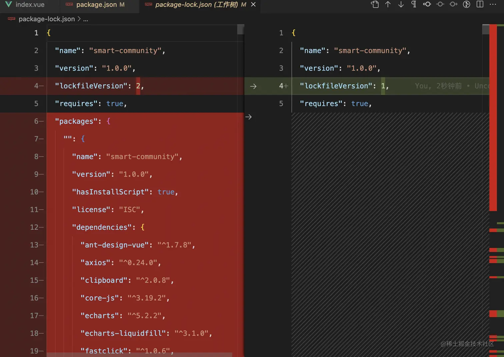

# 限制项目使用指定的node版本

## 一、`package-lock`文件频繁冲突原因

> `node`版本不统一，`node`预置的`npm`版本不一样，生成的`package-lock.json`的 `lockfileVersion `不一致,都会造成`package-lock`冲突



## 二、解决方案

### 1. 限制`npm install`使用的`node`版本

```json
// package.json
{
  "scripts": {
        "preinstall": "npx only-allow npm" // 只能使用npm来安装包
   },
	"engines": {
    "node": "16.13.0",
    "npm": "8.1.0"
	}
}
```

注意📢：`engines` 只是建议，默认不开启严格版本校验，只会给出提示，需要手动开启严格模式。在根目录下 `.npmrc` 添加 `engine-strict = true`

```bash
# .npmrc
engine-strict = true
# 使用pnpm包管理，默认不会执行 npm 的pre、post 钩子,开启方式添加下面这句
enable-pre-post-scripts = true 
```

这下 `npm install` 的时候就会报错了:

```ruby
192:smart-community user$ npm i
npm ERR! code ENOTSUP
npm ERR! notsup Unsupported engine for smart-community@1.0.0: wanted: {"node":"~16.13.0","npm":"~8.1.0"} (current: {"node":"14.18.1","npm":"6.14.15"})
npm ERR! notsup Not compatible with your version of node/npm: smart-community@1.0.0
npm ERR! notsup Not compatible with your version of node/npm: smart-community@1.0.0
npm ERR! notsup Required: {"node":"~16.13.0","npm":"~8.1.0"}
npm ERR! notsup Actual:   {"npm":"6.14.15","node":"14.18.1"}

npm ERR! A complete log of this run can be found in:
npm ERR!     /Users/user/.npm/_logs/2022-08-14T07_29_16_968Z-debug.log
```

**根目录放一个`.nvmrc`切换node版本更方便**，`nvm use` 就可以切换，不需要后面加版本号

```bash
# .nvmrc
v16.17.0
```

### 2. 禁止提交冲突的`package-lock.json`

因：

> `engine-strict` 只能限制 `npm install` ，如果下载指定的npm 包，还是可以下载的，例如:
>
> ```bash
> npm install lodash --save
> ```
>
> 这样执行是不会校验npm版本的，目前还没有找到好的办法去限制，npm 的 preinstall 钩子也不会执行。

果：

> 让冲突代码提交不上去。冲突主要是因为`lockfileVersion`版本不一致导致的。如果`lockfileVersion`一致，至少不会对别人的代码和环境造成影响。 在提交之前判断`lockfileVersion`是否一致。如果不一致，就终止进程，禁止提交代码，并给出切换版本重新`npm install` 的提示

措施：

使用git hooks工具

`.husky/pre-commit`添加如下代码:

```bash
#!/bin/sh
. "$(dirname "$0")/_/husky.sh"

PATH=$PATH:/usr/local/bin:/usr/local/sbin

npm run check:lockfile 		# 新增校验package-lock.json 中lockfileVersion字段
npm run check:dependencies
npx lint-staged
```

`package.json`新增`script`:

```json
{
    "script": {
        "check:lockfile": "node ./misc/checkLockfile"
    }
}
```

```js
// /misc/checkLockfile.js
const { lockfileVersion } = require('../package-lock.json')
const { engines } = require('../package')

if (lockfileVersion !== 2) { // 判断lockfileVersion版本，不是2就终止进程
  console.error(`Required node version ${engines.node} and npm version ${engines.npm}, And then please retry npm install.`)
  process.exit(1)
}
```

### 3. 限制运行时`node`版本

> **保证每个环境运行的都是同一个node版本**

```json
// package.json
{
    "script": {
        ...,
        "predev": "npm run check:node", 			// 开发时校验
        "prebuild": "npm run check:node" 			// 打包时校验
        "check:node": "node ./misc/checkNode",
    }
}
```

校验当前node版本与项目要求的node版本是否匹配。如果不匹配，打印错误提示信息，终止进程：

```js
// misc/checkNode.js
const { engines } = require('../package')

let semver = null
try {
  semver = require('semver') // 校验版本号的一个工具
} catch (error) {}

const version = engines.node
if (semver && (!semver.satisfies(process.version, version))) {
  console.error(`Required node version ${version}, got: ${process.version}.`)
  process.exit(1)
}
if (!semver && (process.version !== version)) {
  console.error(`Required node version ${version} and npm version ${engines.npm}, got: ${process.version}.`)
  process.exit(1)
}
```

