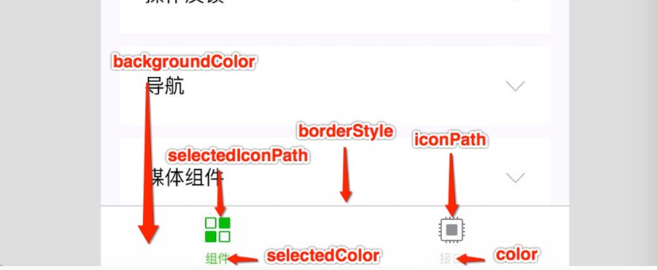
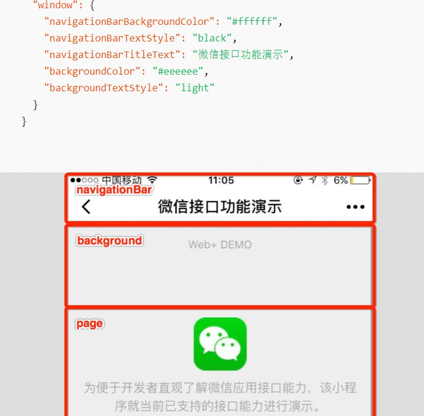
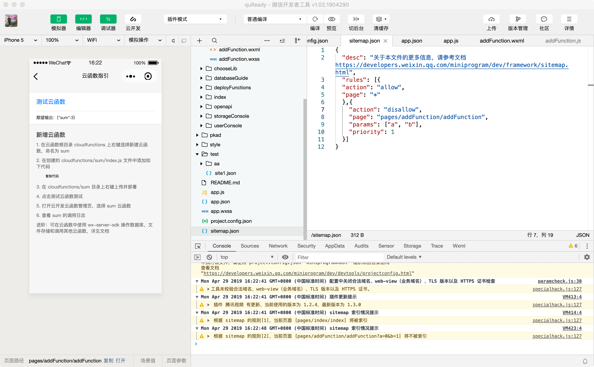

# 配置文件

**默认的基础开发目录结构：**

```text
├── app.js
├── app.json
├── app.wxss
├── pages
│   │── index
│   │   ├── index.wxml
│   │   ├── index.js
│   │   ├── index.json
│   │   └── index.wxss
│   └── logs
│       ├── logs.wxml
│       └── logs.js
└── utils
```

## `app.js`

> 每个小程序都需要在 `app.js` 中调用 `App` 方法注册小程序实例，绑定**生命周期回调函数**、**错误监听**和**页面不存在监听函数**等。
>
> 整个小程序只有一个 App 实例，是全部页面共享的。开发者可以通过 **`getApp`** 方法获取到全局唯一的 App 实例，**获取**App上的**数据**或**调用**开发者注册在 `App` 上的**函数**。

```js
App({
  	// 1.小程序启动时做一些初始操作。全局只触发一次。
    onLaunch(options) {
        // 参数也可以使用 wx.getLaunchOptionsSync 获取
    },
  
  	// 2.监听小程序 启动 或 从后台进入前台显示时触发.
    onShow (options) {
        // 也可以使用 wx.onAppShow 绑定监听
    },
  
  	// 3.监听小程序 从前台进入后台时触发
    onHide () {
        // 也可以使用 wx.onAppHide 绑定监听
    },
  	
  	// 4.小程序发生 脚本错误 或 API 调用报错时触发。
    onError (msg) {
        // 也可以使用 wx.onError 绑定监听。
        console.log(msg)
    },
  
  	// 5.小程序要 打开的页面不存在 时触发
    onPageNotFound(res){
        // 也可以使用 wx.onPageNotFound 绑定监听
        wx.redirectTo({ // 如果是 tabbar 页面，则使用 wx.switchTab
            url: 'pages/...'
        }) 
    },
  	
  	// 6.小程序有未处理的 Promise 拒绝时触发。
    onUnhandledRejection(callback){
        // 也可以使用 wx.onUnhandledRejection 绑定监听。
    },
  
  	// 7.系统切换主题时触发。
    onThemeChange(callback){
        // 也可以使用 wx.onThemeChange 绑定监听
    },
    
    // 添加 自定义函数 或 数据变量，用 this 可以访问
    globalData: 'I am global data',
})
```

在某个`xxx.js`文件中访问 全局变量 或全局函数

```js
const appInstance = getApp();
console.log(appInstance.globalData); // I am global data
```

## `page.js`

> `page.js`不是真的为page页面的文件，page根据具体页面更改

`page.json`

```json
{
  "restartStrategy": "homePageAndLatestPage"
}
```

`page.js`

```js
Page({
    data: {
        text: "This is page data."
    },
  	
  	// 页面的组件选项，同 Component 构造器 中的 options
    options:{ },
  	
  	// 1.页面创建时执行(生命周期)
    onLoad: function(options) {
        // 可获取路由中的参数
      
        var prevExitState = this.exitState // 尝试获得上一次退出前 onSaveExitState 保存的数据
        if (prevExitState !== undefined) { // 如果是根据 restartStrategy 配置进行的冷启动，就可以获取到
            prevExitState.myDataField === 'myData' 
        }
    },
  
  	// 2.页面出现在前台时执行(生命周期)
    onShow: function() { },
  	
  	// 3.页面首次渲染完毕时执行(生命周期)
    onReady: function() {
        // 可对界面内容进行设置的 API 如wx.setNavigationBarTitle
    },
  
  	// 4.页面隐藏/切入后台时触发(生命周期) 
    onHide: function() {
        // 如 wx.navigateTo触发 或 底部tab 切换到其他页面、小程序切入后台等
    },
  
  	// 5.页面销毁时执行(生命周期)
    onUnload: function() {
        // 如wx.redirectTo 或 wx.navigateBack到其他页面时
    },
  
    // 每当小程序可能被销毁之前，页面回调函数 onSaveExitState 会被调用。
    // 如果想保留页面中的状态，可以在这个回调函数中“保存”一些数据，下次启动时可以通过 exitState 获得这些已保存数据.
    //在某些特殊情况下（如微信客户端直接被系统杀死），这个方法将不会被调用，下次冷启动也不遵循 restartStrategy 的配置，而是直接从首页冷启动。
    onSaveExitState: function() {
        var exitState = { myDataField: 'myData' } // 需要保存的数据
        return {
            data: exitState, // 需要保存的数据（只能是 JSON 兼容的数据）
            expireTimeStamp: Date.now() + 24 * 60 * 60 * 1000 // 超时时刻,在这个时刻后，保存的数据保证一定被丢弃，默认为 (当前时刻 + 1 天)
        }
    },
  
  	// 1.下拉刷新时执行
    onPullDownRefresh: function() {
        // 需要在 app.json 的 window选项中 或 页面配置中 开启enablePullDownRefresh
    		// 可以通过 wx.startPullDownRefresh函数 触发下拉刷新，调用后触发下拉刷新动画，效果与用户手动下拉刷新一致
        // 当处理完数据刷新后，wx.stopPullDownRefresh函数 可以停止当前页面的下拉刷新
    },
  	
  	// 2.上拉刷新时执行
    onReachBottom: function() {
        // 需要在 app.json 的 window选项中 或 页面配置中设置触发距离 onReachBottomDistance
    		// 在触发距离内滑动期间，本事件只会被触发一次
    },
  
  	// 1.页面被用户分享时执行,如用户点击右上角转发、button 组件 open-type="share"
    onShareAppMessage: function () {
        // 只有定义了此事件处理函数，右上角菜单才会显示“转发”按钮
        const promise = new Promise(resolve => {
            setTimeout(() => {
                resolve({
                    title: '自定义转发标题'
                })
            }, 2000)
        })
        return { // 返回一个对象，用于自定义转发内容
        	title: '自定义转发标题', // 当前小程序名称
            path: '/page/user?id=123', // 转发路径，当前页面 path ，必须是以 / 开头的完整路径
            imageUrl:"", // 
            promise 
        }
    },
  
  	// 2.点击右上角转发到朋友圈
    onShareTimeline: function () { },
  
  	// 3.用户点击右上角收藏
    onAddToFavorites: function (res) {
      // 页面中包含web-view组件时，返回当前web-view的url
      console.log('webViewUrl: ', res.webViewUrl) 
      
    	return { // 返回一个对象，用于自定义收藏内容
            title: "自定义标题", // 页面标题或账号名称
            imageUrl:"http://demo.png", // 页面截图
            query:"name=xxx&age=xxx" // 当前页面的query
        }
    },
  	
  	// 页面滚动时执行
    onPageScroll: function(obj) {
        // 在需要的时候才在 page 中定义此方法，不要定义空方法。以减少不必要的事件派发对渲染层-逻辑层通信的影响。 注意：请避免在 onPageScroll 中过于频繁的执行 setData 等引起逻辑层-渲染层通信的操作。尤其是每次传输大量数据，会影响通信耗时。
        obj.scrollTop // 页面在垂直方向已滚动的距离（单位px）
    },
  	// 页面尺寸变化时执行,详见 响应显示区域变化
    onResize: function() { },
  	// 当前是 tab 页时，点击 tab 时触发
    onTabItemTap(item) {
        console.log(item.index)
        console.log(item.pagePath)
        console.log(item.text)
    },
  
    // 自定义事件响应函数
    viewTap: function() {
        this.setData({
            text: '这次要改变的数据	',
            'array[2].message':1,
            'a.b.c.d':2
        }, function() {
            // 引起的界面更新渲染完毕后的回调函数
        })
		},
  
    // 自由数据
    customData: {
        hi: 'MINA'
    }
})
```

### Page.route

到当前页面的路径，类型为`String`。

```javascript
Page({
  onShow: function() {
    console.log(this.route)
  }
})
```

### 页面间通信

如果一个页面由另一个页面通过 [`wx.navigateTo`](https://developers.weixin.qq.com/miniprogram/dev/api/route/wx.navigateTo.html) 打开，这两个页面间将建立一条数据通道：

- 被打开的页面可以通过 `this.getOpenerEventChannel()` 方法来获得一个 `EventChannel` 对象；
- `wx.navigateTo` 的 `success` 回调中也包含一个 `EventChannel` 对象。

这两个 `EventChannel` 对象间可以使用 `emit` 和 `on` 方法相互发送、监听事件。

index.js

```js
const app = getApp()

Page({
  jump: function () {
    wx.navigateTo({
      url: './test',
      events: {
        acceptDataFromOpenedPage: function (data) {
          console.log(data)
        },
      },
      success: function (res) {
        res.eventChannel.emit('acceptDataFromOpenerPage', { data: 'send from opener page' })
      }
    })
  },
})
```

test.js

```js
Page({
  onLoad: function (option) {
    const eventChannel = this.getOpenerEventChannel()
    eventChannel.emit('acceptDataFromOpenedPage', { data: 'send from opened page' });
    eventChannel.on('acceptDataFromOpenerPage', function (data) {
      console.log(data)
    })
  }
})
```

### 使用 `behaviors` 来组件间代码复用

> `behaviors` 可以用来让多个页面**有相同的数据**字段和**方法**

my-behavior.js

```js
module.exports = Behavior({
  data: {
    sharedText: 'This is a piece of data shared between pages.'
  },
  methods: {
    sharedMethod: function() {
      this.data.sharedText === 'This is a piece of data shared between pages.'
    }
  }
})
```

page-a.js

```js
var myBehavior = require('./my-behavior.js')
Page({
  behaviors: [myBehavior], // 类似vue中的mixins
  onLoad: function() {
    this.data.sharedText === 'This is a piece of data shared between pages.'
  }
})
```

## `app.json`(全局页面配置)

> `app.json` 是小程序的**全局配置**，包括了小程序的**所有页面路径**、**界面表现**、**网络超时时间**、**底部 tab** 等。

```json
{
  /* sitemapLocation、pages字段为必填 */
  "sitemapLocation":"sitemap.json", // 指明 sitemap.json 的位置
  "pages":[ 
    // 用于描述小程序所有页面路径，这是为了让微信客户端知道当前你的小程序页面定义在哪个目录。
    // 小程序中新增/减少页面，都需要对 pages 数组进行修改。 
    // 未指定 entryPagePath 时，数组的第一项代表小程序的初始页面（首页）
    "pages/index/index",
    "pages/logs/logs"
  ],

  /* 以下字段选填 */
  // 默认小程序默认启动首页
  "entryPagePath":"pages/index/index", 

  // 定义小程序所有页面的状态栏、导航条、标题、窗口背景色等
  "window":{ 
    "backgroundTextStyle":"light",
    "navigationBarBackgroundColor": "#fff", // 导航栏背景颜色,默认#000000
    "navigationBarTitleText": "Weixin", // 导航栏标题文字内容
    "navigationBarTextStyle":"black", // 导航栏标题颜色，仅支持 black / white。 默认white
    "navigationStyle":"default", // 导航栏样式，仅支持以下值：default 默认,custom 自定义导航栏，只保留右上角胶囊按钮。
    "backgroundColor":"#ffffff", // 窗口的背景色
    "backgroundTextStyle":"dark", // 下拉 loading 的样式，仅支持 dark / light
    "backgroundColorTop":"#ffffff", //顶部窗口的背景色，仅 iOS 支持
    "backgroundColorBottom": "#ffffff", // 底部窗口的背景色，仅 iOS 支持
    "enablePullDownRefresh": false, // 是否开启全局的下拉刷新, 详见 Page.onPullDownRefresh
    "onReachBottomDistance": 50, //页面上拉触底事件触发时距页面底部距离，单位为 px。详见 Page.onReachBottom
    "pageOrientation": "portrait", // 屏幕旋转,支持 auto / portrait(竖) / landscape(横)
    "restartStrategy": "homePage" // 重新启动策略,'homePage'下次将从首页冷启动;'homePageAndLatestPage'如果从这个页面退出小程序，下次冷启动后立刻加载这个页面，页面的参数保持不变（不可用于 tab 页）
  },

  // 在 iPad 上运行的小程序可以支持屏幕旋转,注意不能单独配置某个页面是否支持屏幕旋转
  "resizable": true, 
  
  // 底部/顶部 tab 栏的表现
  "tabBar": {
    "custom": false, // 自定义 tabBar
    "color":"#000", // tab 上的文字默认颜色
    "selectedColor":"#eee", // tab 上的文字选中时的颜色
    "backgroundColor":"#fff", // tab 的背景色
    "borderStyle":"black", // tabbar 上边框的颜色， 仅支持 black / white
    "position": "bottom",  // tabBar 的位置，仅支持 bottom / top
    "list": [{ // tab 的列表，最少 2 个、最多 5 个 tab
      "pagePath": "pages/index/index", // 页面路径
      "text": "首页", // tab 上按钮文字
      "iconPath": "", // 图片路径，icon 大小限制为 40kb，建议尺寸为 81px * 81px，不支持网络图片。当 position 为 top 时，不显示 icon
      "selectedIconPath":"", // 选中时的图片路径
    }, {
      "pagePath": "pages/logs/index",
      "text": "日志"
    }]
  },
  
  // 网络请求的超时时间
  "networkTimeout": { 
    "request": 10000, // wx.request 的超时时间,默认60000
    "connectSocket":10000, // wx.connectSocket 的超时时间,默认60000
    "downloadFile": 10000, // wx.downloadFile 的超时时间,默认60000
    "uploadFile":10000 // wx.uploadFile 的超时时间,默认60000
  },
  
  // 在开发者工具中开启 debug 模式,调试信息以 info 的形式给出
  "debug": true, 
  
  "navigateToMiniProgramAppIdList": [
    "wxe5f52902cf4de896"
  ],
	
  //插件所有者小程序需要设置这一项来启用插件功能页
  "functionalPages": , 
  
  // 启用分包加载(按需加载)时，声明项目分包结构
  "subpackages": , 
  
  // 声明分包预下载的规则
  "preloadRule": , 
  
  // 通常情况下，在小程序启动期间，所有页面及自定义组件的代码都会进行注入，当前页面没有使用到的自定义组件和页面在注入后其实并没有被使用.所以小程序支持有选择地注入必要的代码，以降低小程序的启动时间和运行时内存
  "lazyCodeLoading":"requiredComponents", 
  
  // 使用 Worker 处理 多线程任务 时，设置 Worker 代码放置的目录
  "workers": "workers", 
  
  // 申明需要后台运行的能力。目前支持 audio(后台音乐播放)、location(后台定位)。
  // 开发版和体验版上可以直接生效，正式版还需通过审核
  "requiredBackgroundModes": ["audio", "location"], 

	// 声明小程序需要使用的插件
	"plugins": , 

	// 在此处声明的自定义组件视为全局自定义组件，在小程序内的页面或自定义组件中可以直接使用而无需再声明。
	"usingComponents": , 

	// 小程序接口权限相关设置
  "permission":  {
    "scope.userLocation": { // 位置相关权限声明
      "desc": "你的位置信息将用于小程序位置接口的效果展示" // 高速公路行驶持续后台定位
    },
	}, 
	
	// 启用新版的组件样式,涉及的组件有 button icon radio checkbox switch slider
	"style": "v2", 
	
	// 指定需要引用的扩展库。目前支持 kbone、weui
  "useExtendedLib": { 
    "kbone": true,
    "weui": true
  },

  // 聊天位置消息用打车类小程序打开
  "entranceDeclare":{ 
    "locationMessage": {
      "path": "pages/index/index",
      "query": "foo=bar"
    }
  },

	// 表示当前小程序可适配 DarkMode，所有基础组件均会根据系统主题展示不同的默认样式. 
	// 配置后，请根据DarkMode 适配指南自行完成基础样式以外的适配工作
	"darkmode": true, 
	"themeLocation": "/path/to/theme.json",  // 自定义 theme.json 的路径，当配置"darkmode":true时，当前配置文件为必填项

	// 单页模式相关配置，目前 分享到朋友圈 (Beta) 后打开会进入单页模式
	"singlePage": { 
    // 默认自动调整，若原页面是自定义导航栏，则为 float，否则为 squeezed。
    // 导航栏与页面的相交状态，值为 float 时表示导航栏浮在页面上，与页面相交；
    // 值为 squeezed 时表示页面被导航栏挤压，与页面不相交
  	"navigationBarFit": "float或者squeezed" 
	}, 
}
```




## `page.json`（单独页面配置）

如果你整个小程序的风格是蓝色调，那么你可以在 `app.json` 里边声明顶部颜色是蓝色即可。实际情况可能不是这样，可能你小程序里边的每个页面都有不一样的色调来区分不同功能模块，因此我们提供了 `page.json`，让开发者可以独立定义每个页面的一些属性，例如刚刚说的顶部颜色、是否允许下拉刷新等等。

每一个小程序页面使用 **同名 `xxx.json`** 文件来对本页面的窗口表现进行配置。

> 页面配置中**只能设置 `app.json` 中 `window` 对应的配置项**，以决定本页面的窗口表现，**所以无需写 `window` 这个属性**。

```json
{
    "navigationBarBackgroundColor": "#000000", // 导航栏背景颜色
    "navigationBarTextStyle": "white", //导航栏标题颜色，仅支持 black / white
    "navigationBarTitleText": "微信接口功能演示", // 导航栏标题文字内容
    "navigationStyle": "default", //导航栏样式，仅支持以下值：default 默认样式、custom 自定义导航栏，只保留右上角胶囊按钮
    "backgroundColor": "#eeeeee", // 窗口的背景色
    "backgroundTextStyle": "light", // 下拉 loading 的样式，仅支持 dark / light
    "backgroundColorTop": "#ffffff", // 顶部窗口的背景色，仅 iOS 支持
    "backgroundColorBottom": "#ffffff", // 底部窗口的背景色，仅 iOS 支持
    "enablePullDownRefresh": false, //是否开启当前页面下拉刷新。
    "onReachBottomDistance": 50, // 页面上拉触底事件触发时距页面底部距离，单位为px。
    "pageOrientation": "auto", // 屏幕旋转设置，支持 auto / portrait / landscape
    "disableScroll": false, // 设置为 true 则禁止页面整体上下滚动。只在页面配置中有效，无法在 app.json 中设置
    "usingComponents":{}, // 页面自定义组件配置
    "initialRenderingCache": , //页面初始渲染缓存配置
    "style": "default", // 启用新版的组件样式
    "singlePage" : {} // 单页模式相关配置
}
```



## `sitemap.json`(网站地图)

> `sitemap.json` 文件用于配置**小程序**及**其页面**是否允许被**微信索引**，文件内容为一个 JSON 对象，如果没有 `sitemap.json` ，则默认为所有页面都允许被索引

当开发者允许微信索引时，微信会通过爬虫的形式，为小程序的页面内容建立索引。当用户的搜索词条触发该索引时，小程序的页面将可能展示在搜索结果中。 爬虫访问小程序内页面时，会携带特定的 **user-agent：`mpcrawler`** 及[场景值](https://developers.weixin.qq.com/miniprogram/dev/reference/scene-list.html)：**`1129`**。

需要注意的是，若小程序爬虫发现的页面数据和真实用户的呈现不一致，那么该页面将不会进入索引中。

**注：`sitemap` 的索引提示是默认开启的，如需要关闭 `sitemap` 的索引提示，可在小程序项目配置文件 `project.config.json` 的 `setting` 中配置字段 `checkSiteMap` 为 `false`**

**注: `sitemap` 文件内容最大为 5120 个 UTF8 字符**

**注：没有 `sitemap.json` 则默认所有页面都能被索引**

**注：`{"action": "allow", "page": "\*"}` 是优先级最低的默认规则，未显式指明 "` disallow`" 的都默认被索引**

```json
{
    "rules":[{
        "action": "allow", // 只有"allow"、"disallow"两个值，命中该规则的页面是否能被索引,
        "page": "path/to/page", // 取值："*"、页面的路径。* 表示所有页面，不能作为通配符使用
        "params": ["a", "b"], // 当 page 字段指定的页面在被本规则匹配时可能使用的页面参数名称的列表（不含参数值）
        "matching": "exact", // 当 page 字段指定的页面在被本规则匹配时，此参数说明 params 匹配方式
        "priority": 1  // 优先级.  值越大则规则越早被匹配，否则默认从上到下匹配
    }, {
        "action": "disallow",
        "page": "path/to/page",
        "priority": 2
    }]
}
```

### ` matching` 取值说明:

| 值        | 说明                                                       |
| --------- | ---------------------------------------------------------- |
| exact     | 当小程序页面的参数列表**等于** params 时，规则命中         |
| inclusive | 当小程序页面的参数列表**包含** params 时，规则命中         |
| exclusive | 当小程序页面的参数列表与 params **交集为空**时，规则命中   |
| partial   | 当小程序页面的参数列表与 params **交集不为空**时，规则命中 |

#### `exact`举例：

```json
{
  "rules":[{
    "action": "allow",
    "page": "path/to/page",
    "params": ["a", "b"],
    "matching": "exact"
  }, {
    "action": "disallow",
    "page": "path/to/page"
  }]
}
```

- `path/to/page?a=1&b=2` => 优先索引
- `path/to/page` => 不被索引
- `path/to/page?a=1` => 不被索引
- `path/to/page?a=1&b=2&c=3` => 不被索引
- 其他页面都会被索引

#### `inclusive`举例：

```json
{
  "rules":[{
    "action": "allow",
    "page": "path/to/page",
    "params": ["a", "b"],
    "matching": "inclusive"
  }, {
    "action": "disallow",
    "page": "path/to/page"
  }]
}
```

- `path/to/page?a=1&b=2` => 优先索引
- `path/to/page?a=1&b=2&c=3` => 优先索引
- `path/to/page` => 不被索引
- `path/to/page?a=1` => 不被索引
- 其他页面都会被索引

#### `exclusive`举例：

```json
{
  "rules":[{
    "action": "allow",
    "page": "path/to/page",
    "params": ["a", "b"],
    "matching": "exclusive"
  }, {
    "action": "disallow",
    "page": "path/to/page"
  }]
}
```

- `path/to/page` => 优先索引
- `path/to/page?c=3` => 优先索引
- `path/to/page?a=1` => 不被索引
- `path/to/page?a=1&b=2` => 不被索引
- 其他页面都会被索引

#### `partial`举例：

```json
{
  "rules":[{
    "action": "allow",
    "page": "path/to/page",
    "params": ["a", "b"],
    "matching": "partial"
  }, {
    "action": "disallow",
    "page": "path/to/page"
  }]
}
```

- `path/to/page?a=1` => 优先索引
- `path/to/page?a=1&b=2` => 优先索引
- `path/to/page` => 不被索引
- `path/to/page?c=3` => 不被索引
- 其他页面都会被索引



## `project.config.json` 工具配置

> 通常大家在使用一个工具的时候，都会针对各自喜好做一些个性化配置，例如界面颜色、编译配置等等，当你换了另外一台电脑重新安装工具的时候，你还要重新配置。小程序开发者工具在每个项目的根目录都会生成一个 `project.config.json`，你在工具上做的任何配置都会写入到这个文件，当你重新安装工具或者换电脑工作时，你只要载入同一个项目的代码包，开发者工具就自动会帮你恢复到当时你开发项目时的个性化配置，其中会包括编辑器的颜色、代码上传时自动压缩等等一系列选项

