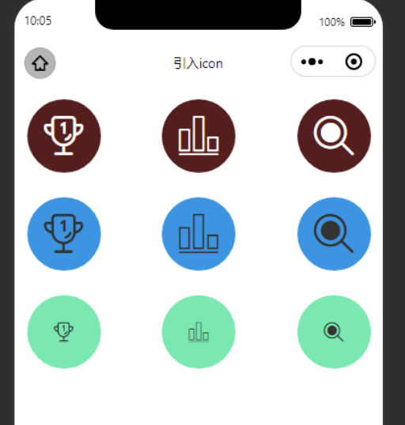
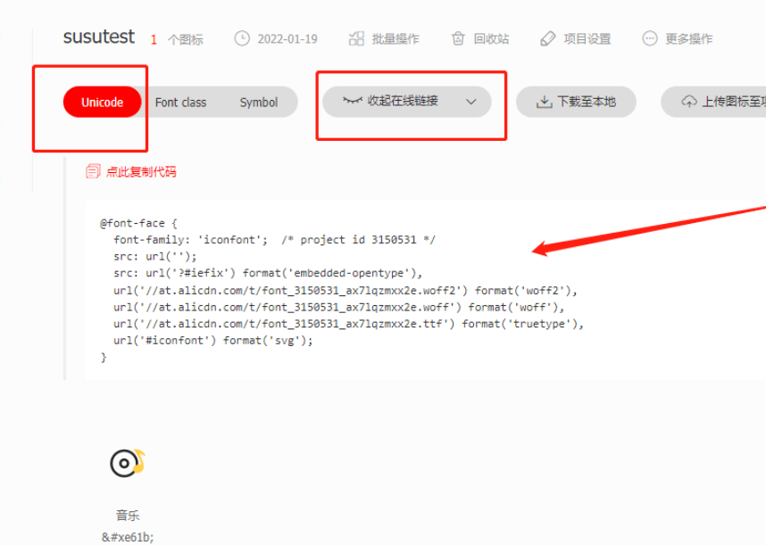
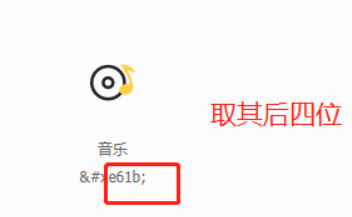

## 微信小程序引入外部icon（阿里巴巴矢量图标）

### 实现效果



### 实现步骤

1. 搜索想要的图标，添加购物车

2. 添加进自己的项目中

3. **获取代码**（*注意：当项目更新之后，该代码也需更新*）

   

4. 新建一个`iconFont.wxss`，复制上面所得的代码

   ```css
   /* 当添加新的图标之后，@font-face需要进行更新 */
   @font-face {
     font-family: 'iconfont';
     /* Project id 2361238 */
     src: url('//at.alicdn.com/t/font_2361238_cxshqh1m3m7.woff2?t=1642320886173') format('woff2'),
       url('//at.alicdn.com/t/font_2361238_cxshqh1m3m7.woff?t=1642320886173') format('woff'),
       url('//at.alicdn.com/t/font_2361238_cxshqh1m3m7.ttf?t=1642320886173') format('truetype');
   }
   
   .iconfont {
     font-family: "iconfont" !important;
     font-size: 16px;
     font-style: normal;
     -webkit-font-smoothing: antialiased;
     -moz-osx-font-smoothing: grayscale;
   }
   
   /* .icon_01 {
     font-size: 40px;
   } */
   
   .icon_01::before {
     content: "\e6f1";
   }
   
   .icon_02::before {
     content: "\e7bd";
   }
   
   .icon_03::before {
     content: "\e61a";
   }
   
   ```

5. **引入一个图标，取到他的后四位**

   

   **设置图标的大小与颜色**

   ```css
   color: #fff;
   font-size: 40px;
   ```

6. 在`wxss`页面引入外部样式

   ```css
   @import "./iconFont.wxss";
   page {
     background-color: #fff;
   }
   
   .box {
     margin: 30rpx auto;
     width: 700rpx;
   }
   
   .mb20 {
     margin-bottom: 20rpx;
     width: 150rpx;
     height: 150rpx;
     background-color: #551e1e;
     border-radius: 50%;
     line-height: 150rpx;
     text-align: center;
     color: #fff;
     font-size: 40px;
   }
   
   .a1 {
     background-color: rgb(61, 148, 224);
     color: #333;
   }
   
   .a2 {
     background-color: rgb(123, 231, 177);
     color: #333;
     font-size: 20px;
   }
   ```

7. 在`wxml`中使用

   ```html
   <view class="box flex-row j_b">
     <view class="iconfont icon_01 mb20"></view>
     <view class="iconfont icon_02 mb20"></view>
     <view class="iconfont icon_03 mb20"></view>
   </view>
   
   <view class="box flex-row j_b">
     <view class="iconfont icon_01 mb20 a1"></view>
     <view class="iconfont icon_02 mb20 a1 "></view>
     <view class="iconfont icon_03 mb20 a1"></view>
   </view>
   <view class="box flex-row j_b">
     <view class="iconfont icon_01 mb20 a2"></view>
     <view class="iconfont icon_02 mb20 a2 "></view>
     <view class="iconfont icon_03 mb20 a2"></view>
   </view>
   ```

   