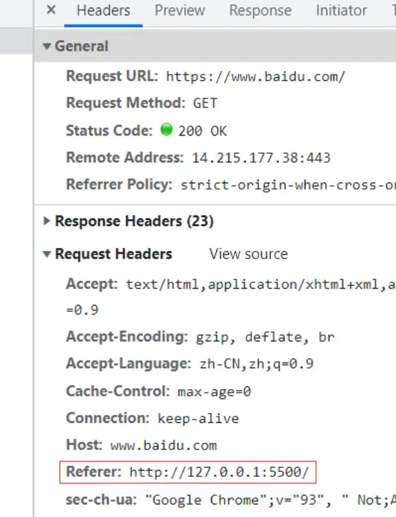

> meta是**文档级元数据元素**，用来表示那些不能由其它 HTML 元相关元素（`<base>`、`<link>`, `<script>`、`<style>`或 `<title>`）之一表示的任何元数据

常见`meta` 元素定义的元数据的类型：

- 如果设置了 `name`属性，`meta` 元素提供的是文档级别的元数据，应用于整个页面。
- 如果设置了 `http-equiv`属性，`meta` 元素则是编译指令，提供的信息与类似命名的 HTTP 头部相同。
- 如果设置了 `charset`属性，`meta` 元素是一个字符集声明，告诉文档使用哪种字符编码。
- 如果设置了 `itemprop` 属性，`meta` 元素提供用户定义的元数据。

## name属性

`name`和`content`一起使用，前者表示要表示的元数据的`名称`，后者是元数据的`值`。

### author

> 用来表示网页的作者的名字，例如某个组织或者机构。

```html
<meta name="author" content="aaa@mail.abc.com">
```

### description

> 是一段简短而精确的、对页面内容的描述。以头条和taobao的`description`标签为例：

```html
<meta name="description" content="今日头条是一个通用信息平台，致力于连接人与信息，让优质丰富的信息得到高效精准的分发，促使信息创造价值。">
```

```html
<meta name="description" content="淘宝网 - 亚洲较大的网上交易平台，提供各类服饰、美容、家居、数码、话费/点卡充值… 数亿优质商品，同时提供担保交易(先收货后付款)等安全交易保障服务，并由商家提供退货承诺、破损补寄等消费者保障服务，让你安心享受网上购物乐趣！">
```

### keywords

> 与页面内容相关的关键词，使用逗号分隔。某些搜索引擎在遇到这些关键字时，会用这些关键字对文档进行分类。 以头条和taobao为例

```html
<meta name="keywords" content="今日头条，头条，头条网，头条新闻，今日头条官网">
```

```html
<meta name="keyword" content="淘宝,掏宝,网上购物,C2C,在线交易,交易市场,网上交易,交易市场,网上买,网上卖,购物网站,团购,网上贸易,安全购物,电子商务,放心买,供应,买卖信息,网店,一口价,拍卖,网上开店,网络购物,打折,免费开店,网购,频道,店铺">
```

### viewport（移动端有效）

> 添加视图窗口适配，用于优化移动端的网页，使得`web`端的网页在手机端正常显示，页面布局不会错位。注意`meta`的`viewport`属性只对移动端浏览器有效，对`pc`端浏览器是无效的。

`viewport`主要包括如下三种类型:

- **布局视区**：是指整个网页在移动端浏览器中显示的区域，此布局在大多数移动端浏览器中默认显示的宽度为`980px`（也有少部分`1024px`或者其他宽度的），故只要整个网页宽度不超过此默认值，页面就可以正常显示
- **可见视区**：指的是移动端设备本身的屏幕显示区域，不同的移动设备，可见视区的尺寸也不同
- **理想视区**：指的是布局视区能完美适配移动设备的可见视区，即布局视区的宽度等于可见视区的宽度，因此不需要缩放和横向滚动条就能正常查看整个网页

```html
<meta name="viewport" content="width=device-width, initial-scale=1.0, maximum-scale=1.0, minimum-scale=1.0, user-scalable=no,minimal-ui">
```

- `width`：控制布局视区的宽度，也可指定为固定宽度值，或者设置为`device-width`。如果`width`不设置或者为空，则使用默认宽度，即上述的`980px`或`1024px`。如果设置为`device-width`，则表示设置为理想视区，即布局视区宽度等于可见视区宽度。如果`width`设置为固定宽度，单位为`px`，也可以不带单位，默认单位为`px`
- `height`：控制布局视区的高度，一般不设置，极少使用
- `initial-scale`：设置布局视区初始化缩放比例（即每一次加载页面时的缩放比例），为一个数字，可以是小数。如果设置`initial-scale`为`1`，则和`width=device-width`一致，表示设置为理想视区。但是两者均有一个小缺陷，即`width=device-width`会导致`iPhone`和`iPad`横竖屏不分，`initial=1.0`会导致`IE`横竖屏不分，故两者都使用，可互相弥补缺陷
- `maximum-scale`：允许用户缩放的最大比例值，为一个数字，可以带小数。需要大于`minimum-scale`
- `minimum-scale`：允许用户缩放的最小比例值，为一个数字，可以带小数
- `user-scalable`：是否允许用户手动缩放布局视区，非必须参数，其中参数为`no`（不允许）、`yes`（允许）

### robots

> 表示爬虫、搜索引擎对此页面的处理行为，或者说，应当遵守的规则，是用来做搜索引擎抓取的。

它的`content`可以为：

1. `all`:搜索引擎将索引此网页，并继续通过此网页的链接索引文件将被检索
2. `none`:搜索引擎讲忽略此网页
3. `index`:搜索引擎索引此网页
4. `noindex`：不索引本页面
5. `follow`:搜索引擎继续通过此网页的链接索引搜索其它的网页
6.  `nofollow`：不跟踪本页面上的链接
7.  `nosnippet`：不在搜索结果中显示说明文字
8.  `noarchive`：不显示快照
9. `noodp `：不使用开放目录中的标题和说明

```html
<meta name="robots" content="noindex,nofollow"/>
```

其中`content`参数如下。

- `index`：搜索引擎可以索引此页面，默认属性，不设置`meta`标签，搜索引擎也会默认索引此页面
- `noindex`：搜索引擎不可索引此页面
- `noimageindex`：搜索引擎不可索引此页面的图片
- `follow`：爬虫可以爬取此页面的链接
- `nofollow`：爬虫不可爬取此页面的链接
- `all`：`index`和`follow`的简写，搜索引擎可以索引此页面，爬虫可以爬取此页面的链接
- `none`：`noindex`和`nofollow`的简写，搜索引擎不可索引此页面，爬虫不可爬取此页面的链接
- `noarchive`：阻止搜索引擎在搜索结果中显示此页面的缓存版本，即网页快照
- `nocache`：功能同`noarchive`一致，适用于`MSN/Live`引擎
- `nosnippet`：搜索引擎的搜索结果中将显示一部分搜索文字上下文的内容，此属性即搜索引擎不可显示该内容，另外搜索引擎也不会保存该页面的快照
- `noodp`：搜索引擎的搜索结果中将显示一部分搜索文字上下文的内容，阻止使用`DMOZ`信息做为此内容
- `noydir`：搜索引擎的搜索结果中将显示一部分搜索文字上下文的内容，阻止`Yahoo directory`信息作为此内容

### renderer

> **用来指定双核浏览器的渲染方式**，比如360浏览器，我们可以通过这个设置来指定360浏览器的渲染方式

```html
<meta name="renderer" content="webkit"> //默认webkit内核
<meta name="renderer" content="ie-comp"> //默认IE兼容模式
<meta name="renderer" content="ie-stand"> //默认IE标准模式
```

- `webkit`（`webkit`内核，极速模式）
- `ie-comp`（`IE`兼容模式，即`IE6`、`IE7`、`IE8`的渲染模式）
- `ie-stand`（`IE`标准模式，即以`IE9`及以上版本渲染）。

### copyright

> 标注页面版权信息。

```html
<meta name="copyright" content="Baidu">
```

### generator

> 标注开发网页的工具或软件。

```html
<meta name="generator" content="VS Code">
```

### format-detection

> 移动端浏览器中，用于识别电话号码、电子邮箱和地理位置的格式。

其中`content`参数为`yes`（开启，默认值）、`no`（关闭）。

```html
<meta name="format-detection"  content="telephone=no">
<meta name="format-detection"  content="email=no">
<meta name="format-detection"  content="address=no">
```

### revisit-after

告知搜索引擎每隔多少天访问一次此页面。

  一般情况下，网站不需要此属性来限制搜索引擎的访问频率。只有网站数据量非常大时，被搜索引擎频繁抓取，会占用过多的服务器资源，影响网站的反应速度，这种情况一般设置每隔`5-7`天来访问抓取一次网页即可。

  网站抓取时间取决于此属性和搜索引擎的重访时间，假设`revisit-after`设置为`5`天，若搜索引擎每隔`10`天访问一次，`revisit-after`不会生效，而最终搜索引擎按照`10`天访问一次。搜索引擎每隔`3`天访问一次，`revisit-after`设置的`5`天则会生效，最终搜索引擎每隔`5`天访问一次页面。

```html
<meta name="revisit-after"  content="5 days">
```

### referrer

`referrer`有来源页面的意思，即表示当前页面是由哪个页面跳转过来的，具体则是跳转至当前页面的`http`请求的请求头中的`Referer`字段包含了上一个页面的`URL`地址。

可能会发现拼写少了一个`r`，正确的拼写其实是`Referrer`，但是由于`http`标准发布时没有发现拼写错误，所以就一直沿用至今。

例如，当前页面的`URL`地址为`http://127.0.0.1:5500/`。

```html
<body>
  <a href="http://www.baidu.com">百度</a>
</body>
```

点击跳转至百度页面，查看页面请求的请求头。



因此服务端可以统计用户来源，并以此进行统计分析、日志记录以及缓存优化等。

但是注意`Referer`可能会暴露用户的浏览历史 ，并且很多时候当前页面的`URL`是会包含用户的个人信息的（例如`token`），所以某些时候需要移除、禁用或者修改策略。

```html
<meta name="referrer" content="">
```

`content`属性值如下:

- `no-referrer`：不发送`Referer`信息
- `no-referrer-when-downgrade`：默认值，安全级别下降时不发送`Referer`信息，目前仅一种情况安全级别下降，即`https`网页跳转至`http`网页，其它情况发送`Referer`完整信息
- `origin`：会发送`Referer`信息，但是仅发送源信息，包括协议、域名和端口号
- `same-origin`：仅同源链接发送`Referer`完整信息
- `strict-origin`：即`origin`与`no-referrer-when-downgrade`合并，安全级别下降时不发送`Referer`信息，安全级别未下降时发送 `Referer`源信息
- `origin-when-cross-origin`：跨域时发送`Referer`源信息，非跨域时即同源情况发送`Referer`完整信息
- `strict-origin-when-cross-origin`：同源链接发送`Referer`完整信息，安全级别下降时不发送`Referer`信息，其它情况发送`Referer`源信息
- `unsafe-url`：最不安全的策略，无论什么情况都发送 `Referer`完整信息

`meta`标签指定`content`是修改全局策略。

  单个`a`标签可通过`referrerpolicy`属性修改局部策略，更多 [详细参考](https://link.juejin.cn/?target=https%3A%2F%2Fdeveloper.mozilla.org%2Fzh-CN%2Fdocs%2FWeb%2FHTTP%2FHeaders%2FReferrer-Policy)。

```html
<a href="http://www.baidu.com" referrerpolicy="no-referrer">百度</a>
```

## http-equiv 属性

> `http-equiv`也是和`content`一起使用，前者表示元数据的`名称`，后者是元数据的`值`。

`http-equiv` 所有允许的值都是特定 HTTP 头部的名称，该属性中`content-type、content-language和set-cookie`已经被废除了。

### X-UA-Compatible

最常见的`http-equiv`值可能就是`X-UA-Compatible`了，它是用来是做IE浏览器适配的：

```html
<meta http-equiv="X-UA-Compatible" content="IE=edge,chrome=1">
```

- `IE=edge`告诉浏览器，以当前浏览器支持的最新版本来渲染，IE9就以IE9版本来渲染。
- `chrome=1`告诉浏览器，如果当前IE浏览器安装了`Google Chrome Frame`插件，就以chrome内核来渲染页面

如果两者都存在的情况：如果有chrome插件，就以chrome内核渲染，如果没有，就以当前浏览器支持的最高版本渲染。

另外，这个属性支持的范围是`IE8-IE11`

```html
<meta http-equiv="X-UA-Compatible" content="IE=10,chrome=1">
```

**📢注意**：如果在我们的`http`头部中也设置了这个属性，并且和`meta`中设置的有冲突，那么哪一个优先呢？ 答案是：开发者偏好（`meta`元素）优先于Web服务器设置（HTTP头）。

### content-type

> 用来声明文档类型和字符集

```html
<meta http-equiv="Content-Type" content="text/html; charset=utf-8">
```

### content-language

> 标注页面的目标受众或者标注当前页面存在的语言。

```html
<meta http-equiv="content-language" content="en">
```

### content-script-type

> 标注页面中脚本的类型

```html
<meta http-equiv="content-script-type" content="text/javascript">
```

### x-dns-prefetch-control

> 一般来说，HTML页面中的a标签会自动启用DNS提前解析来提升网站性能，但是在使用https协议的网站中失效了，我们可以设置：

```html
<meta http-equiv="x-dns-prefetch-control" content="on">
```

来打开dns对a标签的提前解析

### cache-control、Pragma、Expires

和缓存相关的设置，但是遗憾的是这些往往不生效，我们一般都通过`http headers`来设置缓存策略

```html
<!--
这三个表达的实际作用是一样的：设置页面不缓存，这样设定将无法进行脱机浏览
expires视同到期设置为content=0，从而使网页失效不缓存，
也可以设定固定的到期时间。例如：content="Wed, 20 Jun 2022 22:33:00 GMT"。
注意：三者的优先级小于http头的对应缓存策略设置
 -->
<meta http-equiv="pragma" content="no-cache">
<meta http-equiv="cache-control" content="no-cache">
<meta http-equiv="cache-control" content="max-age=180" />
<meta http-equiv="expires" content="0">
<meta http-equiv="expires" content="Tue, 01 Jan 1980 1:00:00 GMT" />
```

* `pragma`

  禁止浏览器从本地缓存中访问页面的内容，即用户无法脱机浏览。

* `cache-control`
  * `public`：可以在任何客户端（浏览器、本地缓存、各种代理服务器等）中缓存，但是不能设置缓存期限
  * `max-age`：不仅可以被任何客户端缓存，而且还可以设置缓存期限。缓存期限是相对服务器时间而言的，超过设置时间，缓存则被认为过期，再次访问需要重新请求服务器加载缓存。如下最大缓存时间为`60`秒，超过`60`秒，缓存则被认为过期
  * `private`：只能被单个用户缓存，不允许中间代理缓存。例如`CDN`不能缓存`private`的响应
  * `only-if-cached`：若缓存存在，只使用缓存，不需要请求服务器加载更新内容
  * `no-cache`：先发送请求，与服务器确认资源是否被修改，若未被修改，则使用缓存
  * `no-store`：不允许缓存，再次访问需重新从服务器上加载缓存
  * `no-transform`：不可对网页内容或网页中的资源进行转换，以便节省缓存空间
  * `no-siteapp`：禁止百度、搜狗等搜索引擎对网页进行转码

### Refresh

这个属性的值可以进行页面的跳转，其效果跟如下函数一样。

```js
setTimeout(function(){
  window.location.href = "https://www.example.com"
},time)
```

```html
<!--
刷新重定向，当content只有第一个参数则是N秒后刷新当前页面，
若包含ur地址则表示在N秒后重定向到url指向的目标地址。
content="3;url=https://juejin.cn/"，第一个参数是刷新或重定向的秒数，第二个参数是重定向地址。
 -->
<meta http-equiv="Refresh" content="3;url=https://juejin.cn/">

<!--当前页面每一秒后刷新一下 -->
<meta http-equiv="refresh" content="1">
<!--当前页面一秒后跳转到首页 -->
<meta http-equiv="refresh" content="0;url='/'">
<!--当前页面一秒后跳转到百度 -->
<meta http-equiv="refresh" content="0;url='https://www.baidu.com'">
```

### content-security-policy

处于安全方面的考虑，浏览器的同源策略在一定程度上保护了用户安全，但是像`script、link、img`等标签是不受同源策略的影响，而这些因素会给我们的用户带来安全风险，这个时候，该属性就出马了。 在浏览器中，通过设置该属性来声明哪些动态资源允许被加载以此减少XSS攻击。该属性的内容包括了对`script、style、font、media`等静态资源的控制，由于其内容过多，在此就不再进行赘述， 想要对此进行了解的，可以阅读[Content Security Policy Reference](https://link.juejin.cn?target=https%3A%2F%2Fcontent-security-policy.com%2F)。

### default-style

这个属性指定了在页面上使用的首选样式表. content属性必须包含`<link>`元素的标题, href属性链接到CSS样式表或包含CSS样式表的`<style>`元素的标题.

### window-target

> 设置页面显示的窗口方式，`content`参数如下，[详细参考](https://juejin.cn/post/6980249431660560392#heading-2)。

```html
<meta http-equiv="window-target" content="_top">
```

- `_top`：页面以当前整个窗口的方式显示，可用于防止页面被其他网页嵌套
- `_black`：页面以新打开的方式显示
- `_self`：页面以当前容器或窗口显示
- `_parent`：页面以父容器或窗口显示

### set-cookie

> 设置`cookie`值及其有效时间。

注意浏览器正在远离此方式，可能由于浏览器版本原因，会产生警告或错误。此功能已在`M63`中废弃，并且在`M65`中完全删除。

```html
<meta http-equiv="set-cookie" content="cookievalue=xxx; expires=Mon, 31 May 3021 06:00:00 GMT; path=/">
```

### pics-label

网页等级评定，`IE`浏览器可以根据网页的限制等级来过滤网页。

```html
<meta http-equiv="pics-label" content="">
```

### page-enter / page-exit

> 设置网页退出和进入的过渡效果。

其中包括`blendTrans`淡入淡出过渡效果，此效果只能设置过渡持续时间（秒）。

  另一种`revealTrans`，可以设置过渡效果类型和过渡持续时间（秒）。

  淡入持续`5`秒。

```html
<meta http-equiv="page-enter" content="blendTrans(duration=5)">
```

  矩形扩大持续`2`秒。

```html
<meta http-equiv="page-enter" content="revealTrans(duration=2, transition=1)">
```

  其中`transition`过渡效果有`24`种，包括`0`（矩形缩小）、`1`（矩形扩大）、`2`（圆形缩小）、`3`（圆形扩大）、`4`（下到上刷新）、`5`（上到下刷新）、`6`（左到右刷新）、`7`（右到左刷新）、`8`（竖百叶窗）、`9`（横百叶窗）、`10`（错位横百叶窗）、`11`（错位竖百叶窗）、`12`（点扩散）、`13`（左右到中间刷新）、`14`（中间到左右刷新）、`15`（中间到上下）、`16`（上下到中间）、`17`（右下到左上）、`18`（右上到左下）、`19`（左上到右下）、`20`（左下到右上）、`21`（横条）、`22`（竖条）、`23`（以上`22`种随机选择一种）。

  注意由于浏览器的版本原因，多数都不再支持`page-enter/page-exit`属性。

## 浏览器

### QQ 浏览器

#### x5-orientation

  指定屏幕方向，其中`content`参数为`landscape`（横屏）、`portrait`（竖屏）。

```html
<meta name="x5-orientation" content="landscape">
```

#### x5-fullscreen

  全屏显示。

```html
<meta name="x5-fullscreen" content="true">
```

#### x5-page-mode

  指定页面以应用模式显示。

```html
<meta name="x5-page-mode" content="app">
```

### UC 浏览器

#### screen-orientation

  指定屏幕方向，其中`content`参数为`landscape`（横屏）、`portrait`（竖屏）。

```html
<meta name="screen-orientation" content="portrait">
```

#### full-screen

  全屏显示。

```html
<meta name="full-screen" content="yes">
```

#### browsermode

  指定页面以应用模式显示。

```html
<meta name="browsermode" content="application">
```

#### nightmode

  夜间模式，其中`content`参数为`enable`（开启）、`disable`（关闭），注意若用户开启浏览器的夜间模式，而`nightmode`设置为`disable`，页面也是以非夜间模式显示。

```html
<meta name="nightmode" content="disable">
```

#### imagemode

  强制图片显示，浏览器为用户提供了无图模式，但是某些页面图片是必须的（如验证码等），如下可强制页面显示图片。

```html
<meta name="imagemode" content="force">
```

  `imagemode`设置为`force`会作用于整个页面，单张可设置如下。

```html

```

#### layoutmode

  指定页面排版模式，其中`content`参数为`fitscreen`（简化页面处理，适用页面阅读省流）、`standard`（同标准浏览器一致），注意`layoutmode`指定后，浏览器提供的页面排版模式将会失效。

```html
<meta name="layoutmode" content="fitscreen">
```

#### viewport

  缩放不显示滚动条，其中`content`参数为`yes`（用户缩放不会出现滚动条）、`no`（同标准浏览器一致）。

```html
<meta name="viewport" content="uc-fitscreen=yes">
```

### IOS

#### apple-mobile-web-app-capable

  隐藏苹果默认的工具栏和菜单栏，其中`content`参数包括`yes`（页面以全屏运行）、`no`（正常显示）。

```html
<meta name="apple-mobile-web-app-capable" content="no">
```

#### apple-mobile-web-app-status-bar-style

  设备顶部状态栏背景色，其中`content`参数包括`default`（白色，默认值）、`black`（黑色）、`black-translucent`（灰色半透明）。

```html
<meta name="apple-mobile-web-app-status-bar-style" content="">
```

#### apple-mobile-web-app-title

  网页添加到主屏幕后的标题（类似`App`的名称）。

```html
<meta name="apple-mobile-web-app-title" content="">
```

#### apple-touch-icon

  网页添加到主屏幕后的图标如下，其中`apple-touch-icon`支持`sizes`属性，用来对应不同设备。

  `57 * 57`（默认值）对应`320 * 640`的`iPhone`老设备，`72 * 72`对应`iPad`，`114 * 114`对应`retina`屏幕的`iPhone`和`iTouch`，`144 * 144`对应`iPad`的高分辨率。

  其中图标匹配方式如下。

- 若没有与当前设备推荐尺寸一致的图标，则优先使用比推荐尺寸大，最接近推荐尺寸的图标
- 若没有比推荐尺寸大的图标，则优先使用最接近推荐尺寸的图标
- 若多个图标符合推荐尺寸，优先使用含`precomposed`关键字的图标
- 若未用`link`指定图标，自动搜索网站根目录下带有`app-touch-icon`或者`app-touch-icon-precomposed`前缀的图标

  `retina`图标是标准图标大小的两倍，实际仅仅需要`114 * 114`和`144 * 144`两款图标即可。将`retina`图标的大小设置成标准图标的尺寸，`IOS`会根据情况自动进行缩放。

```html
<link rel="apple-touch-icon" sizes="57x57" href="assets/imgs/logo.png">
<link rel="apple-touch-icon" sizes="114x114" href="assets/imgs/logo.png">
<link rel="apple-touch-icon" sizes="72x72" href="assets/imgs/logo@2x.png">
<link rel="apple-touch-icon" sizes="144x144" href="assets/imgs/logo@2x.png">
```

#### apple-touch-startup-image

  网页添加到主屏幕后，设置打开后的启动画面。

  其中在`iPhone`和`iTouch`设备上只支持竖屏模式，图片分辨率为`320 * 640`，在`iPad`上支持竖屏和横屏两种模式，分辨率为`768 * 1004`和`748 * 1024`。

  `apple-touch-startup-image`不支持`sizes`属性，可以使用`media`来支持多种屏幕。

```html
<link rel="apple-touch-startup-image" href="assets/imgs/startup-l.png"  media="screen and (min-device-width: 481px) and (max-device-width: 1024px) and (orientation:landscape)">
<link rel="apple-touch-startup-image" href="assets/imgs/startup-l.png" media="screen and (min-device-width: 481px) and (max-device-width: 1024px) and (orientation:portrait)">
<link rel="apple-touch-startup-image" href="assets/imgs/startup.png">
```

#### apple-touch-icon-precomposed

  区别于`apple-touch-icon`，若属性值为`apple-touch-icon-precomposed`时，系统不会对图标添加类似于圆角和高光的效果，若属性值为`apple-touch-icon`时系统会自动为图标添加圆角和高光。

```html
<link rel="apple-touch-icon-precomposed" href="assets/imgs/logo.png">
```

#### apple-itunes-app

  告知`iPhone`的`safari`浏览器，网页对应的`appid`，便于在页面显示`app`的下载广告条。

```html
<meta name="apple-itunes-app" content="app-id=123456789">
```

### Google 浏览器

#### google

  禁止自动翻译。

```html
<meta name="google" value="notranslate">
```

#### mobile-web-app-capable

  使用`Chrome for Android`版本的浏览器添加到主屏幕后，页面以全屏显示，即隐藏工具栏和菜单栏。

```html
<meta name="mobile-web-app-capable" content="yes">
```

#### theme-color

  指定`Chrome for Android`版的浏览器的设备顶部状态栏主题色。

```html
<meta name="theme-color" content="#000000">
```

### Web

#### application-name

  指定页面代表的`web`应用程序的名称，光标悬停在`Win7`任务栏的固定网站按钮上时，此名称将出现在工具提示中，详细参考 [application-name](https://link.juejin.cn?target=https%3A%2F%2Fdocs.microsoft.com%2Fen-us%2Fprevious-versions%2Fwindows%2Finternet-explorer%2Fie-developer%2Fsamples%2Fgg491732%28v%3Dvs.85%29%3Fredirectedfrom%3DMSDN%23application-name)。

```html
<meta name="application-name" content="">
```

#### msapplication-tap-highlight

  禁止页面链接高亮。

```html
<meta name="msapplication-tap-highlight" content="no">
```

#### msapplication-tooltip

  光标悬停在网页快捷方式上，将会显示此提示文本，详细参考 [msapplication-tooltip](https://link.juejin.cn?target=https%3A%2F%2Fdocs.microsoft.com%2Fen-us%2Fprevious-versions%2Fwindows%2Finternet-explorer%2Fie-developer%2Fsamples%2Fgg491732%28v%3Dvs.85%29%3Fredirectedfrom%3DMSDN%23msapplication-tooltip)。

```html
<meta name="msapplication-tooltip" content="">
```

#### msapplication-starturl

  指定网页快捷方式的根`URL`，不指定则默认使用当前页的地址，详细参考 [msapplication-starturl](https://link.juejin.cn?target=https%3A%2F%2Fdocs.microsoft.com%2Fen-us%2Fprevious-versions%2Fwindows%2Finternet-explorer%2Fie-developer%2Fsamples%2Fgg491732%28v%3Dvs.85%29%3Fredirectedfrom%3DMSDN%23msapplication-starturl)。

```html
<meta name="msapplication-starturl" content="">
```

#### msapplication-window

  指定网页快捷方式的首次启动的初始窗口大小，若用户调整了窗口大小，网页将保留新的尺寸值，详细参考 [msapplication-window](https://link.juejin.cn?target=https%3A%2F%2Fdocs.microsoft.com%2Fen-us%2Fprevious-versions%2Fwindows%2Finternet-explorer%2Fie-developer%2Fsamples%2Fgg491732%28v%3Dvs.85%29%3Fredirectedfrom%3DMSDN%23msapplication-window)。

```html
<meta name="msapplication-window" content="width=1024;height=768">
```

#### msapplication-navbutton-color

  自定义网页快捷方式的浏览器窗口中前进和后退按钮的颜色，详细参考 [msapplication-navbutton-color](https://link.juejin.cn?target=https%3A%2F%2Fdocs.microsoft.com%2Fen-us%2Fprevious-versions%2Fwindows%2Finternet-explorer%2Fie-developer%2Fsamples%2Fgg491732%28v%3Dvs.85%29%3Fredirectedfrom%3DMSDN%23msapplication-navbutton-color)。

```html
<meta name="msapplication-navbutton-color" content="#FF3300">
```

#### msapplication-task

  将某个网页同引用程序一般固定在`Win7`任务栏，在点击后显示一个相关站点的列表，详细参考 [msapplication-task](https://link.juejin.cn?target=https%3A%2F%2Fdocs.microsoft.com%2Fen-us%2Fprevious-versions%2Fwindows%2Finternet-explorer%2Fie-developer%2Fsamples%2Fgg491732%28v%3Dvs.85%29%3Fredirectedfrom%3DMSDN%23msapplication-task)。

```html
<meta name="msapplication-task" content="name=xx; action-uri=http://www.xxx.com; icon-uri=/imgs/logo.ico">
```

#### msapplication-task-separator

  在`msapplication-task`中呈现的站点列表中，在各个任务之间放置一条分割线。若指定多条分割线，则通过声明不同`content`来使每条分割线都具有唯一性。

```html
<meta name="msapplication-task-separator" content="id">
```

#### msapplication-TileImage

  `Win8`版本后，支持将网页固定在开始屏幕中，且可以自定义图标和背景图，此属性用来指定图标，详细参考 [msapplication-TileImage](https://link.juejin.cn?target=https%3A%2F%2Fdocs.microsoft.com%2Fen-us%2Fprevious-versions%2Fwindows%2Finternet-explorer%2Fie-developer%2Fplatform-apis%2Fdn255024%28v%3Dvs.85%29%23msapplication-tileimage)。

```html
<meta name="msapplication-TileImage" content="/imgs/logo.png">
```

#### msapplication-TileColor

  同 `msapplication-TileImage`类似，指定背景色，详细参考 [msapplication-TileColor](https://link.juejin.cn?target=https%3A%2F%2Fdocs.microsoft.com%2Fen-us%2Fprevious-versions%2Fwindows%2Finternet-explorer%2Fie-developer%2Fplatform-apis%2Fdn255024%28v%3Dvs.85%29%23msapplication-tilecolor)。

```html
<meta name="msapplication-TileColor" content="#FF3300">
```

#### msApplication-ID

  用于网页关联`Win8`应用程序，`IE`识别用户计算机是否安装了关联应用，若未安装，则提供指向安装此应用程序的直接链接，若安装了则显示切换到`xxx`应用，详细参考 [msApplication-ID](https://link.juejin.cn?target=https%3A%2F%2Fdocs.microsoft.com%2Fen-us%2Fprevious-versions%2Fwindows%2Finternet-explorer%2Fie-developer%2Fdev-guides%2Fhh781489%28v%3Dvs.85%29%23essential-markup)。

```html
<meta name="msApplication-ID" content="App">
```

#### msApplication-PackageFamilyName

  用于将网页连接到商店，详细参考 [msApplication-PackageFamilyName](https://link.juejin.cn?target=https%3A%2F%2Fdocs.microsoft.com%2Fen-us%2Fprevious-versions%2Fwindows%2Finternet-explorer%2Fie-developer%2Fdev-guides%2Fhh781489%28v%3Dvs.85%29%23essential-markup)。

```html
<meta name="msApplication-PackageFamilyName"content="">
```

#### msApplication-Arguments

  传递给应用程序的参数字符串，详细参考 [msApplication-Arguments](https://link.juejin.cn?target=https%3A%2F%2Fdocs.microsoft.com%2Fen-us%2Fprevious-versions%2Fwindows%2Finternet-explorer%2Fie-developer%2Fdev-guides%2Fhh781489%28v%3Dvs.85%29%23essential-markup)。

```html
<meta name="msApplication-Arguments" content="">
```

#### msApplication-MinVersion

  强制要求应用程序的最低版本，若用户尝试切换到过低版本的应用程序，会被链接到应用商店更新应用程序，详细参考 [msApplication-Arguments](https://link.juejin.cn?target=https%3A%2F%2Fdocs.microsoft.com%2Fen-us%2Fprevious-versions%2Fwindows%2Finternet-explorer%2Fie-developer%2Fdev-guides%2Fhh781489%28v%3Dvs.85%29%23essential-markup)。

```html
<meta name="msApplication-MinVersion" content="">
```

#### msApplication-OptOut

  是否阻止用户安装或者切换应用程序，详细参考 [msApplication-Arguments](https://link.juejin.cn?target=https%3A%2F%2Fdocs.microsoft.com%2Fen-us%2Fprevious-versions%2Fwindows%2Finternet-explorer%2Fie-developer%2Fdev-guides%2Fhh781489%28v%3Dvs.85%29%23essential-markup)。

```html
<meta name="msApplication-OptOut" content="install">
```

#### msapplication-badge

  将网页固定到开始屏幕后，`Win8`可以轮询更新更新其中的应用程序，如下指定应用程序的更新方式，详细参考 [msapplication-badge](https://link.juejin.cn?target=https%3A%2F%2Fdocs.microsoft.com%2Fen-us%2Fprevious-versions%2Fwindows%2Finternet-explorer%2Fie-developer%2Fsamples%2Fjj152137%28v%3Dvs.85%29%23msapplication-badge)。

```html
<meta name="msapplication-badge" content="">
```

#### msapplication-config

  自定义网页快捷方式的更新方式、开始屏幕中图标等，注意需使用`XML`文件设置，详细参考 [msapplication-config](https://link.juejin.cn?target=https%3A%2F%2Fdocs.microsoft.com%2Fen-us%2Fprevious-versions%2Fwindows%2Finternet-explorer%2Fie-developer%2Fplatform-apis%2Fdn255024%28v%3Dvs.85%29%23msapplication-config)。

```html
<meta name="msapplication-config" content="http://www.xxx.com/config.xml">
```

#### MSThemeCompatible

  是否在`IE`中开启`xp`的主题，其中`yes`表示打开`xp`的蓝色立体按钮系统显示样式。

```html
<meta http-equiv="MSThemeCompatible" content="yes">
```

#### MSSmartTagsPreventParsing

  `IE 6`中包含有`Smart tag`开关，如下用户将看不到某些链接。

```html
<meta name="MSSmartTagsPreventParsing" content="true">
```

#### HandheldFriendly

  针对手持设备优化，主要是部分不识别`viewport`的浏览器，例如黑莓。

```html
<meta name="HandheldFriendly" content="true">
```

#### MobileOptimized

  布局菜单桌面选择，浏览器根据此属性的`content`值与屏幕宽度对比，决定使用何种布局方式，详细参考 [MobileOptimized](https://link.juejin.cn?target=https%3A%2F%2Fdocs.microsoft.com%2Fen-us%2Fprevious-versions%2Fms890014%28v%3Dmsdn.10%29)。

```html
<meta name="MobileOptimized" content="240">
```

### 其他

#### Open Graph Protocol

  `og`是一种新的`http`头部标记，此协议可以让网页成为富媒体对象，即网页内容可以被其它社会化网站引用，目前此协议被`SNS`网站（`Facebook`等）采用。

  网页遵守此协议，`SNS`可以有效从页面提取信息并呈现给用户，从而提高网站的传播效率。

  `og`主要标签属性包括`title`（标题）、`type`（类型，常用值包括`article`、`book`、`movie`）、`image`（缩略图地址）、`url`（页面地址）、`description`（页面描述）、`site_name`（页面所在网站名）、`videosrc`（视频或`flash`地址）、`audiosrc`（音频地址）。

```html
<meta property="og:title" content="">
<meta property="og:description" content="">
```

#### App Links

  移动端点击一个链接会产生一个弹出框，询问用户打开哪种应用。而`App Links`让用户在点击一个普通链接时候可以打开指定`app`的指定页面，若用户未安装则跳转到`web`页面，或者直接跳转到`app`的下载页面。

```html
<meta property="al:ios:url" content="">
<meta property="al:ios:app_store_id" content="">
<meta property="al:ios:app_name" content="">
<meta property="al:android:url" content="">
<meta property="al:android:app_name" content="">
<meta property="al:android:package" content="">
<meta property="al:web:url" content="">
```


```html
<!-- IOS移动web，是否删除默认的苹果工具栏和菜单栏，content：no/yes。 -->
<meta name="apple-mobile-web-app-capable" content="yes"/>

<!-- IOS移动web，控制状态栏显示样式 -->
<meta name="apple-mobile-web-app-status-bar-style" content="black"/>

<!-- QQ浏览器设置竖屏 -->
<meta name="x5-orientation" content="portrait">
<!-- QQ浏览器设置全屏 -->
<meta name="x5-fullscreen" content="true">
<!-- 启用QQ浏览器应用模式 -->
<meta name="x5-page-mode" content="app">

<!-- UC浏览器全屏显示 -->
<meta name="full-screen" content="yes">
<!-- 设置UC浏览器竖屏 -->
<meta name="screen-orientation" content="portrait">

<!-- windows phone，点击无高光 -->
<meta name="msapplication-tap-highlight" content="no">

<!-- 保留历史记录以及动画效果 -->
<meta name="App-Config" content="fullscreen=yes,useHistoryState=yes,transition=yes">

<!-- 是否启用 WebApp 全屏模式 -->
<meta name="apple-mobile-web-app-capable" content="yes">

<!-- 设置状态栏的背景颜色,只有在 “apple-mobile-web-app-capable” content=”yes” 时生效 -->
<meta name="apple-mobile-web-app-status-bar-style" content="black">

<!-- 添加到主屏后的标题 -->
<meta name="apple-mobile-web-app-title" content="App Title">

<!-- 在网页上方显示一个app banner，提供app store下载 -->
<meta name="apple-itunes-app" content="app-id=APP_ID,affiliate-data=AFFILIATE_ID,app-argument=SOME_TEXT">

<!-- 启用360浏览器的极速模式(webkit) -->
<meta name="renderer" content="webkit">

<!-- uc强制竖屏 -->
<meta name="screen-orientation" content="portrait">

<!-- QQ强制竖屏 -->
<meta name="x5-orientation" content="portrait">

<!-- UC强制全屏 -->
<meta name="full-screen" content="yes">

<!-- QQ强制全屏 -->
<meta name="x5-fullscreen" content="true">

<!-- UC应用模式 -->
<meta name="browsermode" content="application">

<!-- QQ应用模式 -->
<meta name="x5-page-mode" content="app">

<!-- 禁止自动探测并格式化手机号码 -->
<meta name="format-detection" content="telephone=no">


```

