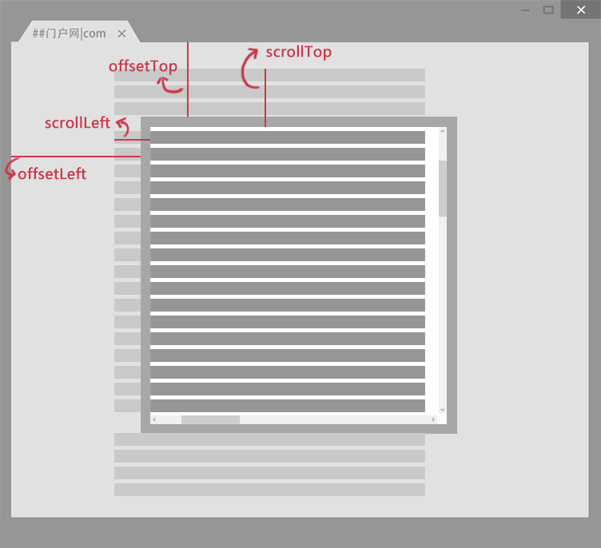

## 1. 闭包

**闭包就是一个函数引用另一个函数内部的变量，因为变量被引用着，所以当另外一个函数执行结束，其相应的执行上下文弹出栈时， 变量并不会被回收，因此可以用来封装一个私有变量。这既是优点也是缺点，不必要的闭包只会增加内存消耗， 因为没有使用的变量并不会被及时回收**

**闭包就是能够读取其他函数内部变量的函数**。例如在javascript中，只有函数内部的子函数才能读取[局部变量](https://baike.baidu.com/item/局部变量/9844788)，所以闭包可以理解成“定义在一个[函数](https://baike.baidu.com/item/函数/301912)内部的函数“。在本质上，**闭包是将函数内部和函数外部连接起来的桥梁**。

```javascript
function f1(){
    var n=999;
    nAdd=function(){
        n+=1
    }
    function f2(){
        alert(n);
    }
    return f2;
}

var result=f1();

result(); // 999

nAdd();

result(); // 1000
```

在这段代码中，result实际上就是**闭包f2函数**。它一共运行了两次，第一次的值是999，第二次的值是1000。这证明了，函数f1中的局部变量n一直保存在内存中，并没有在f1调用后被自动清除。

为什么会这样呢？**原因就在于f1是f2的父函数，而f2被赋给了一个全局变量，这导致f2始终在内存中，而f2的存在依赖于f1，因此f1也始终在内存中，不会在调用结束后，被垃圾回收机制（garbage collection）回收 **。

这段代码中另一个值得注意的地方，就是"`nAdd=function(){n+=1}`"这一行，首先在nAdd前面没有使用var关键字，因此nAdd是一个全局变量，而不是局部变量。其次，**nAdd的值是一个匿名函数（anonymous function），<u>而这个匿名函数本身也是一个闭包</u>，所以nAdd相当于是一个setter，可以在函数外部对函数内部的局部变量进行操作 **。

**使用闭包的注意点**

1）由于***闭包会使得函数中的变量都被保存在内存中，内存消耗很大***，所以不能滥用闭包，否则会造成网页的性能问题，在IE中可能***导致内存泄露***。解决方法是，在退出函数之前，将不使用的局部变量全部删除。

2）**闭包会在父函数外部，改变父函数内部变量的值 **。所以，如果你把父函数当作对象（object）使用，把闭包当作它的公用方法（Public Method），把内部变量当作它的私有属性（private value），这时一定要小心，不要随便改变父函数内部变量的值。

**闭包的用途**

1. 可以读取函数内部的变量
2. 让这些变量的值始终保持在内存中

**比较典型是定义模块**，我们将操作函数暴露给外部，而细节隐藏在模块内部

1. 闭包的第一个用途是使我们在函数外部能够访问到函数内部的变量。
   通过使用闭包，我们可以通过在外部调用闭包函数，从而在外部访问到函数内部的变量，可以使用这种方法来**创建私有变量**。

2. 函数的另一个用途是使已经运行结束的函数上下文中的变量对象继续留在内存中，因为闭包函数保留了这个变量对象的引用，所以这个变量对象不会被回收。

## 2. 介绍一下`js`数据类型

**基本数据类型有**:

1. **String**
2. **Number**
3. **Boolean**
4. **Null**
5. **Undefined**
6. **Symbol**
7. **BigInt**

**引用数据类型有**:

1. **Object**
2. **Array**
3. **Function**

**基本数据类型的值**直接保存在***栈*** 中，而**复杂数据类型的值**保存在***堆***中，**通过使用在栈中保存对应的指针来获取堆中的值**。

## 3. isFinite & Number.isFinite区别

都是检测**有限性**的值。两者区别在于，**`isFinite`函数强制将一个非数值的参数转换成数值**，如果能转换成数值，然后再去判断是否是**有限的**

`Number.isFinite()`检测有穷性的值，这个方法**不会强制将一个非数值的参数转换成数值**，这就意味着，**只有数值类型的值，且是有穷的（finite），才返回 `true`**。

```javascript
Number.isFinite(0)    // true
Number.isFinite('0')  // false
Number.isFinite(Infinity) false
isFinite('0')   // true
isFinite('0')  // true
isFinite(Infinity)  // false
```

## 4.isNaN 和 Number.isNaN 函数的区别

- `isNaN`会**将参数转换成数字**，**任何不能被转换成数值的都返回true**，所以对于非数字的参数返回true，会影响`NaN`判断
- `Number.isNaN`首先判断是不是数字，是数字在去判断是不是`NaN`，这种方法更准确。

```javascript
// isNaN('sdasd') true
// isNaN('21N') true
// isNaN(NaN)  true
// isNaN(123) false

Number.isNaN('1232N')  // false
Number.isNaN('1232')    // false
Number.isNaN(21312)  // false
Number.isNaN('sadas')  // false
Number.isNaN(NaN)   // true
```

## 5.什么是可迭代对象

 一个对象必须实现 @@iterator 方法。这意味着对象（或者它原型链上的某个对象）必须有一个键为 @@iterator 的属性，可通过常量 `Symbol.iterator` 访问该属性

如何判断一个类型是不是可迭代对象

```js
let someString = "hi";
typeof someString[Symbol.iterator];          // "function"
```

- 常见的可迭代对象，有`Array`，`Map`, `Set`, `String`,`TypeArray`, `arguments`
- 可以通过判断**`Symbol.iterator`**判断当前变量是否是可迭代对象

## 6.原型

- 在`js`中，我们**通常会使用构造函数来创建一个对象，每一个构造函数的内部都有一个prototype属性，这个属性对应的值是一个对象，这个对象它包含了可以由该构造函数的所有实例都共享的属性和方法**，我们把它称为原型。
- 原型分为**显示原型**和**隐式原型**，一般称`prototype`为显示原型，`__proto__`称为隐式原型。
- 一般而言，`__proto__`这个指针我们应该获取这个值，但是浏览器中都实现了 `__proto__ `属性来让我们访问这个属性，但是我们最好不要使用这个属性，因为它不是规范中规定的。
- ES5 中新增了一个 **`Object.getPrototypeOf()`** 方法，我们可以通过这个方法来获取对象的原型。

举个例子👇

为什么我们新建的对象可以使用`toString()`方法，这是因为我们访问一个对象的属性时，首先会在这个对象身上找，如果没有的话，我们会通过这个对象的`__proto__`找到该对象的原型，然后在这个原型对象中找，这个原型对象又没有的话，就这样子通过一直找下去，这也就是**原型链概念**。直到找到**原型链的尽头也就是`Object.prototype` **。

## js 获取原型的方法

假设Demo是一个对象，那么有三种方式👇

- `Demo.constructor.prototype`
- Demo.`__proto__`
- `Object.getPrototypeOf(Demo)`

因为设置对象原型的代码：

```js
Object.setPrototypeOf = function (obj, proto) {
  obj.__proto__ = proto;
  return obj;
 }
```

## 6.构造函数、原型与实例之间的关系

每创建一个函数，该函数就会自动带有一个 **`prototype`** 属性。该属性是个指针，指向了一个对象，我们称之为 **原型对象**。

原型对象上默认有一个属性**` constructor`**，该属性也是一个指针，指向其相关联的构造函数。

通过调用构造函数产生的实例，都有一个内部属性，指向了原型对象。所以实例能够访问原型对象上的所有属性和方法。

所以三者的关系是，**(重要)每个构造函数都有一个原型对象，原型对象都包含一个指向构造函数的指针**，而**实例都包含一个指向原型对象的内部指针**。通俗点说就是，**实例通过内部指针可以访问到原型对象，原型对象通过constructor指针，又可以找到构造函数 **。


```javascript
function Dog (name) {
    this.name = name;
    this.type = 'Dog';
}
Dog.prototype.speak = function () {
　　alert('wang');
}
var doggie = new Dog('jiwawa');
doggie.speak();  //wang
```

 以上代码定义了一个构造函数 Dog(), ` Dog.prototype `指向的原型对象，其自带的属性`construtor`又指回了 Dog，即  `Dog.prototype.constructor == Dog.` 实例doggie由于其内部指针指向了该原型对象，所以可以访问到 speak方法。


**`Dog.prototype` 只是一个指针，指向的是原型对象，但是这个原型对象并不特别，它也只是一个普通对象 **。假设说，这时候，我们让 `Dog.protptype` 不再指向最初的原型对象，而是另一个类 （Animal）的实例，情况会怎样呢？


如果Dog原型对象变成了某一个类的实例 `aaa`，这个实例又会指向一个新的原型对象 AAA，那么 doggie 此时就能访问 aaa 的实例属性和 AA A原型对象上的所有属性和方法了。

同理，新的原型对象AAA碰巧又是另外一个对象的实例bbb，这个实例bbb又会指向新的原型对象 BBB，那么doggie此时就能访问 bbb 的实例属性和 BBB 原型对象上的所有属性和方法了。

```javascript
//定义一个 Animal 构造函数，作为 Dog 的父类
function Animal () {
    this.superType = 'Animal';
}

Animal.prototype.superSpeak = function () {
    alert(this.superType);
}

function Dog (name) {
    this.name = name;
    this.type = 'Dog';
}
//改变Dog的prototype指针，指向一个 Animal 实例
//当 doggie 去访问superSpeak属性时，js会先在doggie的实例属性中查找，发现找不到
//然后，js就会去doggie 的原型对象上去找，doggie的原型对象已经被我们改成了一个animal实例，那就是去animal实例上去找。先找animal的实例属性，发现还是没有 superSpeack, 最后去 animal 的原型对象上去找
Dog.prototype = new Animal();

Dog.prototype.speak = function () {
    alert(this.type);
}
var doggie = new Dog('jiwawa');
doggie.superSpeak();  //Animal
```


总结来说：就是当重写了`Dog.prototype`指向的原型对象后，实例的内部指针也发生了改变，指向了新的原型对象，然后就能实现类与类之间的继承了。（**但是如果在重写原型对象之前，产生的实例，其内部指针指向的还是最初的原型对象**)。

## 7. arguments对象了解吗

`arguments`对象是所有（非箭头）函数中都可用的**局部变量**。此对象包含传递给函数的每个参数，第一个参数在索引0处.`arguments`对象不是一个 [`Array`](https://developer.mozilla.org/zh-CN/docs/Web/JavaScript/Reference/Array) 。它类似于`Array`，但除了length属性和索引元素之外没有任何`Array`属性

**转换成数组**👇

```javascript
let args = Array.prototype.slice.call(arguments)
let args1 = Array.from(arguments)
let args2 = [...arguments]
```

* 非严格模式中的函数**没有**包含剩余参数、默认参数和解构赋值，那么`arguments`对象中的值**会**跟踪参数的值（反之亦然）

```javascript
function func(a) { 
  arguments[0] = 99;   // 更新了arguments[0] 同样更新了a
  console.log(a);
}
func(10); // 99
```

这里arguments就会跟踪a变量👇

```javascript
function func(a) { 
  a = 99;              // 更新了a 同样更新了arguments[0] 
  console.log(arguments[0]);
}
func(10); // 99
```

* 当非严格模式中的函数**有**包含**剩余参数**、**默认参数**和**解构赋值**，那么`arguments`对象中的值**不会**跟踪参数的值（反之亦然）。相反, `arguments`反映了调用时提供的参数：

## 把script标签放在body闭合标签上面的原因

- **JavaScript的执行**会阻塞HTML的**解析渲染**;
- 当使用script标签引入外部`js`文件时, **Network线程**会**阻塞HTML的解析**, 但**不会阻塞HTML的渲染**;

JavaScript执行确实会**阻塞HTML的解析渲染**, 若是以**嵌入的方式**引入JavaScript, 不管**script标签**是放在**head标签中**或是**body标签尾部**, 页面都会由于JavaScript的执行而持续白屏; 

而在**引入外部js文件**的情况, 由于**Network线程**下载外部js文件仅阻塞HTML的解析而不会阻塞HTML的渲染, **script标签**置于**body标签尾部**可以避免由于js文件下载时间太长导致的页面持续白屏!

1、**避免用户等待，让页面先展示，然后再去执行脚本**
2、**防止过多js执行时，变量没有初始化的情况**
3、**js文件比较大，一般流程时先加载页面，然后加载并执行js**


从上图可以看出, 网页的渲染流程大致如下:

1. **Parse HTML** 该阶段生成了DOM Tree和CSSOM Tree;
2. **Layout** 将DOM Tree结合CSSOM Tree, 生成Layout Tree(又称Render Tree), 计算每个元素的尺寸和位置;
3. **Update Layout Tree** 更新Layout Tree;
4. **Paint** 生成PaintLayout Tree记录元素绘制顺序;
5. **Composite** 合成视图输出到屏幕;

## async VS defer

```javascript
<script src="..." async></script>
```

**此属性告诉浏览器，此脚本加载的时候，不会阻止浏览器渲染页面，只要此脚本下载完毕，就开始执行脚本**。

不过因为异步下载共有的特性，**多个脚本下载完毕的先后顺序，可不一定是按代码的顺序**，如果两个脚本前后有依赖，使用 async 可能不是一个好主意。异步加载的方式，更适用于类似 require.js 那样的动态加载。

```javascript
<script src="..." defer></script>
```

此属性与 `async` 类似，只是**运行的时机不是脚本下载完毕，而是等着整个文档加载完毕之后执行**，类似于执行在 jQuery 的 `ondomready` 事件（其实也就是 **`DOMContentLoaded`** 事件, defer 在**`DOMContentLoaded`**之前执行）。

另外 **defer 还有一个特点，它是按代码顺序来执行**的。

## 讲讲PWA

PWA全称Progressive Web App，即渐进式WEB应用

一个 PWA 应用首先是一个网页, 可以通过 Web 技术编写出一个网页应用. 随后添加上 **App Manifest** 和 **Service Worker** 来实现 PWA 的安装和离线等功能

- 可以**添加至主屏幕**，点击主屏幕图标可以实现启动动画以及隐藏地址栏
- 实现**离线缓存**功能，即使用户手机没有网络，依然可以使用一些离线功能
- 实现了**消息推送**

## 如何理解 JS 中的this关键字

**this表示当前对象，this的指向是根据调用的上下文来决定的，默认指向window对象 **。
 全局环境：全局环境就是在里面，这里的this始终指向的是window对象。
 局部环境：
 1.在全局作用域下直接调用函数，this指向window。
 2.对象函数调用，哪个对象调用就指向哪个对象。
 3.使用 new 实例化对象，在构造函数中的this指向实例化对象。
 4.使用call或apply改变this的指向。

## 解释一下严格模式(strict mode)

严格模式用于标准化正常的JavaScript语义。严格模式可以嵌入到非严格模式中，关键字 ‘use strict’。使用严格模式后的代码应遵循JS严格的语法规则。例如，分号在每个语句声明之后使用。

## 解释 JavaScript 中的 null 和 undefined

- JavaScript 中有两种底层类型：null 和 undefined。它们代表了不同的含义：
- **尚未初始化**：undefined；
- **空值**：null。

```javascript
//null和undefined是两个不同的对象
null == null  //true
null === null  //true
null == undefined //true
null === undefined //flase
```

## 字符串去重，并去除掉特殊字符，按照数字在前字母在后的顺序排序字符串

```javascript
//如下："1233fddfd&3434fdsaff&454545&4545444rfdsfds&545gdsgs"
var str = "1233fddfd&3434fdsaff&454545&4545444rfdsfds&545gdsgs";
var n = "";
var s="";
for(var i=0;i<str.length;i++){
    if((str[i]>=0&&str[i]<=9)&&n.indexOf(str[i])==-1){
        n+=str[i];
    }else if((str.charCodeAt(i)>=97&&str.charCodeAt(i)<=122)&&s.indexOf(str[i]) == -1){
        s+=str[i];
    }
}
console.log(n+s); //12345fdsarg
```

## 编写一个数组去重的方法

```javascript
function sort(arr) {
    for(var i = 0;i<arr.length;i++){
        for(var j = i+1;j<arr.length;j++){
            if(arr[i] == arr[j]){
                arr.splice(j,1);
                j--; //删除一个元素后，后面的元素会依次往前，下标也需要依次往前
            }
        }
    }
    return arr
}
```

## DOM怎样添加、移除、移动、复制、创建和查找节点

- 获取子节点
  		父节点.children
    	父节点.childNodes
- 获取父节点
  子节点.parentNode
  子节点.offsetParent
- 创建
  document.createElement(‘标签名’)
  document.createTextNode(‘文本内容’)
- 添加
  父节点.appendChild(子节点)
  父节点.insertBefore(newChild，refChild)
- 复制
  被复制的节点.cloneNode(true)
- 删除：
  节点.remove()
  父节点.removeChild（子节点）
- 替换
  父节点.replaceChild（newChild，refChild）

## 如何获取url地址中搜索内容？

`window.location.search`

## 解释一下事件流？

* **事件捕获阶段**：当事件发生的时候，将事件从window依次往子元素传递
  确定目标阶段：确定事件目标
* **事件冒泡阶段**：事件目标开始处理事件，处理完以后会将事件依次传递给父元素，一直到window
  事件都是在事件冒泡处理,`ie`只有冒泡

## ajax请求的时候get 和post方式的区别，什么时候用post

1. GET请求会将参数跟在URL后进行传递，而POST请求则是作为HTTP消息的实体内容发送给WEB服务器。当然在Ajax请求中，这种区别对用户是不可见的
2. GEt传输数据容量小，不安全，post传输数据内容大，更加安全； 当向服务器发送一些数据的时候选择post比较安全

## js哪些操作会造成内存泄露？

* **意外的全局变量**引起的内存泄露

  `function leak(){ leak=“xxx”;//leak成为一个全局变量，不会被回收 }`

* **被遗忘的定时器**或者**回调**

* **闭包**引起的内存泄漏

## $(document).ready() 方法和`window.onload` 有什么区别？

1. `window.onload`只能执行一次，执行第二次则第一次被覆盖;
   ready可执行多次，不会覆盖;
2. `window.onload`等**文档和资源都加载完成**以后调用;
   ready只要**文档结构加载完成**以后就会调用;

## 获取对象属性的方法

- **`Object.keys(testObj) `** 返回的参数就是一个数组，**数组内包括对象内可枚举属性和方法名**
- **for in** 遍历的也可以，不过对于非继承的属性名称也会获取到，通过`hasOwnproperty`判断
- **`Object.getOwnPropertyNames(obj) `**返回的参数就是一个数组，数组内包括**自身拥有的枚举**或**不可枚举属性**名称字符串，如果是数组的话，还有可能获取到`length`属性

## for of 和 for in区别

for in

- index获取的是**索引**
- **遍历的顺序可能不是按照顺序进行的**
- 使用for in 会**遍历数组所有可枚举属性，包括原型**，**例如上面的method和name都会遍历**
- for in **更适合遍历对象**，不要使用for in去遍历数组

**for of**

- for of 语法遍历的是数组元素的**值**
- for in 遍历的是**索引**
- for of遍历的只是数组内的元素，而**不包括数组的原型属性method**和**索引name**

**小结**

- **for..of适用遍历数/数组对象/字符串/map/set等拥有迭代器对象的集合，不能遍历对象 **，因为没有迭代对象，与`forEach()`不同的是，它可以正确响应**break**、**continue**和**return**语句。

- **for in 可以遍历一个普通的对象，这样也是它的本质工作，for in会遍历原型以及可枚举属性 **，最好的情况下，使用**`hasOwnProperty`**判断是不是实例属性。

## 作用域链

**<u>作用域 规定了如何查找变量</u>**，也就是确定当前执行代码对变量的访问权限。当查找变量的时候，会先从**当前上下文的变量对象中**查找，如果没有找到，就会从**父级（词法层面上的父级）执行上下文的变量对象中**查找，一直找到**全局上下文的变量对象**，也就是全局对象。这样**由多个执行上下文的变量对象构成的链表**就叫做 **作用域链**。

**函数的作用域在函数创建时就已经确定了。**当函数创建时，会有一个名为 **`[[scope]]`** 的内部属性保存所有父变量对象到其中。当函数执行时，会创建一个执行环境，然后通过复制函数的 `[[scope]]`  属性中的对象构建起执行环境的作用域链，然后，变量对象 `VO` 被激活生成 `AO` 并添加到作用域链的前端，完整作用域链创建完成：

```
Scope = [AO].concat([[Scope]]);
```

所以闭包，可以说是作用域链的另外一种表示形式。

## 手写函数防抖和函数节流

**节流throttle**

规定在一个单位时间内，只能触发一次函数。如果这个单位时间内触发多次函数，只有一次生效。

- **鼠标的点击事件，比如`mousedown`只触发一次**
- **监听滚动事件，比如是否滑到底部自动加载更多，用throttle判断**
- **比如游戏中发射子弹的频率(1秒发射一颗)**

```javascript
throttle(callback,wait){
    let last = Date.now();
    return function(...args){
        if((Date.now() - last) > wait){
            callback.call(this,...args);
            last = Date.now();
        }
    }
}
```

**防抖**(延迟)

在事件被触发n秒后再执行回调，如果在这n秒内又被触发，则重新计时

- **search搜索，用户不断输入值时，用防抖来节约Ajax请求,也就是输入框事件**。
- **window触发resize时，不断的调整浏览器窗口大小会不断的触发这个事件，用防抖来让其只触发一次**

```javascript
function debounce(callback, delay){
    let timer = null;
    return function(...args){
        if(timer) clearTimeout(timer);
        timer = setTimeout(function(){
            callback.apply(this, args);
        },delay)
    }
}
```

如果仅需要 `_.debounce` 和 `_.throttle` 方法，可以使用 Lodash 的自定义构建工具，生成一个 2KB 的压缩库。使用以下的简单命令即可：

```
npm i -g lodash-cli
npm i -g lodash-cli include=debounce,throttle
```

## **谈一谈你对requestAnimationFrame（rAF）理解**

正好跟节流有点关系，有点相似处

动画帧率可以作为衡量标准，一般来说画面在 60fps 的帧率下效果比较好。

换算一下就是，每一帧要在 16.7ms (16.7 = 1000/60) 内完成渲染。

我们来看看MDN对它的解释吧👇

> `window.requestAnimationFrame() `方法**告诉浏览器您希望执行动画并请求浏览器在下一次重绘之前调用指定的函数来更新动画。**该方法使用一个回调函数作为参数，这个回调函数会在浏览器重绘之前调用。*-- MDN*

当我们调用这个函数的时候，我们告诉它需要做两件事：

1. 我们需要新的一帧；
2. 当你渲染新的一帧时需要执行我传给你的回调函数

### rAF与 setTimeout 相比

rAF(requestAnimationFrame) 最大的优势+是**「由系统来决定回调函数的执行时机」**。

具体一点讲就是，系统每次绘制之前会主动调用 rAF 中的回调函数，如果系统绘制率是 60Hz，那么回调函数就每16.7ms 被执行一次，如果绘制频率是75Hz，那么这个间隔时间就变成了 1000/75=13.3ms。

换句话说就是，rAF 的执行步伐跟着系统的绘制频率走。它能保证回调函数在屏幕每一次的绘制间隔中只被执行一次(上一个知识点刚刚梳理完**「函数节流」**)，这样就不会引起丢帧现象，也不会导致动画出现卡顿的问题。

另外它可以自动调节频率。如果callback工作太多无法在一帧内完成会自动降低为30fps。虽然降低了，但总比掉帧好。

**与setTimeout动画对比的话，有以下几点优势**

- 当页面隐藏或者最小化时，setTimeout仍然在后台执行动画，此时页面不可见或者是不可用状态，动画刷新没有意义，**浪费CPU**。
- rAF不一样，当页面处理未激活的状态时，该页面的屏幕绘制任务也会被系统暂停，因此跟着系统步伐走的rAF也会停止渲染，当页面被激活时，动画就从上次停留的地方继续执行，有效节省了 CPU 开销。

### 什么时候调用呢

规范中似乎是这么去定义的：

- 在重新渲染前调用。
- 很可能在宏任务之后不去调用

这样子分析的话，似乎很合理嘛，为什么要在重新渲染前去调用呢？因为rAF作为官方推荐的一种做流畅动画所应该使用的API，做动画不可避免的去操作DOM，而如果是在渲染后去修改DOM的话，那就只能等到下一轮渲染机会的时候才能去绘制出来了，这样子似乎不合理。

`rAF`在浏览器决定渲染之前给你最后一个机会去改变 DOM 属性，然后很快在接下来的绘制中帮你呈现出来，所以这是做流畅动画的不二选择。

- 根据经验，如果 JavaScript 方法需要绘制或者直接改变属性，我会选择 `requestAnimationFrame`，只要涉及到重新计算元素位置，就可以使用它。
- 涉及到 AJAX 请求，添加/移除 class （可以触发 CSS 动画），我会选择 `_.debounce` 或者 `_.throttle` ，可以设置更低的执行频率

## 浏览器窗口可视区域大小 clientHeight

1. offsetWidth : 元素的宽度值
2. offsetHeight : 元素的高度值
3. offsetLeft : 元素的水平偏移
4. offsetTop : 元素的垂直偏移
5. clientX : 元素在当前窗口中的水平偏移量
6. clientY : 元素在当前窗口中的垂直偏移量
7. clientWidth : 元素的宽度值(不包括边框)
8. clientHeight : 元素的高度值(不包括边框)
9. pageX : 元素在页面中的水平偏移
10. pageY : 元素在页面中的垂直偏移
11. pageX : clientX + scrollLeft
12. pageY : clientY + scrollTop
13. screenX : 元素在屏幕中水平偏移
14. screenY : 元素在屏幕中垂直偏移
15. scrollLeft : 滚动条的水平偏移距离
16. scrollTop : 滚动条的垂直偏移距离
17. scrollWidth : 水平滚动条能滚动的距离
18. scrollHeight : 垂直滚动条能滚动的距离

> 获得浏览器窗口的尺寸（浏览器的视口，不包括工具栏和滚动条）的方法:

**一、对于IE9+、Chrome、Firefox、Opera 以及 Safari：**

• window.innerHeight - 浏览器窗口的内部高度

• window.innerWidth - 浏览器窗口的内部宽度

**二、对于 Internet Explorer 8、7、6、5：**

• document.documentElement.clientHeight表示HTML文档所在窗口的当前高度。

• document.documentElement.clientWidth表示HTML文档所在窗口的当前宽度。

或者

Document对象的body属性对应HTML文档的`<body>`标签

• document.body.clientHeight

• document.body.clientWidth

**在不同浏览器都实用的 JavaScript 方案：**

```js
var w = document.documentElement.clientWidth || document.body.clientWidth;
var h = document.documentElement.clientHeight || document.body.clientHeight;
```

## 网页尺寸scrollHeight

> scrollHeight和scrollWidth，获取网页内容高度和宽度

**一、针对IE、Opera:**

scrollHeight 是网页内容实际高度，可以小于 clientHeight。

**二、针对NS、FF:**

scrollHeight 是网页内容高度，不过最小值是 clientHeight。也就是说网页内容实际高度小于 clientHeight 时，scrollHeight 返回 clientHeight 。

**三、浏览器兼容性**

```
var w=document.documentElement.scrollWidth
   || document.body.scrollWidth;
var h=document.documentElement.scrollHeight
   || document.body.scrollHeight;
```

**注意:区分大小写**

scrollHeight和scrollWidth还可获取Dom元素中内容实际占用的高度和宽度。

## 网页尺寸offsetHeight

offsetHeight和offsetWidth，获取网页内容高度和宽度(包括滚动条等边线，会随窗口的显示大小改变)。

**一、值**

offsetHeight = clientHeight + 滚动条 + 边框。

**二、浏览器兼容性**

```js
var w= document.documentElement.offsetWidth
    || document.body.offsetWidth;
var h= document.documentElement.offsetHeight
    || document.body.offsetHeight;
```

## 网页卷去的距离与偏移量



**scrollLeft:**设置或获取位于给定对象左边界与窗口中目前可见内容的最左端之间的距离 ，即左边灰色的内容。

**scrollTop:**设置或获取位于对象最顶端与窗口中可见内容的最顶端之间的距离 ，即上边灰色的内容。

**offsetLeft:**获取指定对象相对于版面或由 offsetParent 属性指定的父坐标的计算左侧位置 。

**offsetTop:**获取指定对象相对于版面或由 offsetParent 属性指定的父坐标的计算顶端位置 。

**注意:**

**1. 区分大小写**

**2. offsetParent：布局中设置postion属性(Relative、Absolute、fixed)的父容器，从最近的父节点开始，一层层向上找，直到HTML的body。**

## offsetWidth、clientWidth、scrollTop的区别？

**`Element.getBoundingClientRect()` **方法返回元素的大小及其相对于视口的位置

### 1.偏移量

> 元素的可见大小由其高度、宽度决定，包括所有内边距、滚动条和边框的大小（注意，不包括外边距）

`offsetWidth`：当前对象的宽度,占位宽，包含 **内容宽width+左右padding+左右border **

`offsetHeight`:当前对象的高度，**内容高height+上下padding+上下border **

`offsetLeft` :<u>当前元素 左边框 外边缘 到 最近的已定位父级（`offsetParent`） 左边框内边缘的距离</u>。如果父级都没有定位，则分别是到body 顶部 和左边的距离。不能对其进行赋值.设置对象到其上级层左边的距离请用`style.left` 属性

`offsetTop` :<u>当前元素 上边框 外边缘 到 最近的已定位父级（`offsetParent`） 上边框 内边缘的 距离</u>。如果父级都没有定位，则分别是到body 顶部 和左边的距离。*不能对其进行赋值.设置对象到上级层顶部边的距离请用`style.top` 属性*

`offsetParent `:当前对象的上级层对象.


### 2.客户区大小

> 元素的客户区大小指的是**元素内容及其内边距所占据的空间大小**

`clientWidth`：获取元素对象人眼可见内容的宽度，包含 **内容宽width+左右padding**

`clientHeight`: 获取元素对象人眼可见内容的高度，**内容高height + 上下padding**；

`clientLeft`: 获取元素对象的**左边框border宽度**

`clientTop`：获取元素对象的**上边框border高度**


### 3.滚动大小

`scrollWidth`: 获取对象的滚动宽度。即**获取指定标签内容层的真实宽度**（**可视区域宽度+被隐藏区域宽度**）。

`scrollHeight`: 获取对象的滚动高度。即**获取指定标签内容层的真实高度**（**可视区域高度+被隐藏区域高度**）

`scrollLeft`: 设置或获取位于<u>对象实际左边界和对象中目前可见内容的最左端之间的距离(width+padding为一体</u>

`scrollTop`:页面被卷去的高，设置或获取位于<u>对象实际最顶端的边界和对象中可见内容的最顶端边界之间的距离；(height+padding为一体)</u>

**对于不包含滚动条的页面而言，scrollWidth和scrollHeight与clientWidth和clientHeight之间的关系并不十分清晰，浏览器之间的差异很大。**


```javascript
var scrollTop = document.documentElement.scrollTop || window.pageYOffset || document.body.scrollTop

//  持续获取高度的方式
window.addEventListener('scroll', ()=>{
    var scrollTop = document.documentElement.scrollTop || window.pageYOffset || document.body.scrollTop;
});
```


## **实现图片的懒加载**

```javascript
网页可见区域宽： document.body.clientWidth;
网页可见区域高： document.body.clientHeight;
网页可见区域宽： document.body.offsetWidth (包括边线的宽);
网页可见区域高： document.body.offsetHeight (包括边线的宽);
网页正文全文宽： document.body.scrollWidth;
网页正文全文高： document.body.scrollHeight;
网页被卷去的高： document.body.scrollTop;
网页被卷去的左： document.body.scrollLeft;
网页正文部分上： window.screenTop;
网页正文部分左： window.screenLeft;
屏幕分辨率的高： window.screen.height;
屏幕分辨率的宽： window.screen.width;
屏幕可用工作区高度： window.screen.availHeight;
```

 **「原理思路」**

1. 拿到所以的图片`img dom`
2. 重点是第二步，判断当前图片是否到了可视区范围内
3. 到了可视区的高度以后，就将img的data-src属性设置给src
4. 绑定window的`scroll`事件

当然了，为了用户的体验更加，默认的情况下，设置一个**「占位图」**

### 第一种方式

**「clientHeight-scrollTop-offsetTop」**

```javascript
let Img = document.getElementsByTagName("img"),
    len = Img.length,
    count = 0; 
function lazyLoad () {
    let viewH = document.body.clientHeight, //可见区域高度
        scrollTop = document.body.scrollTop; //滚动条距离顶部高度
    for(let i = count; i < len; i++) {
        if(Img[i].offsetTop < scrollTop + viewH ){
            if(Img[i].getAttribute('src') === 'default.png'){
                Img[i].src = Img[i].getAttribute('data-src')
                count++;
            }
        }
    }
}
function throttle(fn, delay) {
    let flag = true,
        timer = null;
    return function (...args) {
        let context = this;
        if (!flag) return;
        flag = false;
        clearTimeout(timer)
        timer = setTimeout(() => {
            fn.apply(context, args);
            flag = true;
        }, delay);
    };
};
window.addEventListener('scroll', throttle(lazyLoad,1000))

lazyLoad();  // 首次加载
```

### 第二种方式

使用 `element.getBoundingClientRect()` API 直接得到 top 值。

```javascript
let Img = document.getElementsByTagName("img"),
    len = Img.length,
    count = 0; 
function lazyLoad () {
    let viewH = document.body.clientHeight, //可见区域高度
        scrollTop = document.body.scrollTop; //滚动条距离顶部高度
    for(let i = count; i < len; i++) {
        if(Img[i].getBoundingClientRect().top < scrollTop + viewH ){
            if(Img[i].getAttribute('src') === 'default.png'){
                Img[i].src = Img[i].getAttribute('data-src')
                count++;
            }
        }
    }
}
function throttle(fn, delay) {
    let flag = true,
        timer = null;
    return function (...args) {
        let context = this;
        if (!flag) return;
        flag = false;
        clearTimeout(timer)
        timer = setTimeout(() => {
            fn.apply(context, args);
            flag = true;
        }, delay);
    };
};
window.addEventListener('scroll', throttle(lazyLoad,1000))
lazyLoad();  // 首次加载 
```

## this

**this 永远指向最后调用它的那个对象**

1. 默认指向，作为**普通函数调用**，**指向window，严格模式下指向undefined**
2. 使用**call/apply/bind** 显示改变this指向
3. **new对象**，被实例调用，指向的就是实例对象
4. 箭头函数：**this指向的是上级作用域中的this**
5. class方法：该this指向的就是实例

## ECMAScript6 怎么写 class，为什么会出现 class 这种东西

在我看来 ES6 新添加的 class 只是为了补充 js 中缺少的一些面向对象语言的特性，但本质上来说它只是一种语法糖，不是一个新的东西，其背后还是原型继承的思想。通过加入 class 可以有利于我们更好的组织代码。在 class 中添加的方法，其实是添加在类的原型上的。

## 哪些操作会造成内存泄漏

1. **意外的全局变量**

2. **被遗忘的计时器或回调函数**

3. **脱离 DOM 的引用**

4. **闭包**

- 第一种情况是我们由于**使用未声明的变量**，而意外的创建了一个全局变量，而使这个变量一直留在内存中无法被回收。

- 第二种情况是我们**设置了 setInterval 定时器，而忘记取消它**，如果循环函数有对外部变量的引用的话，那么这个变量会被一直留在内存中，而无法被回收。
- 第三种情况是我们**获取一个 DOM 元素的引用，而后面这个元素被删除**，由于我们一直保留了对这个元素的引用，所以它也无法被回收。
- 第四种情况是**不合理的使用闭包，从而导致某些变量一直被留在内存当中**。

## Object.is()使用过吗？跟 === 和 == 区别

- 两等号判等，会在比较时进行类型转换。
- 三等号判等（判断严格），比较时不进行隐式类型转换，（类型不同则会返回false）
- 使用 **Object.is** 来进行相等判断时，**一般情况下和三等号的判断相同**，它处理了一些特殊的情况，比如 **-0 和 +0 不再相等，两个 `NaN` **认定为是相等的。

## JS事件循环机制

- 因为 js 是单线程运行的，在代码执行的时候，通过将不同函数的执行上下文压入执行栈中来保证代码的有序执行。
- 在执行同步代码的时候，如果遇到了异步事件，js 引擎并不会一直等待其返回结果，而是会将这个事件挂起，继续执行执行栈中的其他任务。
- 当异步事件执行完毕后，再将异步事件对应的回调加入到与当前执行栈中不同的另一个任务队列中等待执行。
- 任务队列可以分为宏任务对列和微任务对列，当前执行栈中的事件执行完毕后，js 引擎首先会判断微任务对列中是否有任务可以执行，如果有就将微任务队首的事件压入栈中执行。
- 当微任务对列中的任务都执行完成后再去判断宏任务对列中的任务。

微任务包括了 promise 的回调、node 中的 **process.nextTick** 、对 Dom 变化监听的 `MutationObserver`。

宏任务包括了 **script 脚本的执行、setTimeout ，setInterval ，setImmediate** 一类的定时事件，还有如 **I/O 操作**、**UI 渲染**等。

## 立即执行函数是什么

**声明一个函数，并马上调用这个匿名函数就叫做立即执行函数**；也可以说立即执行函数是一种语法，让你的函数在定义以后立即执行；

作用：

1. 不必为函数命名，**避免了污染全局变量**
2. 立即执行函数内部形成了一个单独的作用域，**可以封装一些外部无法读取的私有变量**
3. 封装变量

## 发布订阅者模式

```javascript
class EventEmitter {
    constructor(){
        this.list = {} //list比喻成微信平台
    }
    on(key,fn){ // key比喻成公众号、fn为订阅者
        if(!this.list[key]){
            this.list[key] = []
        }
        this.list[key].push(fn)
        return this
    }
    once(key,fn) {
        if(!this.list[key]){
            this.list[key] = []
        }
        this.list[key].push(fn)
        this.list[key].flag = this.list[key].length; 
        return this
    }
    emit(key, args){
        let that = this;
        let fns = this.list[key]
        if(!fns || fns.length === 0) return false
        for(let i = 0; i < fns.length; i++) {
            fns[i].apply(this, args)
            if(fns.flag === i){
                that.off(key,fns[i-1])
            }
        }
    }
    off(key,fn) {
        let fns = this.list[key];
        let len = fns.length,
            k = -1;
        for(let i = 0; i < len; i++) {
            if(fns[i].name === fn.name){ // 删除
                k = i;
                break;
            }
        }
        if(k !== -1) {
            this.list[key].splice(k,1)
        }
    }

    allOff(key) {
        if(key === undefined){
            this.list = {}
        }else{
            this.list[key] = []
        }
    }
}

var emitter = new EventEmitter();

function handleOne(a, b, c) {
    console.log('第一个监听函数', a, b, c)
}

function handleSecond(a, b, c) {
    console.log('第二个监听函数', a, b, c)
}

function handleThird(a, b, c) {
    console.log('第三个监听函数', a, b, c)
}

emitter.on("demo", handleOne)
    .once("demo", handleSecond)
    .on("demo", handleThird);

emitter.emit('demo', [1, 2, 3]);
// => 第一个监听函数 1 2 3
// => 第二个监听函数 1 2 3
// => 第三个监听函数 1 2 3

emitter.off('demo', handleThird);
emitter.emit('demo', [1, 2, 3]);
// => 第一个监听函数 1 2 3

emitter.allOff();
emitter.emit('demo', [1, 2, 3]);
// nothing

```

## 模块化

**模块化好处**

- **避免了命名冲突(减少了命名空间污染)**
- **更好的分离，按需加载**
- **更高复用性**
- **高维护性**

### CommomJS

CommonJS定义了两个主要概念：

`require`函数，用于导入模块

**`module.exports`**变量，用于导出模块

`require`的第一步是**解析路径获取到模块内容**：

- 如果是核心模块，比如`fs`，就直接返回模块

- 如果是带有路径的如`/`或者`./`等等，则拼接出一个绝对路径，然后**先读取缓存`require.cache`**

  再读取文件。如果没有加后缀，则自动加后缀然后一一识别。

  - `.js` 解析为JavaScript 文本文件
  - `.json`解析JSON对象
  - `.node`解析为二进制插件模块

- **首次加载后的模块会缓存在`require.cache`之中，所以多次加载`require`，得到的对象是同一个**。

### ES6模块与CommonJS的区别

**CommonJS 模块输出的是一个值的拷贝，ES6 模块输出的是值的引用**

- `CommonJS` 模块输出的是**值的拷贝**，也就是说，**一旦输出一个值，模块内部的变化就影响不到这个值**。
- ES6 模块的运行机制与 CommonJS 不一样。JS 引擎对脚本静态分析的时候，遇到模块加载命令`import`，就会生成一个只读引用。等到脚本真正执行时，再根据这个只读引用，到被加载的那个模块里面去取值。换句话说，ES6 的`import`有点像 Unix 系统的“符号连接”，原始值变了，`import`加载的值也会跟着变。因此，ES6 模块是动态引用，并且不会缓存值，模块里面的变量绑定其所在的模块。

**CommonJS 模块是运行时加载，ES6 模块是编译时输出接口**

- 运行时加载: `CommonJS` 模块就是对象；即在输入时是先加载整个模块，生成一个对象，然后再从这个对象上面读取方法，这种加载称为“运行时加载”。
- 编译时加载: ES6 模块不是对象，而是通过 `export` 命令显式指定输出的代码，`import`时采用静态命令的形式。即在`import`时可以指定加载某个输出值，而不是加载整个模块，这种加载称为“编译时加载”

### 模块化开发怎么做？

- 我对模块的理解是，**一个模块是实现一个特定功能的一组方法**。在最开始的时候，js 只实现一些简单的功能，所以并没有模块的概念，但随着程序越来越复杂，代码的模块化开发变得越来越重要。
- 由于**函数具有独立作用域的特点**，最原始的写法是使用函数来作为模块，几个函数作为一个模块，但是这种方式容易造成全局变量的污染，并且模块间没有联系。
- 后面提出了对象写法，通过将函数作为一个对象的方法来实现，这样解决了直接使用函数作为模块的一些缺点，但是这种办法会暴露所有的所有的模块成员，外部代码可以修改内部属性的值。
- 现在**最常用的是立即执行函数的写法，通过利用闭包来实现模块私有作用域的建立，同时不会对全局作用域造成污染。**

## Attribute与Property

**attribute **：是HTML**标签上的某个属性**，如id、class、value等以及自定义属性

**property **：是js获取的**DOM对象上的属性值**，比如a，你可以将它看作为一个基本的js对象。

```javascript
let demo11 = oDiv.getAttribute('class');
let demo2 = oDiv.setAttribute('data-name','new-value')
```

## 路由规则

可以在不刷新页面的前提下动态改变浏览器地址栏中的URL地址，动态修改页面上所显示资源。

 **window.history的方法和属性**

```
back()` `forward()` `go()
```

HTML5 新方法：添加和替换历史记录的条目

**pushState()**

```javascript
history.pushState(state, title, url); 添加一条历史记录，不刷新页面
```

`state` : 一个于指定网址相关的状态对象，`popstate`事件触发时，该对象会传入回调函数中。如果不需要这个对象，此处可以填null。

`title` : 新页面的标题，但是所有浏览器目前都忽略这个值，因此这里可以填null。

`url` : 新的网址，必须与前页面处在同一个域。浏览器的地址栏将显示这个网址。

**replaceState**

```javascript
history.replaceState(state, title, url);  替换当前的历史记录，不刷新页面
```

- 这两个API的相同之处是都会操作浏览器的历史记录，而不会引起页面的刷新。
- 不同之处在于，pushState会增加一条新的历史记录，replaceState则会替换当前的历史记录。
- 这两个api，加上state改变触发的`popstate`事件，提供了单页应该的另一种路由方式。

 `popstate` 事件：历史记录发生改变时触发

**基于hash（location.hash+hashchange事件）**

我们知道**location.hash的值就是url中`#`后面的内容**，如`http://www.163.com#something`。

此网址中，**location.hash='#something'**。

hash满足以下几个特性，才使得其可以实现前端路由：

1. url中hash值的变化并不会重新加载页面，因为hash是用来指导浏览器行为的，对服务端是无用的，所以不会包括在http请求中。
2. **hash值的改变，都会在浏览器的访问历史中增加一个记录**，也就是能通过浏览器的回退、前进按钮控制hash的切换
3. 我们可以通过**hashchange事件，监听到hash值的变化**，从而响应不同路径的逻辑处理。

```javascript
window.addEventListener("hashchange", funcRef, false)
```

如此一来，我们就可以在hashchange事件里，根据hash值来更新对应的视图，但不会去重新请求页面，同时呢，也在history里增加了一条访问记录，用户也仍然可以通过前进后退键实现UI的切换。

**触发hash值的变化有2种方法**👇

- 一种是**通过a标签，设置href属性**，当标签点击之后，地址栏会改变，同时会触发hashchange事件

```html
<a href="#TianTianUp">to somewhere</a>
```

* 另一种是通过**js直接赋值给location.hash**，也会改变url，触发**hashchange事件**。

```
location.hash="#somewhere"
```
