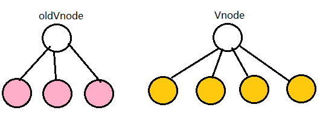
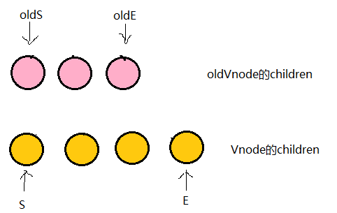

# 前置知识

## type

首先咱们来说`type`。 这里的`type`表示：**VNode 的节点类型**。 比如：

1. 一个`div`节点，`vnode` 就是`div`
2. 一个`li`节点，`vnode` 就是`li`
3. 一个`注释`节点，`vnode` 就是`comment`
4. 一个`组件节点`，`vnode`就是`Component 对象实例`
5. ......

## 什么是虚拟DOM？

> diff算法是一种精准更新真实Dom树的性能优化方法。虚拟DOM是用来表示真实dom的一个JS对象，包含的字段有**标签名称**、**标签属性**、**子标签的名称**、**子标签属性**、**文本节点**。
>
> vue通过模版编译生成虚拟DOM树，然后在通过渲染器渲染成真实DOM，当数据更新时，产生新的虚拟dom树，如果直接用新的虚拟DOM树生成真实DOM并不是最优的方法。为了进一步降低找出差异的性能消耗，就要使用diff算法。Diff算法是一种对比算法。对比新旧虚拟DOM，对比出是哪个虚拟节点更改了，找出这个虚拟节点，并只更新这个虚拟节点所对应的真实节点，实现精准地更新真实DOM。


# vue2 双端diff算法

## key有什么作用？

> **`key` 是对节点的唯一标识，diff 算法的目的是根据 key 复用 dom 节点，通过移动节点而不是创建新节点来减少 dom 操作。**

## diff 算法干什么用？

> 用于对比**新旧**两个虚拟DOM，找出差异，最小化更新视图。
>
> diff的过程就是调用名为`patch`的函数，比较新旧节点，一边比较一边给**真实的DOM**打补丁。

diff 算法约定了两种处理原则：**<u>只做同层的对比，Vnode的节点类型type 变了就不再对比子节点</u>。**


## **双端diff算法**(能减少节点的移动次数)比对流程

1. 需要 4 个指针，分别指向**新旧**两个 `vnode` 数组的首尾。
2. 先`oldS`和`newS`比（首首）、再`oldE`和`newE`比(尾尾)、接着`oldS`和`newE`比(首尾)、然后`oldE`和`newS`比(尾首)
3. 找到了相同节点，就进行`patchVnode`。
4. 如果没找到，就遍历`oldVNode`,找出与`newS`拥有相同的`key`值的元素，进行 `patchVnode`
5. 头和尾的指针向中间移动，直到 `oldStartIdx > oldEndIdx && newStartIdx <= newEndIdx` 或者 `newStartIdx > newEndIdx && oldStartIdx <= oldEndIdx `，说明就处理完了全部的节点。
6. 还剩下旧的 `vnode` 就批量删除，剩下新的 `vnode` 就批量新增


[**`updateChildren`方法源码**：](https://github.com/vuejs/vue/blob/bd6cea0973247e2a8e1d4a2250614c0bf44f0b26/src/core/vdom/patch.js#L404-L474)

```js
function updateChildren (parentElm, oldCh, newCh, insertedVnodeQueue, removeOnly) {
    let oldStartIdx = 0
    let newStartIdx = 0
    let oldEndIdx = oldCh.length - 1
    let oldStartVnode = oldCh[0]
    let oldEndVnode = oldCh[oldEndIdx]
    let newEndIdx = newCh.length - 1
    let newStartVnode = newCh[0]
    let newEndVnode = newCh[newEndIdx]
    let oldKeyToIdx, idxInOld, vnodeToMove, refElm

    // removeOnly is a special flag used only by <transition-group>
    // to ensure removed elements stay in correct relative positions
    // during leaving transitions
    const canMove = !removeOnly

    if (process.env.NODE_ENV !== 'production') {
      checkDuplicateKeys(newCh)
    }

    while (oldStartIdx <= oldEndIdx && newStartIdx <= newEndIdx) {
      if (isUndef(oldStartVnode)) {
        oldStartVnode = oldCh[++oldStartIdx] // Vnode has been moved left
      } else if (isUndef(oldEndVnode)) {
        oldEndVnode = oldCh[--oldEndIdx]
      } else if (sameVnode(oldStartVnode, newStartVnode)) { // 首首
        patchVnode(oldStartVnode, newStartVnode, insertedVnodeQueue, newCh, newStartIdx)
        oldStartVnode = oldCh[++oldStartIdx]
        newStartVnode = newCh[++newStartIdx]
      } else if (sameVnode(oldEndVnode, newEndVnode)) { // 尾尾
        patchVnode(oldEndVnode, newEndVnode, insertedVnodeQueue, newCh, newEndIdx)
        oldEndVnode = oldCh[--oldEndIdx]
        newEndVnode = newCh[--newEndIdx]
      } else if (sameVnode(oldStartVnode, newEndVnode)) { // 首尾，Vnode moved right
        patchVnode(oldStartVnode, newEndVnode, insertedVnodeQueue, newCh, newEndIdx)
        canMove && nodeOps.insertBefore(parentElm, oldStartVnode.elm, nodeOps.nextSibling(oldEndVnode.elm))
        oldStartVnode = oldCh[++oldStartIdx]
        newEndVnode = newCh[--newEndIdx]
      } else if (sameVnode(oldEndVnode, newStartVnode)) { //尾首， Vnode moved left
        patchVnode(oldEndVnode, newStartVnode, insertedVnodeQueue, newCh, newStartIdx)
        canMove && nodeOps.insertBefore(parentElm, oldEndVnode.elm, oldStartVnode.elm)
        oldEndVnode = oldCh[--oldEndIdx]
        newStartVnode = newCh[++newStartIdx]
      } else {
        // 在oldCh中遍历找出与newStartVnode相同的元素
        if (isUndef(oldKeyToIdx)) oldKeyToIdx = createKeyToOldIdx(oldCh, oldStartIdx, oldEndIdx)
        idxInOld = isDef(newStartVnode.key)
          ? oldKeyToIdx[newStartVnode.key]
          : findIdxInOld(newStartVnode, oldCh, oldStartIdx, oldEndIdx)
        if (isUndef(idxInOld)) { // New element
          createElm(newStartVnode, insertedVnodeQueue, parentElm, oldStartVnode.elm, false, newCh, newStartIdx)
        } else {
          vnodeToMove = oldCh[idxInOld]
          if (sameVnode(vnodeToMove, newStartVnode)) {
            patchVnode(vnodeToMove, newStartVnode, insertedVnodeQueue, newCh, newStartIdx)
            oldCh[idxInOld] = undefined
            canMove && nodeOps.insertBefore(parentElm, vnodeToMove.elm, oldStartVnode.elm)
          } else {
            // same key but different element. treat as new element
            createElm(newStartVnode, insertedVnodeQueue, parentElm, oldStartVnode.elm, false, newCh, newStartIdx)
          }
        }
        newStartVnode = newCh[++newStartIdx]
      }
    }
    if (oldStartIdx > oldEndIdx) {
      refElm = isUndef(newCh[newEndIdx + 1]) ? null : newCh[newEndIdx + 1].elm
      addVnodes(parentElm, refElm, newCh, newStartIdx, newEndIdx, insertedVnodeQueue)
    } else if (newStartIdx > newEndIdx) {
      removeVnodes(oldCh, oldStartIdx, oldEndIdx)
    }
  }

function sameVnode (a, b) {
  return (
    a.key === b.key && (
      (
        a.tag === b.tag &&
        a.isComment === b.isComment &&
        isDef(a.data) === isDef(b.data) &&
        sameInputType(a, b)
      ) || (
        isTrue(a.isAsyncPlaceholder) &&
        a.asyncFactory === b.asyncFactory &&
        isUndef(b.asyncFactory.error)
      )
    )
  )
}

function sameInputType (a, b) {
  if (a.tag !== 'input') return true
  let i
  const typeA = isDef(i = a.data) && isDef(i = i.attrs) && i.type
  const typeB = isDef(i = b.data) && isDef(i = i.attrs) && i.type
  return typeA === typeB || isTextInputType(typeA) && isTextInputType(typeB)
}

function patchVnode (
    oldVnode,
    vnode,
    insertedVnodeQueue,
    ownerArray,
    index,
    removeOnly
  ) {
    if (oldVnode === vnode) {
      return
    }

    if (isDef(vnode.elm) && isDef(ownerArray)) {
      // clone reused vnode
      vnode = ownerArray[index] = cloneVNode(vnode)
    }

    const elm = vnode.elm = oldVnode.elm

    if (isTrue(oldVnode.isAsyncPlaceholder)) {
      if (isDef(vnode.asyncFactory.resolved)) {
        hydrate(oldVnode.elm, vnode, insertedVnodeQueue)
      } else {
        vnode.isAsyncPlaceholder = true
      }
      return
    }

    // reuse element for static trees.
    // note we only do this if the vnode is cloned -
    // if the new node is not cloned it means the render functions have been
    // reset by the hot-reload-api and we need to do a proper re-render.
    if (isTrue(vnode.isStatic) &&
      isTrue(oldVnode.isStatic) &&
      vnode.key === oldVnode.key &&
      (isTrue(vnode.isCloned) || isTrue(vnode.isOnce))
    ) {
      vnode.componentInstance = oldVnode.componentInstance
      return
    }

    let i
    const data = vnode.data
    if (isDef(data) && isDef(i = data.hook) && isDef(i = i.prepatch)) {
      i(oldVnode, vnode)
    }

    const oldCh = oldVnode.children
    const ch = vnode.children
    if (isDef(data) && isPatchable(vnode)) {
      for (i = 0; i < cbs.update.length; ++i) cbs.update[i](oldVnode, vnode)
      if (isDef(i = data.hook) && isDef(i = i.update)) i(oldVnode, vnode)
    }
    if (isUndef(vnode.text)) {
      if (isDef(oldCh) && isDef(ch)) {
        if (oldCh !== ch) updateChildren(elm, oldCh, ch, insertedVnodeQueue, removeOnly)
      } else if (isDef(ch)) {
        if (process.env.NODE_ENV !== 'production') {
          checkDuplicateKeys(ch)
        }
        if (isDef(oldVnode.text)) nodeOps.setTextContent(elm, '')
        addVnodes(elm, null, ch, 0, ch.length - 1, insertedVnodeQueue)
      } else if (isDef(oldCh)) {
        removeVnodes(oldCh, 0, oldCh.length - 1)
      } else if (isDef(oldVnode.text)) {
        nodeOps.setTextContent(elm, '')
      }
    } else if (oldVnode.text !== vnode.text) {
      nodeOps.setTextContent(elm, vnode.text)
    }
    if (isDef(data)) {
      if (isDef(i = data.hook) && isDef(i = i.postpatch)) i(oldVnode, vnode)
    }
  }
```

```js
// 判断两个vnode的标签和key是否相同 如果相同 就可以认为是同一节点就地复用
function isSameVnode(oldVnode, newVnode) {
  return oldVnode.tag === newVnode.tag && oldVnode.key === newVnode.key;
}
```

## 具体分析

1.**`patch`**

patch函数接收两个参数`oldVnode`和`Vnode`分别代表新的节点和之前的旧节点

* 判断两节点是否值得比较，值得比较则执行`patchVnode`

* 不值得比较则用`Vnode`替换`oldVnode`

如果两个节点都是一样的，那么就深入检查他们的子节点。如果两个节点不一样那就说明`Vnode`完全被改变了，就可以直接替换`oldVnode`。

虽然这两个节点不一样但是他们的子节点一样怎么办？别忘了，diff可是逐层比较的，如果第一层不一样那么就不会继续深入比较第二层了。

2.**`patchVnode `**

当我们确定两个节点值得比较之后我们会对两个节点指定`patchVnode`方法。

这个函数做了以下事情：

- 找到对应的真实dom，称为`el`
- 判断`Vnode`和`oldVnode`是否指向同一个对象，如果是，那么直接`return`
- 如果他们都有文本节点并且不相等，那么将`el`的文本节点设置为`Vnode`的文本节点。
- 如果`oldVnode`有子节点而`Vnode`没有，则删除`el`的子节点
- 如果`oldVnode`没有子节点而`Vnode`有，则将`Vnode`的子节点真实化之后添加到`el`
- 如果两者都有子节点，则执行`updateChildren`函数比较子节点，这一步很重要

3.**`updateChildren`**

先说一下这个函数做了什么

- 将`Vnode`的子节点`Vch`和`oldVnode`的子节点`oldCh`提取出来
- `oldCh`和`vCh`各有两个头尾的变量`StartIdx`和`EndIdx`，它们的2个变量相互比较，一共有4种比较方式。如果4种比较都没匹配，如果设置了`key`，就会用`key`进行比较，在比较的过程中，变量会往中间靠，一旦`StartIdx>EndIdx`表明`oldCh`和`vCh`至少有一个已经遍历完了，就会结束比较。



粉红色的部分为oldCh和vCh.将它们取出来并分别用s和e指针指向它们的头child和尾child



现在分别对`oldS、oldE、S、E`两两做`sameVnode`比较，有四种比较方式，当其中两个能匹配上那么真实dom中的相应节点会移到Vnode相应的位置，这句话有点绕，打个比方

- 如果是oldS和E匹配上了，那么真实dom中的第一个节点会移到最后
- 如果是oldE和S匹配上了，那么真实dom中的最后一个节点会移到最前，**匹配上的两个指针向中间移动**
- 如果四种匹配没有一对是成功的，那么遍历`oldChild`，`S`挨个和他们匹配，匹配成功就在真实dom中将成功的节点移到`oldS`位置，如果依旧没有成功的，那么将`S对应的节点`插入到dom中对应的`oldS`位置，`oldS`和`S`指针向中间移动。

这个匹配过程的结束有两个条件：

- `oldS > oldE`表示`oldCh`先遍历完，那么就将多余的`vCh`根据index添加到dom中去（如上图）
- `S > E`表示vCh先遍历完，那么就在真实dom中将区间为`[oldS, oldE]`的多余节点删掉


## 总结

1. diff算法用于对比新旧两个虚拟DOM，找出差异，最小化的更新视图。

2. 再对比的过程中，只做同层的对比，节点的type(类型)变了，那就不再对比子节点

3. 如果节点相同，那就对比子节点，对比的时候，需要 4 个指针，分别指向**新旧**两个 `vnode` 数组的首尾

   1. 先`oldS`和`newS`比（首首）、再`oldE`和`newE`比(尾尾)、接着`oldS`和`newE`比(首尾)、然后`oldE`和`newS`比(尾首)

   2. 找到了，就进行`patchVnode`。

   3. 如果没找到，就遍历`oldVNode`,找出与`newS`拥有相同的`key`值(`key`没有的话，就对比`tag`)的元素，再进行 `patchVnode`

      > `patchVnode`方法内的对比是：
      >
      > 1. `newVNode`和`oldVNode`都有文本节点，那么就用**新文本替换旧文本**
      > 2. `newVNode`有子节点，但`oldVNode`没有子节点，那么增加新的子节点
      > 3. `newVNode`没有子节点，但`oldVNode`有子节点，那么删除旧的子节点
      > 4. `newVNode`和`oldVNode`都有子节点，那么调用`updateChildren`方法继续比较(`updateChildren`方法内包含`patchVnode`，`patchVnode`方法内也包含`updateChildren`)

4. 对比过的头和尾指针要向中间移动，直到 `oldStartIdx > oldEndIdx && newStartIdx <= newEndIdx` 或者 `newStartIdx > newEndIdx && oldStartIdx <= oldEndIdx `，说明就处理完了全部的节点。

5. 还剩下旧的 `vnode` 就批量删除，剩下新的 `vnode` 就批量新增

# vue3 快速diff算法

## 最长递增子序列

> vue3的diff算法用到了**最长递增子序列算法**

求解最长递增子序列 [leetcode300](https://leetcode.cn/problems/longest-increasing-subsequence/)给你一个整数数组 nums ，找到其中最长严格递增子序列的长度。

> 子序列 是由数组派生而来的序列，删除（或不删除）数组中的元素而不改变其余元素的顺序。例如，`[3,6,2,7]` 是数组 `[0,3,1,6,2,2,7]` 的子序列。

```js
/**
 * 最长递增子序列
 * @param {number[]} nums 
 * @return {number}
 */
const lengthOfLIS = function (nums) {
    if (nums.length === 0) return 0;
    const tails = [nums[0]]; // 存储最长递增子序列的末尾元素
    for (let i = 1; i < nums.length; i++) { 
        if (nums[i] > tails[tails.length - 1]) { // 如果当前元素大于末尾元素，则直接添加到末尾
            tails.push(nums[i]);
        } else { // 如果当前元素小于等于末尾元素，则找到第一个大于等于当前元素的元素，并替换
            const index = getFirstGreaterIndex(nums[i]);
            tails[index] = nums[i];
        }
    }
    return tails.length;

    /**
     * 遍历数组，找到第一个大于等于target的元素
     * @param target 目标元素
     * @returns {number} index
     */
    function getFirstGreaterIndex(target) {
        // for (let i = 0; i < tails.length; i++) {
        //     if (tails[i] >= target) {
        //         return i;
        //     }
        // }
        // 因为是有序的，所以可以使用二分查找来优化
        let i = 0, j = tails.length - 1;
        while (i < j) {
            const mid = Math.floor((i + j) / 2);
            if (tails[mid] >= target) {
                j = mid;
            } else {
                i = mid + 1;
            }
        }
        return i;
    }
}

```


示例 1：

```
输入：nums = [10,9,2,5,3,7,101,18]
输出：4
解释：最长递增子序列是 [2,3,7,101]，因此长度为 4 。
```

示例 2：

```
输入：nums = [0,1,0,3,2,3]
输出：4
```

示例 3：

```
输入：nums = [7,7,7,7,7,7,7]
输出：1
```

### **动态规划：O(n²)**

> 定义：`dp[i]`代表以`num[i]`结尾的最长子序列的长度
>
> - 双层遍历：对比`num[i]`和`num[j]`之前的数据
> - 当`num[j]`< `num[i]`时，`num[i]`就可以拼接在`num[j]`后，此时`num[i]`位置的上升子序列长度为：`dp[i]+1`
> - 当`num[j]` > `num[i]`时，`num[i]`和`num[j]`无法构成上升子序列，跳过
> - 计算选出`dp[i]`中最大的值即为计算结果

```ts
function lengthOfLIS(nums: number[]): number {
    const len: number = nums.length;
    if (len <= 1) return len;
    const dp: number[] = new Array(len).fill(1);
    for(let i = 0; i < len; i++) {
        for(let j = 0; j < i; j++) {
            if (nums[j] < nums[i]) {
                dp[i] = Math.max(dp[j] + 1, dp[i]);
            }
        }
    }
    return Math.max(...dp);
};
```


### 贪心 + 二分查找：O(nlogn)

> 要使上升子序列的长度尽可能的长，就要使序列上升的速度尽可能的慢，因此需要让序列内末尾数字尽可能的小。
> 我们可以维护一个result数组，用来存放单调递增序列结果，然后依次遍历nums数组；
>
> 如果`nums[i] > result[len]`, 则直接插入到result末尾
> 否则，在result数组中通过二分查找的方式，找到第一个比`nums[i]`大的值`result[j]`;并更新`result[j] = nums[i]`

```ts
function lengthOfLIS(nums: number[]): number {
  const n:number = nums.length
  if (n <=1 ) return n;
  let result:number[] = [nums[0]]
  let len = result.length	// 最大长度
  for (let i = 1; i < n; i++) {
    if (nums[i] > result[len-1]) { //大于末尾的值， 直接近栈
      result.push(nums[i]) 
      ++len
    } else {
      let left = 0, right = len;
      while(left < right) { // 二分查找序列内第一个大于nums[i]的值
        const mid = (left + right) >> 1
        if (result[mid] < nums[i]) {
          left = mid + 1
        } else {
          right = mid
        }
      }
      result[left] = nums[i] // 替换
    }
  }
  return len
}
```


注意：这个方案中的result得到的长度是正确的，但是顺序并不一定是正确结果需要的顺序，比如`[10, 9, 2, 5, 3, 7, 1, 18]`得到的result为`[1, 3, 7, 18]`

[点击这里可以查看 vue 中**求解最长递增子序列**的代码](https://link.juejin.cn?target=https%3A%2F%2Fgithub.com%2Fvuejs%2Fcore%2Fblob%2Fbef85e7975084b05af00b60ecd171c83f251c6d5%2Fpackages%2Fruntime-core%2Fsrc%2Frenderer.ts%23L2402-L2442)，通过源码可以发现：**vue 通过 getSequence 函数处理的最长递增子序列**

该函数算法来自于 [维基百科（贪心 + 二分查找）](https://link.juejin.cn?target=https%3A%2F%2Fzh.m.wikipedia.org%2Fzh-hans%2F%E6%9C%80%E9%95%BF%E9%80%92%E5%A2%9E%E5%AD%90%E5%BA%8F%E5%88%97)，我们复制了 `vue 3` 中 `getSequence` 的所有代码，并为其加入了 **详细的备注**，如下：

```js
/**
 * 获取最长递增子序列下标
 * 维基百科：https://en.wikipedia.org/wiki/Longest_increasing_subsequence
 * 百度百科：https://baike.baidu.com/item/%E6%9C%80%E9%95%BF%E9%80%92%E5%A2%9E%E5%AD%90%E5%BA%8F%E5%88%97/22828111
 */
 function getSequence(arr) {
  // 获取一个数组浅拷贝。注意 p 的元素改变并不会影响 arr
  // p 是一个最终的回溯数组，它会在最终的 result 回溯中被使用
  // 它会在每次 result 发生变化时，记录 result 更新前最后一个索引的值
  const p = arr.slice()
  // 定义返回值（最长递增子序列下标），因为下标从 0 开始，所以它的初始值为 0
  const result = [0]
  let i, j, u, v, c
  // 当前数组的长度
  const len = arr.length
  // 对数组中所有的元素进行 for 循环处理，i = 下标
  for (i = 0; i < len; i++) {
    // 根据下标获取当前对应元素
    const arrI = arr[i]
    // 
    if (arrI !== 0) {
      // 获取 result 中的最后一个元素，即：当前 result 中保存的最大值的下标
      j = result[result.length - 1]
      // arr[j] = 当前 result 中所保存的最大值
      // arrI = 当前值
      // 如果 arr[j] < arrI 。那么就证明，当前存在更大的序列，那么该下标就需要被放入到 result 的最后位置
      if (arr[j] < arrI) {
        p[i] = j
        // 把当前的下标 i 放入到 result 的最后位置
        result.push(i)
        continue
      }
      // 不满足 arr[j] < arrI 的条件，就证明目前 result 中的最后位置保存着更大的数值的下标。
      // 但是这个下标并不一定是一个递增的序列，比如： [1, 3] 和 [1, 2] 
      // 所以我们还需要确定当前的序列是递增的。
      // 计算方式就是通过：二分查找来进行的

      // 初始下标
      u = 0
      // 最终下标
      v = result.length - 1
      // 只有初始下标 < 最终下标时才需要计算
      while (u < v) {
        // (u + v) 转化为 32 位 2 进制，右移 1 位 === 取中间位置（向下取整）例如：8 >> 1 = 4;  9 >> 1 = 4; 5 >> 1 = 2
        // https://developer.mozilla.org/zh-CN/docs/Web/JavaScript/Reference/Operators/Right_shift
        // c 表示中间位。即：初始下标 + 最终下标 / 2 （向下取整）
        c = (u + v) >> 1
        // 从 result 中根据 c（中间位），取出中间位的下标。
        // 然后利用中间位的下标，从 arr 中取出对应的值。
        // 即：arr[result[c]] = result 中间位的值
        // 如果：result 中间位的值 < arrI，则 u（初始下标）= 中间位 + 1。即：从中间向右移动一位，作为初始下标。 （下次直接从中间开始，往后计算即可）
        if (arr[result[c]] < arrI) {
          u = c + 1
        } else {
          // 否则，则 v（最终下标） = 中间位。即：下次直接从 0 开始，计算到中间位置 即可。
          v = c
        }
      }
      // 最终，经过 while 的二分运算可以计算出：目标下标位 u
      // 利用 u 从 result 中获取下标，然后拿到 arr 中对应的值：arr[result[u]]
      // 如果：arr[result[u]] > arrI 的，则证明当前  result 中存在的下标 《不是》 递增序列，则需要进行替换
      if (arrI < arr[result[u]]) {
        if (u > 0) {
          p[i] = result[u - 1]
        }
        // 进行替换，替换为递增序列
        result[u] = i
      }
    }
  }
  // 重新定义 u。此时：u = result 的长度
  u = result.length
  // 重新定义 v。此时 v = result 的最后一个元素
  v = result[u - 1]
  // 自后向前处理 result，利用 p 中所保存的索引值，进行最后的一次回溯
  while (u-- > 0) {
    result[u] = v
    v = p[v]
  }
  return result
}

```

**那么为什么贪心算法可以得到正确的长度呢？**

要想得到最长上升子序列的正确长度，首先必须保证result内存放的数值增速尽可能稳和慢，所以要使用增长空间大、有潜力的值来组合；

比如1,50,5,……当我们遍历到50的时候，并不知道后面是否还有值，此时先将数据放入栈中存起来是明智的，继续往后遍历遇到了5，显然选用1,5比选用1,50更让人放心也更有潜力，因为后面的数再往栈内存放的几率更大，即使后面没有更多值了，那么选用1,5还是1,50其实最后长度是一样的。

那如果使用了更小的值，已经在栈内的值应该如何处理呢？比如我们栈中存放了1,3,9,10,再往后遍历的时候遇到了5，显然5比9,10都更有潜力，如果将栈直接变成1,3,5又不太可能，因为如果后面没有更多值了，长度由4变成3，结果是错误的；但如果不去管5的话，后面又碰到了 6,7,8那不就JJ了；

所以我们可以考虑既不能放弃有潜力的值，也不能错失正确的长度结果，因此我们不妨鱼和熊掌都兼得一下，比如将第一个大于5的值9替换掉变成1,3,5,10，这样在放弃栈内容顺序正确性的情况下保证了栈长度的正确性，接下来，再往后遍历会遇到3种情况：

后面没有更多值了，此时结果长度为4，是没问题的

如果后面遇到50，则可以直接插入到栈中，变为1,3,5,10,50，长度为5也是没问题的，因为我们并没有将最后的值替换掉，所以我们可以将栈想象成为9做了个替身5，真正的值还是替换前的1,3,9,10

如果后面遇到了6，则按照一开始的规则，将10替换掉变成1,3,5,6，长度为4也是没问题的，因为我们将最后的值都做了替换，所以此时替身5就变成了真身，同时我们也发现，得到的栈中的值就是最后的最优解

可以发现，在没有替换完栈中的值时，栈中被替换的的值，起到的是占位的效果，为后面遍历数字提供参照的作用；

**要想得到正确的序列，首先要对上面的代码做一些改动：**

- 将result修改为存储下标（最后回溯是会改成真正的值）；为下面的chain提供参考

- 增加chain变量，存放每一位在被加入到result时其对应的前一位的下标值，进行关系绑定
- 回溯chain，覆盖result的值。因为result内，最后一位一定是正确的，所以可以从后往前进行修正

上面我们说过在对栈内某个值进行替换后，变动的值后面的所有的值如果都没有变过的话，那么替换的值只是一个替身，无法作为最后结果进行输出，只有替换值后面的都变动过了，才会由替身变为真身。那么在没有全部替换前，我们是需要有一种方法去保存原来顺序的：

比如`3,5,7`，可以想象成`7->5->3`他们之间是强绑定，7前面绑定的永远都是5，5前面永远都是3

- 如果此时遇到了4，栈会变成`3,4,7`，5虽然变成了4，但是`7->5->3`这个绑定关系是不会变的

- 如果此时又遇到了15，栈变成了`3,4,7,15`，则绑定和回溯关系就变成了`15->7->5->3`

那么什么时候4能生效呢？那就是在4后面的值都被替换了，比如又遇到了6和8，则栈变为了`3，4，6，8`,绑定和回溯关系就变成了`8->6->4->3`


```ts
function getOfLIS(nums: number[]):number[]  {
  const n:number = nums.length
  if (n <=1 ) return nums;
  let result:number[] = [0]  // 由原来存储具体值改为存储下标
  let chain = new Map() // 通过下标存储映射关系
  for (let i = 0; i < n; i++) {
    const j = result[result.length - 1]
    if (nums[i] > nums[j]) {
      chain.set(i,{val: i, pre: j})
      result.push(i)
    } else {
      let left = 0, right = result.length;
      while(left < right) {
        const mid = (left + right) >> 1
        if (nums[result[mid]] < nums[i]) {
          left = mid + 1
        } else {
          right = mid
        }
      }
      chain.set(i,{val: i, pre: result[left - 1]})
      result[left] = i
    }
  }
  let preIdx = result[result.length - 1]
  let len = result.length
 // 从后往前进行回溯，修正覆盖result中的值，找到正确的顺序
  while(chain.get(preIdx)) {  
  	let lastObj = chain.get(preIdx)  
    result[--len] = nums[lastObj.val]
    preIdx = lastObj.pre
  }
  return result
}; 

const test= [9,2,5,3,7,101,4,18,1]
console.log(getOfLIS(test)); // [2,3,4,18]
```

## 快速`diff`算法

> vue3中的`diff`和上面的思想其实是一样的，都是基于下标来绑定数字在被插入`result`内时和其前面一个数字的关系。但是它看起来会更加难以理解，因为它是通过数组（P）来绑定回溯关系的，返回的是最长递增子序列的下标值
>

```js
  function getSequence(arr) {
    const p = arr.slice() // 回溯专用
    const result = [0]
    let i, j, u, v, c
    const len = arr.length
    for (i = 0; i < len; i++) {
      const arrI = arr[i]
      // 排除了等于0的情况，原因是0并不代表任何dom元素，只是用来做占位的
      if (arrI !== 0) {
        j = result[result.length - 1]
        // 当前值大于子序列最后一项
        if (arr[j] < arrI) {
          // p内存储当前值的前一位下标
          p[i] = j
          // 存储当前值的下标
          result.push(i)
          continue
        }
        u = 0
        v = result.length - 1
        // 当前数值小于子序列最后一项时，使用二分法找到第一个大于当前数值的下标
        while (u < v) {
          c = ((u + v) / 2) | 0
          if (arr[result[c]] < arrI) {
            u = c + 1
          } else {
            v = c
          }
        }
        if (arrI < arr[result[u]]) {
          // 第一位不需要操作，一位它没有前一项
          if (u > 0) {
            // p内存储找到的下标的前一位
            p[i] = result[u - 1]
          }
          // 找到下标，直接替换result中的数值
          result[u] = i
        }
      }
    }
    u = result.length
    v = result[u - 1]
    // 回溯，从最后一位开始，将result全部覆盖，
    while (u-- > 0) {
      result[u] = v
      v = p[v]
    }
    return result
  }
```

### `diff`算法分为5个步骤


从上面的源码截图中可以看出整个`diff`的分为5步：

1. 预处理`前`置节点（`sync from start`）：自前向后的对比
2. 预处理`后`置节点（`sync from end`）：自后向前的对比
3. 处理`仅有新增`节点情况（`common sequence + mount`）：新节点多于旧节点，需要挂载
4. 处理`仅有卸载`节点情况（`common sequence + unmount`）：旧节点多于新节点，需要卸载
5. 处理`其他`情况(新增/卸载/移动)（`unknown sequence`）：乱序

#### 第一步：预处理`前`置节点(自前向后的对比)


**自前向后的 diff 比对**中，会 **依次获取相同下标**的`newChild` 和`oldChild` ：

1. 如果`newChild` 和`oldChild` 为 **相同的 `VNode`**，则直接通过 `patch` 进行打补丁即可。每次处理成功，则会自增 `i` 标记，表示**自前向后已处理过的节点数量**
2. 如果`newChild` 和`oldChild` 为 **不相同的 `VNode`**，则会跳出循环，暂停自前向后的diff对比，接着开始第二步自后向前对比。

下面我们把**源码添加了详细备注（进行了适当简化）**：

```js
  const patchKeyedChildren = (
    oldChildren,
    newChildren,
    container,
    parentAnchor
  ) => {
    /**
     * 索引
     */
    let i = 0
    /**
     * 新的子节点的长度
     */
    const newChildrenLength = newChildren.length
    /**
     * 旧的子节点最大（最后一个）下标
     */
    let oldChildrenEnd = oldChildren.length - 1
    /**
     * 新的子节点最大（最后一个）下标
     */
    let newChildrenEnd = newChildrenLength - 1

    // 1. 自前向后的 diff 对比。经过该循环之后，从前开始的相同 vnode 将被处理
    while (i <= oldChildrenEnd && i <= newChildrenEnd) {
      const oldVNode = oldChildren[i]
      const newVNode = normalizeVNode(newChildren[i])
      // 如果 oldVNode 和 newVNode 被认为是同一个 vnode，则直接 patch 即可
      if (isSameVNodeType(oldVNode, newVNode)) {
        patch(oldVNode, newVNode, container, null)
      }
      // 如果不被认为是同一个 vnode，则直接跳出循环
      else {
        break
      }
      // 下标自增
      i++
    }

```

#### 第二步：预处理`后`置节点(自后向前的对比)


第二步的逻辑和第一步类似，但是对比方向相反。

**自后向前的 diff 比对**中，会 **依次获取相同下标**的`newChild` 和`oldChild` ：

1. 如果`newChild` 和`oldChild` 为 **相同的 `VNode`**，则直接通过 `patch` 进行打补丁即可。每次处理成功，**会自减 `oldChildrenEnd` 和 `newChildrenEnd`** ，表示：**新、旧节点中已经处理完成节点（自后向前）**

2. 如果`newChild` 和`oldChild` 为 **不相同的 `VNode`**，则会跳出循环，暂停自前向后的diff对比。

   通过前两步的比对，如果新节点多于旧节点，则开始第三步；如果旧节点多于新节点，则开始第四步。如果新旧节点数相同则开始第五步

同样，咱们把**源码添加了详细备注（进行了适当简化）**：

```js
// 2. 自后向前的 diff 对比。经过该循环之后，从后开始的相同 vnode 将被处理
while (i <= oldChildrenEnd && i <= newChildrenEnd) {
  const oldVNode = oldChildren[oldChildrenEnd]
  const newVNode = normalizeVNode(newChildren[newChildrenEnd])
  if (isSameVNodeType(oldVNode, newVNode)) {
    patch(oldVNode, newVNode, container, null)
  } else {
    break
  }
  // 最后的下标递减
  oldChildrenEnd--
  newChildrenEnd--
}
```

#### 第三步：处理`仅有新增`节点情况(新节点多于旧节点，需要挂载)

第一步和第二步的处理，都有一个前提条件，那就是：**新节点数量和旧节点数量是完全一致的。**但是在日常开发中，咱们经常也会遇到新旧节点数量不一致的情况。具体可以分为两种：

1. 新节点的数量多于旧节点的数量（如：`arr.push(item)`）
2. 旧节点的数量多于新节点的数量（如：`arr.pop(item)`）

那么第三步和第四步就是用来处理这两种情况的。

让 “新节点多于旧节点”，那么咱们其实有两种方式：

1. 执行`arr.push()`：这样可以把新数据添加到**尾部**。即：**多出的新节点位于 尾部**
2. 执行`arr.unshift()`：这样可以把新数据添加到**头部**。即：**多出的新节点位于 头部**

那么明确好以上内容之后，下面咱们来看下第三步代码：

```js
// 3. 新节点多余旧节点时的 diff 比对。
if (i > oldChildrenEnd) {
    if (i <= newChildrenEnd) {
        const nextPos = newChildrenEnd + 1
        // 重点：找到锚点
        const anchor =
                nextPos < newChildrenLength ? newChildren[nextPos].el : parentAnchor
        while (i <= newChildrenEnd) {
                patch(null, normalizeVNode(newChildren[i]), container, anchor)
                i++
        }
    }
}
```


由上面的代码可知：

1. 对于**新节点多于旧节点**的场景具体可以再细分为两种情况：
   1. 多出的新节点位于 **尾部**
   2. 多出的新节点位于 **头部**
2. 这两种情况下的区别在于：**插入的位置不同**
3. 明确好插入的位置之后，直接通过 `patch` 进行打补丁即可。

#### 第四步：处理`仅有卸载`节点情况(旧节点多于新节点，需要卸载)

根据第三步的经验，其实我们也可以明确，对于旧节点多于新节点时，对应的场景也可以细分为两种：

1. 执行`arr.pop()`：这样可以从 **尾部** 删除数据。即：**多出的旧节点位于 尾部**
2. 执行`arr.shift()`：这样可以从 **头部** 删除数据。即：**多出的旧节点位于 头部**

对应的代码：

```js
// 4. 旧节点多与新节点时的 diff 比对。
else if (i > newChildrenEnd) {
    while (i <= oldChildrenEnd) {
        // 卸载 dom
        unmount(oldChildren[i])
        i++
    }
}
```


由以上代码可知：

1. 旧节点多于新节点时，只需要 **卸载旧节点即可**

#### 第五步：处理`其他`情况(新增/卸载/移动)-乱序的情况

##### 1. 最长递增子序列在 `diff` 中的作用是什么？

在第五步的 `diff` 中，`vue` 使用了 **最长递增子序列** 这样的一个概念，那么最长递增子序列在 `diff` 中的作用是什么？答案是`保证最佳的移动方案,最长递增子序列的确定可以帮助我们减少移动的次数,从而提升性能`。

假设，我们现在有一个这样两组节点：

```
旧节点：1,2,3,4,5,6
新节点：1,3,2,4,6,5
```

我们可以根据 **新节点** 生成 **递增子序列（非最长）（注意：并不是惟一的）** ，其结果为：

1. `1、3、6`
2. `1、2、4、6`
3. ...

对于以上的节点对比而言，如果我们想要把 **旧节点转化为新节点**，那么将要涉及到节点的 **移动**，所以问题的重点是：**如何进行移动**。

那么接下来，我们来分析一下移动的策略，整个移动根据递增子序列的不同，将拥有两种移动策略：

1. `1、3、6` 递增序列下：
   1. 因为 `1、3、6` 的递增已确认，所以它们三个是不需要移动的，那么我们所需要移动的节点无非就是 **三** 个 `2、4、5` 。
   2. 所以我们需要经过 **三次** 移动
2. `1、2、4、6` 递增序列下：
   1. 因为 `1、2、4、6` 的递增已确认，所以它们四个是不需要移动的，那么我们所需要移动的节点无非就是 **两个** `3、5` 。
   2. 所以我们需要经过 **两次** 移动

所以由以上分析，我们可知：**最长递增子序列的确定，可以帮助我们减少移动的次数**

所以，当我们需要进行节点移动时，移动需要事先构建出最长递增子序列，以保证我们的移动方案。

##### 2. 详解

第五步乱序是最复杂的场景，将会涉及到 **添加、删除、打补丁、移动** 这些所有场景

第五步代码如下：

```js
// 5. unknown sequence
// [i ... e1 + 1]: a b [c d e] f g
// [i ... e2 + 1]: a b [e d c h] f g
// i = 2, e1 = 4, e2 = 5
else {
  // 旧子节点的开始索引：oldChildrenStart
  const s1 = i 
  // 新子节点的开始索引：newChildrenStart
  const s2 = i 

  // 5.1 创建一个 <key（新节点的 key）:index（新节点的位置）> 的 Map 对象 keyToNewIndexMap。通过该对象可知：新的 child（根据 key 判断指定 child） 更新后的位置（根据对应的 index 判断）在哪里
  const keyToNewIndexMap: Map<string | number | symbol, number> = new Map()
  // 通过循环为 keyToNewIndexMap 填充值（s2 = newChildrenStart; e2 = newChildrenEnd）
  for (i = s2; i <= e2; i++) {
    // 从 newChildren 中根据开始索引获取每一个 child（c2 = newChildren）
    const nextChild = (c2[i] = optimized
      ? cloneIfMounted(c2[i] as VNode)
      : normalizeVNode(c2[i]))
    // child 必须存在 key（这也是为什么 v-for 必须要有 key 的原因）
    if (nextChild.key != null) {
      // key 不可以重复，否则你将会得到一个错误
      if (__DEV__ && keyToNewIndexMap.has(nextChild.key)) {
        warn(
          `Duplicate keys found during update:`,
          JSON.stringify(nextChild.key),
          `Make sure keys are unique.`
        )
      }
      // 把 key 和 对应的索引，放到 keyToNewIndexMap 对象中
      keyToNewIndexMap.set(nextChild.key, i)
    }
  }

  // 5.2 循环 oldChildren ，并尝试进行 patch（打补丁）或 unmount（删除）旧节点
  let j
  // 记录已经修复的新节点数量
  let patched = 0
  // 新节点待修补的数量 = newChildrenEnd - newChildrenStart + 1
  const toBePatched = e2 - s2 + 1
  // 标记位：节点是否需要移动
  let moved = false
  // 配合 moved 进行使用，它始终保存当前最大的 index 值
  let maxNewIndexSoFar = 0
  // 创建一个 Array 的对象，用来确定最长递增子序列。它的下标表示：《新节点的下标（newIndex），不计算已处理的节点。即：n-c 被认为是 0》，元素表示：《对应旧节点的下标（oldIndex），永远 +1》
  // 但是，需要特别注意的是：oldIndex 的值应该永远 +1 （ 因为 0 代表了特殊含义，他表示《新节点没有找到对应的旧节点，此时需要新增新节点》）。即：旧节点下标为 0， 但是记录时会被记录为 1
  const newIndexToOldIndexMap = new Array(toBePatched)
  // 遍历 toBePatched ，为 newIndexToOldIndexMap 进行初始化，初始化时，所有的元素为 0
  for (i = 0; i < toBePatched; i++) newIndexToOldIndexMap[i] = 0
	// 遍历 oldChildren（s1 = oldChildrenStart; e1 = oldChildrenEnd），获取旧节点（c1 = oldChildren），如果当前 已经处理的节点数量 > 待处理的节点数量，那么就证明：《所有的节点都已经更新完成，剩余的旧节点全部删除即可》
  for (i = s1; i <= e1; i++) {
    // 获取旧节点（c1 = oldChildren）
    const prevChild = c1[i]
    // 如果当前 已经处理的节点数量 > 待处理的节点数量，那么就证明：《所有的节点都已经更新完成，剩余的旧节点全部删除即可》
    if (patched >= toBePatched) {
      // 所有的节点都已经更新完成，剩余的旧节点全部删除即可
      unmount(prevChild, parentComponent, parentSuspense, true)
      continue
    }
    // 新节点需要存在的位置，需要根据旧节点来进行寻找（包含已处理的节点。即：n-c 被认为是 1）
    let newIndex
    // 旧节点的 key 存在时
    if (prevChild.key != null) {
      // 根据旧节点的 key，从 keyToNewIndexMap 中可以获取到新节点对应的位置
      newIndex = keyToNewIndexMap.get(prevChild.key)
    } else {
      // 旧节点的 key 不存在（无 key 节点）
      // 那么我们就遍历所有的新节点（s2 = newChildrenStart; e2 = newChildrenEnd），找到《没有找到对应旧节点的新节点，并且该新节点可以和旧节点匹配》（s2 = newChildrenStart; c2 = newChildren），如果能找到，那么 newIndex = 该新节点索引
      for (j = s2; j <= e2; j++) {
       // 找到《没有找到对应旧节点的新节点，并且该新节点可以和旧节点匹配》（s2 = newChildrenStart; c2 = newChildren）
        if (
          newIndexToOldIndexMap[j - s2] === 0 &&
          isSameVNodeType(prevChild, c2[j] as VNode)
        ) {
          // 如果能找到，那么 newIndex = 该新节点索引
          newIndex = j
          break
        }
      }
    }
    // 最终没有找到新节点的索引，则证明：当前旧节点没有对应的新节点
    if (newIndex === undefined) {
      // 此时，直接删除即可
      unmount(prevChild, parentComponent, parentSuspense, true)
    } 
    // 没有进入 if，则表示：当前旧节点找到了对应的新节点，那么接下来就是要判断对于该新节点而言，是要 patch（打补丁）还是 move（移动）
    else {
      // 为 newIndexToOldIndexMap 填充值：下标表示：《新节点的下标（newIndex），不计算已处理的节点。即：n-c 被认为是 0》，元素表示：《对应旧节点的下标（oldIndex），永远 +1》
      // 因为 newIndex 包含已处理的节点，所以需要减去 s2（s2 = newChildrenStart）表示：不计算已处理的节点
      newIndexToOldIndexMap[newIndex - s2] = i + 1
      // maxNewIndexSoFar 会存储当前最大的 newIndex，它应该是一个递增的，如果没有递增，则证明有节点需要移动
      if (newIndex >= maxNewIndexSoFar) {
        // 持续递增
        maxNewIndexSoFar = newIndex
      } else {
        // 没有递增，则需要移动，moved = true
        moved = true
      }
      // 打补丁
      patch(
        prevChild,
        c2[newIndex] as VNode,
        container,
        null,
        parentComponent,
        parentSuspense,
        isSVG,
        slotScopeIds,
        optimized
      )
      // 自增已处理的节点数量
      patched++
    }
  }

  // 5.3 针对移动和挂载的处理
  // 仅当节点需要移动的时候，我们才需要生成最长递增子序列，否则只需要有一个空数组即可
  const increasingNewIndexSequence = moved
    ? getSequence(newIndexToOldIndexMap)
    : EMPTY_ARR
  // j >= 0 表示：初始值为 最长递增子序列的最后下标
  // j < 0 表示：《不存在》最长递增子序列。
  j = increasingNewIndexSequence.length - 1
  // 倒序循环，以便我们可以使用最后修补的节点作为锚点
  for (i = toBePatched - 1; i >= 0; i--) {
    // nextIndex（需要更新的新节点下标） = newChildrenStart + i
    const nextIndex = s2 + i
    // 根据 nextIndex 拿到要处理的 新节点
    const nextChild = c2[nextIndex] as VNode
    // 获取锚点（是否超过了最长长度）
    const anchor =
      nextIndex + 1 < l2 ? (c2[nextIndex + 1] as VNode).el : parentAnchor
    // 如果 newIndexToOldIndexMap 中保存的 value = 0，则表示：新节点没有用对应的旧节点，此时需要挂载新节点
    if (newIndexToOldIndexMap[i] === 0) {
      // 挂载新节点
      patch(
        null,
        nextChild,
        container,
        anchor,
        parentComponent,
        parentSuspense,
        isSVG,
        slotScopeIds,
        optimized
      )
    } 
    // moved 为 true，表示需要移动
    else if (moved) {
      // j < 0 表示：不存在 最长递增子序列
      // i !== increasingNewIndexSequence[j] 表示：当前节点不在最后位置
      // 那么此时就需要 move （移动）
      if (j < 0 || i !== increasingNewIndexSequence[j]) {
        move(nextChild, container, anchor, MoveType.REORDER)
      } else {
        // j 随着循环递减
        j--
      }
    }
  }
}
```

由以上代码可知：

它的主要逻辑分为三大步：

1. 创建一个 `<key（新节点的 key）:index（新节点的位置）>` 的 `Map` 对象 `keyToNewIndexMap`。通过该对象可知：新的 `child`（根据 `key` 判断指定 `child`） 更新后的位置（根据对应的 `index` 判断）在哪里
2. 循环 `oldChildren` ，并尝试进行 `patch`（打补丁）或 `unmount`（删除）旧节点
3. 处理 移动和挂载

上面代码的具体图画如下：

>  举个例子，比如要新增`n8`节点，删除`n3`节点，移动`n4`、`n5`、`n6`节点


1. 创建两张表

   * `创建新节点位置映射表 keyToNewIndexMap`(用于映射出新节点与位置的索引关系)，如`n6`的索引位置是`2`，以此类推。然后定义两个变量：

     * `当前最远位置(maxNewIndexSoFar) = 0`

       用于记录新节点中当前的最远位置，目的是用于判断新旧节点，在遍历的过程中，是否同时呈现递增趋势。如果不是，则证明节点产生了移动，需要移动标识置为`true`，后续进行移动处理。

     * `移动标识(moved) = false`

   * `创建一个新旧节点位置映射表(newIndexToOldIndexMap)`(用于记录新旧节点位置的映射关系)，初始值都为0。如果处理过后，值还是为0的话，则判定为新节点，后续需要挂载。

   

2. 首先从旧节点列表`s1=2`开始，在新节点列表中查找，发现没有`n3`节点，所以该节点是要卸载的节点，直接执行卸载操作。

3. 接着`s1=3`的时候，在新节点列表中查找，发现有`n4`节点，就把`s1+1=4`记录到`新旧节点位置映射表`中，同时我们对比`新节点位置索引值`和`当前最远位置`，发现`3`比`0`大，所以`当前最远位置=3`，然后打补丁更新。

   

   

4. 同样的逻辑，`s1=4`的时候，在新节点列表中查找，发现有`n5`节点，就把`s1+1=5`记录到`新旧节点位置映射表`中，同时我们对比`新节点位置索引值`和`当前最远位置`，发现`4`比`3`大，所以`当前最远位置=4`，然后打补丁更新。

5. 目前`当前最远位置`值依然`呈递增趋势`，所以`移动标识(moved)`还是`false`。

6. 接着当`s1=5`的时候，在新节点列表中查找，发现有`n6`节点，就把`s1+1=6`记录到`新旧节点位置映射表`中，同时我们对比`新节点位置索引值`和`当前最远位置`，发现`2`比`4`小，它不是呈递增趋势了，就说明节点需要移动了，我们把`移动标识(moved)`设置为`true`，然后打补丁更新。

7. 最后，我们需要处理`新旧节点位置映射表`，从里面寻找一个`最长递增子序列`（目的是让节点做到最小限度的移动操作），我们发现最长递增子序列是`4`和`5`，对应索引是`1`和`2`。

   

​	然后，从后往前遍历，处理`新旧节点位置映射表`

​	

​	当`i=3`的时候，对应节点为`n8`，在`新旧节点位置映射表`中的值为`0`，为`0`则表示节点需要新增，所以挂载`n8`节点。

​	当`i=2`的时候，对应节点为`n5`，在`新旧节点位置映射表`中的值为`5`，`i=2`它是处于最长递增子序列`j=1`的地方，因此无需移动直接跳过。一旦找到最长递增子序列的元素，`i`和`j`的值需要递减。

​	当`i=1`的时候，对应节点为`n4`，在`新旧节点位置映射表`中的值为`4`，`i=1`它是处于最长递增子序列`j=0`的地方，因此无需移动直接跳过。同理，`i`和`j`的值继续递减。

​	

​	当`i=0`的时候，对应节点为`n6`，在`新旧节点位置映射表`中的值为`6`，`i=0`它不处于最长递增子序列中，因此该节点需要移动，所以执行移动操作

8. `diff`完成，整个过程中，新增了`n8`节点，卸载了`n3`节点，移动了`n6`,其他均为原地`patch`更新。

### `patch`打补丁更新，具体执行了哪些操作？

"打补丁" (patching) 阶段，是指将 diff 算法计算出的差异应用到真实 DOM 上的具体操作。这些操作大致可以分为以下几个步骤：

1. **更新节点**：如果新旧虚拟节点是相同的（即 `key` 和 `type` 相同），就会比较并`更新节点的属性和事件监听器`，同时递归地进行子节点的 patch 操作。
2. **添加节点**：如果新的虚拟节点在旧的虚拟节点中不存在，那么会创建一个新的 DOM 节点，并将其插入到真实 DOM 树中正确的位置。
3. **删除节点**：如果旧的虚拟节点在新的虚拟树中不存在，则会将对应的真实 DOM 节点从 DOM 树中移除。
4. **移动节点**：Vue diff 算法会通过 "key" 属性识别可服用的子元素。如果子节点仅仅是顺序变动了，那么 Vue 会尽可能的复用已有节点，并重新排序，而不是销毁再创建。
5. **更新文本节点**：如果比较的节点是文本节点，Vue 会直接更新文本内容。

在进行 patch 操作时，Vue 尝试最小化 DOM 操作次数，因为DOM操作往往是Web应用中相对昂贵的操作。为此，Vue在内部维护了一个更新队列，确保在同一个事件循环中如果有多个数据变更导致的虚拟DOM更新，它们会被合并，并且多次的 diff 结果只会应用一次实际的DOM操作。

值得注意的是，Vue 2 和 Vue 3 在 diff 算法上有一些不同。Vue 3 引入了 Composition API 和 Fragment 等特性，并使用了更快的虚拟 DOM 更新策略。以上的涵盖了通用的 patch 操作，但实现的具体细节可能有所不同。
