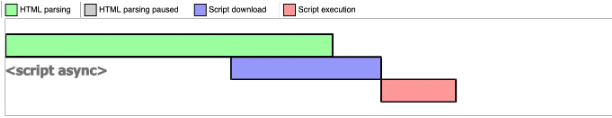

# 回流(重排)和重绘

> 重排和重绘是浏览器**关键渲染路径**上的两个节点， 浏览器的关键渲染路径就是 DOM 和 CSSOM 生成渲染树，然后根据渲染树通过一个布局(也叫 layout)步骤来确定页面上所有内容的大小和位置，确定布局后，将像素 绘制 (也叫 Paint)到屏幕上。
>
> **重排**就是当元素的位置发生变动的时候，浏览器重新执行布局这个步骤，来重新确定页面上内容的大小和位置，确定完之后就会进行重新绘制到屏幕上，所以重排一定会导致重绘。
>
> **重绘**：如果元素位置没有发生变动，仅仅只是样式发生变动，这个时候浏览器重新渲染的时候会跳过布局步骤，直接进入绘制步骤，这就是重绘，所以重绘不一定会导致重排

## 理解关键渲染路径

> **关键渲染路径**(**Critical Rendering Path**)是浏览器将 HTML，CSS 和 JavaScript 转换为屏幕上的像素所经历的步骤序列。优化关键渲染路径可提高渲染性能。

具体的浏览器解析渲染机制(**关键渲染路径**)如下所示：


1. 解析HTML，生成DOM树，解析CSS，生成CSSOM树
2. 浏览器引擎将DOM树和CSSOM树结合，生成渲染树(Render Tree)
3. Layout(回流):根据生成的渲染树，进行回流(Layout)，得到节点的几何信息（位置，大小）
4. Painting(重绘):根据渲染树以及回流得到的几何信息，得到节点的绝对像素
5. Display:将像素发送给GPU，展示在页面上

## 答案

- 重排(Reflow)：元素的 **位置发生变动** 时发生重排，也叫回流。**此时在 Layout 阶段，计算每一个元素在设备视口内的确切位置和大小。当一个元素位置发生变化时，其父元素及其后边的元素位置都可能发生变化，代价极高**。
- 重绘(Repaint): 元素的 **样式发生变动** ，但是位置没有改变。**此时在关键渲染路径中的 Paint 阶段，将渲染树中的每个节点转换成屏幕上的实际像素，这一步通常称为绘制或栅格化。**

#  JS 放在页面底部的原因？

> 1. 为了JS的**下载、解析、执行 **不阻塞 HTML的解析，造成页面白屏时间过长，影响用户体验
> 2. 为了浏览器正确构建DOM树，JS正确获取DOM的信息

JavaScript 的执行是在生成渲染树之前的。这也是为什么 **JavaScript 的加载、解析与执行会阻塞 DOM 的构建，阻塞页面的渲染。**

浏览器在解析 HTML 的时候，如果遇到一个没有任何属性的 script 标签，就会暂停解析，先发送网络请求获取该 JS 脚本的代码内容，然后让 JS 引擎执行该代码，当代码执行完毕后恢复解析。整个过程如下图所示：


因为 JavaScript 可以修改网页的内容，它可以更改 DOM，如果不阻塞，那么这边在构建 DOM，那边 JavaScript 在改 DOM，而且在 JS 中前一秒获取到的 DOM 和后一秒获取到的 DOM 不一样是什么鬼？它会产生一系列问题，所以 JS 是阻塞的，它会阻塞 DOM 的构建流程，所以在 JS 中无法获取 JS 后面的元素，因为 DOM 还没构建到那。**这也就是为什么我们需要把 js 放在页面底部的原因**，尽量保证 DOM 树生成完毕再去加载 JS。

## **CSS加载会造成阻塞吗**

> 先给出结论
>
> - `CSS`不会阻塞`DOM`解析，但会阻塞`DOM`渲染。
> - `CSS`不会阻塞JS文件下载，但会阻塞JS执行

**由于 JavaScript 是可操纵 DOM 和 CSS 样式 的,如果在修改这些元素属性同时渲染界面（即 JavaScript 线程和 UI 线程同时运行）,那么渲染线程前后获得的元素数据就可能不一致了。**

因此为了防止渲染出现不可预期的结果,浏览器设置 **「GUI 渲染线程与 JavaScript 引擎为互斥」**的关系

**有时候JS需要等到CSS的下载，这是为什么呢？**

其实这样做是有道理的，如果脚本的内容是获取元素的样式，宽高等`CSS`控制的属性，浏览器是需要计算的，也就是依赖于`CSS`。浏览器也无法感知脚本内容到底是什么，为避免样式获取，因而只好等前面所有的样式下载完后，再执行`JS`

**JS文件下载和CSS文件下载是并行的，有时候CSS文件很大，所以JS需要等待**

# 性能优化

基于以上的分析，简单的说几条性能优化的方式，自己可以去分析一下为什么这些方式可以做性能优化。

1. 减少 DOM 树渲染时间（譬如降低 HTML 层级、标签尽量语义化等等）
2. 减少 CSSOM 树渲染时间（降低选择器层级等等）
3. 减少 HTTP 请求次数及请求大小
4. 将 css 放在页面开始位置
5. 将 js 放在页面底部位置，并尽可能用 `defer` 或者 `async` 来确保 DOM 树生成完才会去加载 JS
6. 用 link 替代@import
7. 如果页面 css 较少，尽量使用内嵌式
8. 为了减少白屏时间，页面加载时先快速生成一个 DOM 树

## `defer` 和 `async` 的区别 ?

> 相同：两者都是**异步的加载(请求下载)外部JS文件，不会阻塞HTML解析**。
>
> 不同：
>
> 1. `async`脚本的**执行**可能会阻塞HTML的解析；`defer`脚本则不会。
> 2. `async`脚本的**执行**顺序可能不确定(依赖网络传输结果，谁先到执行谁)；`defer`脚本顺序执行
>
> 在`defer `和 `async `的`script`脚本中应避免出现操作DOM的代码

### async

> `async` 表示异步
>
> <u>`async`是在外部JS加载完成后，浏览器空闲时，` Load`事件触发前执行</u>，标记为`async`的脚本并不保证按照指定他们的先后顺序执行，该属性对于内联脚本无作用 (即没有**`src`**属性的脚本）

带`async`的脚本一定会在`load`事件之前执行，可能会在`DOMContentLoaded`之前或之后执行。当浏览器遇到带有 `async `属性的 `script `时，请求该脚本的网络请求是异步的，不会阻塞浏览器解析 HTML，但会有两种情况：

- 情况1：一旦JS脚本请求回来之后， 如果此时 HTML 还没有解析完，`async`脚本已经加载完了，那么 HTML 停止解析，先让 JS 引擎执行代码，执行完毕后再进行HTML解析，HTML解析完毕后触发`DOMContentLoaded`事件

  

- 情况2：如果在 JS 脚本请求回来之前，已经 HTML 解析完了，`async`脚本才加载完，那就啥事没有，立即执行 JS 代码，那么在HTML解析完毕、`async`脚本还没加载完的时候就触发`DOMContentLoaded`事件

  

所以 `async `是不可控的，因为执行时间不确定，你如果在异步 JS 脚本中获取某个 DOM 元素，有可能获取到也有可能获取不到。而且如果存在多个 `async `的时候，它们之间的执行顺序也不确定，完全依赖于网络传输结果，谁先到执行谁。

### defer

> `defer `表示延迟。
>
> <u>`defer`是在外部JS加载完成后，整个文档解析完成后，触发 `DOMContentLoaded` 事件前执行</u>，如果缺少 `src` 属性（即内嵌脚本），该属性不应被使用，因为这种情况下它不起作用

当浏览器遇到带有 `defer `属性的 `script `时，获取该脚本的网络请求也是异步的，不会阻塞浏览器解析 HTML，一旦网络请求回来之后，如果此时 HTML 还没有解析完，浏览器不会暂停解析并执行 JS 代码，而是等到HTML 解析完成后才会执行。而 `DOMContentLoaded` 只有在 `defer `脚本执行结束后才会被触发。

- 情况1：HTML还没解析完成时，defer脚本已经加载完毕，那么defer脚本将等待HTML解析完成后再执行。defer脚本执行完毕后触发`DOMContentLoaded`事件

  

- 情况2：HTML解析完成时，defer脚本还没加载完毕，那么defer脚本继续加载，加载完成后直接执行，执行完毕后触发`DOMContentLoaded`事件

| **script 标签**  | **JS 执行顺序**  | **是否阻塞解析 HTML**  |
| ---------------- | ---------------- | ---------------------- |
| `<script>`       | 在 HTML 中的顺序 | 阻塞                   |
| `<script async>` | 网络请求返回顺序 | 可能阻塞，也可能不阻塞 |
| `<script defer>` | 在 HTML 中的顺序 | 不阻塞                 |

## `DOMContentLoaded` 与 `load` 的区别 ?

- `DOMContentLoaded`事件触发时：**仅当DOM解析完成**后，不包括样式表，图片等资源。
- `onload ` 事件触发时,**页面上所有的 DOM,样式表,脚本,图片等资源都已加载完成**。

## 正确的性能优化思路

当你遇到一个性能问题的时候，绝对不是去网上找一些性能优化的方法，然后不管三七二十一，就整上去，这样大概率是没啥用的。

**第一件事情，一定是要先分析性能的瓶颈在哪里。**

**第一件事情，一定是要先分析性能的瓶颈在哪里。**

**第一件事情，一定是要先分析性能的瓶颈在哪里。**

比如你遇到了**首屏加载**的性能问题，你就要根据开发者工具，比如看 `network `是否是由于**资源体积太大导致请求慢，还是后端处理慢，还是资源太多了加载慢**。

如果这些都不是，可能是因为 渲染慢，再去分析 `performce `面板，看一下是 **JS 执行慢**，还是啥原因。

再比如你遇到了 webpack 的性能问题，比如**打包的资源太大**了，你要去解决这个问题，你也不应该直接去随便找几个优化的方法就开始整。

而是先应该通过 `webpack-bundle-analyzer` 插件去分析包大的原因是什么？

- 是依赖包太大了，没有做按需加载？
- 还是重复的打包了几个版本的相同依赖？
- 还是因为 `src `太大了，是否需要做个动态加载？
- 还是因为其他的，通过 `webpack-bundle-analyzer` 分析出来的组成内容去找问题。

**最后再总结一下，遇到问题应该先通过各种分析工具，找到出现性能瓶颈的原因，再根据这个原因去寻找对应的优化方式，要对症下药。**

# 如何减少回流

下面给出避免回流的经验：

- 如果想设定元素的样式，通过改变元素的 `class` 类名 (尽可能在 DOM 树的最里层)

  ```JS
  const container = document.getElementById('container')
  container.style.width = '100px'
  container.style.height = '200px'
  container.style.border = '10px solid red'
  container.style.color = 'red'
  ```

  使用类名去合并样式

  ```JS
  <style>
      .basic_style {
          width: 100px;
          height: 200px;
          border: 10px solid red;
          color: red;
      }
  </style>
  <script>
      const container = document.getElementById('container')
      container.classList.add('basic_style')
  </script>
  ```

- 应用元素的动画，使用 `position` 属性的 `fixed` 值或 `absolute` 值(如前文示例所提)

- 避免使用 `table` 布局，`table` 中每个元素的大小以及内容的改动，都会导致整个 `table` 的重新计算

- 避免设置多项内联样式

- 对于那些复杂的动画，对其设置 `position: fixed/absolute`，尽可能地使元素脱离文档流，从而减少对其他元素的影响

- 使用css3硬件加速，可以让`transform`、`opacity`、`filters`这些动画不会引起回流重绘

- 避免使用 CSS 的 `JavaScript` 表达式

- 使用 `translate` 替代 `top`

- 动画实现的速度的选择，**动画速度越快，回流次数越多 **，也可以选择使用 `requestAnimationFrame`

- CSS 选择符从右往左匹配查找，避免 DOM 深度过深

- 将频繁运行的动画变为图层，图层能够阻止该节点回流影响别的元素。比如对于 `video` 标签，浏览器会自动将该节点变为图层。

- **不要把 DOM 结点的属性值放在一个循环里当成循环里的变量 **

  ```js
  for(let i = 0; i < 1000; i++) {
      // 获取 offsetTop 会导致回流，因为需要去获取正确的值
      console.log(document.querySelector('.test').style.offsetTop)
  }
  ```

* 在使用 `JavaScript` 动态插入多个节点时, 可以使用`DocumentFragment`. 创建后一次插入. 就能避免多次的渲染性能

例如，多次修改一个把元素布局的时候，我们很可能会如下操作

```js
const el = document.getElementById('el')
for(let i=0;i<10;i++) {
    el.style.top  = el.offsetTop  + 10 + "px";
    el.style.left = el.offsetLeft + 10 + "px";
}
```

每次循环都需要获取多次`offset`属性，比较糟糕，可以使用变量的形式缓存起来，待计算完毕再提交给浏览器发出重计算请求

```js
// 缓存offsetLeft与offsetTop的值
const el = document.getElementById('el')
let offLeft = el.offsetLeft, offTop = el.offsetTop

// 在JS层面进行计算
for(let i=0;i<10;i++) {
  offLeft += 10
  offTop  += 10
}

// 一次性将计算结果应用到DOM上
el.style.left = offLeft + "px"
el.style.top = offTop  + "px"
```

我们还可以通过通过设置元素属性`display: none`，将其从页面上去掉，然后再进行后续操作，这些后续操作也不会触发回流与重绘，这个过程称为离线操作

```js
const container = document.getElementById('container')
container.style.width = '100px'
container.style.height = '200px'
container.style.border = '10px solid red'
container.style.color = 'red'
```

离线操作后

```js
let container = document.getElementById('container')
container.style.display = 'none'
container.style.width = '100px'
container.style.height = '200px'
container.style.border = '10px solid red'
container.style.color = 'red'
...（省略了许多类似的后续操作）
container.style.display = 'block'
```

