# HTTP三次握手与四次挥手

一个完整的HTTP是包含请求与响应的，所以需要通过TCP来创建连接通道

**一个TCP通道可以通过多个HTTP请求**

一般来讲需要通过三次握手来确认连接过程，规避因为网络原因从而产生的资源消耗，从而创建TCP连接

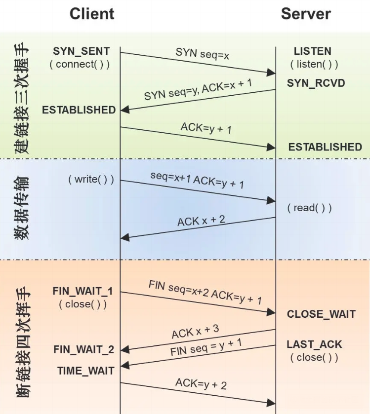

## TCP 头部结构

对于TCP三次握手和四次挥手，我们最主要的就是关注TCP头部的**序列号**、**确认号**以及几个**标记位**（`SYN/FIN/ACK/RST`）

* **序列号**：在初次建立连接的时候，客户端和服务端都会为「本次的连接」随机初始化一个序列号。（纵观整个TCP流程中，序列号可以用来解决网络包乱序的问题）
* **确认号**：该字段表示「接收端」告诉「发送端」对上一个数据包已经成功接收（确认号可以⽤来解决网络包丢失的问题）
* `SYN`：SYN为1时，表示希望**创建连接**。
* `ACK`：ACK为1时，**确认号**字段有效。
* `FIN`：FIN为1时，表示希望**断开连接**。
* `RST`：RST为1时，表示TCP**连接出现异常**，需要断开

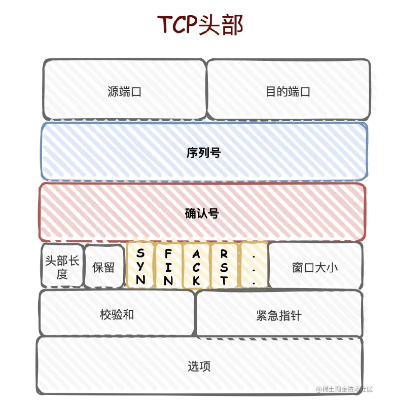

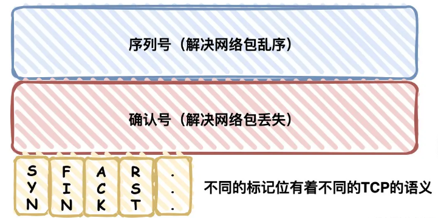

## 三次握手

> TCP三次握手的过程其实就是在确认通信双方（客户端和服务端）的序列号

### 大概过程

**第一次握手**：客户端会随机**初始化序号seq**（`client_isn`），将此序号置于 TCP 首部的「序号」字段中，同时**把 `SYN` 标志位置为 `1`** ，表示 `SYN` 报文。接着把第一个 SYN 报文发送给服务端，**表示向服务端发起连接**，该报文不包含应用层数据，之后客户端处于 `SYN-SENT` 状态。

**第二次握手**：服务端收到客户端的 `SYN` 报文后，首先服务端也随机**初始化自己的序号seq**（`server_isn`），将此序号填入 TCP 首部的「序号」字段中，其次把 TCP 首部的**「确认应答号」字段填入 `client_isn + 1`**, 接着**把 `SYN` 和 `ACK` 标志位置为 `1`**。最后把该报文发给客户端，该报文也不包含应用层数据，之后服务端处于 `SYN-RCVD` 状态。

**第三次握手**：客户端收到服务端报文后，还要向服务端回应最后一个应答报文，首先该应答报文 TCP 首部 **`ACK` 标志位置为 `1`** ，其次**「确认应答号」字段填入 `server_isn + 1`** ，最后把报文发送给服务端，**这次报文可以携带客户到服务器的数据**，之后客户端处于 `ESTABLISHED` 状态。

握手过程中传送的包里不包含数据，三次握手完毕后，客户端与服务器才正式开始传送数据。理想状态下，TCP连接一旦建立，在通信双方中的任何一方主动关闭连接之前，TCP 连接都将被一直保持下去。

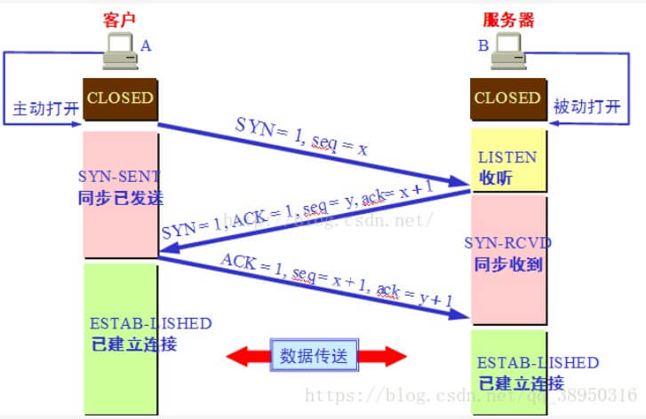

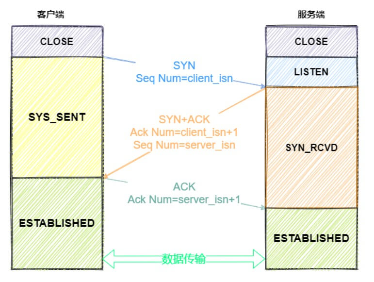

### 详细过程

1. 在最开始的时候，客户端处于`CLOSE` 状态，服务器主动监听某个端口，处于 `LISTEN` 状态

2. 客户端会**随机生成序列号**（一般叫做`client_isn`），并且把**标志位设置为SYN**（意味着要连接），然后把该报文发送给服务端，发送完**SYN报文**以后，自己便进入了 `SYN_SEND` 状态

   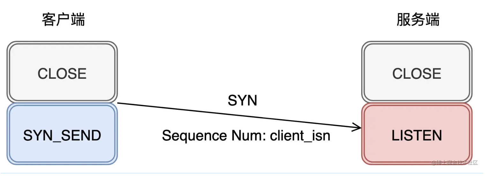

3. 服务端接收到了客户端的请求之后，自己也初始化对应的序列号（一般叫做 `server_isn`），在「**确认号**」字段里填上`client_isn + 1`（相当于告诉客户端，已经收到了发送过来的序列号了） ，并且把 `SYN` 和 `ACK` 标记位都点亮(置为1)，接着就把该报文发送给客户端，服务端的状态变成 `SYN_RECV` 状态

   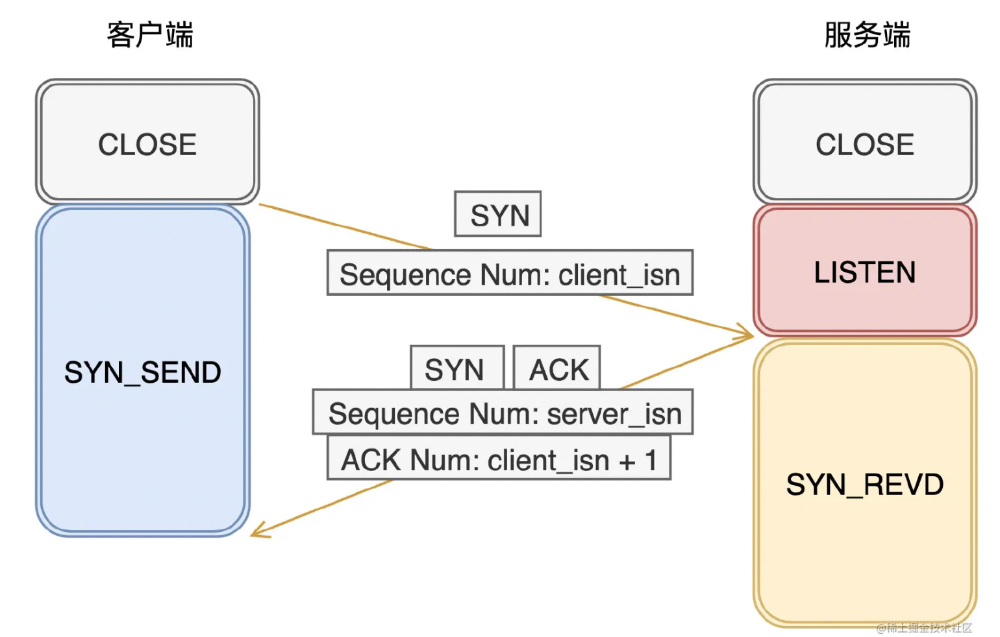

4. 客户端收到服务端发送的报文后，就知道服务端已经接收到了自己的序列号（通过「**确认号**」就可以知道），并且接收到了服务端的序列号(`server_isn`)。此时，客户端需要告诉服务端自己已经接收到了他发送过来的序列号，所以在「**确认号**」字段上填上`server_isn+1`，并且标记位 `ACK `为1，接着发送报文之后，进入 `ESTABLISHED` 状态，而服务端接收到客户端的报文之后，也进入 `ESTABLISHED` 状态

   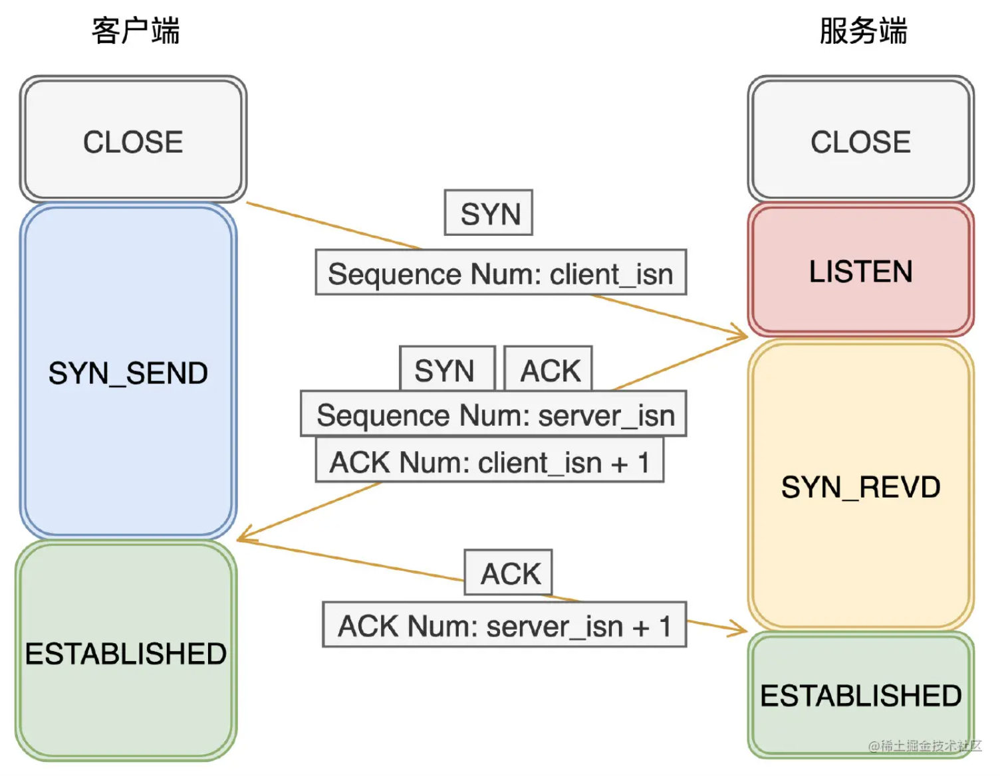

### 关于三次握手的其他问题

#### 1.可以改成两次握手吗？

不能！因为两次握手只能保证客户端的序列号成功被服务端接收，而服务端是无法确认自己的序列号是否被客户端成功接收。

#### 2.序列号为什么是随机的？

一方面为了安全性（随机ISN能避免非同一网络的攻击），另一方面可以让通信双方能够根据序号将「不属于」本连接的报文段丢弃

#### 3.建立连接的过程中出现丢包怎么办？

* 假设第一个包丢了，客户端发送给服务端的 SYN 包丢了（简而要之就是服务端没接收到客户端的SYN包）

  客户端迟迟收不到服务端的ACK包，那就会周期性超时重传，直到收到服务端的ACK

* 假设第二个包丢了，服务端发送的SYN+ACK包丢了（简而要之就是客户端没接收到服务端的SYN+ACK包）

  服务端迟迟收不到客户端的ACK包，那就会周期性超时重传，直到收到客户端的ACK

* 假设第三个包丢了（ACK包），客户端发送完第三个包后单方面进入了 `ESTABLISHED` 状态，而服务端也认为此时连接是正常的，但第三个包没到达服务端。

  1. 如果此时客户端与服务端**都还没数据发送**，那服务端会认为自己发送的SYN+ACK的包没发送至客户端，所以会超时重传自己的SYN+ACK包
  2. 如果这时候**客户端已经要发送数据了**，服务端接收到了ACK + Data数据包，那自然就切换到 `ESTABLISHED` 状态下，并且接收客户端的Data数据包
  3. 如果此时**服务端要发送数据了**，但发送不了，会一直周期性超时重传SYN + ACK，直到接收到客户端的ACK包

#### 4.三次握手过程中可以携带数据吗

第一次、第二次握手不可以携带数据，而第三次握手是可以携带数据的。

为什么这样呢？大家可以想一个问题，假如第一次握手可以携带数据的话，如果有人要恶意攻击服务器，那他每次都在第一次握手中的 SYN 报文中放入大量的数据，因为攻击者根本就不理服务器的接收、发送能力是否正常，然后疯狂着重复发 SYN 报文的话，这会让服务器花费很多时间、内存空间来接收这些报文。也就是说，第一次握手可以放数据的话，其中一个简单的原因就是会让服务器更加容易受到攻击了。

而对于第三次的话，此时客户端已经处于 `established` 状态，也就是说，对于客户端来说，他已经建立起连接了，并且也已经知道服务器的接收、发送能力是正常的了，所以能携带数据也没什么问题。

## 四次挥手

与建立连接的“三次握手”类似，断开一个TCP连接则需要“四次握手”。

### 大概过程

**第一次挥手**：客户端打算关闭连接，此时会发送一个 TCP 首部 **`FIN` 标志位被置为 `1`** 的报文，也即 `FIN` 报文，之后客户端进入 `FIN_WAIT_1` 状态。

**第二次挥手**：服务端收到该报文后，就向客户端发送 **`ACK` 应答报文**，接着服务端进入 `CLOSED_WAIT` 状态

**第三次挥手**：客户端收到服务端的 `ACK` 应答报文后，之后进入 `FIN_WAIT_2` 状态。等待服务端处理完数据后，也向客户端发送 `FIN` 报文，之后服务端进入 `LAST_ACK` 状态。

**第四次挥手**：客户端收到服务端的 `FIN` 报文后，回一个 `ACK` 应答报文，之后进入 `TIME_WAIT` 状态。服务器收到了 `ACK` 应答报文后，就进入了 `CLOSED` 状态，至此服务端已经完成连接的关闭。客户端在经过 `2MSL` 一段时间后，自动进入 `CLOSED` 状态，至此客户端也完成连接的关闭。

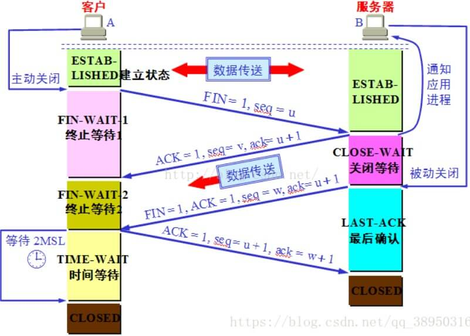

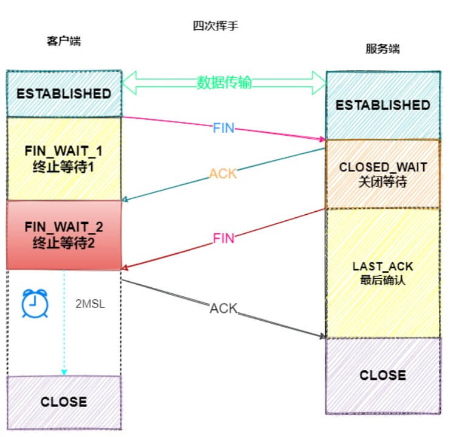

### 详细过程

1. 客户端打算关闭连接，会发 `FIN` 报文给服务端（其实就是把 **标志位 `FIN`** 点亮），客户端发送完之后，就进入`FIN_WAIT_1`状态

2. 服务端收到 `FIN` 报文之后，回复 `ACK` 报文给客户端（**表示已经收到了**），服务端发送完之后，就进入 `CLOSE_WAIT` 状态

3. 客户端接收到服务端的 `ACK` 报文，就进入了 `FIN_WAIT_2` 状态

   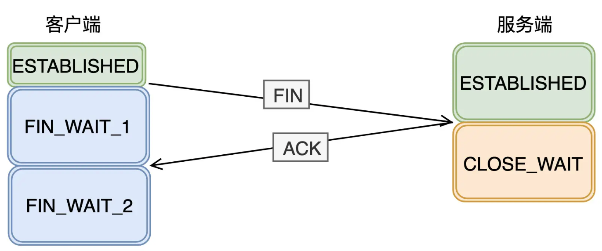

4. 这时候，服务器可能还有数据要发送给客户端，等服务端确认自己已经没有数据返回给客户端之后，就发送`FIN`报文给客户端了，自己进入 `LAST_ACK` 状态

5. 客户端收到服务端的`FIN`报文之后，回应`ACK`报文，自己进入 `TIME_WAIT` 状态

6. 服务端收到客户端的`ACK`报文之后，服务端就进入 `CLOSE` 状态

7. 客户端在`TIME_WAIT`等到`2MSL`，也进入了 `CLOSE` 状态

   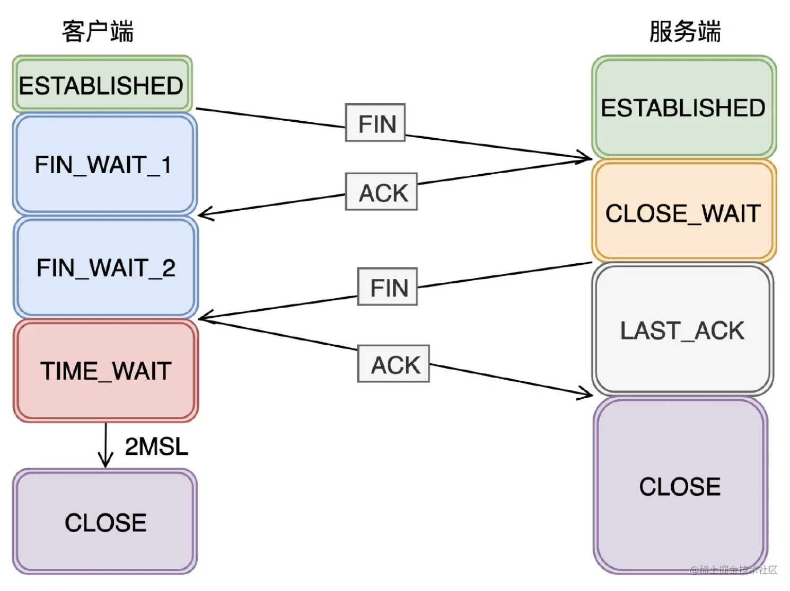

### 关于四次挥手的其他问题

#### 1. 为什么要四次挥手？

因为当客户端第一次发送 `FIN` 报文之后，只是代表着客户端不再发送数据给服务端，但此时客户端还是有接收数据的能力的。而服务端收到`FIN`报文的时候，可能还有数据要传输给客户端，所以只能先回复 `ACK`给客户端。等到服务端不再有数据发送给客户端时，才发送 `FIN` 报文给客户端，表示可以关闭了。

#### 2.TIME_WAIT 状态有什么作用(等待 2MSL)？

1. 原因一：保证最后的 ACK 报文 「接收方」一定能收到（如果收不到，对方会 重发 FIN 报文）
2. 原因二：确保在创建新连接时，先前网络中残余的数据都丢失了

#### 3.TIME_WAIT 状态多过会有什么危害？怎么解决呢？

从流程上看， TIME_WAIT 状态 只会出现在 主动发起 关闭连接的一方。危害就是会占用内存资源和端口呗（毕竟在等待嘛），解决的话，有Linux参数可以设置，具体忘了额。

#### 4.为什么客户端在TIME-WAIT阶段要等2MSL？

为的是确认服务器端是否收到客户端发出的 ACK 确认报文，当客户端发出最后的 ACK 确认报文时，并不能确定服务器端能够收到该段报文。

2MSL**最大报文段生存的时间**

