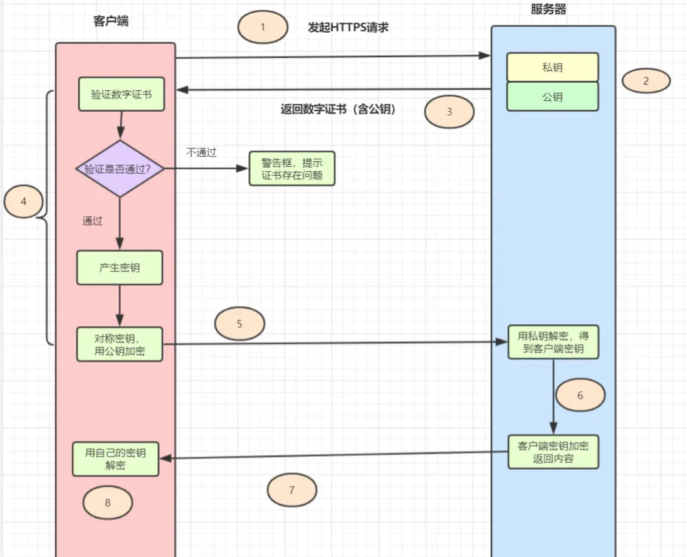

## HTTPS

HTTPS是以安全为目标的 HTTP 通道，是 HTTP 的安全版。HTTPS 的安全基础是 SSL。SSL 协议位于 TCP/IP 协议与各种应用层协议之间，为数据通讯提供安全支持。

**SSL 协议可分为两层：**

- SSL 记录协议（SSL Record Protocol），它建立在可靠的传输协议（如TCP）之上，为高层协议提供数据封装、压缩、加密等基本功能的支持。
- SSL 握手协议（SSL Handshake Protocol），它建立在 SSL 记录协议之上，用于在实际的数据传输开始前，通讯双方进行身份认证、协商加密算法、交换加密密钥等。

### **HTTPS的优点**

- 使用 HTTPS 协议可认证用户和服务器，确保数据发送到正确的客户机和服务器。
- HTTPS 协议是由SSL+HTTP 协议构建的可进行加密传输、身份认证的网络协议，要比 HTTP 协议安全，可防止数据在传输过程中不被窃取、修改，确保数据的完整性。
- HTTPS 是现行架构下最安全的解决方案，虽然不是绝对安全，但它大幅增加了中间人攻击的成本。

### **HTTPS的缺点**

- HTTPS 协议握手阶段比较费时，会使页面的加载时间延长近。
- HTTPS 连接缓存不如 HTTP 高效，会增加数据开销，甚至已有的安全措施也会因此而受到影响。
- HTTPS 协议的安全是有范围的，在黑客攻击、拒绝服务攻击和服务器劫持等方面几乎起不到什么作用。
- SSL 证书通常需要绑定 IP，不能在同一 IP 上绑定多个域名，IPv4 资源不可能支撑这个消耗。
- 部署 HTTPS 后，因为 HTTPS 协议的工作要增加额外的计算资源消耗，例如 SSL 协议加密算法和 SSL 交互次数将占用一定的计算资源和服务器成本。
- HTTPS 协议的加密范围也比较有限。最关键的，SSL 证书的信用链体系并不安全，特别是在某些国家可以控制 CA 根证书的情况下，中间人攻击一样可行。

## **HTTPS：让数据传输更安全**

- 在 TCP 和 HTTP 之间插入一个安全层，所有经过安全层的数据都会被加密或者解密；
- 对称加密：浏览器发送加密套件列表和一个随机数 client-random，服务器会从加密套件中选取一个加密套件，然后生成一个随机数 service-random，返回给浏览器。这样浏览器和服务器都有相同 client-random 和 service-random，再用相同的方法将两者混合生成一个密钥 master secret，双方就可以进行数据加密传输了；
- 对称加密缺点：client-random 和 service-random 的过程都是明文，黑客可以拿到协商的加密套件和双方随机数，生成密钥，数据可以被破解；
- 非对称加密：浏览器发送加密套件列表给服务器，服务器选择一个加密套件，返回加密套件和公钥，浏览器用公钥加密数据，服务器用私钥解密；
- 非对称加密缺点：加密效率太低，不能保证服务器发送给浏览器的数据安全，黑客可以获取公钥；
- 对称加密结合非对称加密：浏览器发送对称加密套件列表、非对称加密列表和随机数 client-random 给服务器，服务器生成随机数 service-random，选择加密套件和公钥返回给浏览器，浏览器利用 client-random 和 service-random 计算出 pre-master，然后利用公钥给 pre-master 加密，向服务器发送加密后的数据，服务器用私钥解密出 pre-master 数据，结合 client-random 和 service-random 生成对称密钥，使用对称密钥传输加密数据；
- 引入数字证书是为了证明“我就是我”，防止 DNS 被劫持，伪造服务器；
- 证书的作用：一个是向浏览器证明服务器的身份，另一个是包含服务器公钥；
- 数字签名过程：CA 使用 Hash 函数技术明文信息，得出信息摘要，然后 CA 使用私钥对信息摘要进行加密，加密后的秘文就是数字签名；
- 验证数字签名：读取证书明文信息，使用相同 Hash 函数计算得到信息摘要 A，再利用 CA 的公钥解密得到 B，对比 A 和 B，如果一致，则确认证书合法；

## 一次完整https的请求流程

1. 客户端发起https请求
2. 服务器必须要有一套数字证书，可以自己制作，也可以向权威机构申请。这套证书其实就是一对公私钥。
3. 服务器将自己的数字证书（含有公钥、证书的颁发机构等）发送给客户端。
4. 客户端收到服务器端的数字证书之后，会对其进行验证，主要验证公钥是否有效，比如颁发机构，过期时间等等。如果不通过，则弹出警告框。如果证书没问题，则生成一个密钥（对称加密算法的密钥，其实是一个随机值），并且用证书的公钥对这个随机值加密。
5. 客户端会发起https中的第二个请求，将加密之后的客户端密钥(随机值)发送给服务器。
6. 服务器接收到客户端发来的密钥之后，会用自己的私钥对其进行非对称解密，解密之后得到客户端密钥，然后用客户端密钥对返回数据进行对称加密，这样数据就变成了密文。
7. 服务器将加密后的密文返回给客户端。
8. 客户端收到服务器发返回的密文，用自己的密钥（客户端密钥）对其进行对称解密，得到服务器返回的数据。

## HTTPS与HTTP的区别

- HTTP 是超文本传输协议，信息是明文传输，HTTPS 则是具有安全性的 SSL 加密传输协议。
- HTTP与HTTPS的连接方式不同，端口也不同，HTTP端口用的是80，HTTPS端口用的是443。
- HTTP 的连接很简单，是无状态的。HTTPS 协议是由 SSL+HTTP 协议构建的可进行加密传输、身份认证的网络协议，比 HTTP 协议安全。(无状态的意思是其数据包的发送、传输和接收都是相互独立的。无连接的意思是指通信双方都不长久的维持对方的任何信息。)
- HTTPS协议需要申请证书，一般免费的证书很少。

