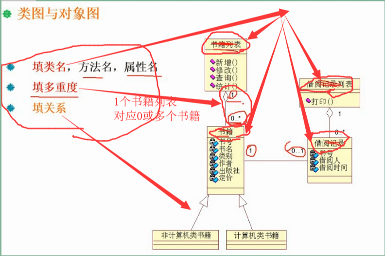
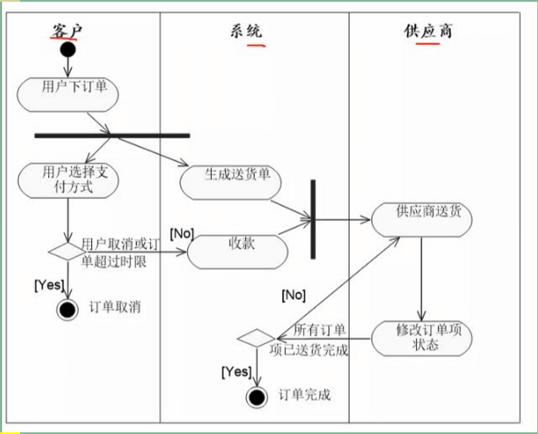
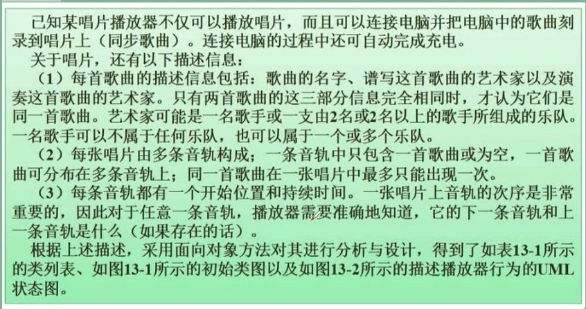
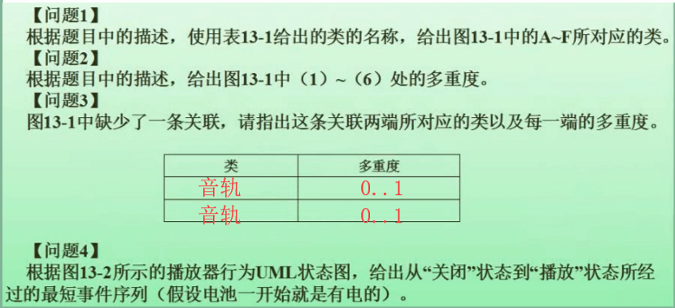
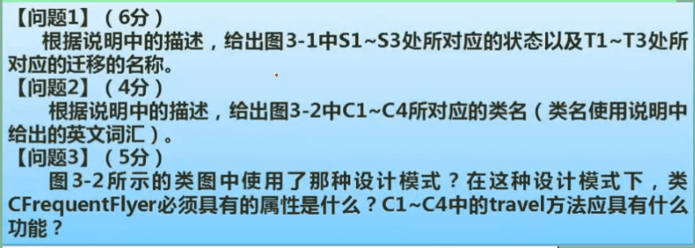
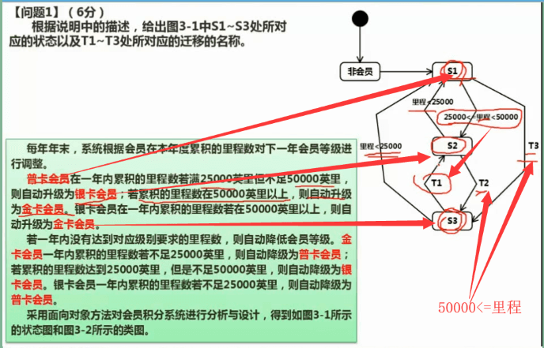
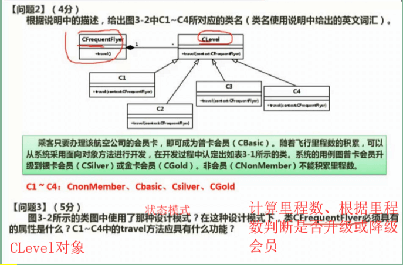

- UML类图统称不用于对 对象快照 进行建模

- 伪传递规则：若X→Y在R上成立，且WY→Z，则XW→Z。

- π是投影运算，选出某个表中的若干列

  σ是选择运算，选出满足某些条件的行

  ▷◁是自然连接。等值连接去掉重复的行后就是啦。这里去掉一个B一个C

* UML的5大系统视图：

  逻辑视图(设计视图)：在架构方面有重要意义，即类、子系统、包、用例实现的子集

  进程视图：可执行线程和进程作为活动类的建模，描述了并发和同步结构

  部署视图：表示软件到硬件的映射和分布结构。

  用例视图：其是最基本的需求分析模型


> 题：包含8个成员的开发小组的沟通路径最多(即任意两人有沟通路径)有多少条？

**解析：**

```
如果项目有n个工作人员，则有n×（n -1）/ 2个相互沟通的路径。
8×7/2=28。
```

### 计算环形复杂度

1. 流图中的区域数等于环形复杂度。
2. 流图G的环形复杂度`V(G)=E-N+2`，其中，**E是流图中边的条数**，**N是结点数**。
3. 流图G的环形复杂度`V(G)=P+1`，其中，P是流图中判定结点的数目

### UML图

> UML中：同步消息是实线黑色箭头、异步消息实线线条箭头

#### 类图

> 给出了系统的静态设计视图，活动类的类图给出了系统的静态进程视图

**考填类名，方法名，属性名**、**填多重度**、**填关系**




##### 类与类之间的关系

- **依赖关系**：一个元素的修改引起另一个元素的变化。**带纯黑箭头的虚线**
- **泛化关系**：继承关系是泛化关系的反关系，**子类从父类继承，而父类是子类的泛化**。**空心箭头的实线指向父类**。另外：子类中除了有与父类一致的信息外，还包括额外的信息。可以使用父类实例的地方，也可使用子类实例
- **聚合关系**：是传递和反对称。如一辆轿车有四个轮子。有**不同的生命周期**。带空心菱形的实线，指向代表整体的类
- **组合关系**：**同生命周期**，如公司和部门关系。**带实心菱形的实线**
- **实现关系**：将说明和实现联系起来。接口是对行为而非实现的说明，类中包含了实现的结构，一个类或多个类可以实现一个接口，而每个类分别实现接口中的操作。**空心箭头的虚线**


#### 对象图

> 描述一组对象及它们之间的关系，从真实案例或原型案例的角度建立的。

#### 构件图

> 描述一个封装的类和它的接口、端口及内嵌的构件和连接件构成的内部结构。用于表示系统的静态设计实现视图

#### 组合结构图

> 描述结构化类(如构件或类)的内部结构
>
> 结构图的成分包括：模块、调用、控制

#### 用例图

> 描述一组用例、参与者及它们之间的关系

**考参与者、用例**

**包含关系和扩展关系的区别：包含是必须的，扩展不是必须的**


#### 顺序图

> 一种交互图，由一组对象或参与者以及它们之间可能发送的消息构成。

**填对象名、消息名(选词填空)**


#### 通信图(协作图)

> 描述对象之间的交互，交互对象之间的链接关系，反映了系统的动态和静态特征


#### 活动图

> 类似程序流程图



#### 状态图(也称动态图)

> 填触发事件


### 案例分析

第1题：






第2题：






