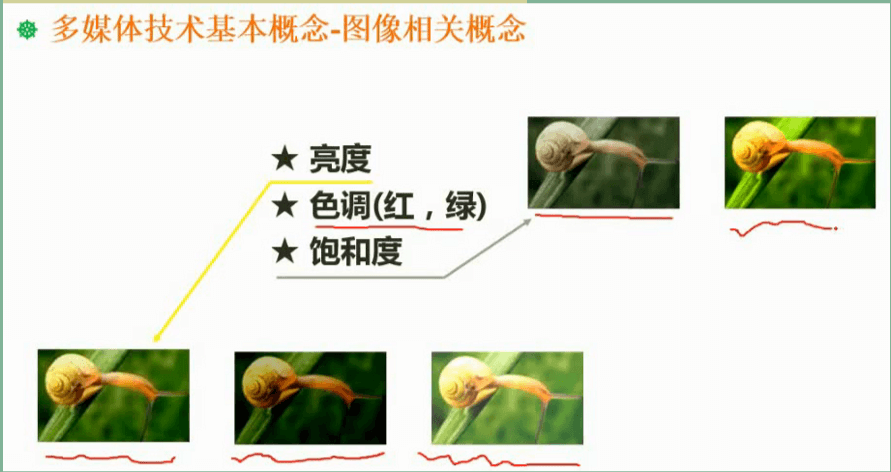
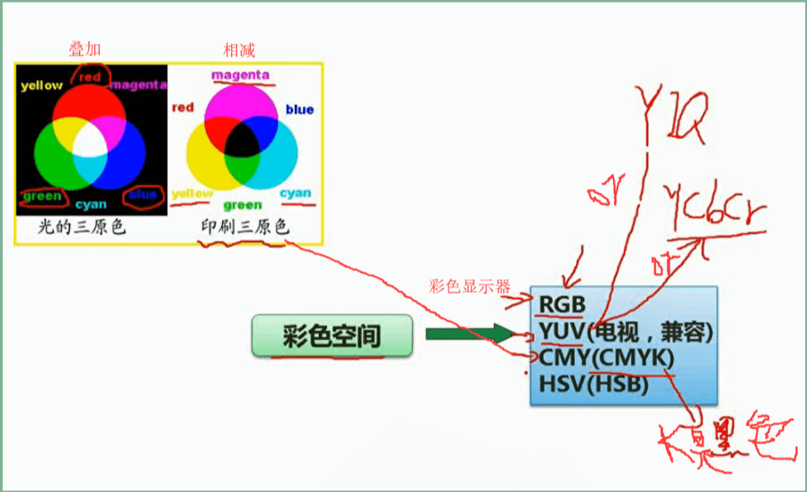
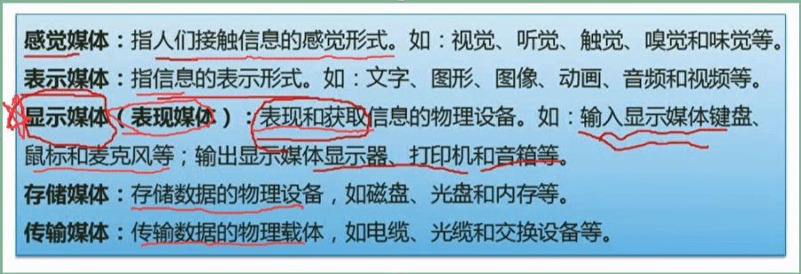
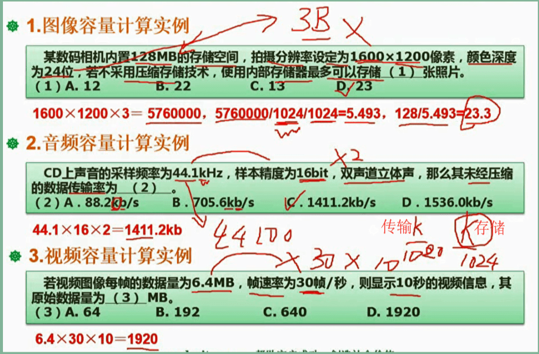
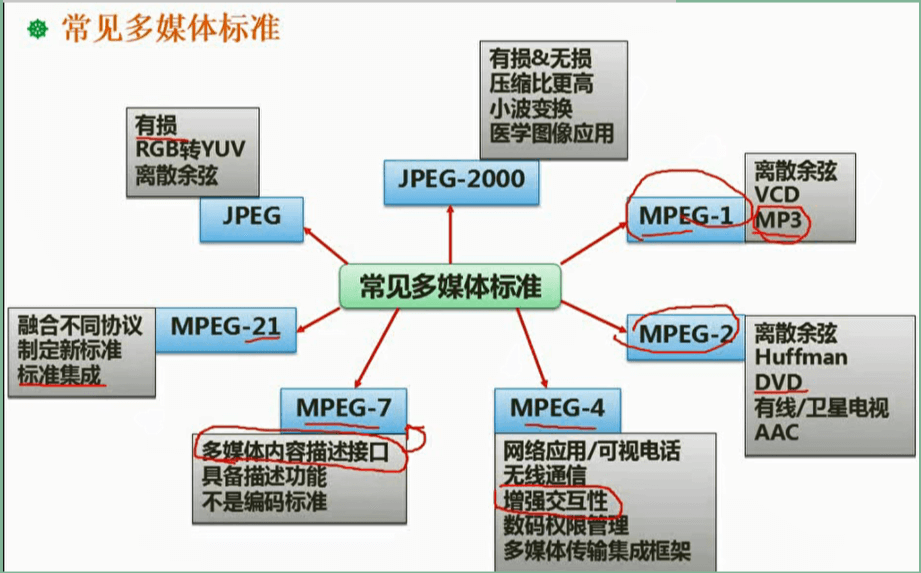
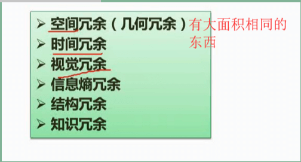

**数字图像的冗余**：

1. **空间冗余**：图像内部**相邻像素之间**存在较强的相关性所造成的冗余。

2. **时间冗余**：视频图像序列中的**不同帧之间**的相关性所造成的冗余。

3. **视觉冗余**：指人眼不能感知或不敏感的那部分图像信息。

4. **信息熵冗余**(编码冗余)：图像中平均**每个像素使用的比特数大于该图像的信息熵**，则图像中存在冗信息熵余。

5. **结构冗余**：指图像中存在很强的**纹理结构**或**自相似性**

6. **知识冗余**：指在有些图像中还包含**与某些先验知识有关**的信息。

**音频相关概念**：

**图像相关概念：**

* **矢量化图形**：保存最少的信息，文件大小比位图小，并且文件大小于物体的大小无关。

* **位图**：用像素点，可直接、快速地在屏幕上显示出来，占用存储空间较大，一般需要进行数据压缩点距越小，分辨率越高

**每个像素有16位颜色位，可表示2^16种不同的颜色**

用油墨或颜料进行混合得到的彩色称为相减混色，三基色：青、红、黄，这三种颜色混合成不同颜色，称为CMY彩色空间。 

### 媒体的种类

### 多媒体计算问题

### 常见多媒体标准

MPEG-1、MPEG-2、MPEG-4主要针对音、视频编码技术。

MPEG-1：VCD、mp3使用其作为音、视频信息压缩编码。

MPEG-2：DVD

MPEG-7：多媒体内容描述接口标准

MPEG-21：多媒体应用框架标准，不包括音、视频压缩编码技术

数据压缩技术基础：

有损压缩和无损压缩：

