* **TCP与UDP区别**

  > 1、TCP面向连接（如打电话要先拨号建立连接）;UDP是无连接的，即发送数据之前不需要建立连接；
  >
  > 2、TCP提供可靠的服务。也就是说，通过TCP连接传送的数据，无差错，不丢失，不重复，且按序到达;UDP尽最大努力交付，即不保证可靠交付；
  >
  > 3、TCP面向字节流，实际上是TCP把数据看成一连串无结构的字节流;UDP是面向报文的；UDP没有拥塞控制，因此网络出现拥塞不会使源主机的发送速率降低（对实时应用很有用，如IP电话，实时视频会议等）；
  >
  > 4、每一条TCP连接只能是点到点的;UDP支持一对一，一对多，多对一和多对多的交互通信；
  >
  > 5、TCP首部开销20字节;UDP的首部开销小，只有8个字节；
  >
  > 6、TCP的逻辑通信信道是全双工的可靠信道，UDP则是不可靠信道，整体来看UDP开销较小.

* 交换机三种交换模式：有存储转发、快速转发、碎片丢弃。

* 中继器：适用于完全相同的两类网络的互连，主要功能是通过对数据信号的接收、放大、整形和转发，扩大网络传输的距离

* 集线器：所有结点共享一个冲突域

* 网桥

  > 连接两个MAC层协议相同的网络，根据帧的物理地址进行网络间信息转发，可缓解网络通信繁忙度，提高效率

  透明网桥：混杂方式，易安装，但网络资源的利用不充分，一般用在总线网中。

  源路由选择网桥：一般用在令牌环网中

* 二层交换机：根据MAC地址进行数据的转发，将这些MAC地址与对应的端口记录在自己内部的一个地址表中

* 光纤

  > 单模光纤：窄芯线，用激光，耗散极小。高速度、长距离，成本高
  >
  > 多模光纤：宽芯线，LED作光源，短距离，速度低，耗散大，价格低

* 网络命令

  > Ping：测试本机能否跟外部指定主机连接
  >
  > tracert:跟踪路由，查出路径上哪段路由出现了连接故障。
  >
  > netstat:查看本机各端口的连接情况，是一个监控TCP/IP网络的非常有用的工具，可以显示路由表、实际的网络连接以及每一个网络接口设备的状态信息。
  >
  > arp:查看和修改本机主机上的arp表项，常用于查看arp缓存及解决IP地址解释故障
  >
  > route Print：查看路由表命令
  >
  > Nslookup：用于查询Internet域名信息或诊断DNS服务器问题的工具，通常需要一台域名服务器来提供域名服务

* 私有地址：`10.0.0.0~10.255.255.255`、`172.16.0.0~172.31.255.255`、 `192.168.0.0~192.168.255.255`
* 预留的组播地址：`224.0.0.0~239.255.255.255`

* **快速以太网**

  > 100Base-TX：5类非屏蔽双绞线/1，2类STP
  >
  > 100Base-FX：62.5/125多模光纤
  >
  > 100Base-T4：3类非屏蔽双绞线

* **安全防护策略**（软件系统对抗攻击）：安全日志、入侵检测、隔离防护、漏洞扫描

### 网络层协议与端口

- FTP：文件传输协议
- SMTP：简单邮件传输协议
- SNMP：简单网络管理协议，为了解决Internet上的路由器管理问题而提出的

- 21和20端口：FTP服务
- 23端口：Telnet服务
- 25端口：SMTP服务
- 110端口：POP3服务

### OSI网络管理5大功能:

> 配置管理、故障管理、性能管理、安全管理、计费管理

### 病毒类型

1. **引导型**病毒:改写磁盘上引导扇区的内容
2. **文件型**病毒：感染文件扩展名位COM\EXE\OVL等可执行程序
3. **混合型**病毒：综合引导型和文件型病毒的特性。
4. **宏**病毒：一种脚本病毒，寄存在文档或模板的宏中的计算机病毒，感染文件主要有Word、Excel等，病毒前缀Macro
5. **蠕虫**病毒：是无须计算机使用者干预即可运行的独立程序，它通过不停的获得网络中存在漏洞的计算机上的部分或全部控制权来进行传播。

### OSI七层模型

**ARP表**：用于缓存设备的IP地址与MAC地址的对应关系。

**好处**：限制网络广播的数量

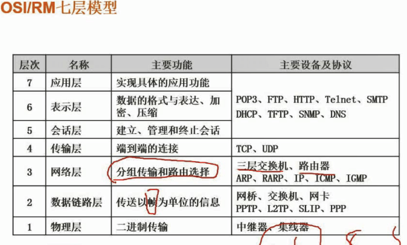

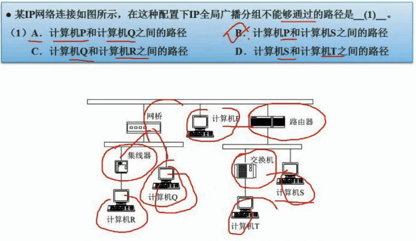

### 网络技术标准与协议

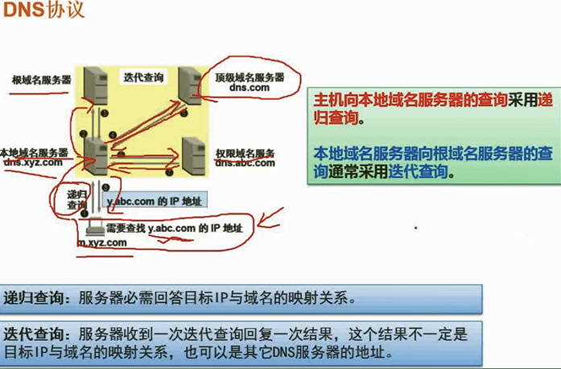

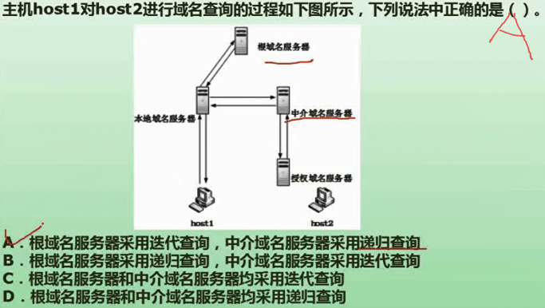

### 网络类型与拓扑结构

### 网络规划与设计

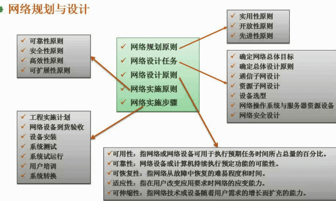

### 分层设计

#### 物理网设计

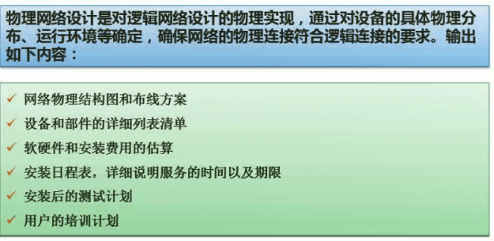

#### 逻辑网设计

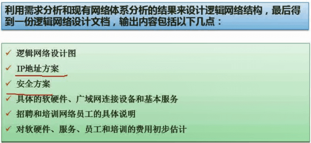

###  IP地址与子网划分

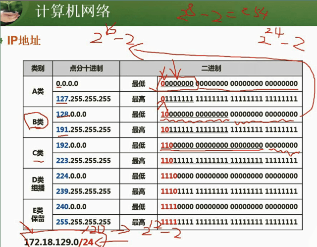

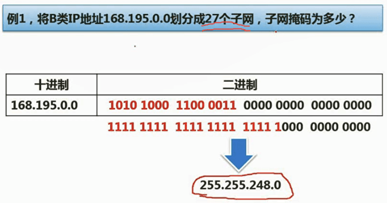

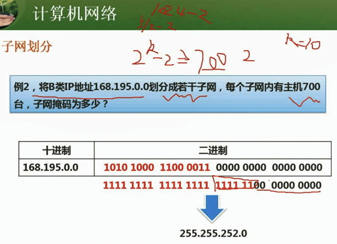

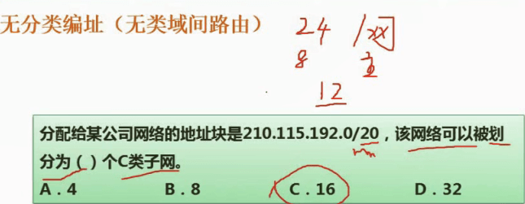

#### 特殊含义IP地址

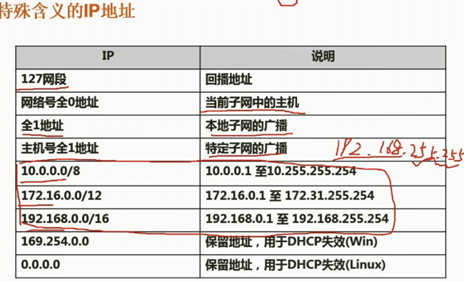

### 无线网

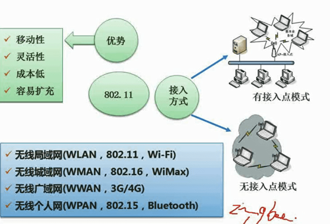

### 网络接入技术

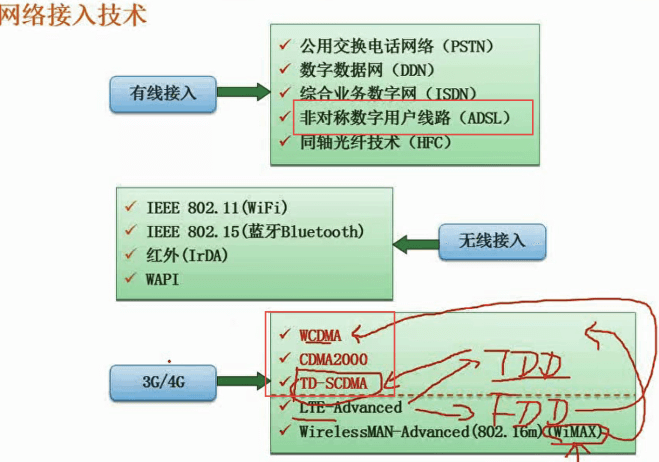

### IPv6

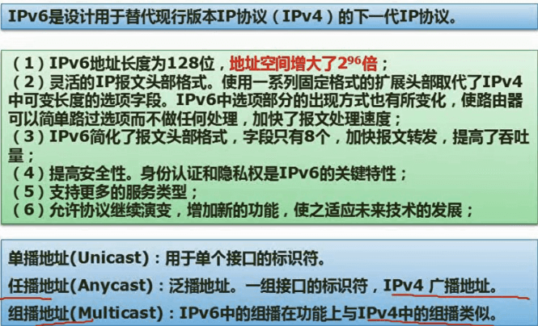

### 信息系统安全属性

### 对称加密与非对称加密(重点)

* **对称加密(私钥加密)**：文件加密和解密使用相同的密钥。

  > **优点**：使用简单、加密解密快捷快效，适合大容量数据。
  >
  > **缺点**：加密强度不够、密钥分发困难。

* **非对称加密(公钥加密)**：密钥成对出现，一个公钥一个私钥。

  > **优点**：解决私钥加密强度不够和密钥分发困难的问题。
  >
  > **缺点**：加密速度极慢，用于对极小的数据量进行加密，如信息摘要，加密对称密钥。

PGP：基于RSA公钥加密体系的邮件加密协议

SET：安全电子交易，增加了对商家身份的认证

TLS：安全传输层协议，用于在两个通信应用程序之间提供保密性和数据完整性。

**SSL的作用**：1.用户和服务器的合法性认证 2.加密数据以隐藏被传送的数据 3.保护数据的完整性

 

everyone:即所有的用户，默认权限最低

Users：普通用户组，是最安全的组。不允许成员修改操作系统的设置或用户资料

power users：高级用户组，权限仅次于Administrators

Administrators:管理员组

**网络攻击:**

* 被动攻击：
  1. 监听：只是获取通信双方的通信信息

* 主动攻击：
  1. 中断：阻隔源站向目的站点之间的通信，达到攻击目的
  2. 伪造：源站点并未向目的站点发送信息
  3. 篡改：先获取源站点的信息，将信息进行修改

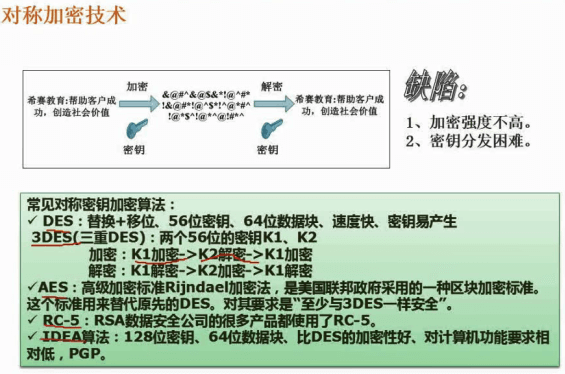

**非对称加密适合小容量数据**

**数字信封技术**：发送方**采用对称密钥**来加密信息内容，再将此对称密钥**用接收方的公开密钥**来加密(这部分称为数字信封)之后，将它和加密后的信息一起发送给接收方。

**信息摘要**：MD5(128)、SHA (160)被截获，**第三方无法篡改**

**数字签名**：发送方不可抵赖。该技术使用**非对称加密**技术，通常定义2种互补运算，一个**用于签名**、另一个**用于验证**。(**信息摘要**)发送者A的**私钥加密** --------> 接收者用发送者A的**公钥进行解密**

**数字整数与PGP：**

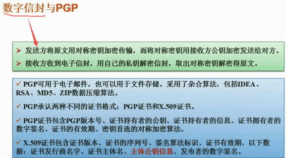

**各个网络层次的安全保障：**

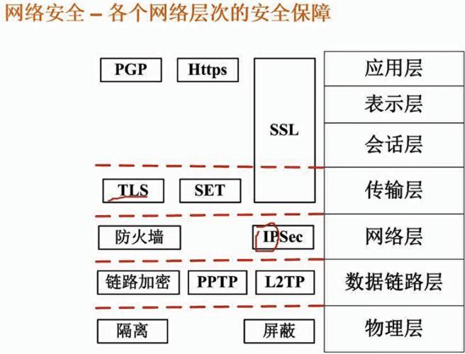

**网络威胁与攻击：**

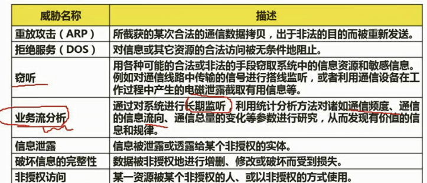

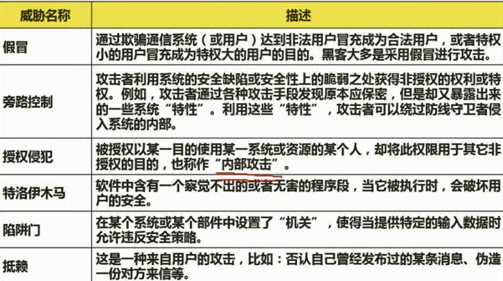

### 防火墙

