## 考点

> 数据的表示、计算机结构、Flynn分类法、CISC与RISC、流水线技术、存储系统、总线系统、可靠性、 

* **循环冗余采用模2运算来构造检验位**。

- **STD总线**是一种规模小，面向工业控制的8位系统总线，支持多处理器系统，支持多个CPU模板。
- **交叉开关**将各个CPU连接成动态互连网络，组成多处理机系统。
- **PCI总线**用于将显卡、声卡、网卡、硬盘控制器等高速外围设备直接挂在CPU总线上。
- **集群系统**是一种<u>多处理机系统</u>，一般使用局域网将一组高性能工作站或者高档PC按一定结构连接起来。
- **Centronic总线**属于外部总线，它的接口是一种打印机并行接口标准，用于将计算机与打印机等外设相连接。

* **I/O设备与CPU之间数据传送控制方式4种**：
  1. 程序直接控制方式和中断控制方式只适用于简单、外设很少的计算机系统
  2. DMA方式和通道方式：采用<u>外设与内存直接交换数据</u>的方式。
  3. **程序直接控制方式**：耗费大量CPU时间，无法检测发现设备的错误，只能串行工作。
  4. **中断控制方式**：中断次数较多，耗费CPU时间，并行操作的设备受中断处理时间限制，中断次数增多导致数据丢失。
  5. **DMA方式**：要求CPU执行**设备驱动程序**来启动设备
  6. **通道方式**：在CPU发出I/O启动命令之后，由**通道指令**来完成这些工作。 
* **字长**：同一时间中CPU处理二进制数的位数叫字长
* **数据总线**：即字长的二进制的位数
* **地址总线**：其多少**确定内存容量的大小**，如34位的地址总线允许 **2^34^** 的内存容量，即16GB
* **以科学为主的计算机**：对主机的运算速度要求很高
* **以大型数据库处理为主的计算机**：对内存容量、存取速度、外存储器的读写速度要求高
* **对用作网络传输的计算机**：要求很高的I/O速度
* **运算器**：负责**算术**、**逻辑运算**功能，由ALU、数据缓冲寄存器、累加寄存器、多路转换器、数据总线、状态条件寄存器
  * **累加器**：存放算术或逻辑运算的一个操作数和运算结果
  * **数据寄存器**：保存操作数和运算结果，为了节省读取操作数所需占用总线和访问存储器的时间

* **控制器**：**分析和执行指令**的部件，各个部件按时序协调操作，由程序计数器、指令寄存器、指令编译码、时序发生器、微操作信号发生器
  * **程序计数器**:用于存放下一条指令所在单元的地址的地方

* **地址寄存器**：保存当前CPU所访问的内存单元的地址

## 一、数据表示

### 进制转换

#### 1. R进制转十进制：按权展开法

> 如二进制`10100.01=1*2^4+1*2^2+1*2^-2`. 整数位从0开始，小数位从-1开始
>
> 同样七进制`604.01=6*7^2+4*7^0+1*7^-2`。

#### 2. 十进制转R进制：短除法

#### 3. 二进制转八进制与十六进制数：分3段与4段

原码、反码、补码、移码(一般用在浮点运算中的阶码)：

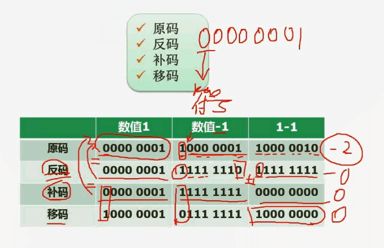

### 原码、反码、补码表示的范围

> **各类运算采用补码进行**：
>
> 1. 为了使符号位能与有效值部分一起参加运算，简化运算部件的设计。
> 2. 为了使减法运算转换为加法运算。

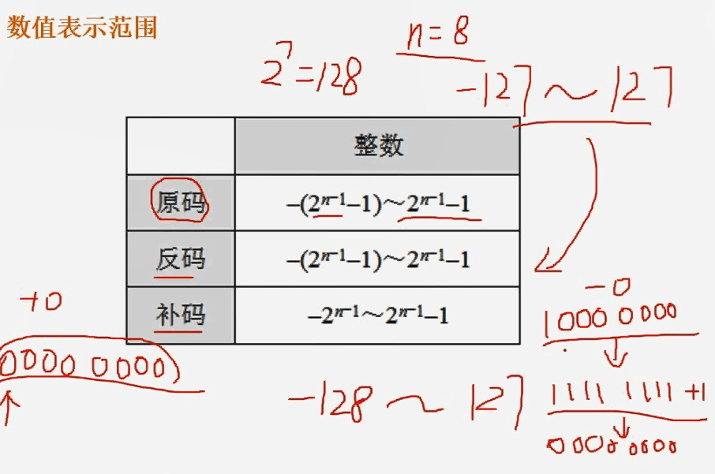

### 浮点数运算：尾数、指数

> 增加M的位数、减少E的位数可减少可表示的数的范围同时提高精度。

## 二、流水线计算

### 1. 流水线周期及流水线执行时间计算

流水线周期、理论公式(考试时%80用这条)、实践公式(%20用这条)：

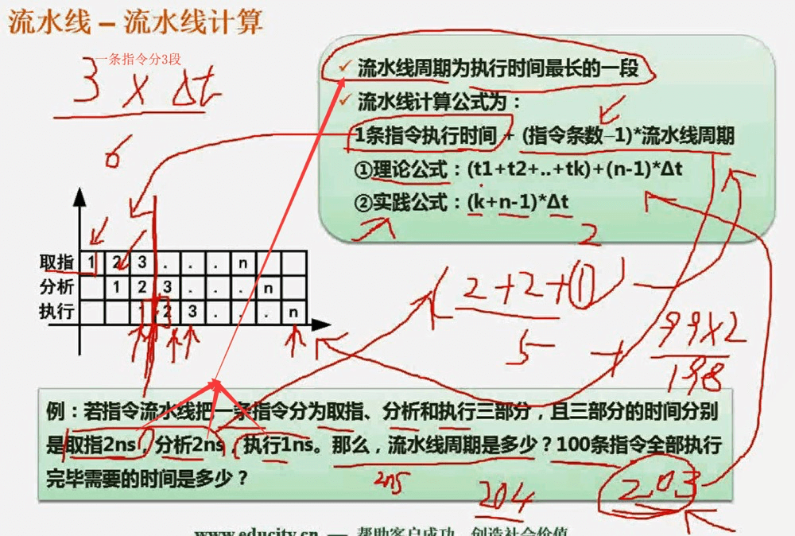

### 2. 流水线吞吐率计算(即每条指令要多少时间)

### 3. 流水线的加速比

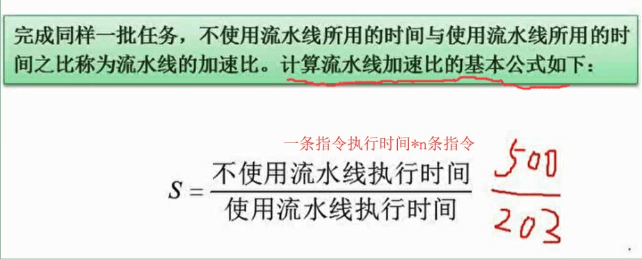

### 4. 流水线的效率(设备利用率)

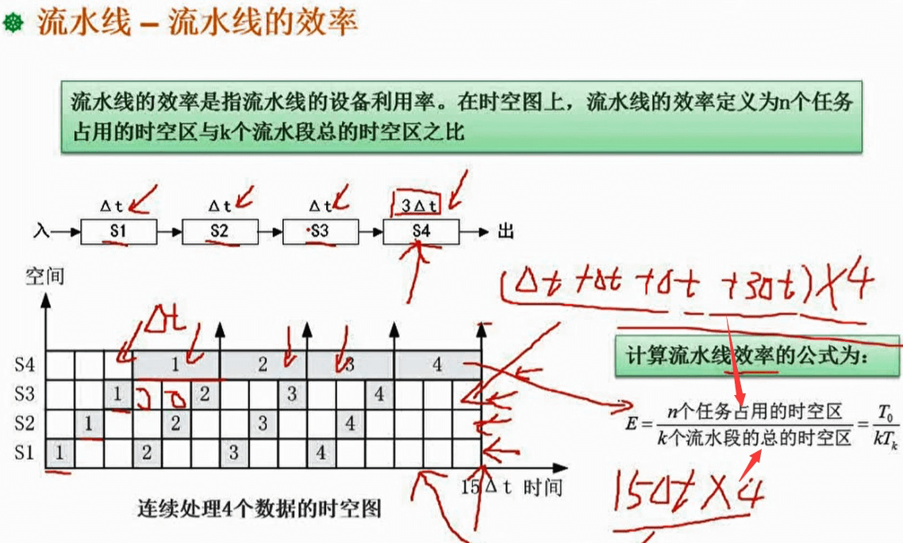

## 三、地址单元计算

> 计算k个地址单元：首先C7FFFH+1等于C8000H，再减去AC000H，等于1C000.把它/K(1024应该是1000)得到112.
>
> 每单元存储计算：112K*16 与28*16K*x比值为1，所以x=4.

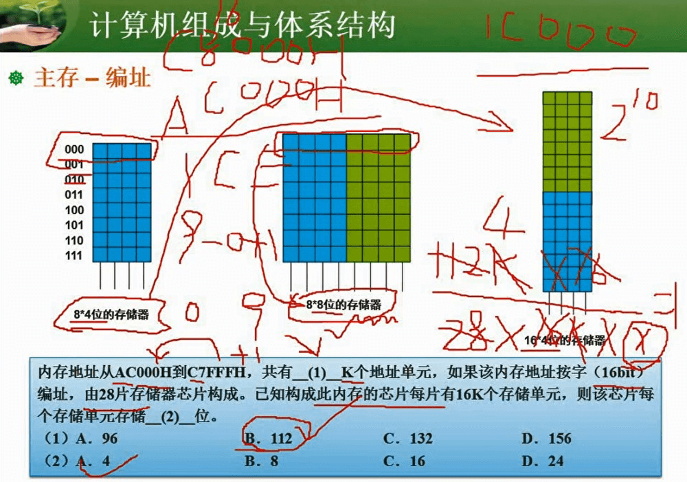

## 四、磁盘的计算：磁道

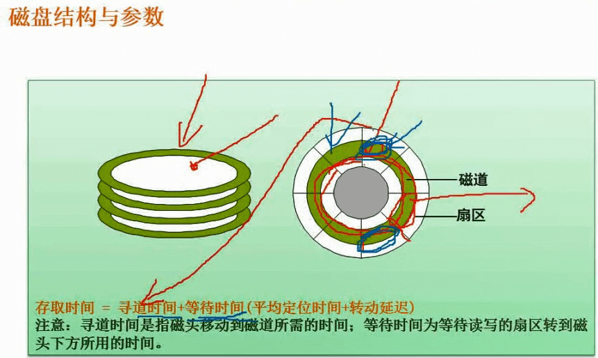

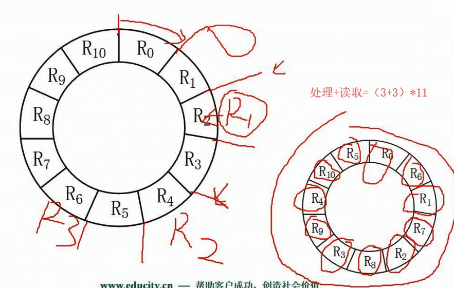

## 五、串联系统与并联系统可靠度计算

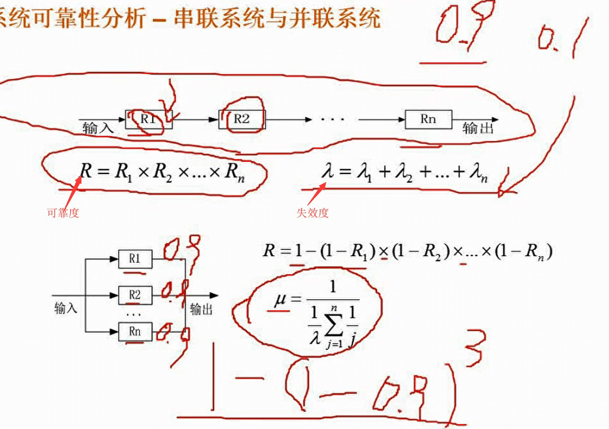

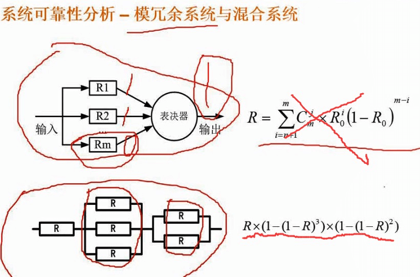

## 六、CRC循环校验码与海明校验码

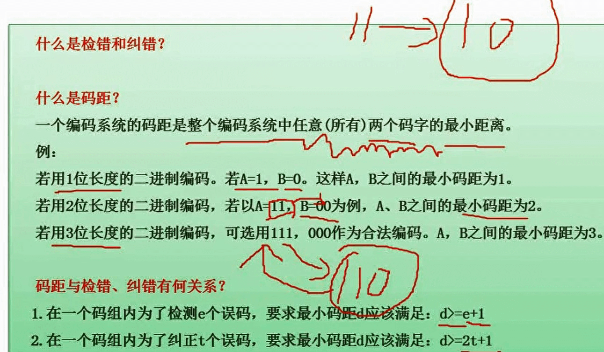

### CRC循环校验码

> **可以进行检错但不能进行纠错**

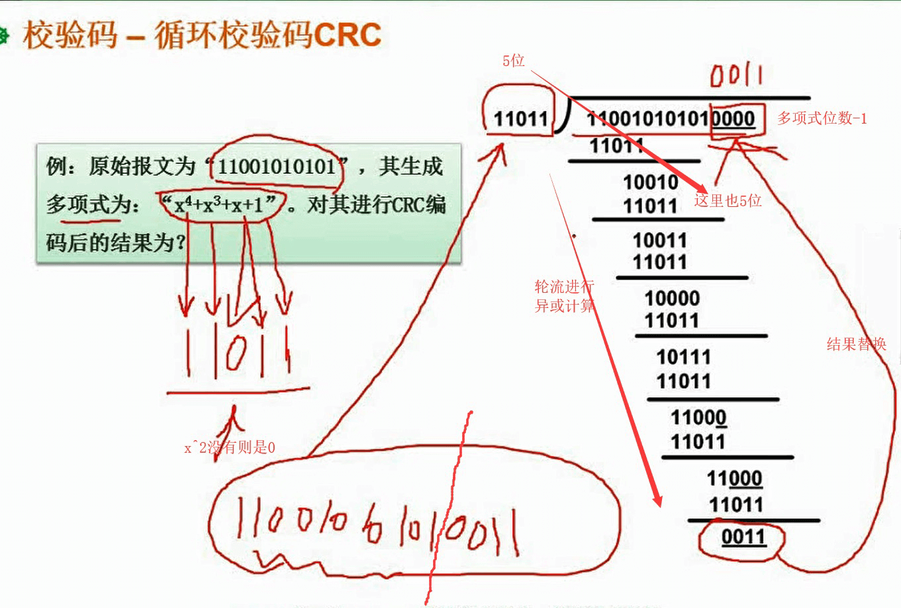

### 海明校验码

> 即可校验也可纠错

计算公式：`2^k >= m + k +1`	 k位校验位(取最小值)，m位信息位数据位，n=m+k位的纠错码

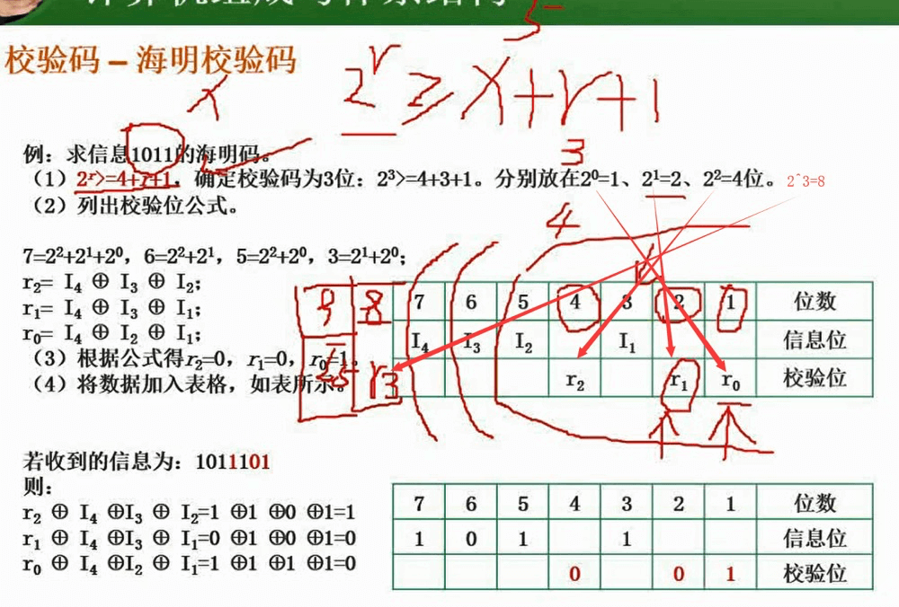

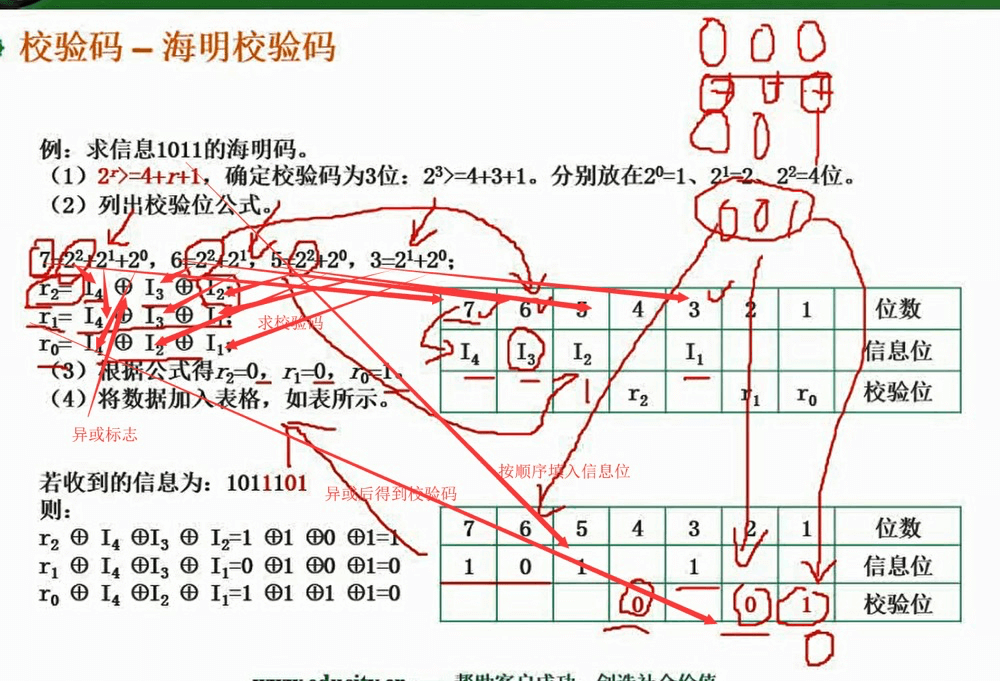

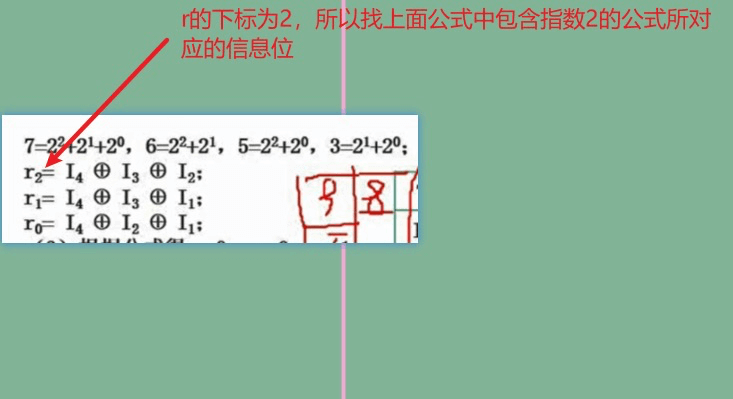

## 其他

1. 计算机总线分类：

   

   主存与CPU的硬连接有三组连接：**地址总线(AB)**、**数据总线(DB)**、**控制总线(CB)**

   

2. **计算机体系结构分类Flynn**

   

3. **CISC与RISC：选择题**

   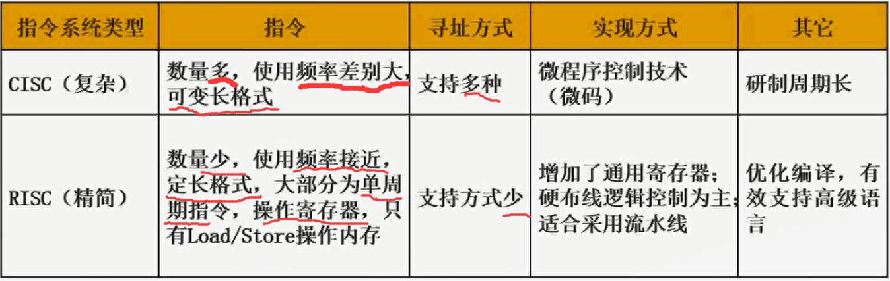

4. **计算机层次化存储结构**：

   

5. **Cache的功能和系统的平均周期计算**：**寄存器速度 > Cache**

   

6. **程序的局部性**：如程序在一段时间内访问相对小的一段地址空间

   > 时间局部性、空间局部性

   

7. **随机存储器与只读存储器**

   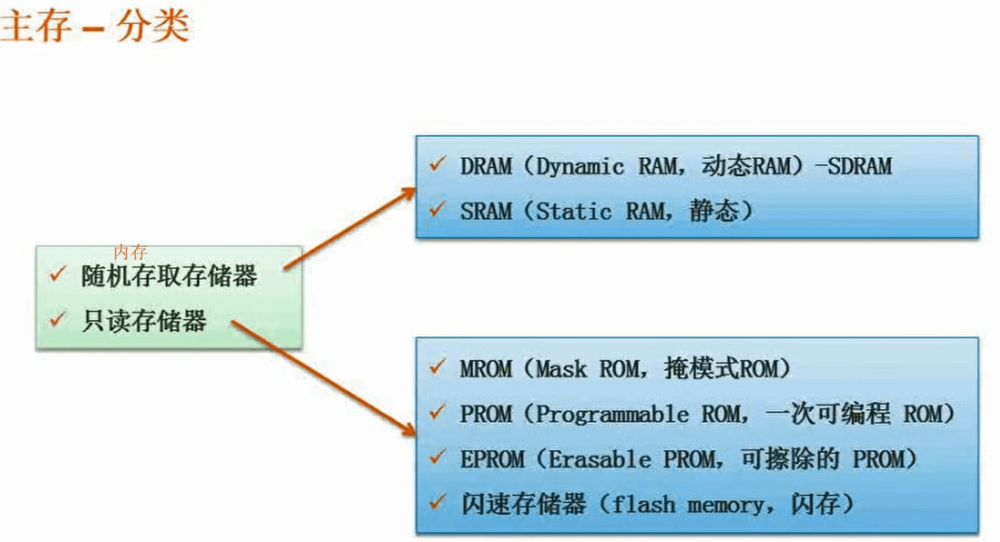
