## 考点

- 编译与解释
- 文法

- 正规式

  > 正规式不能用于描述配对或嵌套的结构，重复串也不能。
  >
  > 正规式可以描述的每种结构都可以用上下文无关文法来描述。

- 有限自动机

  > 每个非确定的有限自动机都有一个与之等价的正规式。

- 表达式
- 传值与传址

- 多种程序语言特点

  > **编译程序**生成源程序的目标代码(有词法、语法、语义分析等过程)，**解释性程序**不产生源程序的目标代码。
  >
  > 高级程序设计语言提供描述数据、运算、控制和数据传输的语言成分。控制包括顺序、选择、循环结构。

* **极限编程(XP)**的最佳实践：
  1. 只处理当前的需求，使设计保持简单。
  2. 系统最终用户代表应全程配合XP团队。
  3. 大价值观：**沟通**，**简单**，**反馈**，**勇气**；
  4. 5个原则：**快速反馈**，**简单性假设**，**逐步修改**，**提倡更改**和**优质工作**
  5. 12个最佳实践：**计划游戏**（快速制定计划、随着细节的不断变化而完善）、**小型发布**（系统的设计要能够尽可能早地交付）、**隐喻**（找到合适的比喻传达信息）、**简单设计**（只处理当前的需求，使设计保持简单）、**测试现行**（先写测试代码，然后再编写程序）、**重构**（重新审视需求和设计，重新明确地描述它们以符合新的和现有的需求）、**结队编程**、**集体代码所有制**、**持续集成**（可以按日甚至按小时为客户提供可运行的版本）、**每周工作40个小时**、**现场客户和编码标准**。

**正确性维护**：改正没有发现的错误

**适应性维护**：技术，需求发生了变化而引起的维护

**完善性维护**：扩展功能和完善性能

**预防性维护**：提高可靠性和可维护性

## 一、编译过程

> **词法分析**：对字符串扫描与分解，识别出一个个单词。**用到正规式和有限自动机**
>
> **语法分析**：把单词符号分解为语法单位，如短语、句子、程序段。语法分析的任务是根据语言的语法规则分析单词串是否构成短语和句子，即表达式，语句和程序等基本语言结构，同时检查和处理程序中的语法错误。

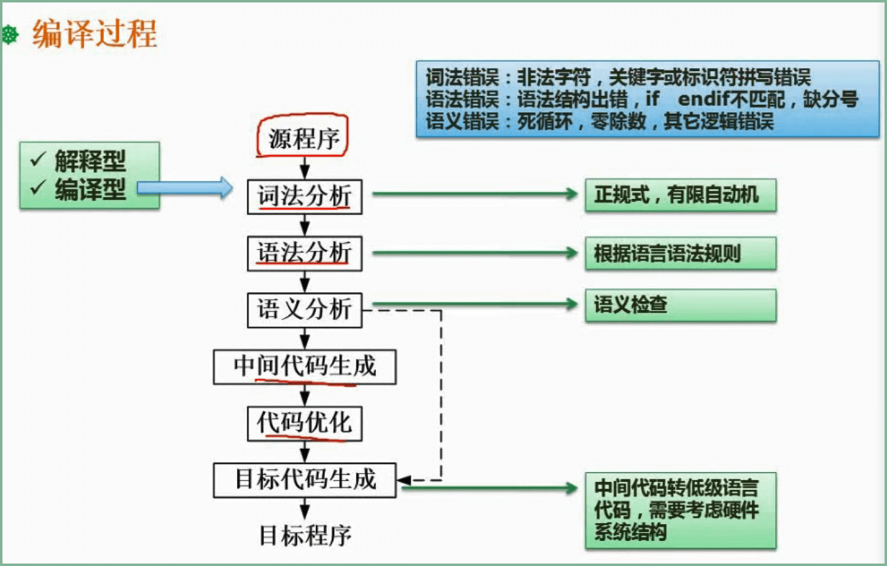

## 二、文法

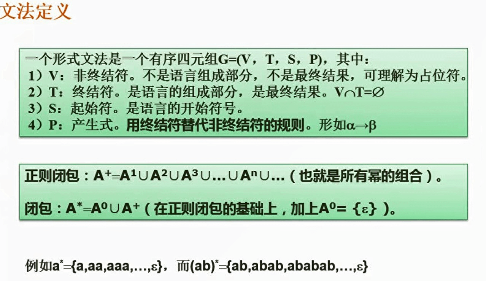

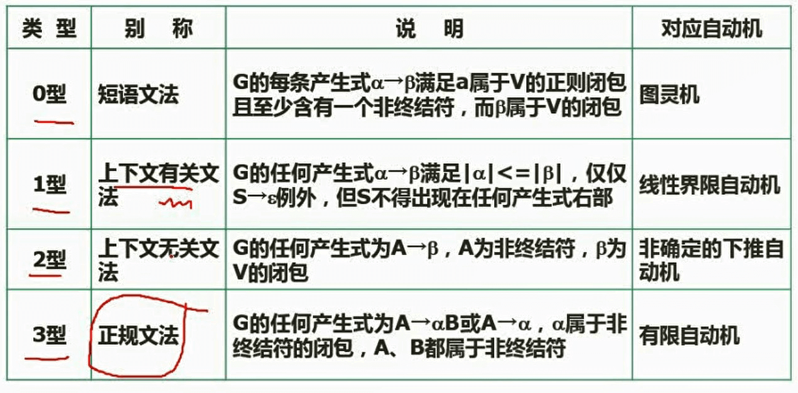

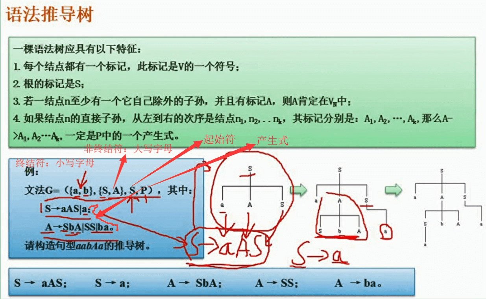

## 三、有限自动机与正规式

> 确定的有限自动机与不确定的有限自动机等价，则两者可识别的记号完全相同。

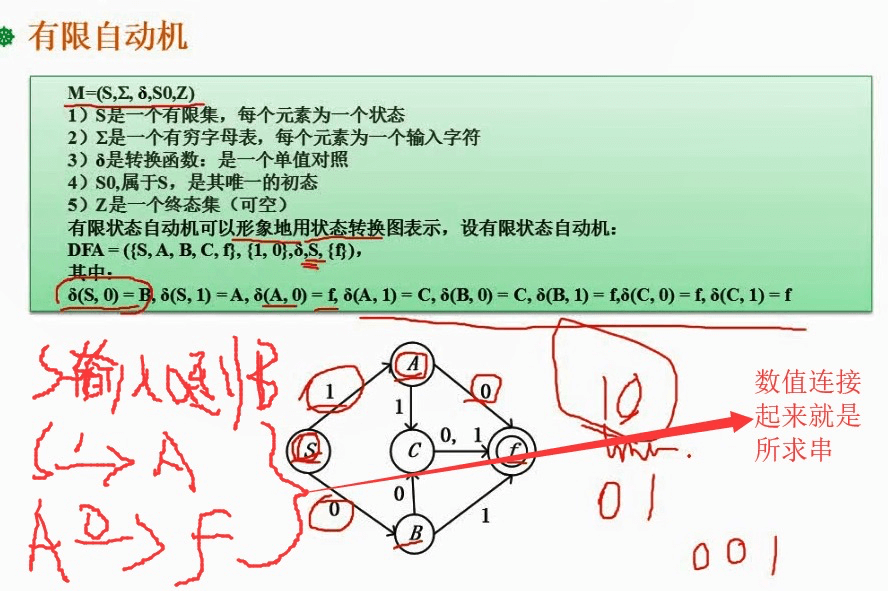

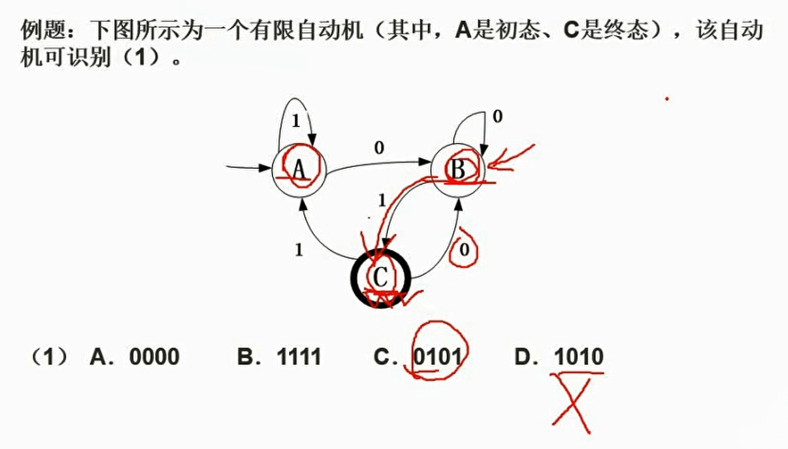

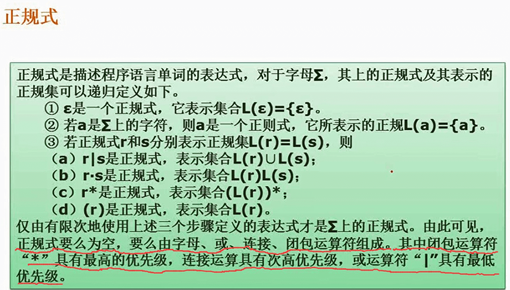

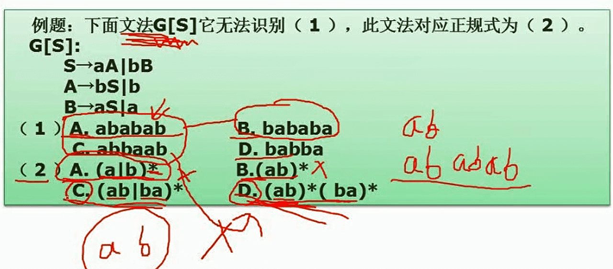

## 四、程序语言基础-表达式

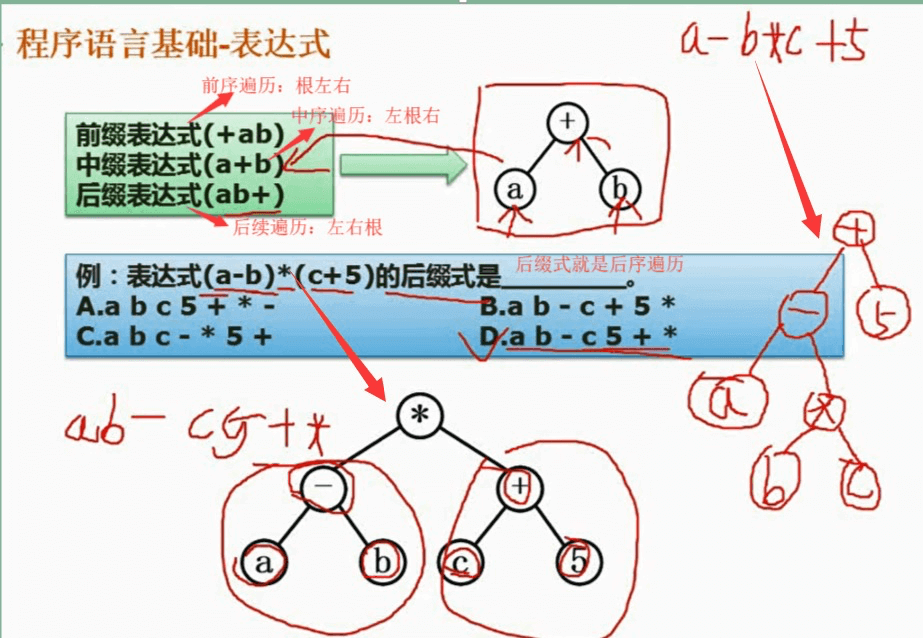

## 五、函数调用

> 传值调用和传址调用，其形参和实参都不能是任意形式的表达式。

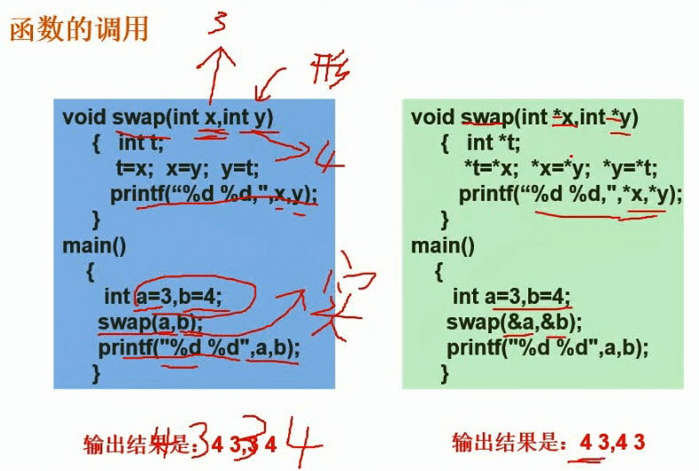

## 六、各种程序语言的特点

- 命令式程序语言是基于动作的语言：Fortran,Pascal和C语言
- 函数式语言是一类演算语言，用于人工智能：Lisp，ML
- 面向对象设计语言：C++，Java，c#，SmallTalk
- 逻辑程序设计语言，适用于书写自动定理证明、专家系统和自然语言理解等问题的程序

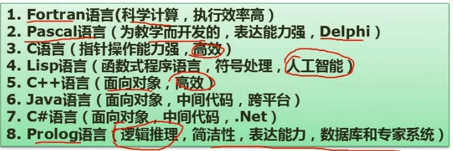