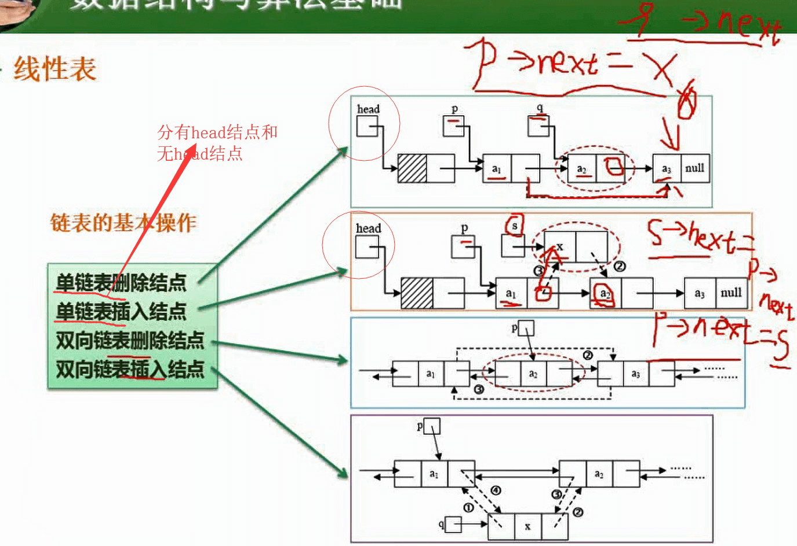
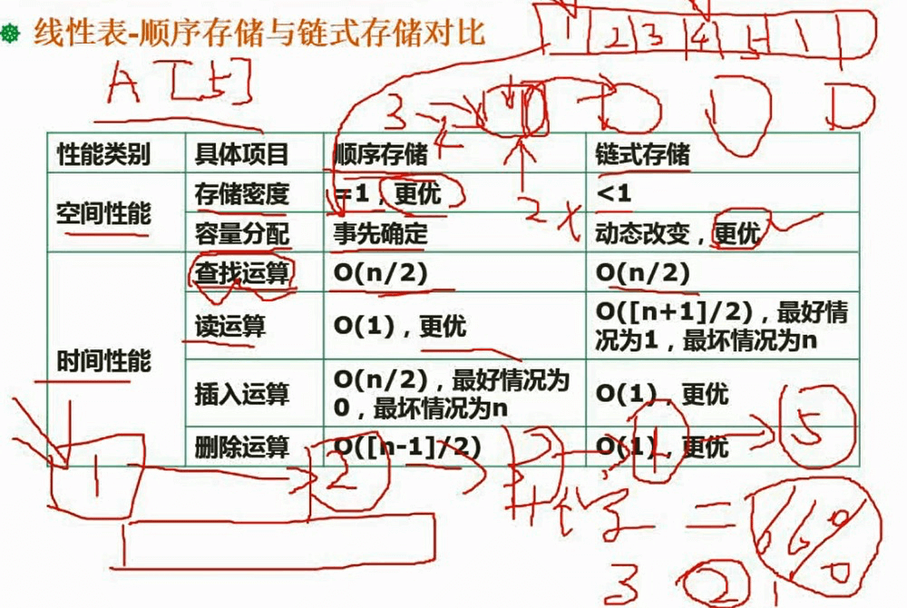
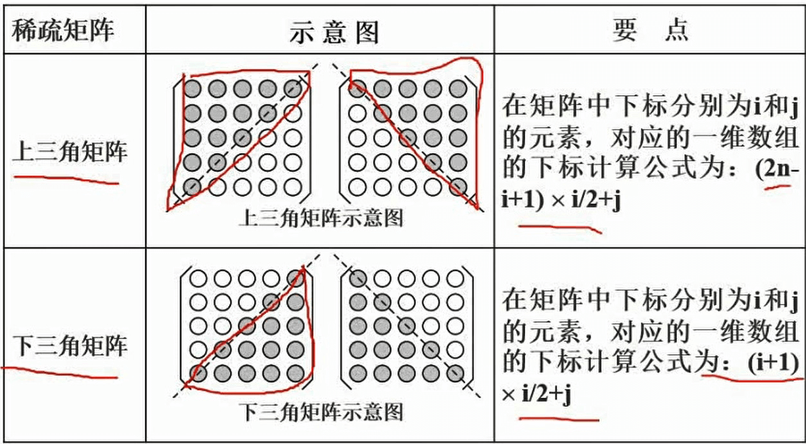
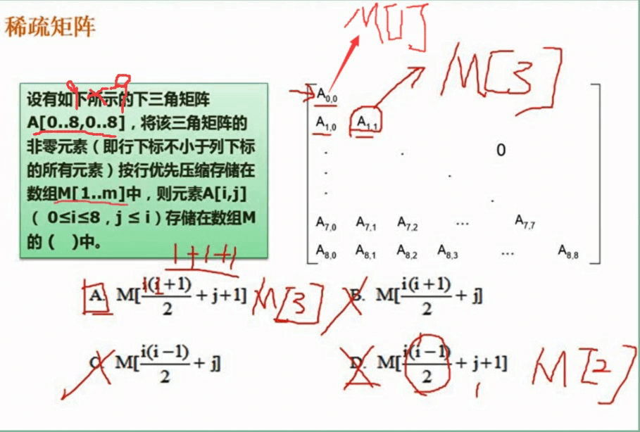

## 考点

- 数组与矩阵

- 线性表

- 广义表

- 树与二叉树

- 图

- 排序与查找
- 算法基础及常见的算法

## 1. 数据结构

### 顺序表与链表：线性表的两种存储结构

### 顺序存储与链式存储

> 顺序存储：顺序存储，随机存取
>
> 链式存储：随机存储，顺序存取

### 线性表：队列与栈

### 广义表：求长度：元素个数、求深度：所嵌套的层次

## 2. 排序算法

**时间复杂度、空间复杂度、稳定性(要记忆)**

## 2. 矩阵

**上三角矩阵、下三角矩阵：**

