## 考点

### 磁盘调度算法

* **先来先服务(FCFS)**算法：按照请求访问者的先后次序

* **最短寻道时间优先(SSTF)**算法：对寻道时间最短的请求进行服务

* **C-SCAN**算法：将磁头从盘的一端移动到另一端，在移动过程中对遇到的请求进行服务，不同的是当到达另一端时，马上折回到盘的开始端，不对返回路径上的任何请求服务

* **SCAN**算法：从盘的一端移动到另一端，服务遇到磁道上的每个请求，在另一端，磁头往回移动，继续扫描服务。


### 前趋图(PV操作)

> P通过、V释放

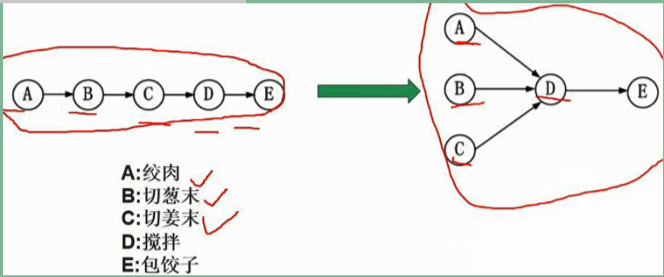

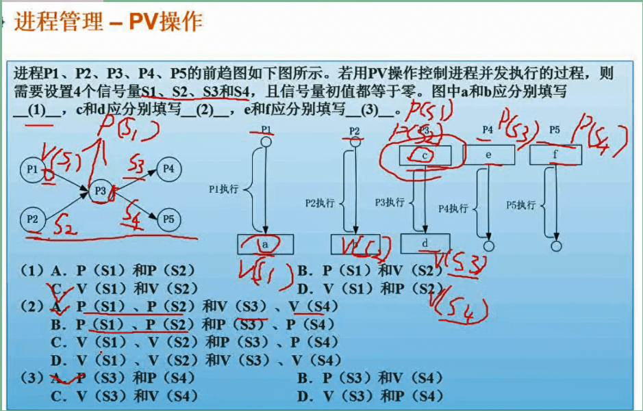

#### 进程的同步与互斥


#### PV操作：实现资源的互斥使用


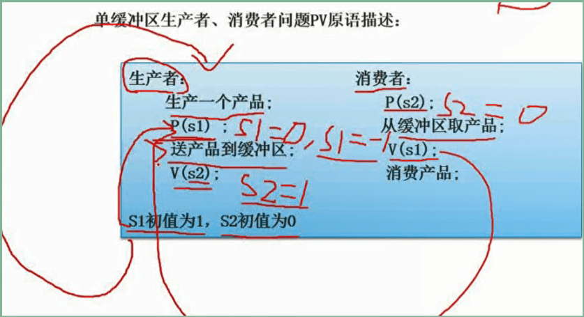


#### 进程死锁问题(重点)

- 不发生死锁：K*(N-1)+1 = 资源数
- 发生死锁：K*(N-1) = 资源数

#### 解决死锁：撤销进程、资源剥夺

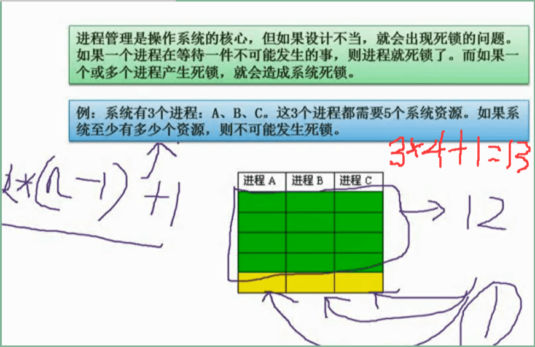

#### 进程死锁和预防：银行家算法

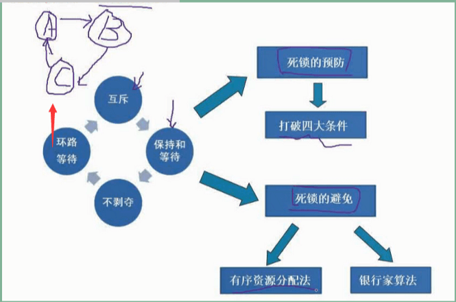


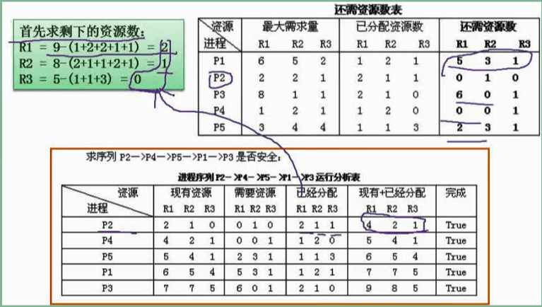

### 分区存储组织（重点）

- **连续分区**：不支持多道程序设计
- **固定分区**存储管理：支持多道程序设计的最简单存储管理方法，容易产生较多存储器碎片
- **可重定位分区**存储管理：消除存储碎片和紧缩存储空间，但紧缩需花费大量的时间和系统资源
- **非请求分页式**存储管理：解决分区存储管理中**碎片多**和**紧缩处理时间长的缺点**，支持多道程序设计，不支持虚拟存储
- **请求分页式**存储管理：解决分区存储管理中碎片多和紧缩处理时间长的缺点，支持多道程序设计，支持虚拟存储，不能实现对最自然的以段为单位的共享与存储保护

- **段页式**存储管理：支持虚拟存储，可实现动态链接和装配

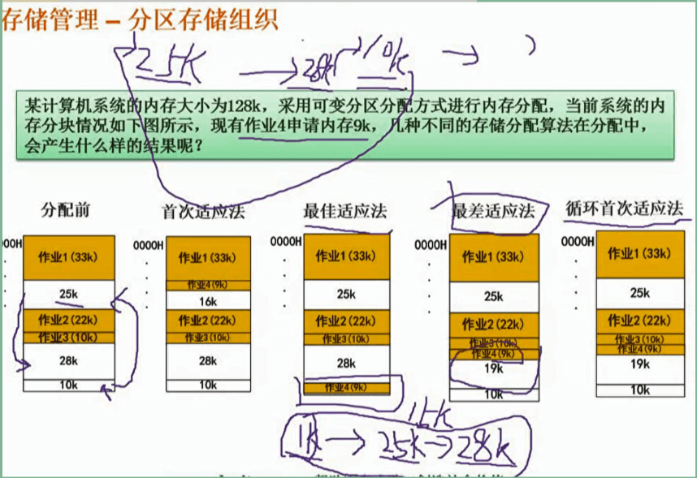

#### 页式存储

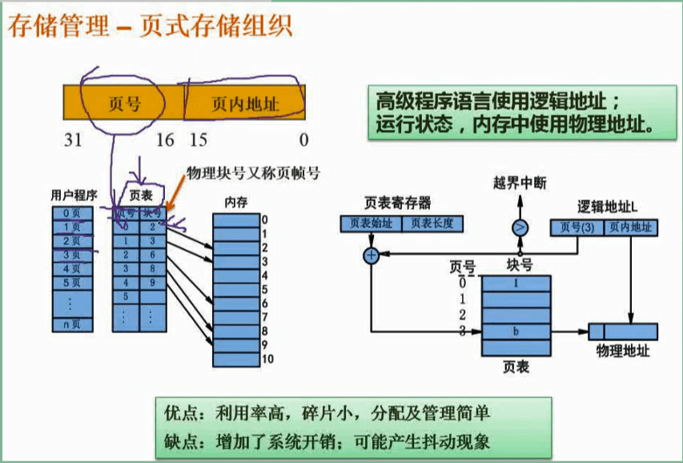


#### 段式存储


#### 段页式存储


**快表放Cache，慢表放内存**


**题**

> 某文件系统采用多级索引结构，若磁盘块的大小为 512 字节，每个块号需占 3 字节，那么根索引采用一级索引时的文件最大长度为 （1） K 字节；采用二级索引时的文件最大长度为 （2） K 字节

**解析：**

```
每个磁盘块 → 512B  

块号（每条逻辑号和物理号映射的记录）占→3B

一级索引时：512/3=170个逻辑号（即170个物理块）

★170×512B/1024=85KB

二级索引时：

★170×170×512B/1024=14450KB
```

### 页面淘汰算法

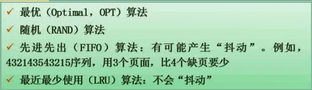

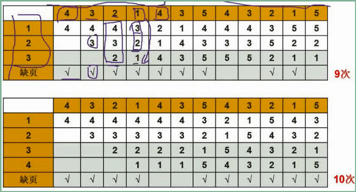


### 文件管理

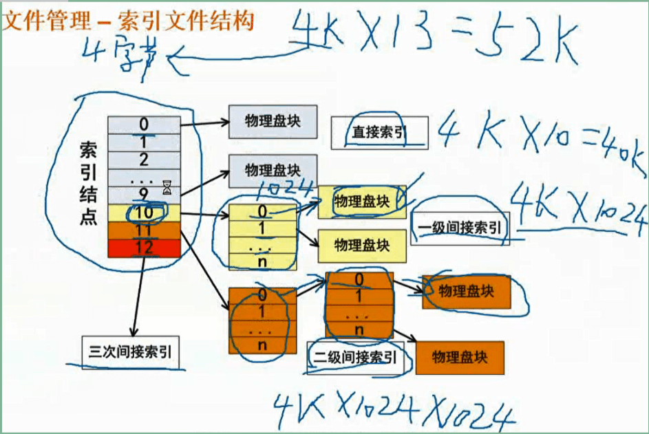

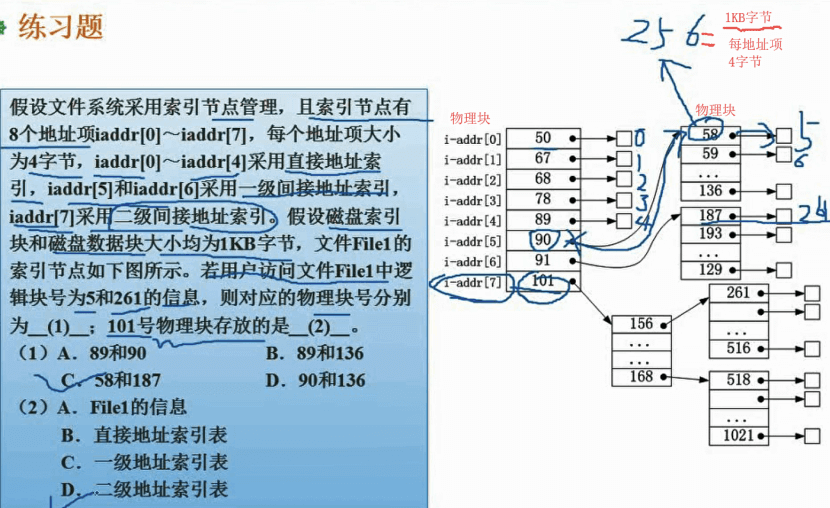

**文件和树形目录结构：绝对路径和相对路径**

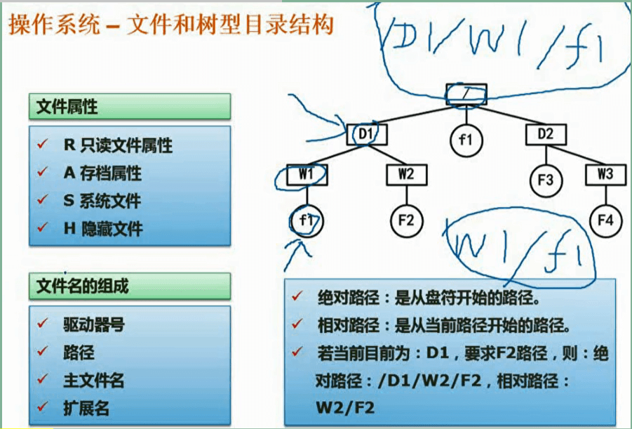

#### 空闲区表法(空闲文件目录)

#### 空闲链表法

#### 成组链接法

#### 位示图法


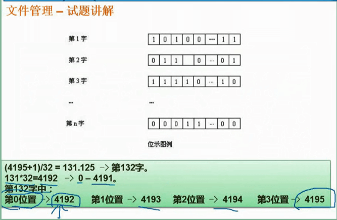

### 设备管理

#### 设备与CPU之间数据传送控制方式

1. **程序直接控制方式**
2. **中断控制方式**
3. **直接内存访问DMA方式**
4. **通道控制方式**


#### 虚设备与Spooling技术


**微内核操作系统**

