## 考点

* **软件维护工具**主要有：
  1. 版本控制工具；
  2. 文档分析工具；
  3. 开发信息库工具；
  4. 逆向工程工具；
  5. 再工程工具；
  6. 配置管理支持工具。
* **软件调试的方法**：
  1. **归纳法**：是指从测试所暴露的问题出发，收集所有正确或不正确的数据，分析他们之间的关系，提出假想的错误原因，用这些数据来证明或反驳，从而查出错误所在。
  2. **试探法**：调试人员分析错误的症状，猜测问题所在的位置，利用在程序中设置输出语句，分析寄存器，存储器的内容等手段获得错误的线索，一步步地试探和分析错误的所在。这种方法效率低，适合结构比较简单的程序。
  3. **回溯法**：调试人员从发现错误的位置开始，人工沿着程序的控制流程往回跟踪代码，直到找出错误根源为止。这种方法适合于小型程序，对于大规模程序，由于其需要回溯的路径太多而不可操作。
  4. **对分查找法**：这种方法主要用于缩小错误范围，如果已经知道程序中的变量在若干位置的正确取值，可以在这些位置上给这些变量以正确值，观察程序运行的输出结果，如果没有发现问题，则说明赋予变量一个正确值开始到输出结果之间程序没有错误，问题可能在除此之外的程序中，否则错误就在所观察的这部分程序中，对含有错误的程序段再使用这种方法，直接把故障范围缩小到比较容易诊断为止。
  5. **演绎法**：根据测试结果，列出所有可能的错误；分析已有的数据，排除不可能和彼此矛盾的原因；对其余的原因，选择可能性最大的，利用已有的数据完善该假设，使假设更具体；用假设来解释所有的原始测试结果，如果能解释这一切，则假设得以证实，也就找出错误，否则，要么是假设不完备或不成立，要么有多个错误同时存在，需要重新分析，提出新的假设知道发现错误为止。
* **中间代码常用的表达形式**如后缀式，三元式，四元式和树，可以跨平台。
* **新老系统之间的转换**有三种方式：直接转换、并行转换、分段转换(逐步转换、向导转换、试点过渡法)。一个模块的作用范围应该在其控制范围之内。

- **风险管理中的活动**：
  1. **风险识别**：建立风险条目检查表，用于识别风险
  2. **风险预测(风险估算)**：风险发生的可能性或概率，及风险发生了所产生的后果，估算风险对项目及产品的影响，标注风险预测的整体精确度。
  3. **风险评估**：定义风险参考水平值，预测影响参考水平值的风险组合
  4. **风险控制**：风险避免、风险监控和风险管理及意外事件计划

* **信息系统开发方法：** 结构化法、原型法、面向对象方法、面向服务方法

  

### 软件开发模型

#### 瀑布模型

> 结构化方法中的模型，适用于需求明确、二次开发

#### 原型模型、演化模型、增量模型

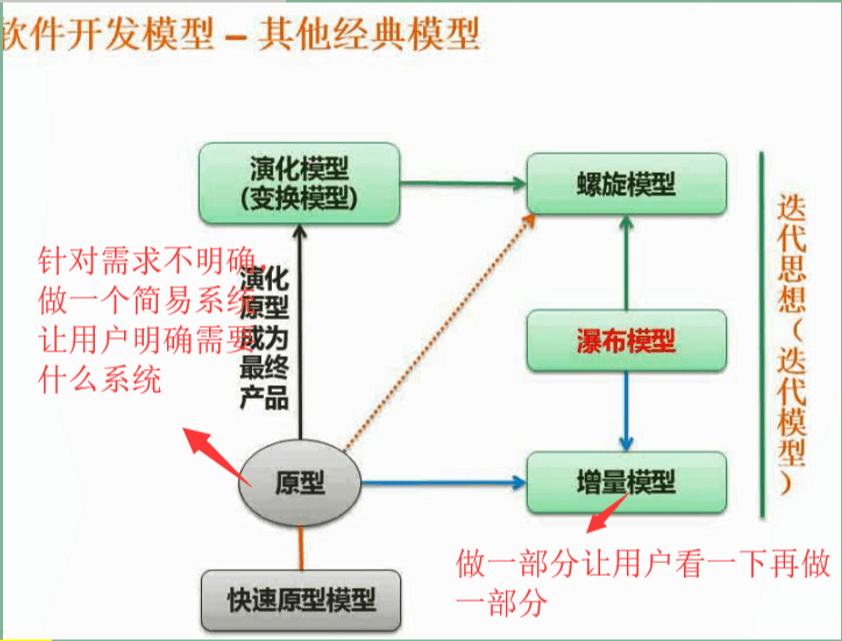

#### 螺旋模型

> 显著特点是**风险分析**

#### V模型

> 注重于测试

#### 喷泉模型

> 特点是面向对象

#### RAD：快速开发模型

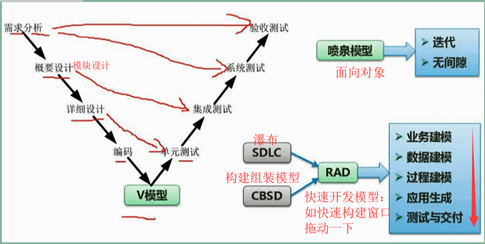

#### 构建组装模型(CBSD)

> 提高可靠性，提高复用性，降低成本

#### 同一过程模型(up/rup)

> **α测试**：用户在开发者的场所由开发者指导完成的测试，指在“受控的”环境中进行
>
> **β测试**：用户在“非受控的”环境中进行。

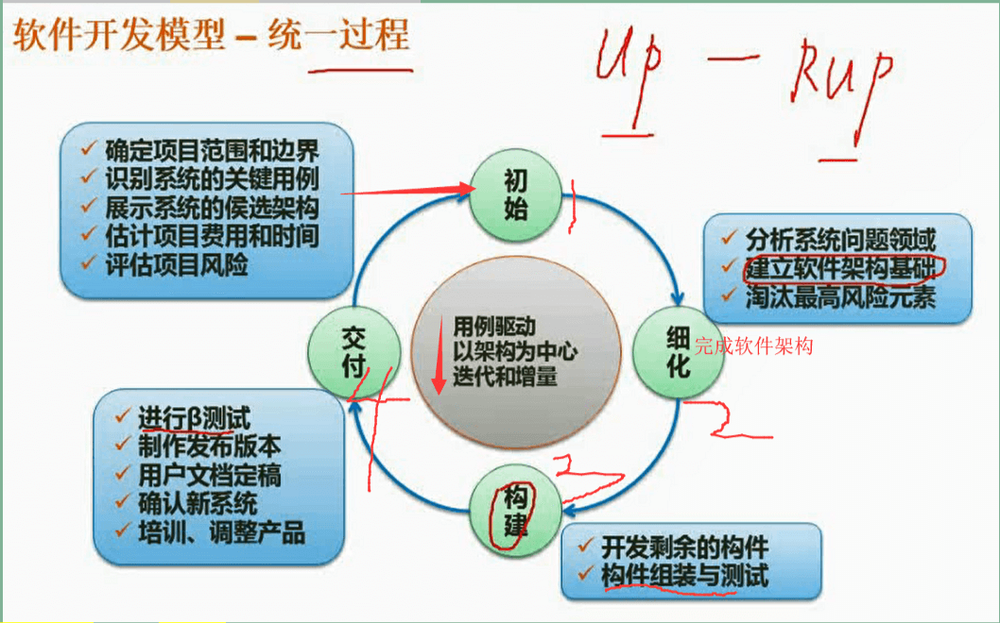

### 敏捷开发方法

> 注重小项目，大中型项目不适合

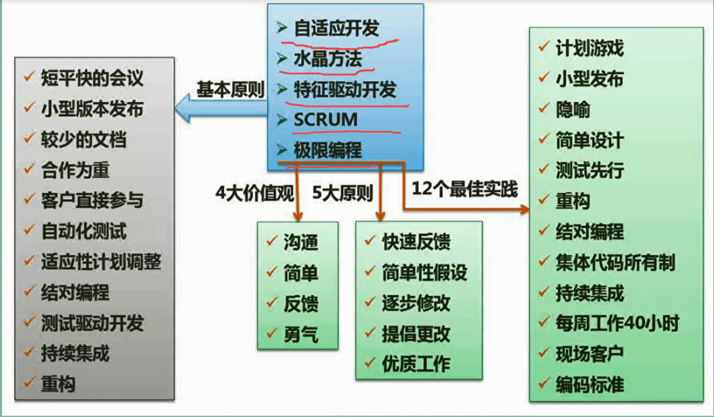

### 需求分类

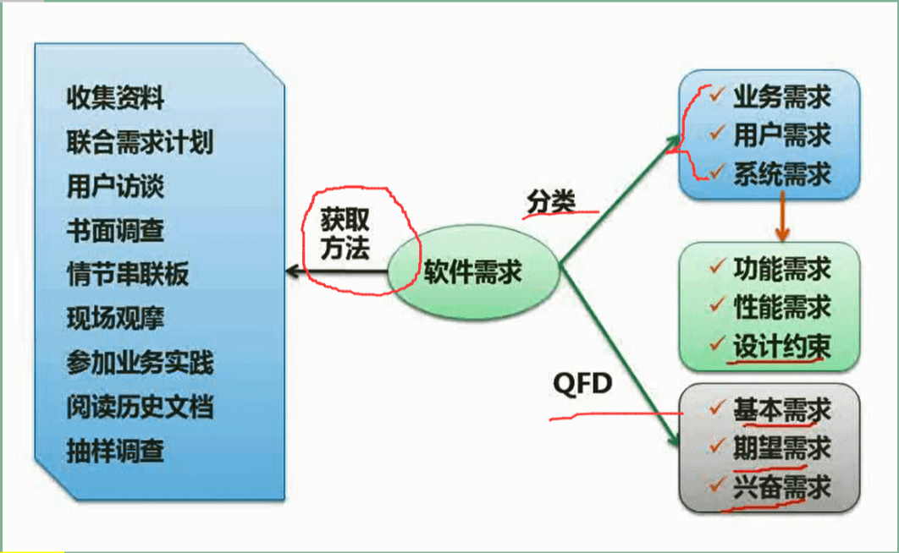

### 结构化设计-模块

#### 内聚与耦合

### 软件测试

#### 测试原则与测试类型

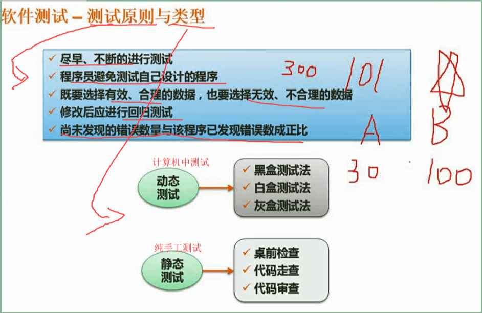

#### 测试用例设计

* **黑盒测试**：只知道输入和输出，不知道程序结构

* **白盒测试**：知道程序结构

  白盒测试的逻辑覆盖：

  1. 语句覆盖
  2. 判定覆盖(分支覆盖)：判定的每个分支至少执行一次
  3. 条件覆盖
  4. 判定/条件覆盖：同时满足判定覆盖、条件覆盖
  5. 条件组合覆盖：满足判定/条件覆盖
  6. 路径覆盖

​	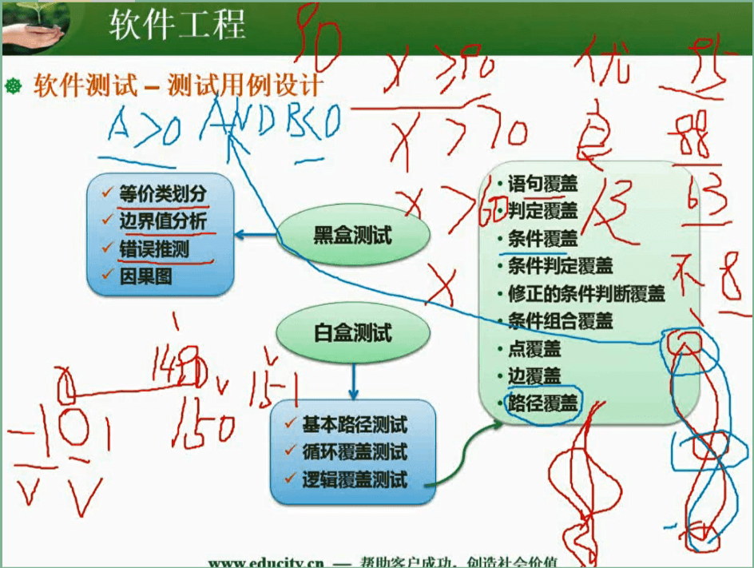

#### 测试阶段

> **单元测试**：程序员自测功能的完整性
>
> **集成测试**(**组装测试**)：检查各模块之间的接口和通信问题
>
> **确认测试**：检测软件功能，性能等是否符合用户需求
>
> **系统测试**：验证完整的软件配置项能否和系统正确连接。

### McCabe复杂度（考点）

> 计算有向图的环路复杂度`V(G)=m-n+2`，m是有向线段，n是节点数

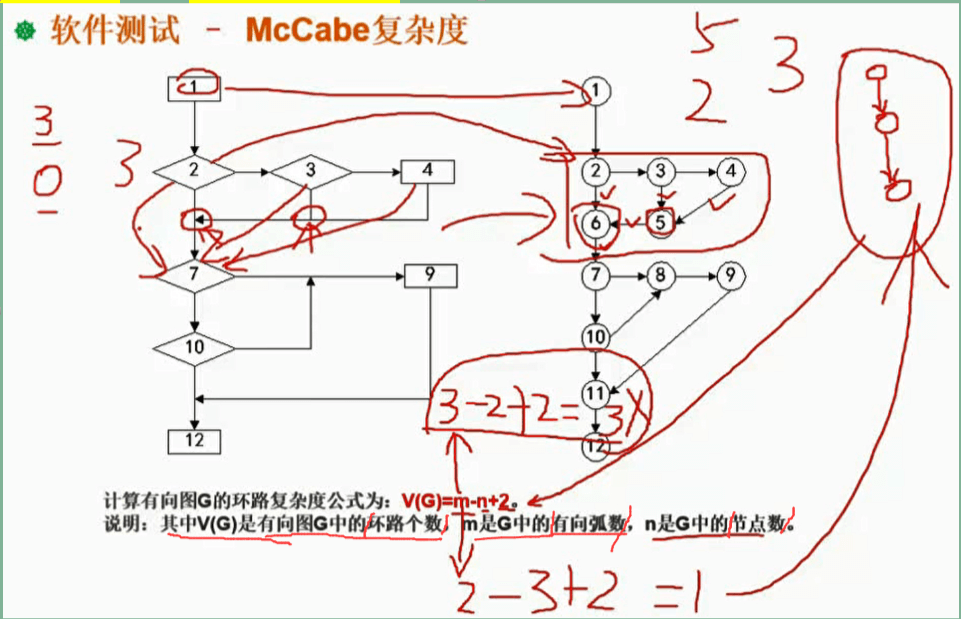

### 软件维护

> 软件维护的4种类型：**改正性维护**、**适应性维护**、**完善性维护**、**预防性维护**

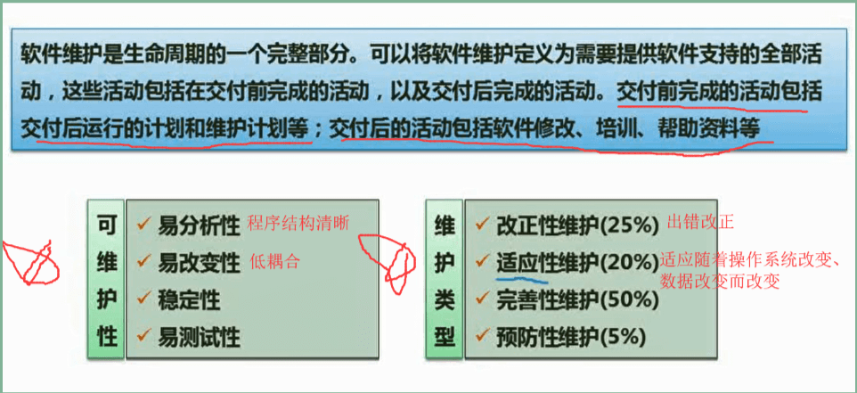

### 软件过程改进-CMMI

> 阶段式
>
> 连续式

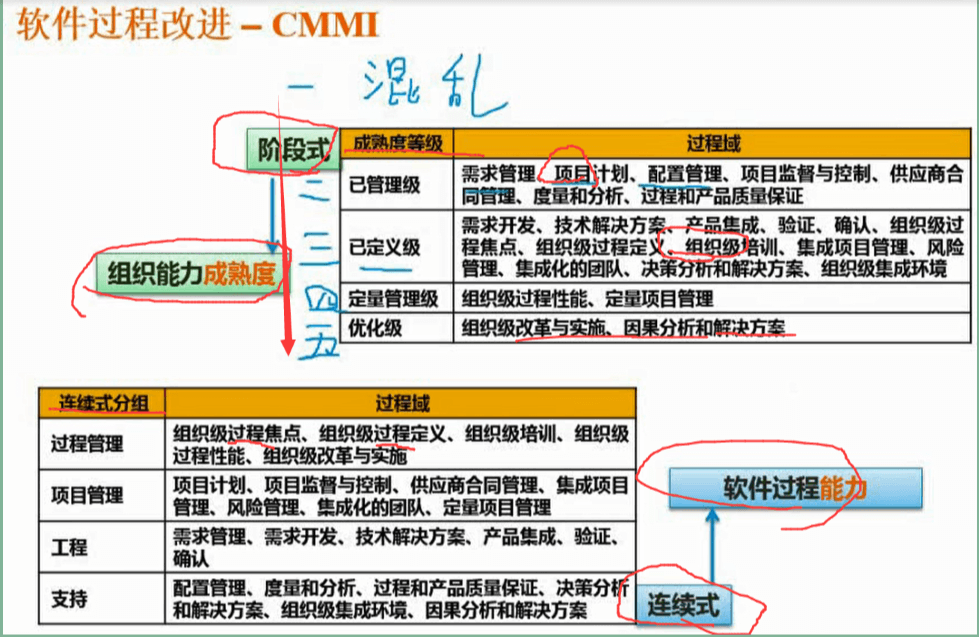

### 项目管理（考点）

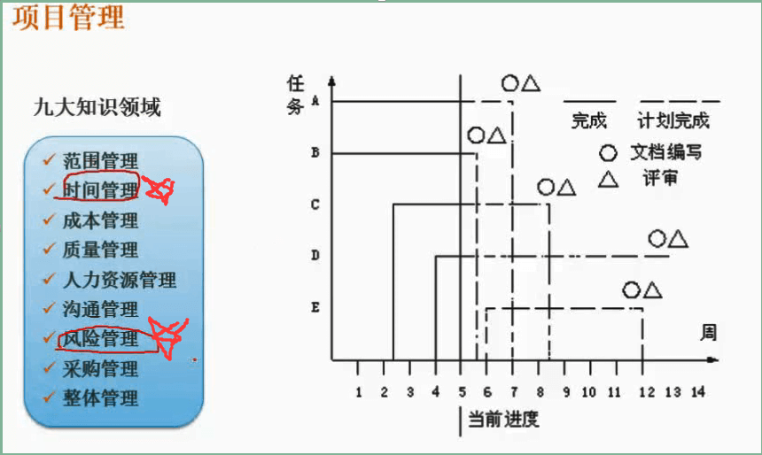

#### 时间管理

- **关键路径**：图中从起点到终点长度最长的哪条路径，而关键路径的长度则是整个项目的工期。
- **某结点最早开始时间**：采用顺推，如果计算的某结点有两个箭头指向了它，最早开始时间为计算结果最大的那个。
- **最晚开始时间**：采用逆推，①关键路径长度-终点到该点的长度。若有两个箭头从该结点出发，则选①的计算结果最小的那个
- **活动的松弛时间**：最晚开始时间-最早开始时间(所有活动完成的时间-所求活动线路的完成的时间)

### 风险管理

> 计算风险曝光度 = 风险出现概率 x 风险可能造成的损失

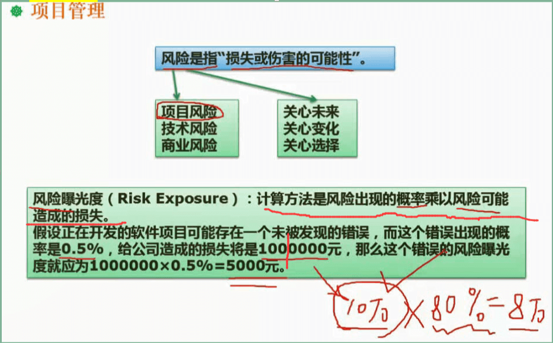