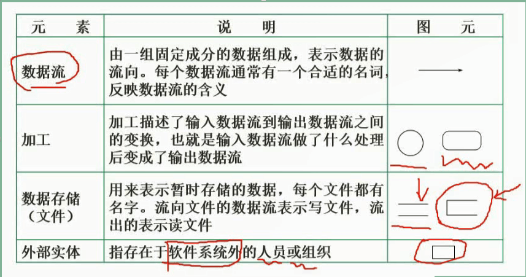
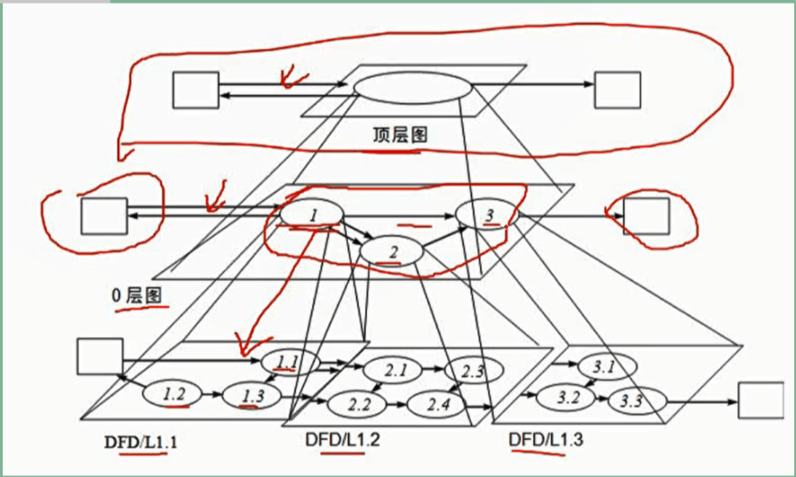
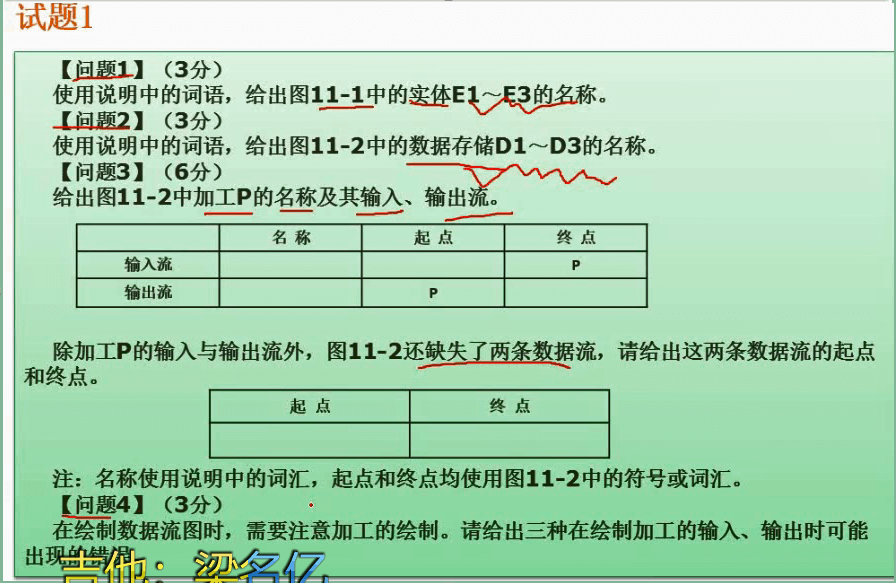
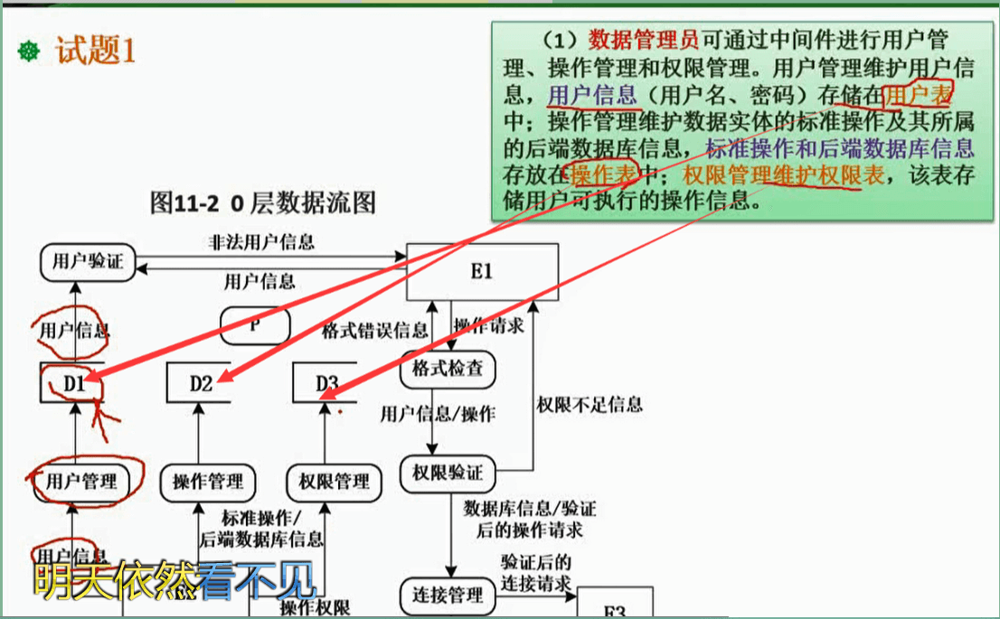
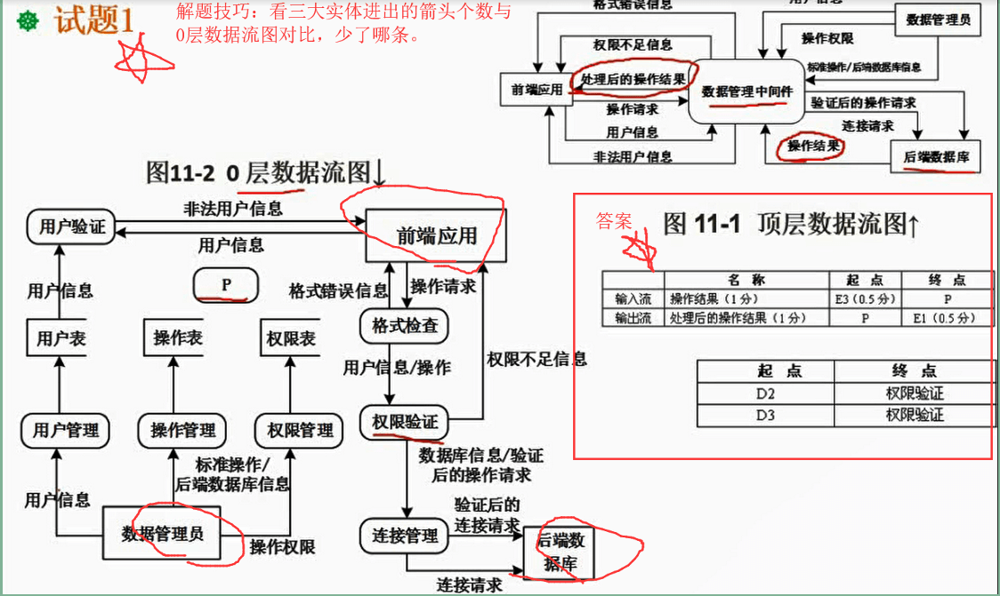
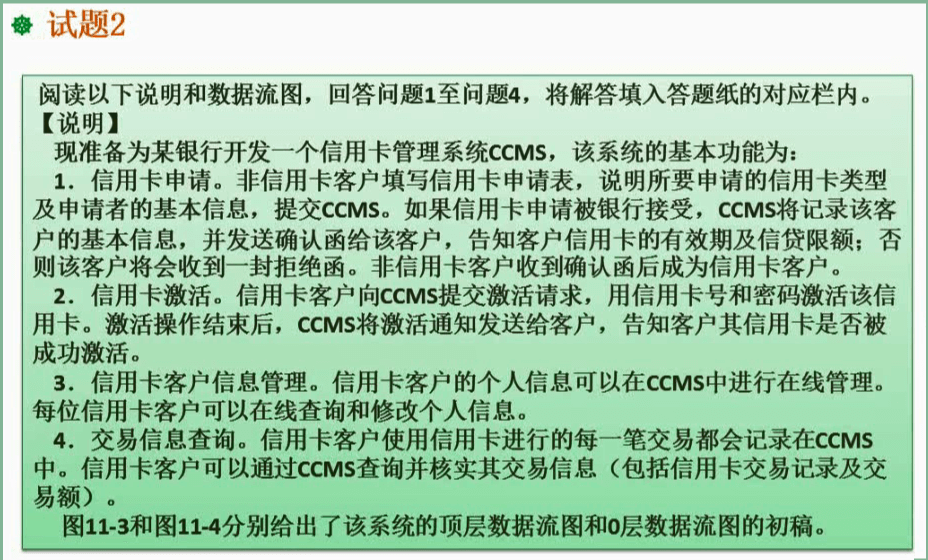
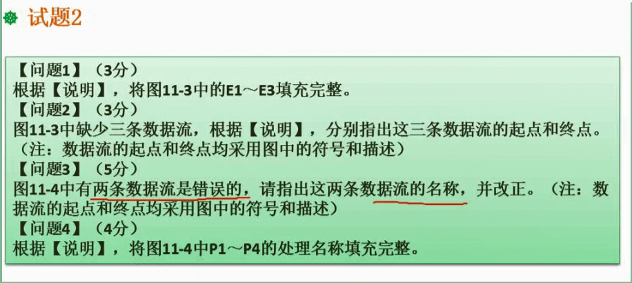
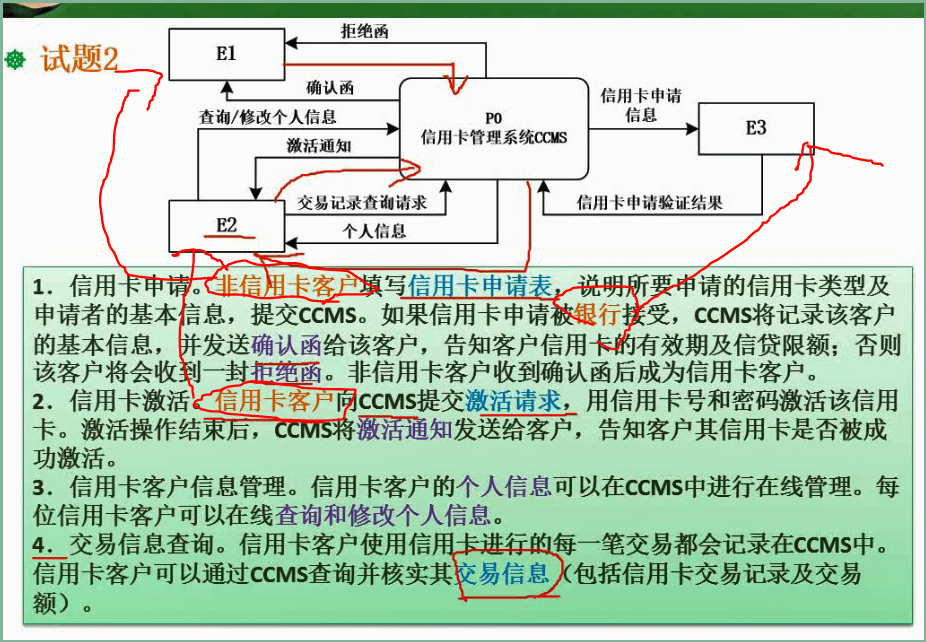
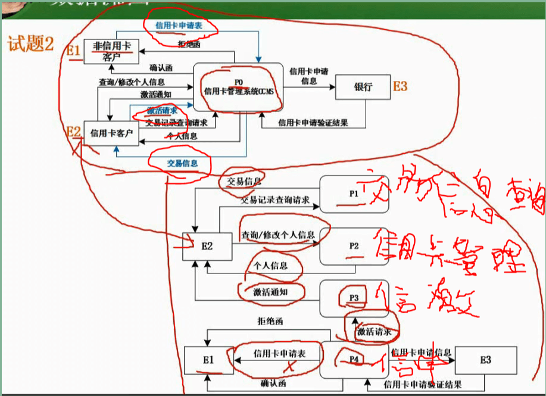

## 考点（下午题）

- **物理数据流图**：关注的是系统中的物理实体，以及一些具体的文档、报告、其他输入/输出硬拷贝。其用作系统构造和实现的技术性蓝图。

- **逻辑数据流图**：强调参与者所做的事，可帮助设计者决定需要哪些系统资源、为了运行系统用户必须执行的活动、在系统安装之后如何保护和控制这些系统。

- **绘制数据流图时应注意**：保持父图与子图平衡。父图中某加工的输入输出数据流必须与它的子图的输入输出数据流在数量和名字上相同。如果父图的一个输入或输出数据流对应于子图中几个输入或输出数据流，而子图中组成这些数据流的数据项全体正好是父图中的这个数据流，那么它们是平衡的。

- **程序流程图通常在进行详细设计时使用，用来描述程序的逻辑结构**。

- **数据流图**：是需求分析阶段使用的一种重要工具

  

  

### 数据流图的分层

### 数据字典

> 数据字典有以下4类条目：数据流，数据项，数据存储和基本加工。

### 数据流图平衡原则（重点）

* **父图与子图的平衡**：顶层数据流图与0层数据流图要一致

  

* **子图内平衡**：一个加工单元要有输入和输出

* 绘制加工时可能出现的两个错误：**黑洞**、**奇迹**。还有输入和输出名称一样、能输入但根本无法输出

  

### 解题技巧

> 详细阅读说明的题干部分
>
> 利用数据平衡原则，查漏补缺

**选数据存储时找题干中的什么什么表和什么什么文件关键字**

**解题技巧：看三大实体进出的箭头个数与0层数据流图对比，少了哪条**

