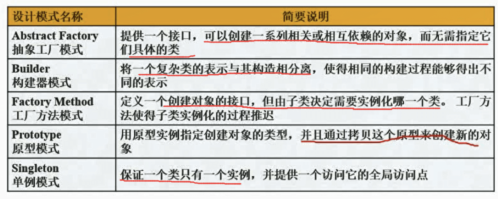
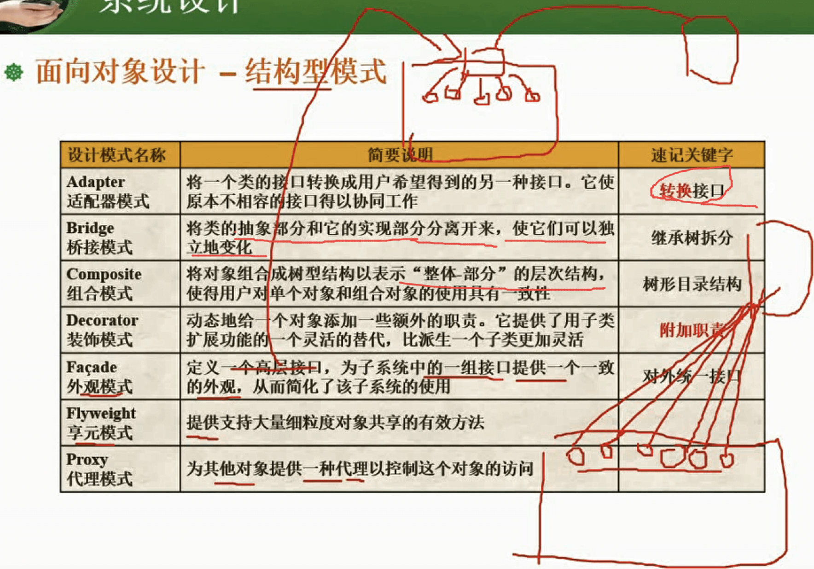
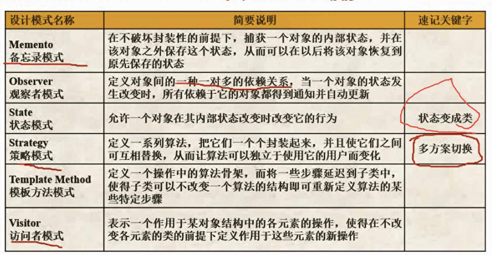
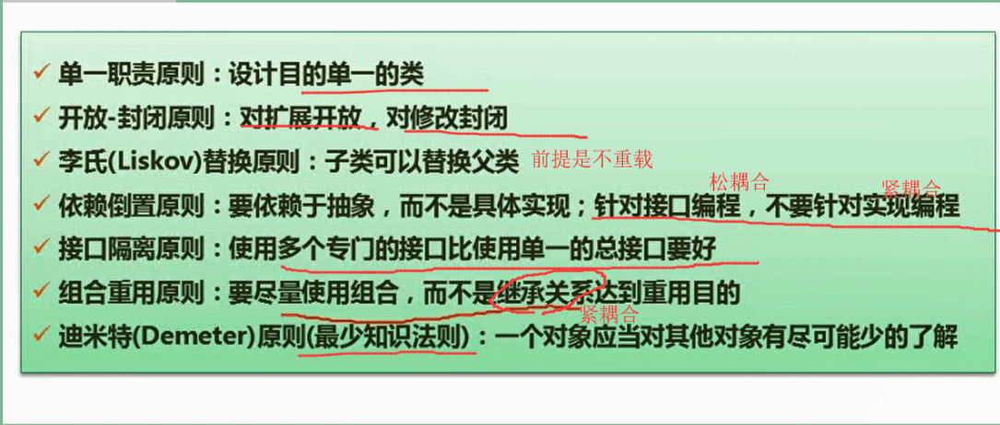
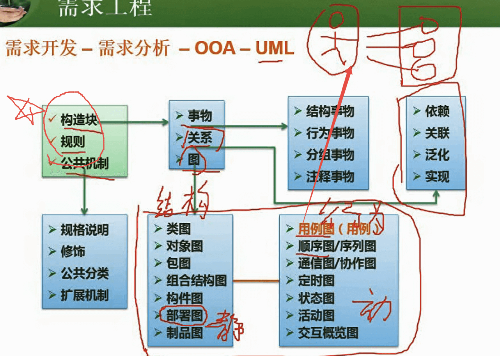

* 对象的特性：由对象标识、属性、服务三要素。定义好相关行为、边界、具有可扩展性。继承和组合都可实现其可扩展性

* 概要设计文档主要包括：软件体系总体结构设计；数据结构及数据库设计。

* 多态形式：

  > 通用多态：参数多态、包含多态
  >
  > 特定多态：过载多态、强制多态

* 抽象类不能实例化(通过new关键字产生对象)

* 构造函数：
  1. 与类同名
  2. 没有返回值，在构造函数加void是错误的
  3. 被定义为共有函数
  4. 在建立对象时由系统自动调用

* 析构函数：
  1. 没有任何参数、不能被重载，可以是虚函数，一个类只有一个析构函数
  2. 没有返回值
  3. 与类名相同，在类名前加上~以示与构造函数对比区别
  4. 一般由用户自己定义，在对象消失时由系统自动调用。用户没定义时，系统自动生成。

* UML事物：

  > 结构事物：模型的静态部分，描述概念或物理元素
  >
  > 行为事物：动态部分，描述了跨越时间和空间的行为
  >
  > 分组事物：组织部分，模型分解成的“盒子”
  >
  > 注释事物：解释部分，来描述、说明、标注模型的任何元素

* 面向对象分析：基于用例模型。

  3个活动：建模系统功能、发现并确定业务对象，组织对象并确定其关系

* 面向对象设计：在分析对象模型的基础上，设计各个对象、对象之间的关系(如层次关系、继承关系)和通信方式(如消息模式)

### 设计模式

> 架构模式：对全局而言
>
> 设计模式：对局部而言
>
> 惯用法：用到程序语言

1. 适配器Adapter

   > **将一个接口转化为另一个接口，用于接口不兼容**

2. 原型Prototype

   > 用原型实例指定创建对象的种类，通过复制这些原型创建新对象

3. 迭代器Iterator

   > 顺序访问一个聚合对象中各个元素，而不暴露该对象的内部表示

4. 观察者Observer

   > 定义对象间的一种**一对多的依赖关系**，**当一个对象的状态发生改变时，所有依赖于它的对象都得到通知并被自动更新**

5. 桥接模式

   > 将抽象部分与它的实现部分分离，使它们都可以独立地变化

6. 单例模式Singleton

   > 某个**类只能有一个实例**、它必须自选创建这个实例，它必须自行向整个系统提供这个实例

7. 组合设计模式Composite

   > 组合多个对象形成树形结构以表示整体-部分的结构层次。

8. 外观模式Facade模式(门面模式)

   > 提供统一接口去访问多个子系统的多个不同接口

#### 创建型模式

> 抽象工厂、构建器、工厂方法、原型模式、单例模式

#### 结构型模式

> 适配器、桥接、组合、装饰、外观、享元、代理

#### 行为型模式

> 职责链、命令、解释器、迭代器、中介者、备忘录、观察者、状态、策略、模板方法、访问者

#### 设计模式作用

1. 重用设计

2. 为设计提供共同的词汇

3. 在开发文档中采用模式词汇让其他人理解你的做法，利于文档开发

4. 应用设计模式让重构系统变得容易，降低设计或实现中出现错误的可能

5. 支持变化，为重写其他应用程序提供很好的系统框架

6. 节省时间

7. 适应需求变化

### 类的分类

- 边界类：系统外部环境和系统内部运作之间的交互，工作在参与者和系统之间，边界对象表示的为一个交互接口

- 实体类：存储和管理系统内部的信息，实体类独立于系统外部环境

- 抽象类

  静态成员函数不能调用普通数据函数，普通数据函数可以调用静态成员函数

### 设计原则

> 接口与实现可分割

### UML

