* 数据库系统能减少数据冗余，提高数据独立性，并集中检查数据完整性

* **关系数据库规范化的目的**：使数据库逻辑结构更合理，消除插入、修改、删除异常、减少数据冗余。并且设计关系模式是数据库设计中逻辑设计阶段的任务

* 分布式数据库的特点：其是传统集中式数据库系统的发展

  1. 数据的集中控制性

  2. 数据独立性

  3. 数据冗余可控性

  4. 场地自治性

* 处理并发控制的主要方法-(采用封锁技术)：

  1. 排他型封锁(X封锁)：事物T对数据A实现X封锁，只允许事物T读取和修改数据A，其他事物要等事物T解除X封锁

  以后才能对数据A实现任何类型的封锁

  2. 共享型封锁(S封锁)：事物T对数据A实现S封锁，允许事物T读取数据A，但不能修改，在S封锁解除之前不允许任何

  事物对数据A实现X封锁。

* 事务的特性：

  1. 原子性：数据库的逻辑工作单位。更新操作是原子不可分的，这些操作是一个整体，对数据库而言要么不做要不全做，不能部分做。

  2. 一致性：使数据库从一个一致性状态变到另一个一致性状态

  3. 隔离性：一个事务的执行不能被其他事务干扰

  4. 持续性(永久性)：事务一旦提交，对数据库所做的修改是永久性的。

* 故障的种类：

  事务故障：非预期的，意味着事务没有到达预期的终点。是不能由应用程序处理的故障如运算溢出、并行事务发生死锁而被选中撤销该事务等。

  系统故障：指造成系统停止运转的任何事件，使得系统重新启动，如中央处理器故障、操作系统故障、突然停电

  介质故障(硬故障)：指外存故障，如磁盘的磁头碰撞、瞬时的强磁场干扰等

### 数据库模式-三级模式两级映射

> 一个数据库可以有多个外模式，只有一个概念模式、一个内模式
>
> 一个应用程序只能使用一个外模式
>
> **索引**对应内模式；**视图**对应外模式；**基本表**对应概念模式

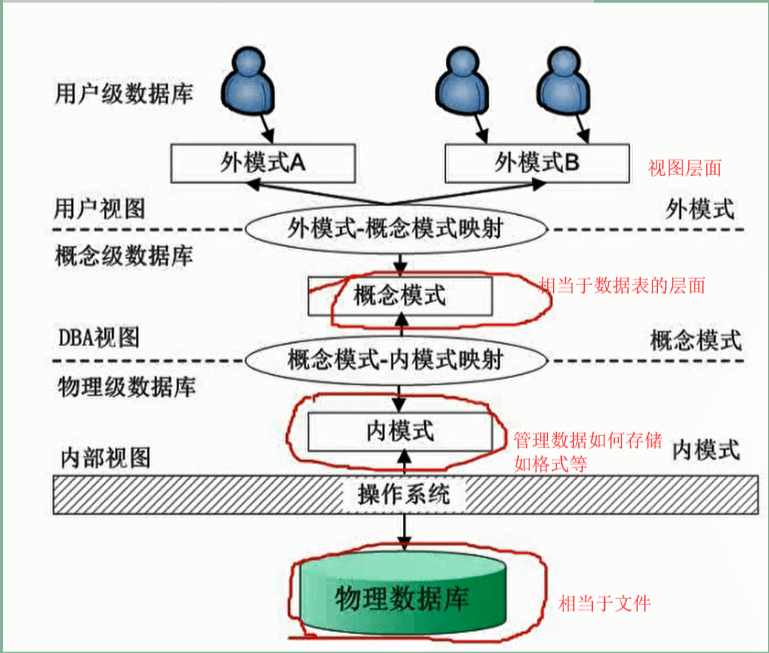

### E-R模型

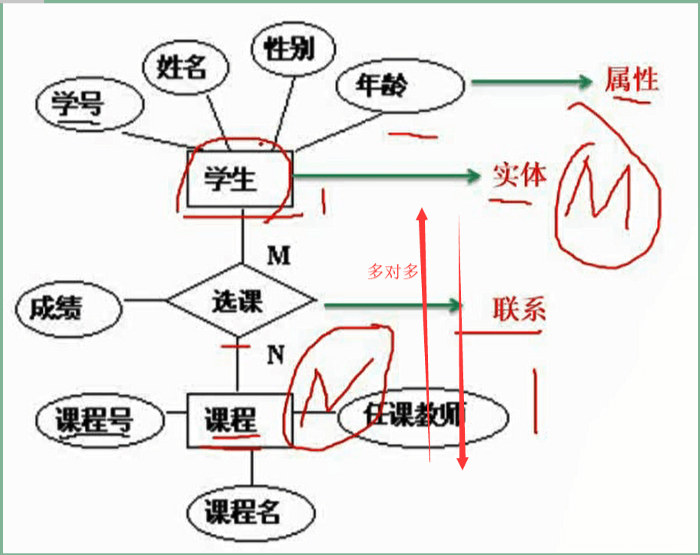

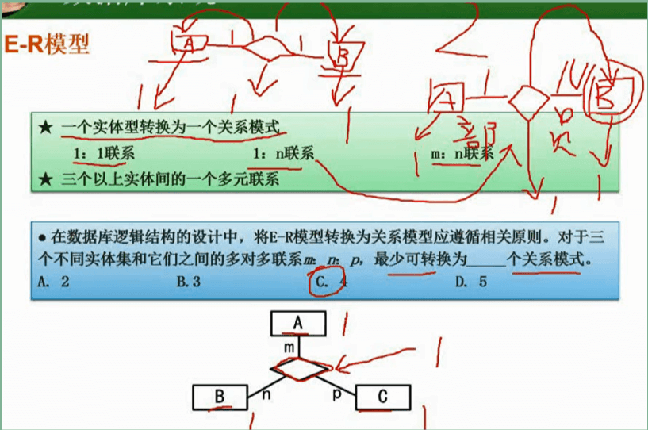

### 关系代数(选择题)

- 元组：行记录
- 笛卡尔积：R x S
- 连接 ▷◁：从两个关系的笛卡尔积结果中选取属性间满足一定条件的元组
- 投影 π：从关系中挑选若干属性组成新的关系，它对关系进行列操作
- 选择 σ：从关系中找到满足条件的所有元组的操作，即不改变关系表中的属性个数但能减少元组个数的操作，对关系进行行操作。

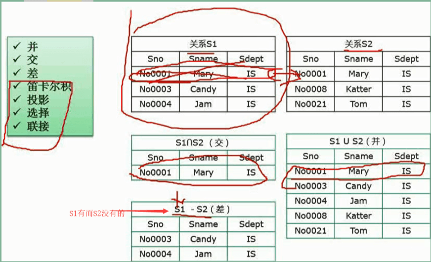

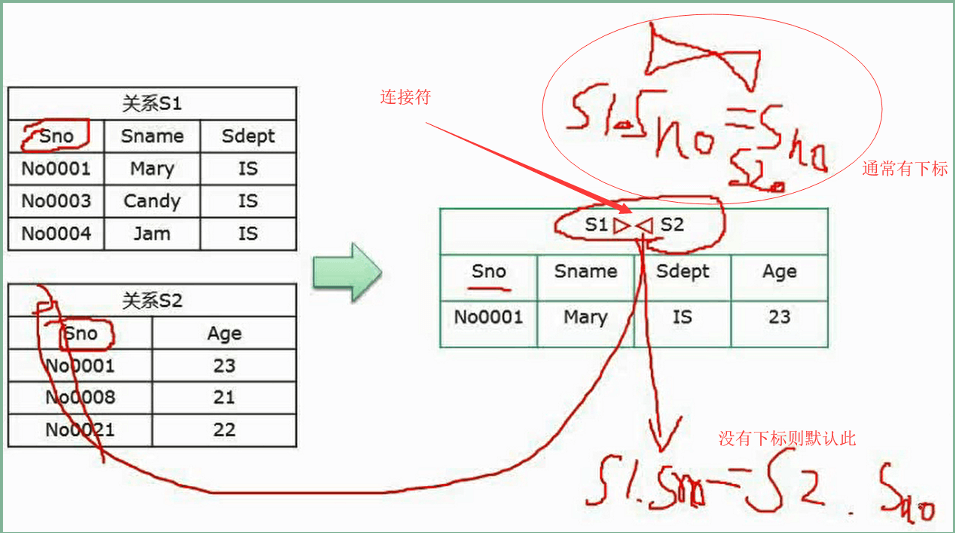

**小细节**

规范化理论_函数依赖：

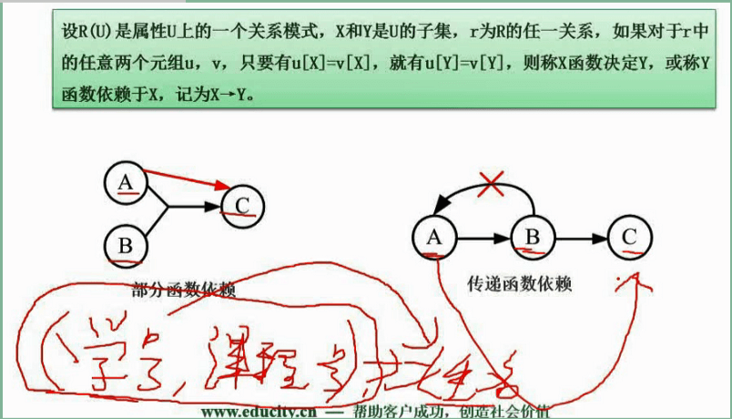

**规范化理论_候选键**

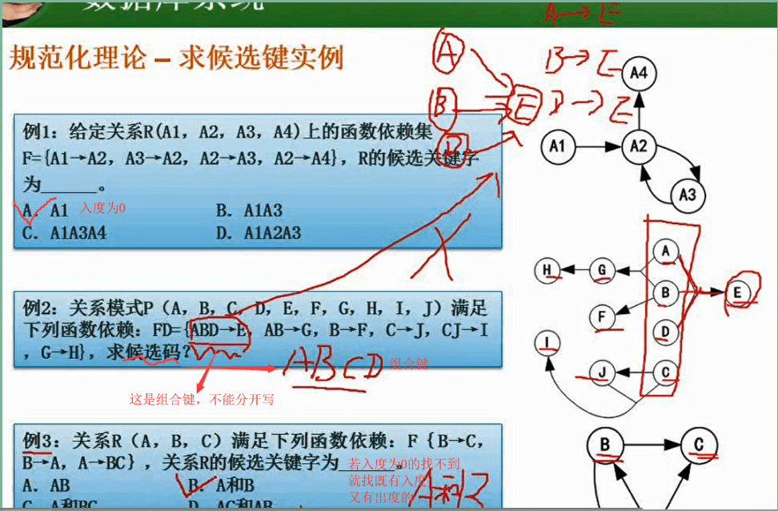

### 规范化理论_范式：重点

#### 第一范式

#### 第二范式

> 达不到第二范式，必定存在冗余、修改操作的不一致性、插入和删除异常

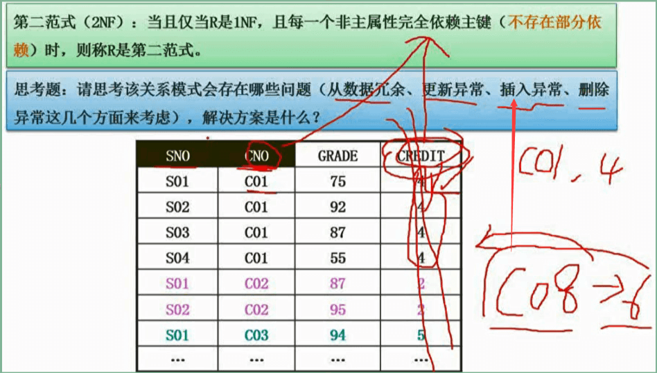

#### 第三范式

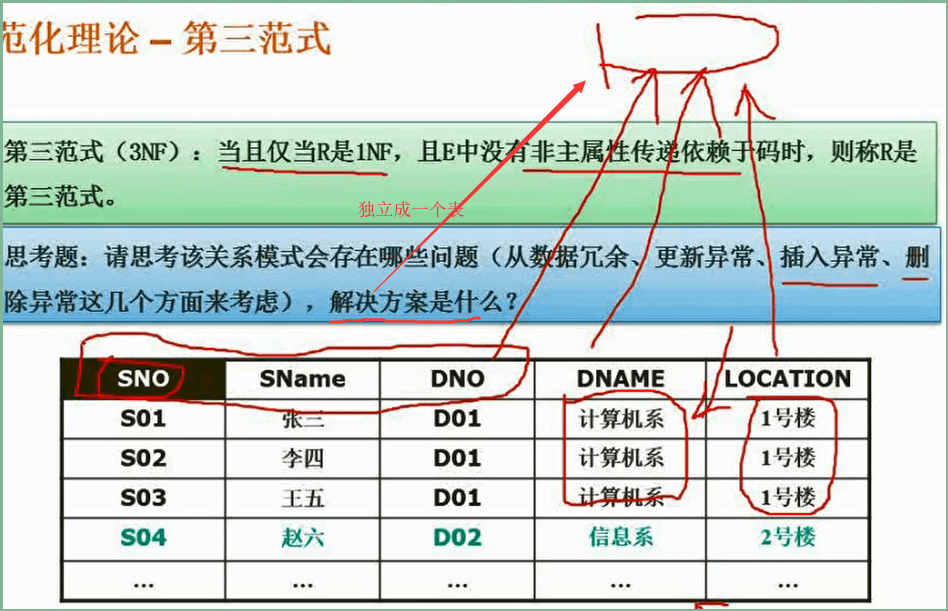

#### BC范式

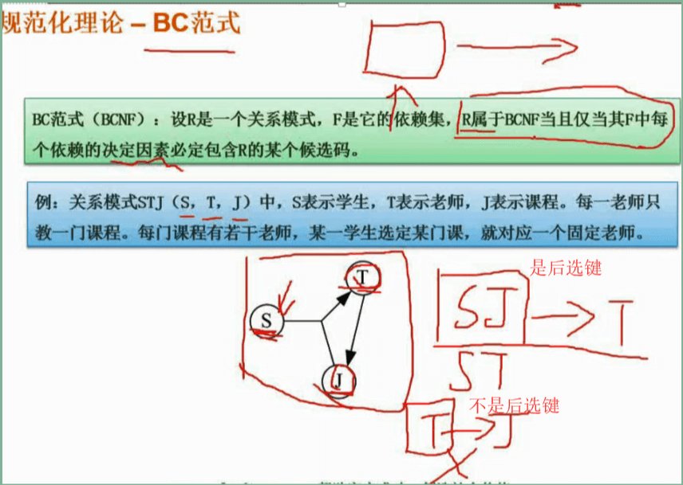

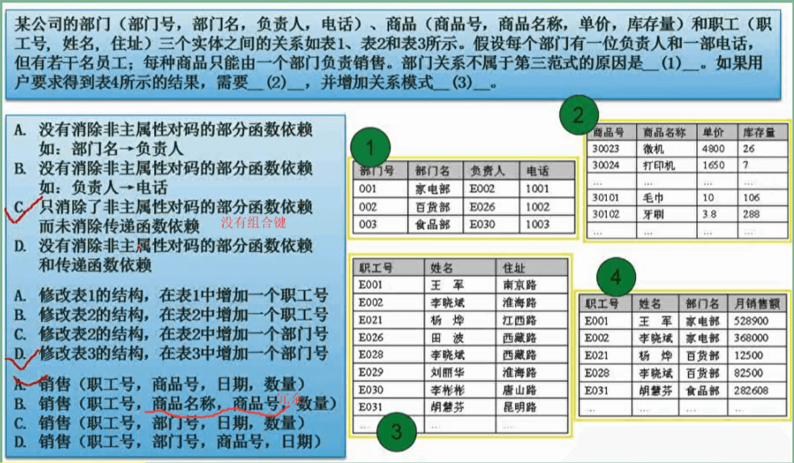

### 规范化理论_模式分解

> **无损连接**分解判定定理：`R1∩R2→R2-R1` 如：`R1(A,B) R2(B,C)`  根据定理得到 `B → C`

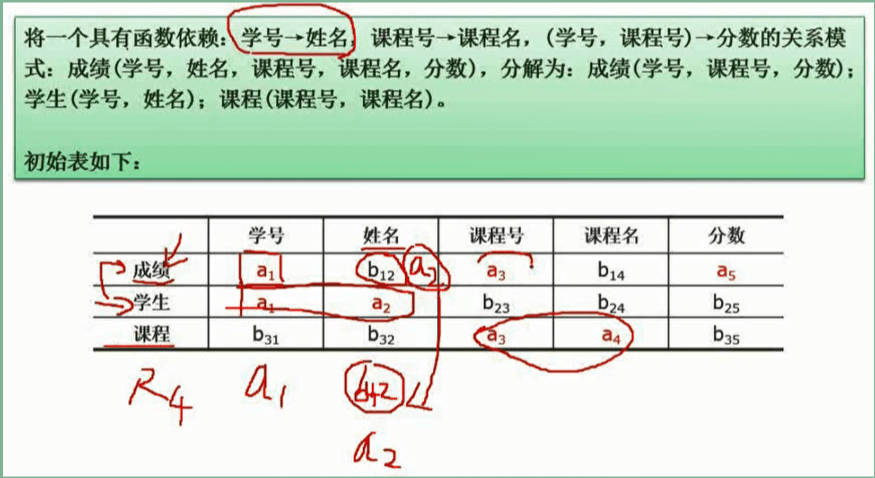

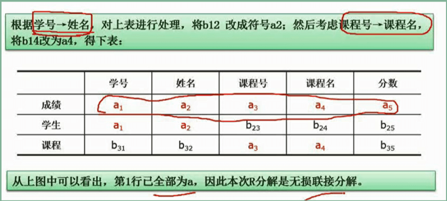

### 数据库并发控制

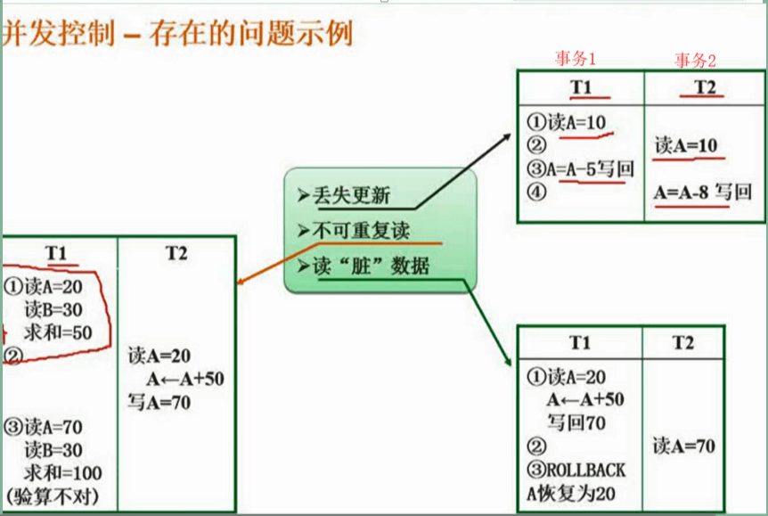

- **丢失更新**：指两个事务T1和T2读入同一数据并修改，T2提交的结果破坏了T1提交的结果，导致T1的修改被丢失
- **不能重复读**：指事务T1读取数据后，事务T2执行更新操作，使T1无法再现前一次读取结果。
- **读“脏数据”**：指事物T1修改某一数据并将其写回磁盘，事物T2读取同一数据后，T1由于某种原因被撤销，这时T1修改过的数据恢复原值，T2读到的数据与数据库中的数据不一致。

#### 解决并发控制存在的问题：

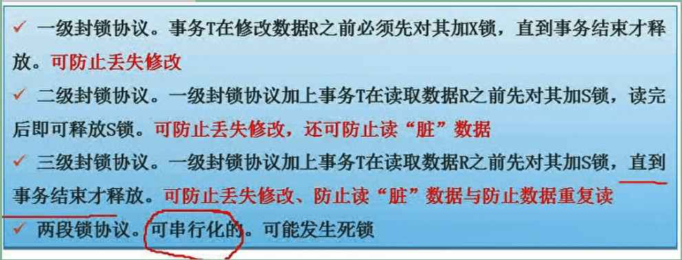

### 数据库完整性约束：(分3类)

- 实体完整性约束(主键)：表的每一行在表中是唯一的实体
- 参照完整性约束(参照其他表)：指两个表的主关键字和外关键字的数据应一致，保证了表之间数据的一致性，防止了数据丢失或无意义的数据在数据库中扩散

- 用户自定义完整性约束：针对某个特定系数据库的约束条件

上3类都解决不了的时候用 触发器

#### 数据库安全

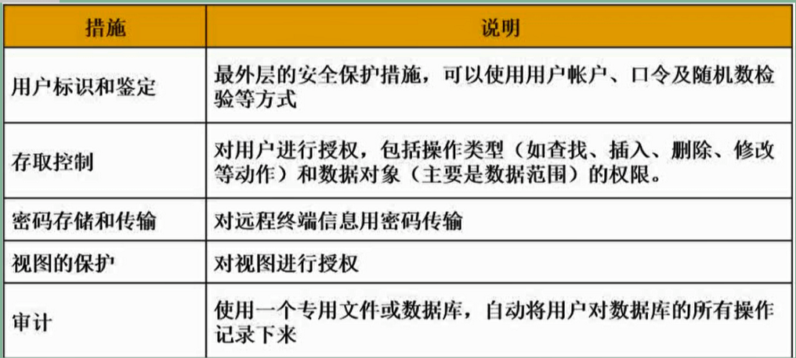

#### 数据库备份与恢复

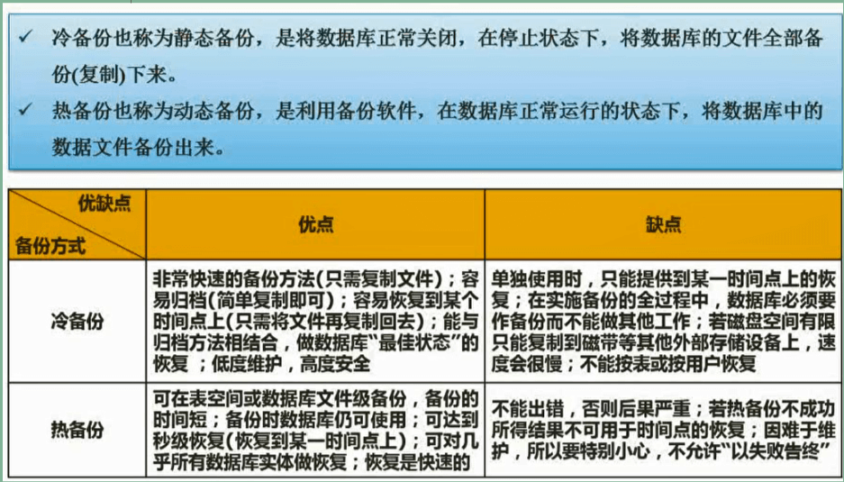

- 完全备份：
- 差量备份：优点是速度快、占用较小的时间和空间
- 增量备份：若数据库很大，事物处理十分频繁，则有用。

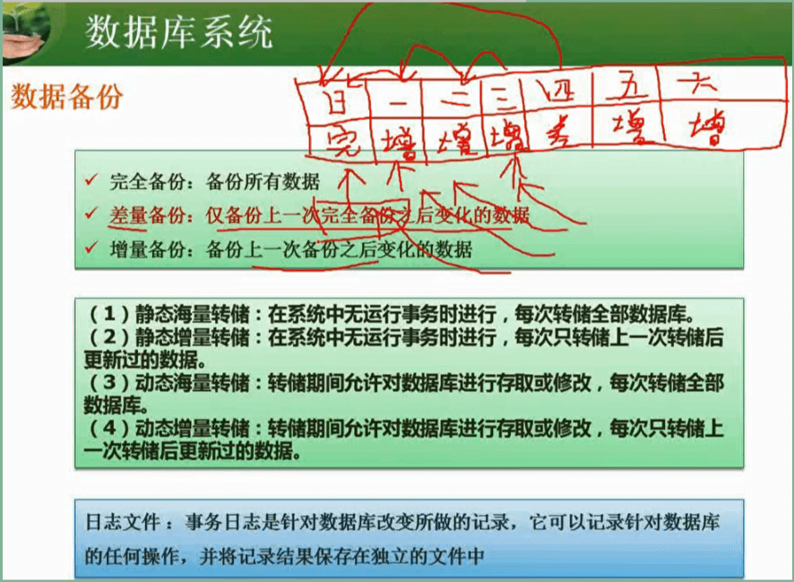

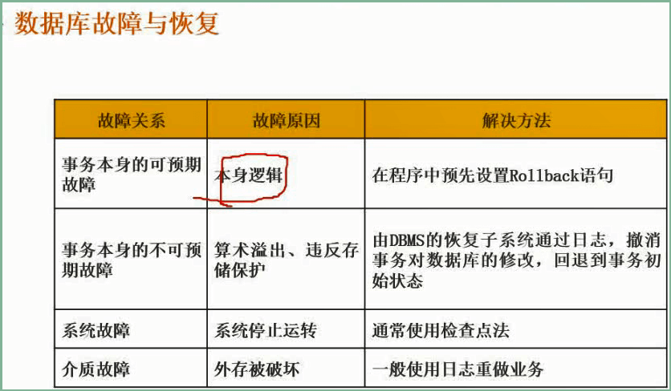

### 数据仓库与数据挖掘

#### 数据仓库的特性

- 面向主题的特性：将关于主题的数据组织起来分析数据及数据之间的关系。
- 集成：将业务系统中关于主题的数据集中起来，对数据进行一系列预处理
- 随时间变化：不进行分析数据更新操作，但数据仓库随时间变化会不断增加、删除、修改数据。

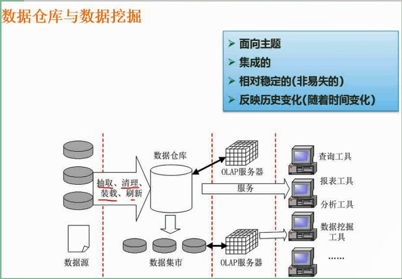

#### 反规范化技术

### 大数据

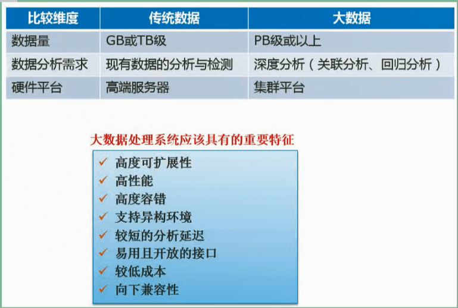