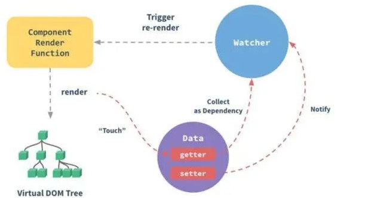

# Vue2双向绑定原理

> vue是采用**数据劫持**结合**发布者-订阅者模式**的方式，通过`Object.defineProperty()`来劫持各个属性的`setter`，`getter`，在数据变动时发布消息给订阅者，触发响应的监听回调。

**具体步骤**

**第一步：**
对需要`observer`的数据对象进行递归遍历，包括子属性对象的属性，都加上`setter`和`getter`这样的话，给这个对象的某个值赋值，就会触发`setter `，那么就能监听到了数据变化

**第二步：**
 `compile`解析模板指令，将模板中的变量替换成数据。然后初始化渲染页面视图，并将每个指令**对应的节点绑定更新函数，添加监听数据的订阅者，一旦数据有变动，收到通知，更新视图**

**第三步：**

`Watcher` 订阅者是 `Observer` 和 `Compile` 之间通信的桥梁，主要做的事情是:

- 在自身实例化时往属性订阅器(`dep`)里面添加自己
- 自身必须有一个 `update()`方法
- 待属性变动 `dep.notice()`通知时，能调用自身的 `update() `方法，并触发 `Compile` 中绑定的回调，则功成身退。

**第四步:**
MVVM 作为数据绑定的入口，整合 Observer、Compile 和 Watcher 三者，通过 Observer 来监听自己的 model 数据变化，通过 Compile 来解析编译模板指令，最终利用 Watcher 搭起 Observer 和 Compile 之间的通信桥梁，达到数据变化 -> 视图更新；视图交互变化(input) -> 数据 model 变更的双向绑定效果。

**vue双向绑定原理**

vue接收一个模板和data参数。1，首先将data中的数据进行递归遍历，对每个属性执行Object.defineProperty，定义get和set函数。并为每个属性添加一个dep数组。当get执行时，会为调用的dom节点创建一个watcher存放在该数组中。当set执行时，重新赋值，并调用dep数组的notify方法，通知所有使用了该属性watcher，并更新对应dom的内容。2，将模板加载到内存中，递归模板中的元素，检测到元素有v-开头的命令或者双大括号的指令，就会从data中取对应的值去修改模板内容，这个时候就将该dom元素添加到了该属性的dep数组中。这就实现了数据驱动视图。在处理v-model指令的时候，为该dom添加input事件（或change），输入时就去修改对应的属性的值，实现了页面驱动数据。3，将模板与数据进行绑定后，将模板添加到真实dom树中。

# Vue3的双向绑定原理

`Vue3`中要用`Proxy `代替`defineProperty`。`proxy`无论是从操作上还是底层功能上远强于`defineProperty`。`Proxy `在目标对象之前架设一层拦截，外界对象对该对象的访问，都必须先通过这层拦截，因此提供了一种机制，可以对外界的访问进行过滤和改写

**优点**：

1. 可以监听数组的变化，这个是`defineProperty`做不到的
2. 直接监听对象，而不是对象的属性，而且会生成一个新对象