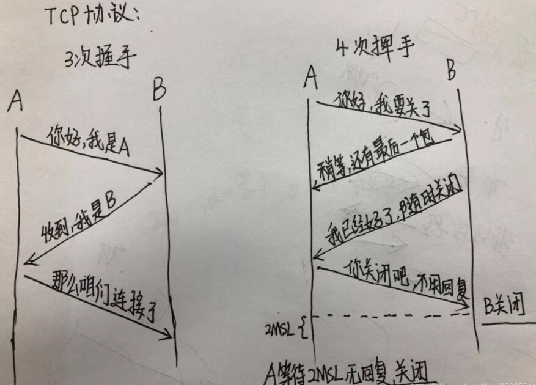
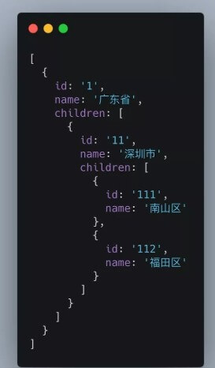

### 1. **（滴滴、饿了么）写 React / Vue 项目时为什么要在列表组件中写 key，其作用是什么？**

   key的作用是更新组件时**判断两个节点是否相同**。相同就复用，不相同就删除旧的创建新的。

   带唯一key时，如果新旧节点key不一样，不但要销毁和创建vnode，在DOM里添加移除节点对性能的影响更大。所以会才说“不带key可能性能更好”。但是这种模式只适用于**渲染简单的无状态组件**。

   **举个例子：**

   一个新闻列表，可点击列表项来将其标记为"已访问"，可通过tab切换“娱乐新闻”或是“社会新闻”。

   不带key属性的情况下，在“娱乐新闻”下选中第二项然后切换到“社会新闻”，"社会新闻"里的第二项也会是被选中的状态，因为这里复用了组件，保留了之前的状态。要解决这个问题，可以为列表项带上新闻id作为唯一key，那么每次渲染列表时都会完全替换所有组件，使其拥有正确状态。

### 2. **`['1', '2', '3'].map(parseInt)` what & why ?**

   ```js
['1', '2', '3'].map(parseInt);
// [1, NaN, NaN]
// 相当于
['1', '2', '3'].map((item,index)=>{
    // parseInt的第二个是要转换的进制，范围2~36
    // 所以实际上转给parseInt的参数分别为: '1',0   '2',1    '3',2
    // 0相当于10，十进制,1和2不在范围内,所以返回NaN
    return parseInt(item,index); 
})
   ```

### 3.（挖财）什么是防抖和节流？有什么区别？如何实现？

```js
# 节流函数(每调用一次后在规定的时间wait内不可再次调用)
function throttle(callback,wait){
    let last = Date.now();
    return function(...args){
        if((Date.now() - last) > wait){
            callback.call(this,...args);
            last = Date.now();
        }
    }
}
```

- **鼠标的点击事件，比如`mousedown`只触发一次**
- **监听滚动事件，比如是否滑到底部自动加载更多，用throttle判断**
- **比如游戏中发射子弹的频率(1秒发射一颗)**

```js
# 防抖函数(在事件被触发n秒后再执行回调，如果在这n秒内又被触发，则重新计时)
function debounce(callback, delay){
    let timer = null;
    return function(...args){
        if(timer) clearTimeout(timer);
        timer = setTimeout(function(){
            callback.apply(this, args);
        },delay)
    }
}
```

- **search搜索，用户不断输入值时，用防抖来节约Ajax请求,也就是输入框事件**。
- **window触发resize时，不断的调整浏览器窗口大小会不断的触发这个事件，用防抖来让其只触发一次**

### 4. 介绍下 Set、Map、WeakSet 和 WeakMap 的区别？

### 5. 深度优先遍历和广度优先遍历

```js
# 深度优先遍历
let deepTraversal = (node, nodeList = []) => {
  if (node !== null) {
    nodeList.push(node)
    let children = node.children
    for (let i = 0; i < children.length; i++) {
      deepTraversal(children[i], nodeList)
    }
  }
  return nodeList;
}

# 广度优先遍历
let widthTraversal = (node) => {
  let nodes = []
  let stack = []
  if (node) {
    stack.push(node)
    while (stack.length) {
      let item = stack.shift()
      let children = item.children
      nodes.push(item)
      // 队列，先进先出
      for (let i = 0; i < children.length; i++) {
        stack.push(children[i])
      }
    }
  }
  return nodes
}
```

### 6. 请分别用深度优先思想和广度优先思想实现一个拷贝函数？

```js
# 深度优先的深拷贝
let DFSdeepClone = (obj, visitedArr = []) => {
  let _obj = {}
  if (isTypeOf(obj, 'array') || isTypeOf(obj, 'object')) {
    let index = visitedArr.indexOf(obj)
    _obj = isTypeOf(obj, 'array') ? [] : {}
    if (~index) { // 判断环状数据 ~-1 == 0 一个骚操作而已
      _obj = visitedArr[index]
    } else {
      visitedArr.push(obj)
      for (let item in obj) {
        _obj[item] = DFSdeepClone(obj[item], visitedArr)
      }
    }
  } else if (isTypeOf(obj, 'function')) {
    _obj = eval('(' + obj.toString() + ')');
  } else {
    _obj = obj
  }
  return _obj
}

# 广度优先的深拷贝
let BFSdeepClone = (obj) => {
    let origin = [obj],
      copyObj = {},
      copy = [copyObj]
      // 去除环状数据
    let visitedQueue = [],
      visitedCopyQueue = []
    while (origin.length > 0) {
      let items = origin.shift(),
        _obj = copy.shift()
      visitedQueue.push(items)
      if (isTypeOf(items, 'object') || isTypeOf(items, 'array')) {
        for (let item in items) {
          let val = items[item]
          if (isTypeOf(val, 'object')) {
            let index = visitedQueue.indexOf(val)
            if (!~index) {
              _obj[item] = {}
                //下次while循环使用给空对象提供数据
              origin.push(val)
                // 推入引用对象
              copy.push(_obj[item])
            } else {
              _obj[item] = visitedCopyQueue[index]
              visitedQueue.push(_obj)
            }
          } else if (isTypeOf(val, 'array')) {
            // 数组类型在这里创建了一个空数组
            _obj[item] = []
            origin.push(val)
            copy.push(_obj[item])
          } else if (isTypeOf(val, 'function')) {
            _obj[item] = eval('(' + val.toString() + ')');
          } else {
            _obj[item] = val
          }
        }
        // 将已经处理过的对象数据推入数组 给环状数据使用
        visitedCopyQueue.push(_obj)
      } else if (isTypeOf(items, 'function')) {
        copyObj = eval('(' + items.toString() + ')');
      } else {
        copyObj = obj
      }
    }
  return copyObj
}
```

### 7. ES5/ES6 的继承除了写法以外还有什么区别？

### 8. setTimeout、Promise、Async/Await 的区别

### 9.（头条、微医）Async/Await 如何通过同步的方式实现异步

### 10.（头条）异步笔试题

> 请写出下面代码的运行结果

```js
async function async1() {
    console.log('async1 start');
    await async2();
    console.log('async1 end');
}
async function async2() {
    console.log('async2');
}
console.log('script start');
setTimeout(function() {
    console.log('setTimeout');
}, 0)
async1();
new Promise(function(resolve) {
    console.log('promise1');
    resolve();
}).then(function() {
    console.log('promise2');
});
console.log('script end');

> script start
> async1 start
> async2
> promise1
> script end
> async1 end
> promise2
> setTimeout
```

### 11. （携程）算法手写题

> 已知如下数组：**var arr = [ [1, 2, 2], [3, 4, 5, 5], [6, 7, 8, 9, [11, 12, [12, 13, [14] ] ] ], 10];**
> 编写一个程序将数组扁平化去并除其中重复部分数据，最终得到一个升序且不重复的数组

```js
Array.from(new Set(arr.flat(Infinity))).sort((a, b) => { return a - b })
> [1, 2, 3, 4, 5, 6, 7, 8, 9, 10, 11, 12, 13, 14]
```

`flat()` 方法会按照一个可指定的深度递归遍历数组，并将所有元素与遍历到的子数组中的元素合并为一个新数组返回。

### 12. （滴滴、挖财、微医、海康）JS 异步解决方案的发展历程以及优缺点。

### 13.（微医）Promise 构造函数是同步执行还是异步执行，那么 then 方法呢？

### 14. （兑吧）情人节福利题，如何实现一个 new

要手动实现一个 new 操作符，首先要知道 new 操作符都做了什么事，即构造函数的内部原理：

1. 创建一个新对象；
2. 链接到原型（将构造函数的 prototype 赋值给新对象的 __proto__）；
3. 绑定this（构造函数中的this指向新对象并且调用构造函数）
4. 返回新对象

```js
function newFn(fn) {
    // 创建一个新对象,并将这个对象的__proto__指向构造函数的prototype
    var obj = {
        __proto__: fn.prototype
    };
    // 将构造函数的this指向这个新对象
    var res = fn.apply(obj, Array.prototype.slice.call(arguments, 1));
    // 判断构造函数是否有返回值
    if ((typeof res === "object" || typeof res === "function") && res !== null) {
        return res ;
    }
    // 返回这个新对象
    return obj;
}

function Person(name, age) {
    this.name = name;
    this.age = age;
}

var p = newFn(Person, 'cao', 22);
```

### 15. （网易）简单讲解一下http2的多路复用

### 16. 谈谈你对TCP三次握手和四次挥手的理解

| 字段 | 含义                                                         |
| ---- | ------------------------------------------------------------ |
| URG  | 紧急指针是否有效。为1，表示某一位需要被优先处理              |
| ACK  | 确认号是否有效，一般置为1                                    |
| RSH  | 提示接收端应用程序立即从TCP缓冲区把数据读走                  |
| RST  | 对方要求重新建立连接，复位                                   |
| SYN  | 请求建立连接，并将其序列号的字段进行序列号的初始值设定。建立连接，设置为1 |
| FIN  | 希望断开连接                                                 |



#### 三次握手


1. **第一次握手**：建立连接时，客户端发送syn包（syn=j）到服务器，并进入SYN_SENT状态，等待服务器确认；SYN：同步序列编号

2. **第二次握手**：服务器收到syn包，必须确认客户的SYN（ack=j+1），同时自己也发送一个SYN包（syn=k），即SYN+ACK包，此时服务器进入SYN_RECV状态；
3. **第三次握手**：客户端收到服务器的SYN+ACK包，向服务器发送确认包ACK(ack=k+1），此包发送完毕，客户端和服务器进入ESTABLISHED（TCP连接成功）状态，完成三次握手。

#### 四次挥手


1. **A**：B，不好意思，我这边需要关闭连接了，你准备一下？(发了一个fin信号给B，等待回应)

2. **B**：好的A，我收到你的关闭信号了，我还有数据没发好，你等我下（回应A，带回去ACK的最后一个信息，失败可以重发）
3. **B**：A老弟，我好了，我可以关闭了，给你最后说一下，等下你回应我的话，我就直接关了；

4. **A**：好的老哥，我回应你一下，你收到就关闭吧，不用理我(发完这条信息后，进入time_wait状态)。

   B收到ack信息，直接就关闭了，此过程不产生数据的交互

   A等待2MSL(最大报文段生存时间)后，B没东西给过来，我也关了

#### 为什么握手需要三次，而挥手却需要四次？

握手的时候，A和B打个招呼，B可以直接把自己的SYN信息和对A的回应ACK信息一起带上，但是挥手的时候，A说我要断开了，B还没发完最后的数据，因此需要先回应一下A，我收到你的断开的请求了，但是你要等我把最后的内容给你，所以这里分开了2步： （1）回应A； （2）发送自己的最后一个数据

#### 为什么A进入TIME_WAIT需要等待最大报文段生存的时间后，才能关闭？

原因是，担心网络不可靠而导致的丢包，最后一个回应B的ACK万一丢了怎么办，在这个时间内，A是可以重新发包的，但是超过了最大等待时间的话，就算收不到也没用了，所以就可以关闭了。

### 17. A、B 机器正常连接后，B 机器突然重启，问 A 此时处于 TCP 什么状态

> 如果A 与 B 建立了正常连接后，从未相互发过数据，这个时候 B 突然机器重启，问 A 此时处于 TCP 什么状态？如何消除服务器程序中的这个状态？（超纲题，了解即可）

### 18. （微医）React 中 setState 什么时候是同步的，什么时候是异步的？

### 19. React setState 笔试题，下面的代码输出什么？

```react
class Example extends React.Component {
    constructor() {
        super();
        this.state = {
            val: 0
        };
    }

    componentDidMount() {
        this.setState({val: this.state.val + 1});
        console.log(this.state.val);    // 第 1 次 log

        this.setState({val: this.state.val + 1});
        console.log(this.state.val);    // 第 2 次 log

        setTimeout(() => {
            this.setState({val: this.state.val + 1});
            console.log(this.state.val);  // 第 3 次 log

            this.setState({val: this.state.val + 1});
            console.log(this.state.val);  // 第 4 次 log
        }, 0);
    }

    render() {
        return null;
    }
};
```

### 20. 介绍下 npm 模块安装机制，为什么输入 npm install 就可以自动安装对应的模块？

### 21. 有以下 3 个判断数组的方法，请分别介绍它们之间的区别和优劣

> **Object.prototype.toString.call() 、 instanceof 以及 Array.isArray()**

### 22. 介绍下重绘和回流（Repaint & Reflow），以及如何进行优化

### 23. 介绍下观察者模式和订阅-发布模式的区别，各自适用于什么场景

### 24. 聊聊 Redux 和 Vuex 的设计思想

### 25. 说说浏览器和 Node 事件循环的区别

### 26. 介绍模块化发展历程

> 可从IIFE、AMD、CMD、CommonJS、UMD、webpack(require.ensure)、ES Module、`<script type="module">` 这几个角度考虑。

### 27. 全局作用域中，用 const 和 let 声明的变量不在 window 上，那到底在哪里？如何去获取？。

### 28. cookie 和 token 都存放在 header 中，为什么不会劫持 token？

### 29. 聊聊 Vue 的双向数据绑定，Model 如何改变 View，View 又是如何改变 Model 的

### 30. 两个数组合并成一个数组

> 请把两个数组 **['A1', 'A2', 'B1', 'B2', 'C1', 'C2', 'D1', 'D2'] 和 ['A', 'B', 'C', 'D']，合并为 ['A1', 'A2', 'A', 'B1', 'B2', 'B', 'C1', 'C2', 'C', 'D1', 'D2', 'D']**。

### 31. 改造下面的代码，使之输出0 - 9，写出你能想到的所有解法。

```js
for (var i = 0; i< 10; i++){
    setTimeout(() => {
        console.log(i);
    }, 1000)
}
```

### 32. Virtual DOM 真的比操作原生 DOM 快吗？谈谈你的想法。

### 33. **下面的代码打印什么内容，为什么？**

```js
var b = 10;
(function b(){
    b = 20;
    console.log(b); 
})();
// 打印如下
ƒ b(){
    b = 20;
    console.log(b); 
}
```

**解释：**

```js
var b = 10;
(function b() {
    // 内部作用域，会先去查找是有已有变量b的声明，有就直接赋值20，确实有了呀。发现了具名函数 function b(){}，拿此b做赋值；
    // IIFE的函数无法进行赋值（内部机制，类似const定义的常量），所以无效。
    b = 20;
    console.log(b); // [Function b]
    console.log(window.b); // 10，不是20
})()
```

所以严格模式下能看到错误：`Uncaught TypeError: Assignment to constant variable`

```js
var b = 10;
(function b() {
	'use strict'
	b = 20;
	console.log(b)
})() // "Uncaught TypeError: Assignment to constant variable."
```

有`window`：

```js
var b = 10;
(function b() {
    window.b = 20; 
    console.log(b); // [Function b]
    console.log(window.b); // 20是必然的
})();
```

有`var`:

```js
var b = 10;
(function b() {
    var b = 20; // IIFE内部变量
    console.log(b); // 20
   	console.log(window.b); // 10 
})();
```

### 34. 浏览器缓存读取规则

> 可以分成 Service Worker、Memory Cache、Disk Cache 和 Push Cache，那请求的时候 from memory cache 和 from disk cache 的依据是什么，哪些数据什么时候存放在 Memory Cache 和 Disk Cache中？

### 35. 使用迭代的方式实现 flatten 函数。

### 36. 为什么 Vuex 的 mutation 和 Redux 的 reducer 中不能做异步操作？

### 37. （京东）下面代码中 a 在什么情况下会打印 1？

```text
var a = ?;
if(a == 1 && a == 2 && a == 3){
     console.log(1);
}
```

**考察的是类型的隐式转换,考引用类型在比较运算符时候,隐式转换会调用本类型toString或valueOf方法. 而`==`会进行隐式类型转换，所以我们只要重写`toString()`或者`valueOf()`方法就可以了**

```js
# 方法一
var a = {
    i: 1,
    toString() {
        return a.i++;
    }
}
if( a == 1 && a == 2 && a == 3 ) {
    console.log(1);
}
# 方法二
var a = {
    i: 1,
    valueOf() {
        return a.i++;
    }
}
if( a == 1 && a == 2 && a == 3 ) {
    console.log(1);
}
# 方法三
var a = [1,2,3];
a.toString = a.shift;
if( a == 1 && a == 2 && a == 3 ) {
    console.log(1);
}
# 方法四
var a = {[Symbol.toPrimitive]:((i) => () => ++i)(0)};
if( a == 1 && a == 2 && a == 3 ) {
    console.log(1);
}
# 方法五
Object.defineProperty(window, 'a', {
    get: function(){
        return this.value = this.value ? (this.value += 1):1;
    }
});
if( a == 1 && a == 2 && a == 3 ) {
    console.log(1);
}
```

### 38. 介绍下 BFC 及其应用。

### 39. 在 Vue 中，子组件为何不可以修改父组件传递的 Prop。如果修改了，Vue 是如何监控到属性的修改并给出警告的

### 40. 下面代码输出什么

```js
var a = 10;
(function () {
    console.log(a)
    a = 5
    console.log(window.a)
    var a = 20;
    console.log(a)
})()
> undefined
> 10
> 20
```

### 41. （喜马拉雅）实现一个 sleep 函数

> 比如 sleep(1000) 意味着等待1000毫秒，可从 Promise、Generator、Async/Await 等角度实现

### 42. 使用 sort() 对数组 [3, 15, 8, 29, 102, 22] 进行排序，输出结果

```js
[3, 15, 8, 29, 102, 22].sort()
> [102, 15, 22, 29, 3, 8]
```

### 43. 介绍 HTTPS 握手过程

### 44. HTTPS 握手过程中，客户端如何验证证书的合法性

### 45. 输出以下代码执行的结果并解释为什么

```js
var obj = {
    '2': 3,
    '3': 4,
    'length': 2,
    'splice': Array.prototype.splice,
    'push': Array.prototype.push
}
obj.push(1)
obj.push(2)
console.log(obj)
> [empty, empty, 1, 2, splice: ƒ, push: ƒ]
```

### 46. 双向绑定和 vuex 是否冲突

### 47. call 和 apply 的区别是什么，哪个性能更好一些

### 48. 为什么通常在发送数据埋点请求的时候使用的是 1x1 像素的透明 gif 图片？

### 49. （百度）实现 (5).add(3).minus(2) 功能

> 例：5 + 3 - 2，结果为 6

### 50. Vue 的响应式原理中 Object.defineProperty 有什么缺陷？为什么在 Vue3.0 采用了 Proxy，抛弃了 Object.defineProperty？

### 51.怎么让一个 div 水平垂直居中

### 52.输出以下代码的执行结果并解释为什么

```js
var a = {n: 1};
var b = a;
a.x = a = {n: 2};

console.log(a.x) // undefined 
console.log(b.x) // {n: 2}
a //{n: 2}
b //{n: 1,x: {n: 2}}
```

### 53.冒泡排序如何实现，时间复杂度是多少， 还可以如何改进？

### 54.某公司 1 到 12 月份的销售额存在一个对象里面

> 如下：{1:222, 2:123, 5:888}，请把数据处理为如下结构：[222, 123, null, null, 888, null, null, null, null, null, null, null]。

### 55.要求设计 LazyMan 类，实现以下功能。

```js
LazyMan('Tony');
// Hi I am Tony

LazyMan('Tony').sleep(10).eat('lunch');
// Hi I am Tony
// 等待了10秒...
// I am eating lunch

LazyMan('Tony').eat('lunch').sleep(10).eat('dinner');
// Hi I am Tony
// I am eating lunch
// 等待了10秒...
// I am eating diner

LazyMan('Tony').eat('lunch').eat('dinner').sleepFirst(5).sleep(10).eat('junk food');
// Hi I am Tony
// 等待了5秒...
// I am eating lunch
// I am eating dinner
// 等待了10秒...
// I am eating junk food
```

### 56.分析比较 opacity: 0、visibility: hidden、display: none 优劣和适用场景。

### 57.箭头函数与普通函数（function）的区别是什么？构造函数（function）可以使用 new 生成实例，那么箭头函数可以吗？为什么？

### 58.给定两个数组，写一个方法来计算它们的交集。

> 例如：给定 nums1 = [1, 2, 2, 1]，nums2 = [2, 2]，返回 [2, 2]。

### 59.已知如下代码，如何修改才能让图片宽度为 300px ？注意下面代码不可修改。

> ``

### 60.介绍下如何实现 token 加密

### 61.redux 为什么要把 reducer 设计成纯函数

### 62.如何设计实现无缝轮播

### 63.模拟实现一个 Promise.finally

### 64.`a.b.c.d` 和 `a['b']['c']['d']`，哪个性能更高？

### 65.ES6 代码转成 ES5 代码的实现思路是什么

### 66.数组编程题

> 随机生成一个长度为 10 的整数类型的数组，例如 `[2, 10, 3, 4, 5, 11, 10, 11, 20]`，将其排列成一个新数组，要求新数组形式如下，例如 `[[2, 3, 4, 5], [10, 11], [20]]`。

### 67.如何解决移动端 Retina 屏 1px 像素问题

### 68.如何把一个字符串的大小写取反（大写变小写小写变大写），例如 ’AbC' 变成 'aBc'

### 69.介绍下 webpack 热更新原理，是如何做到在不刷新浏览器的前提下更新页面的

### 70.实现一个字符串匹配算法，从长度为 n 的字符串 S 中，查找是否存在字符串 T，T 的长度是 m，若存在返回所在位置。

### 71.为什么普通 `for` 循环的性能远远高于 `forEach` 的性能，请解释其中的原因。

### 72.介绍下 BFC、IFC、GFC 和 FFC

### 73.使用 JavaScript Proxy 实现简单的数据绑定

### 74.数组里面有10万个数据，取第一个元素和第10万个元素的时间相差多少

### 75.输出以下代码运行结果

```js
// example 1
var a={}, b='123', c=123;  
a[b]='b';
a[c]='c';  
console.log(a[b]); // c
// a = {123: "c"}

---------------------
// example 2
var a={}, b=Symbol('123'), c=Symbol('123');  
a[b]='b';
a[c]='c';  
console.log(a[b]); // b
// a = {Symbol(123): "b", Symbol(123): "c"}

---------------------
// example 3
var a={}, b={key:'123'}, c={key:'456'};  
a[b]='b';
a[c]='c';  
console.log(a[b]); // c
// a={[object Object]: "c"}
// 因为键名称只能是字符串，b/c单做键会调用toString得到的都是[object Object]
```

### 76.算法题「旋转数组」

> 给定一个数组，将数组中的元素向右移动 k 个位置，其中 k 是非负数。

示例 1：

```text
输入: [1, 2, 3, 4, 5, 6, 7] 和 k = 3
输出: [5, 6, 7, 1, 2, 3, 4]
解释:
向右旋转 1 步: [7, 1, 2, 3, 4, 5, 6]
向右旋转 2 步: [6, 7, 1, 2, 3, 4, 5]
向右旋转 3 步: [5, 6, 7, 1, 2, 3, 4]
```

示例 2：

```text
输入: [-1, -100, 3, 99] 和 k = 2
输出: [3, 99, -1, -100]
解释: 
向右旋转 1 步: [99, -1, -100, 3]
向右旋转 2 步: [3, 99, -1, -100]
```

### 77.Vue 的父组件和子组件生命周期钩子执行顺序是什么

### 78.input 搜索如何防抖，如何处理中文输入

### 79.介绍下 Promise.all 使用、原理实现及错误处理

### 80.打印出 1 - 10000 之间的所有对称数

> 例如：121、1331 等

### 81.周一算法题之「移动零」

> 给定一个数组 nums，编写一个函数将所有 0 移动到数组的末尾，同时保持非零元素的相对顺序。
> 示例:
> 输入: [0,1,0,3,12]
> 输出: [1,3,12,0,0]
>
> 说明:

1. 必须在原数组上操作，不能拷贝额外的数组。
2. 尽量减少操作次数。

### 82.var、let 和 const 区别的实现原理是什么

### 83.请实现一个 add 函数，满足以下功能。

> add(1); // 1
> add(1)(2); // 3
> add(1)(2)(3)；// 6
> add(1)(2, 3); // 6
> add(1, 2)(3); // 6
> add(1, 2, 3); // 6

### 84. react-router 里的 `link` 标签和 `a` 标签有什么区别

> 如何禁掉 `<a>` 标签默认事件，禁掉之后如何实现跳转。

### 85.（京东、快手）周一算法题之「两数之和」

给定一个整数数组和一个目标值，找出数组中和为目标值的两个数。

你可以假设每个输入只对应一种答案，且同样的元素不能被重复利用。

示例：

```text
给定 nums = [2, 7, 11, 15], target = 9

因为 nums[0] + nums[1] = 2 + 7 = 9
所以返回 [0, 1]
```

### 86.在输入框中如何判断输入的是一个正确的网址。

### 87.实现 convert 方法，把原始 list 转换成树形结构，要求尽可能降低时间复杂度

以下数据结构中，id 代表部门编号，name 是部门名称，parentId 是父部门编号，为 0 代表一级部门，现在要求实现一个 convert 方法，把原始 list 转换成树形结构，parentId 为多少就挂载在该 id 的属性 children 数组下，结构如下：

```js
// 原始 list 如下
let list =[
    {id:1,name:'部门A',parentId:0},
    {id:2,name:'部门B',parentId:0},
    {id:3,name:'部门C',parentId:1},
    {id:4,name:'部门D',parentId:1},
    {id:5,name:'部门E',parentId:2},
    {id:6,name:'部门F',parentId:3},
    {id:7,name:'部门G',parentId:2},
    {id:8,name:'部门H',parentId:4}
];
const result = convert(list, ...);

// 转换后的结果如下
let result = [
    {
      id: 1,
      name: '部门A',
      parentId: 0,
      children: [
        {
          id: 3,
          name: '部门C',
          parentId: 1,
          children: [
            {
              id: 6,
              name: '部门F',
              parentId: 3
            }, {
              id: 16,
              name: '部门L',
              parentId: 3
            }
          ]
        },
        {
          id: 4,
          name: '部门D',
          parentId: 1,
          children: [
            {
              id: 8,
              name: '部门H',
              parentId: 4
            }
          ]
        }
      ]
    },
  ···
];
```

### 88.设计并实现 Promise.race()

### 89.实现模糊搜索结果的关键词高亮显示


### 90.介绍下 HTTPS 中间人攻击

### 91.已知数据格式，实现一个函数 fn 找出链条中所有的父级 id

```js
const value = '112'
const fn = (value) => {
...
}
fn(value) // 输出 [1， 11， 112]
```




### 92.给定两个大小为 m 和 n 的有序数组 nums1 和 nums2。请找出这两个有序数组的中位数。要求算法的时间复杂度为 O(log(m+n))。

示例 1：

```js
nums1 = [1, 3]
nums2 = [2]
```

中位数是 2.0

示例 2：

```js
nums1 = [1, 2]
nums2 = [3, 4]
```

中位数是(2 + 3) / 2 = 2.5

### 93.vue 在 v-for 时给每项元素绑定事件需要用事件代理吗？为什么？

### 94.模拟实现一个深拷贝，并考虑对象相互引用以及 Symbol 拷贝的情况

### 95.介绍下前端加密的常见场景和方法

### 96.React 和 Vue 的 diff 时间复杂度从 O(n^3) 优化到 O(n) ，那么 O(n^3) 和 O(n) 是如何计算出来的？

### 97.（京东）写出如下代码的打印结果

```js
function changeObjProperty(o) {
    // 形参相当于 o = webSite = new Object();
  o.siteUrl = "http://www.baidu.com"
  o = new Object() // 形参 o 的指向发生改变，指向堆内存中一个新的对象
  o.siteUrl = "http://www.google.com"
  console.log(a); // {siteUrl: "http://www.google.com"}
} 
let webSite = new Object();
changeObjProperty(webSite);
console.log(webSite.siteUrl); // http://www.baidu.com
```

### 98.（bilibili）编程算法题

> 用 JavaScript 写一个函数，输入 int 型，返回整数逆序后的字符串。如：输入整型 1234，返回字符串“4321”。要求必须使用递归函数调用，不能用全局变量，输入函数必须只有一个参数传入，必须返回字符串。

```js
function fun(num){
    let num1 = num / 10;
    let num2 = num % 10;
    if(num1<1){
        return num;
    }else{
        num1 = Math.floor(num1)
        return `${num2}${fun(num1)}`
    }
}
var a = fun(12345)
console.log(a)
console.log(typeof a)
```

### 99.（京东）请写出如下代码的打印结果

```js
function Foo() {
    Foo.a = function() {
        console.log(1)
    }
    this.a = function() {
        console.log(2)
    }
}
Foo.prototype.a = function() {
    console.log(3)
}
Foo.a = function() {
    console.log(4)
}
Foo.a(); // 4
let obj = new Foo();
/* 这里调用了 Foo 的构建方法。Foo 的构建方法主要做了两件事：
1. 将全局的 Foo 上的直接方法 a 替换为一个输出 1 的方法。
2. 在新对象上挂载直接方法 a ，输出值为 2。
*/
obj.a(); // 2
// 因为有实例方法 a ，不需要去访问原型链，所以使用的是构建方法里所定义的 this.a，
// # 输出 2
Foo.a(); // 1
// 构建方法里已经替换了全局 Foo 上的 a 方法，所以
// # 输出 1
```

