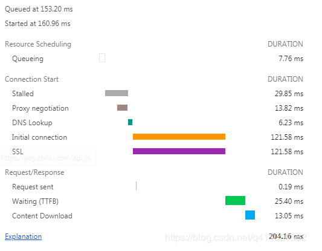

## 1. 减少 HTTP 请求

一个完整的 HTTP 请求需要经历:

1. **DNS 查找**
2. **TCP 握手**
3. **浏览器发出 HTTP 请求**
4. **服务器接收请求，服务器处理请求并发回响应**
5. **浏览器接收响应等过程**

接下来看一个 HTTP 请求，请求的文件大小为 28.4KB ：



- **Queueing**: 在请求队列中的时间。
- **Stalled**: 从TCP 连接建立完成，到真正可以传输数据之间的时间差，此时间包括代理协商时间。
- **Proxy negotiation**: 与代理服务器连接进行协商所花费的时间。
- **DNS Lookup**: 执行DNS查找所花费的时间，页面上的每个不同的域都需要进行DNS查找。
- **Initial Connection / Connecting**: 建立连接所花费的时间，包括TCP握手/重试和协商SSL。
- **SSL**: 完成SSL握手所花费的时间。
- **Request sent**: 发出网络请求所花费的时间，通常为一毫秒的时间。
- **Waiting(TFFB)**: TFFB 是发出页面请求到接收到应答数据第一个字节的时间。
- **Content Download**: 接收响应数据所花费的时间。

从这个例子可以看出，**真正下载数据的时间占比为 `13.05 / 204.16 = 6.39%`，文件越小，这个比例越小，文件越大，比例就越高。**这就是为什么要建议将多个小文件合并为一个大文件，从而减少 HTTP 请求次数的原因。

## 2. 使用 HTTP2

启用HTTP2:https://www.kancloud.cn/kancloud/get-to-know-http-2-in-10-minutes/96601

HTTP2 相比 HTTP1.1 有如下几个优点：

1. #### 解析速度快

   服务器解析 HTTP1.1 的请求时，必须不断地读入字节，直到遇到分隔符 CRLF 为止。而解析 HTTP2 的请求就不用这么麻烦，因为 HTTP2 是基于帧的协议，每个帧都有表示帧长度的字段。

2. #### 多路复用

   HTTP1.1 如果要同时发起多个请求，就得建立多个 TCP 连接，因为一个 TCP 连接同时只能处理一个 HTTP1.1 的请求。

   在 HTTP2 上，多个请求可以共用一个 TCP 连接，这称为多路复用。同一个请求和响应用一个流来表示，并有唯一的流 ID 来标识。 多个请求和响应在 TCP 连接中可以乱序发送，到达目的地后再通过流 ID 重新组建。

3. #### 首部压缩

   例如有如下两个请求：

   ```http
   :authority: unpkg.zhimg.com
   :method: GET
   :path: /za-js-sdk@2.16.0/dist/zap.js
   :scheme: https
   accept: */*
   accept-encoding: gzip, deflate, br
   accept-language: zh-CN,zh;q=0.9
   cache-control: no-cache
   pragma: no-cache
   referer: https://www.zhihu.com/
   sec-fetch-dest: script
   sec-fetch-mode: no-cors
   sec-fetch-site: cross-site
   user-agent: Mozilla/5.0 (Windows NT 6.1; Win64; x64) AppleWebKit/537.36 (KHTML, like Gecko) Chrome/80.0.3987.122 Safari/537.36
   ```

   ```http
   :authority: zz.bdstatic.com
   :method: GET
   :path: /linksubmit/push.js
   :scheme: https
   accept: */*
   accept-encoding: gzip, deflate, br
   accept-language: zh-CN,zh;q=0.9
   cache-control: no-cache
   pragma: no-cache
   referer: https://www.zhihu.com/
   sec-fetch-dest: script
   sec-fetch-mode: no-cors
   sec-fetch-site: cross-site
   user-agent: Mozilla/5.0 (Windows NT 6.1; Win64; x64) AppleWebKit/537.36 (KHTML, like Gecko) Chrome/80.0.3987.122 Safari/537.36
   ```

   从上面两个请求可以看出来，有很多数据都是重复的。如果可以把相同的首部存储起来，仅发送它们之间不同的部分，就可以节省不少的流量，加快请求的时间。

   HTTP/2 在客户端和服务器端使用“首部表”来跟踪和存储之前发送的键－值对，对于相同的数据，不再通过每次请求和响应发送。

   下面再来看一个简化的例子，假设客户端按顺序发送如下请求首部：

   ```http
   Header1:foo
   Header2:bar
   Header3:bat
   ```

   当客户端发送请求时，它会根据首部值创建一张表：

   | 索引 | 首部名称 | 值   |
   | ---- | -------- | ---- |
   | 62   | Header1  | foo  |
   | 63   | Header2  | bar  |
   | 64   | Header3  | bat  |

   如果服务器收到了请求，它会照样创建一张表。 当客户端发送下一个请求的时候，如果首部相同，它可以直接发送这样的首部块：**`62 63 64`**

   服务器会查找先前建立的表格，并把这些数字还原成索引对应的完整首部。

4. #### 优先级

   HTTP2 可以对比较紧急的请求设置一个较高的优先级，服务器在收到这样的请求后，可以优先处理。

5. #### 流量控制

   由于一个 TCP 连接流量带宽（根据客户端到服务器的网络带宽而定）是固定的，当有多个请求并发时，一个请求占的流量多，另一个请求占的流量就会少。流量控制可以对不同的流的流量进行精确控制。

6. #### 服务器推送

   **服务器可以对一个客户端请求发送多个响应。换句话说，除了对最初请求的响应外，服务器还可以额外向客户端推送资源，而无需客户端明确地请求。**

   例如当浏览器请求一个网站时，除了返回 HTML 页面外，服务器还可以根据 HTML 页面中的资源的 URL，来提前推送资源。

## 3. 使用服务端渲染

- **客户端渲染:** 获取 HTML 文件，根据需要下载 JavaScript 文件，运行文件，生成 DOM，再渲染。

- **服务端渲染：**服务端返回 HTML 文件，客户端只需解析 HTML。

  - 优点：首屏渲染快，SEO 好。
  - 缺点：配置麻烦，增加了服务器的计算压力。

  #### 客户端渲染过程

  1. 访问客户端渲染的网站。
  2. 服务器返回一个包含了引入资源语句和 `<div id="app"></div>` 的 HTML 文件。
  3. 客户端通过 HTTP 向服务器请求资源，当必要的资源都加载完毕后，执行 `new Vue()` 开始实例化并渲染页面。

  #### 服务端渲染过程

  1. 访问服务端渲染的网站。
  2. 服务器会查看当前路由组件需要哪些资源文件，然后将这些文件的内容填充到 HTML 文件。如果有 ajax 请求，就会执行它进行数据预取并填充到 HTML 文件里，最后返回这个 HTML 页面。
  3. 当客户端接收到这个 HTML 页面时，可以马上就开始渲染页面。与此同时，页面也会加载资源，当必要的资源都加载完毕后，开始执行 `new Vue()` 开始实例化并接管页面。

  从上述两个过程中可以看出，区别就在于第二步。客户端渲染的网站会直接返回 HTML 文件，而服务端渲染的网站则会渲染完页面再返回这个 HTML 文件。

  **这样做的好处是什么？是更快的内容到达时间 (time-to-content)**。

  假设你的网站需要加载完 abcd 四个文件才能渲染完毕。并且每个文件大小为 1 M。

  这样一算：客户端渲染的网站需要加载 4 个文件和 HTML 文件才能完成首页渲染，总计大小为 4M（忽略 HTML 文件大小）。而服务端渲染的网站只需要加载一个渲染完毕的 HTML 文件就能完成首页渲染，总计大小为已经渲染完毕的 HTML 文件（这种文件不会太大，一般为几百K，我的个人博客网站（SSR）加载的 HTML 文件为 400K）。**这就是服务端渲染更快的原因**。

  参考资料：

  - [vue-ssr-demo](https://link.juejin.cn/?target=https%3A%2F%2Fgithub.com%2Fwoai3c%2Fvue-ssr-demo)
  - [Vue.js 服务器端渲染指南](https://link.juejin.cn/?target=https%3A%2F%2Fssr.vuejs.org%2Fzh%2F)

## 4. 静态资源使用 CDN

> **内容分发网络（CDN）**是一组分布在多个不同地理位置的 Web 服务器。我们都知道，当服务器离用户越远时，延迟越高。CDN 就是为了解决这一问题，在多个位置部署服务器，让用户离服务器更近，从而缩短请求时间。

