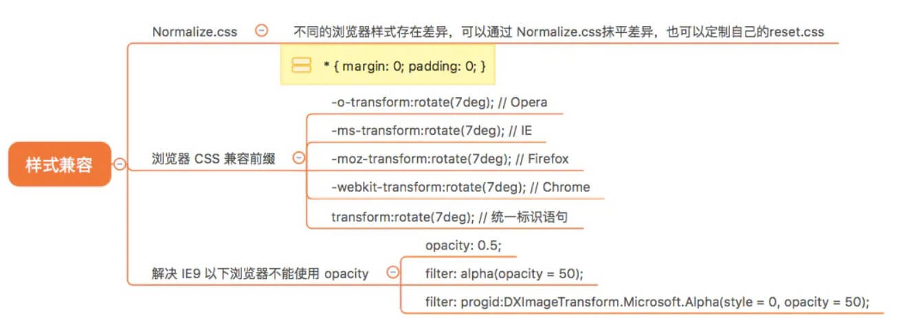
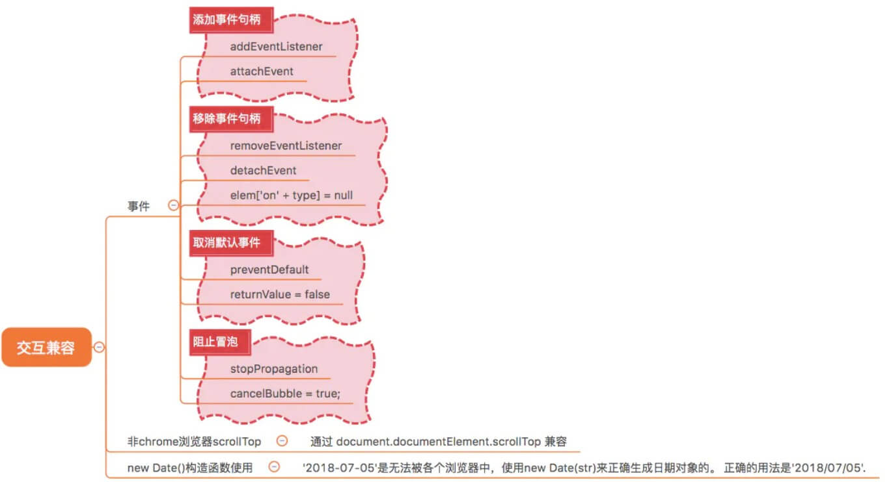
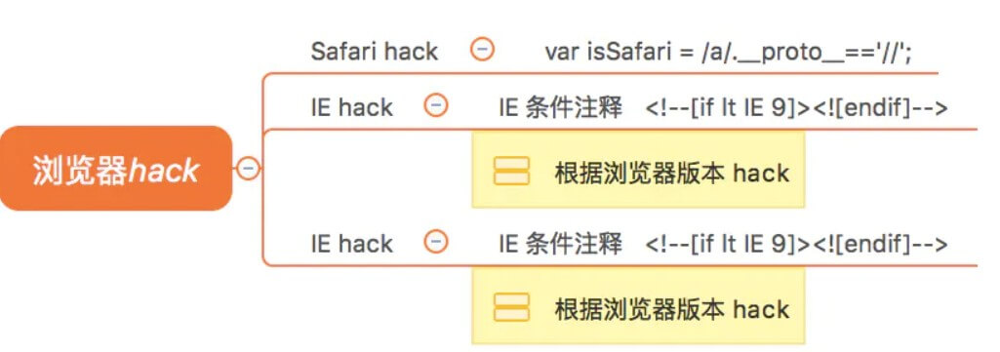

## CSS兼容性



1. **不同的浏览器样式存在差异，可以通过 Normalize.css 抹平差异，也可以定制自己的 reset.css**

2. **为部分css属性添加厂商前缀**

   | **内核** | **主要代表的浏览器** | **前缀** |
   | -------- | -------------------- | -------- |
   | Trident  | IE浏览器             | -ms      |
   | Gecko    | Firefox              | -moz     |
   | Presto   | Opera                | -o       |
   | Webkit   | Chrome和Safari       | -webkit  |

3. 在用到**透明属性**，解决 **IE9 以下**浏览器不能使用 **opacity**。

   ```css
    opacity: 0.5;
    filter: alpha(opacity = 50); //IE6-IE8我们习惯使用filter滤镜属性来进行实现
    filter: progid:DXImageTransform.Microsoft.Alpha(style = 0, opacity = 50); //IE4-IE9都支持滤镜写法progid:DXImageTransform.Microsoft.Alpha(Opacity=xx)
   ```


4. **td高度的问题 **

   table中td的宽度都不包含border的宽度，但是oprea和ff中td的高度包含了border的高度 。

   **解决**： 设置line-height和height一样。在ie中如果td中的没有内容，那么border将不会显示。

5. **对于360双核浏览器**

   可以添加以下头部meta信息可以使得网页用webkit内核渲染：

   ```html
   <meta http-equiv="X-UA-Compatible" content="IE=edge,chrome=1">
   ```

   * IE=edge：保持使用最高级别模式显示内容；

   * chrome=1：谷歌的外挂插件Google Chrome Frame（谷歌内嵌浏览器框架GCF），使用IE浏览网页时实际上是使用Chrome浏览器内核渲染，最低支持IE6，但前提是客户端已经安装GCF。

     但实际上这个meta标识是ie浏览器所识别的，并不是公认的标准，所以有时你会发现360并不能总是以chrome内核渲染你的按现代标准开发的网页。

     可以试试通过添加：**`<meta name="renderer" content="webkit">`**

     这个meta标识是360自家实现的(详情：[meta.html](https://link.juejin.cn/?target=http%3A%2F%2Fse.360.cn%2Fv6%2Fhelp%2Fmeta.html))，表示强制要求360浏览器用chrome的内核渲染网页。[se.360.cn/v6/help/met…](https://link.juejin.cn/?target=http%3A%2F%2Fse.360.cn%2Fv6%2Fhelp%2Fmeta.html)


6. **ie8的css兼容**

   * **使用meta标签调节浏览器的渲染方式：**

     IE8中有一个**“兼容性视图”**的概念，当初IE8发布时，相对于IE6/7已经做出了非常大的改进，但是很多老站点仅针对IE6/7进行了优化，使用IE8渲染反而会一团糟。IE8加入了“兼容性视图”功能，这样的话就可以在IE8中使用IE6或IE7的内核渲染页面。这个当然不是我们想要的，所以需要使用meta标签来**强制IE8使用最新的内核渲染页面**，代码如下：

     ```html
     <meta http-equiv="X-UA-Compatible" content="IE=edge,chrome=1">
     ```
     
     IE=edge表示强制使用IE最新内核，
     
      chrome=1表示如果安装了针对IE6/7/8等版本的浏览器插件Google Chrome Frame（可以让用户的浏览器外观依然是IE的菜单和界面，但用户在浏览网页时，实际上使用的是Chrome浏览器内核），那么就用Chrome内核来渲染。
     
      对比360：`<meta name="renderer" content="webkit">`

   * **ie8中的一些css 不支持**

     1. **ie8支持:`first-child`,但不支持:`last-child`。**

     2. **html5shiv.js**

        IE8不支持HTML5的新标签，如`<header>`、`<nav>`等标签在IE8无法渲染。html5shiv.js可帮助IE6-8浏览器兼容HTML5语义化标签。

        **使用方法**：在页面中引用html5shiv.js文件。必须添加在页面的`<head>`元素内，因为IE浏览器必须在元素解析前知道这个元素，所以这个js文件不能在页面底部引用。

     3. **Respond.js**

        IE8不支持CSS媒体查询，对响应式设计大大不利。Respond.js可帮助IE6-8兼容“**`min/max-width`**”媒体查询条件。

        使用方法：在页面中所有css文件的引用位置之后引用`Respond.js`。而且`Respond.js`的引用得越早，用户看到页面闪烁的机会越小。

     4. **CSS3字体单位“rem”兼容方案：`rem.js`**

        CSS3引入了新的字体大小单位rem，与em的“相对于其父元素来设置字体大小”的功能不同，rem是相对于根元素`<html>`的字体大小比率单位，成了目前主流的单位之一。IE9+开始支持，IE8就只能通过引入js库来支持了。

        使用方法：在页面中引用rem.js文件。需要引用在页脚，也就是`<body>`末尾，在所有css文件引用和DOM元素之后。

     5. **一些其它不支持的属性：**

        border-radius 圆角

        box-shadow 盒子阴影

        CSS3 Background 背景渐变

7. **placeholder**

   不支持ie10-以下的版本(可以通过使用一个span标签来模拟提示。)

## JS兼容性



1. **使用event对象**

   1. **用户不传参:**

      想要使用 event，我们就需要先使用如下语句　　

         `var e = arguments.callee.caller.arguments[0] || window.event`

         `arguments.callee.caller.arguments[0]:`

         函数体本身-->函数体的调用函数体--> function onclick()

        `argument.callee.caller.arguments[0]`即为传参集合的第一个形参event了.

   2. **传参(event)**

2. **获取目标元素**

   **兼容写法**：`event.srcElement ? event.srcElement : event.target;`

3. **attachEvent和addEventListener，事件兼容的问题，通常封装一个适配器的方法，过滤事件句柄绑定、移除、冒泡阻止以及默认事件行为处理**

   ```js
   var helper = {};
   // 绑定事件
   helper.on = function(target, type, handler){
       if(target.addEventListener){
           target.addEventListener(type,handler, false);
       }else{
           target.addEvent('on'+type,function(event){
               return handler.call(target,event);
           },false)
       }
   };
   //取消事件监听
   helper.remove = function(target,type,handler){
       if(target.removeEventListener){
           target.removeEventListener(type,handler);
       }else{
           target.detachEvent('on'+type,function(event){
               return handler.call(target,event)
           },true)
       }
   }
   ```

4. **new Date()构造函数使用，'2018-07-05'是无法被各个浏览器中，使用new Date(str)来正确生成日期对象的。 正确的用法是'2018/07/05'.**

5. **获取 scrollTop 通过 document.documentElement.scrollTop 兼容非chrome浏览器**

   ```js
    var scrollTop = document.documentElement.scrollTop||document.body.scrollTop;
   ```

6. **元素样式的设置和获取**

   * **style**：各大浏览器都兼容，能设置样式和获取样式，但是获取不了外部样式

     ```js
     el.style.attr(这样为获取);
     el.style.attr="值";
     ```

   * **currentStyle**: 该属性只兼容IE，不兼容火狐和谷歌

     ```js
     el.currentStyle.attr
     ```

   * **getComputedStyle**: 该属性是兼容火狐谷歌,不兼容IE8及以下

   通常使用 **`getComputedStyle`** 读取样式，通过 **`element.style `**修改样式。

   可选[pseudoElt]属性：指定一个要匹配的伪元素的字符串。不需要伪元素可以为null

   配合该属性可以从伪元素拉取样式信息：比如,**`::after, ::before`**

   ```js
   getComputedStyle(oDiv, '::after').content;
   //兼容性写法： 
   function getStyle(ele,attr){ 
       if(ele.currentStyle){ 
           return ele.currentStyle[attr] 
       }else{ 
           return getComputedStyle(obj,false)[attr] 
       } 
   }
   ```

7. **获取dom节点**：

   **`parentElement`** 获取对象层次中的父元素。

   **`parentNode`** 获取文档层次中的父结点。

   因为`parentElement`找的是**元素**，因此当找到根部document时候就是出现值为null的报错，而且`parentNode`找的是**节点**，当然就可以显示出来了！

8. **鼠标按键编码的兼容**

   W3C标准下：**0，1，2**分别代表左，中，右三个键;

   在ie11及以上 + 主流浏览器下 是符合W3C标准的，但是在ie10以及以下：

   左中右分别为：**1 4 2**

   ```js
   function but(evt){     
       var e = evt || window.event;    
       if(evt){       
           return e.button;     
       } else if (window.event){          
           switch(e.button){             
               case 1: 
                   return 0;             
               case 4: 
                   return 1;             
               case 2: 
                   return 2;          
           }     
       } 
   }
   ```

## 浏览器hack



1. **条件注释法(IE10+已经不支持条件注释)**

   大于 gt || 大于等于 gte || 小于 lt || 小于等于 lte(`<!--[if gte IE 8]><![endif]-->`)

   ```html
   <!DOCTYPE html> 
   <!--[if IE 8 ]> <html class="ie8" lang="en"> <![endif]--> 
   <!--[if IE 9 ]> <html class="ie9" lang="en"> <![endif]--> 
   <!--[if (gt IE 9)|!(IE)]><!--> 
   <html lang="en"> <!--<![endif]-->
   ```

2. **非IE(IE10+也能识别)，此处多加的<-->，在IE中被当作内部注释，而在非IE浏览器中会闭合之前的注释(<!--[if !IE]><--><![endif]-->)**

   ```html
   <!--[if !IE]><-->  
   <div class="box" id="box"></div> 
   <![endif]-->

