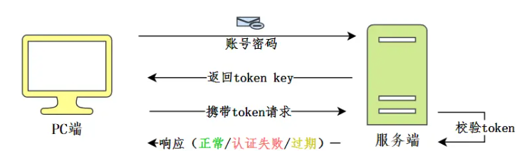
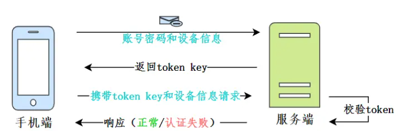
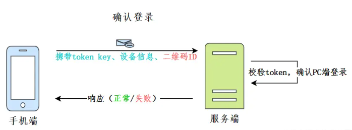
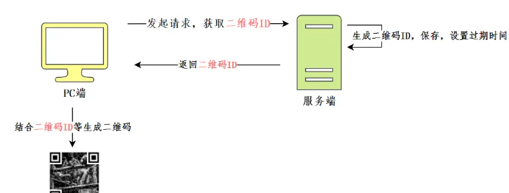
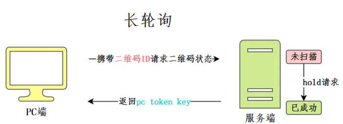
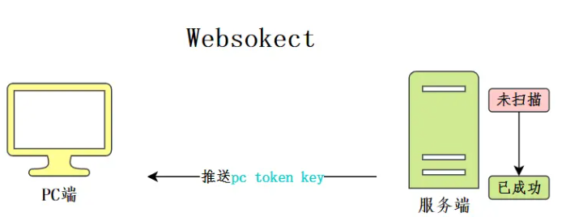
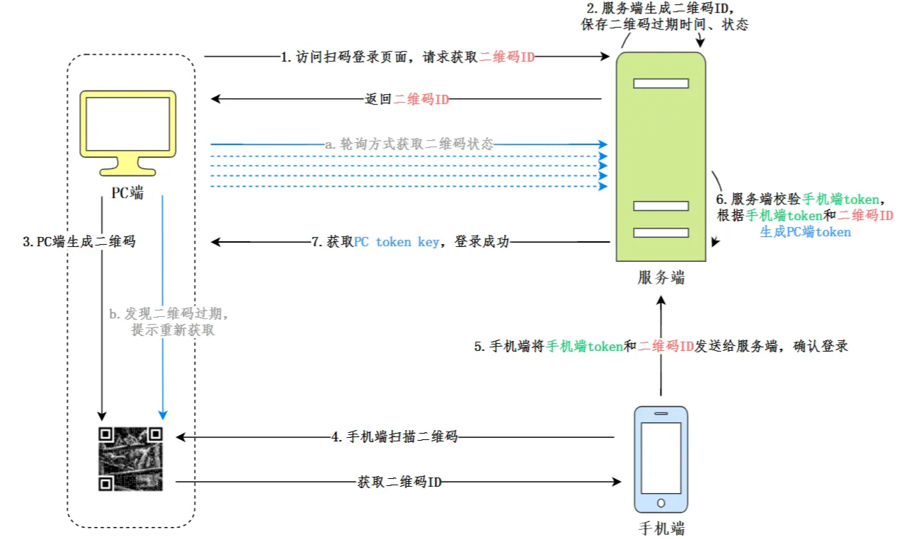

# 如何实现扫码登录

> 扫码登录涉及三种角色：`PC端`、`手机端`、`服务端`，两个问题：`手机端`如何完成认证、`PC端`如何完成登录

## 普通账号密码登录方式

如果用普通的账号密码方式登录认证，PC端通过账号密码完成认证，然后服务端给PC端同步返回token key之类的标识，PC端再次请求服务端，需要携带token key，用于标识和证明自己登录的状态。

服务端响应的时候，需要对token key进行校验，通过则正常响应；校验不通过，认证失败；或者token过期，PC端需要再次登录认证，获取新的token key。

## 扫码登录方式

### 一、手机端如何完成认证

#### 了解APP认证机制

首先，手机端一般是不会存储登录密码的，我们发现，只有装载APP，第一次登录的时候，才需要进行基于账号密码的登录，之后即使这个清理掉这个应用进程，甚至手机重启，都是不需要再次输入账号密码的，它可以自动登录。

这背后有一套基于`token`的认证机制，和PC有些类似，但又有一些不同。

1. APP登录认证的时候除了**账号密码**，还有**设备信息**
2. 账号密码校验通过，服务端会把账号与设备进行一个绑定，进行持久化的保存，包含了**账号ID，设备ID(应该是IMEI码(国际移动设备设别码))，设备类型**等等
3. APP每次请求除了携带token key，还需要携带设备信息

因为移动端的设备具备唯一性，可以为**每个客户端生成专属token，这个token也不用过期**，所以这就是我们可以一次登录，长久使用的原理

#### 手机扫码

1. `扫描二维码`：识别PC端展示的二维码，获取**二维码ID**

2. `确认登录`：手机端通过带认证信息(token key、设备信息)、二维码信息（二维码ID）请求服务端，完成认证过程，确认PC端的登录

   

### 二、PC端如何完成登录

#### 二维码生成

> 手机扫码这个过程，其实是对二维码的解码，获取二维码中包含的数据。
>
> 二维码是展示在我们的PC端，所以生成这个操作由**PC端去请求服务端，获取相应的数据，再由PC端生成这个二维码**。

二维码在我们这个场景里面是一个重要的媒介，**服务端必须给这个数据生成惟一的标识作为二维码ID，同时还应该设置过期的时间**。**PC端根据二维码ID等数据生成二维码**。

同时，服务端也应该保存二维码的一些状态：`未扫描`、`已成功`、`已失效`。

#### PC端如何完成登录

PC端通过token来标识登录状态。那么手机端扫码确认之后，服务端就应该给PC生成相应的token。那么，这个PC端又如何获取它所需的token key，来完成登录呢？

PC端可以通过获取二维码的状态来进行相应的响应：

- 二维码`未扫描`：无操作
- 二维码`已失效`：提示刷新二维码
- 二维码`已成功`：从服务端获取PC token

获取二维码状态，主要有三种方式：

##### 1.轮询

> 轮询方式是指客户端会每隔一段时间就主动给服务端发送一次二维码状态的查询请求。

##### 2.长轮询

> 长轮询是指客户端主动给服务端发送二维码状态的查询请求，服务端会按情况对请求进行阻塞，直至二维码信息更新或超时。当客户端接收到返回结果后，若二维码仍未被扫描，则会继续发送查询请求，直至状态变化（已失效或已成功）

##### 3.Websocket

> Websocket是指前端在生成二维码后，会与后端建立连接，一旦后端发现二维码状态变化，可直接通过建立的连接主动推送信息给前端。

## 总结扫码登录整体的实现流程

以常用的轮询方式获取二维码状态为例：

1. 访问PC端二维码生成页面，PC端请求服务端获取`二维码ID`
2. 服务端生成相应的`二维码ID`，设置二维码的过期时间，状态等。
3. PC获取`二维码ID`，生成相应的二维码。
4. 手机端扫描二维码，获取`二维码ID`。
5. 手机端将`手机端token`和`二维码ID`发送给服务端，确认登录。
6. 服务端校验`手机端token`，根据`手机端token`和`二维码ID`生成`PC端token`
7. PC端通过轮询方式请求服务端，通过`二维码ID`获取二维码状态，如果已成功，返回`PC  token`和用户信息，登录成功。

