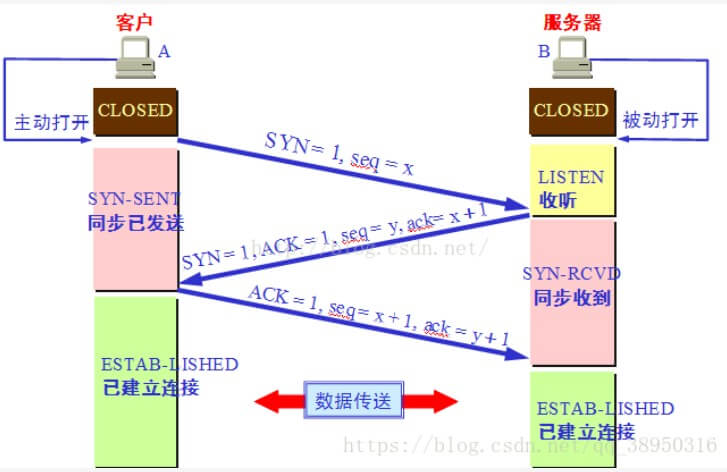

## HTTP 状态码知道哪些？分别什么意思？

状态码：由3位数字组成，第一个数字定义了响应的类别

**1xx：指示信息，表示请求已接收，需要请求者继续执行操作**

**2xx：成功，表示请求已被成功接受，处理。**

```
200 OK：客户端请求成功
202 ：服务器已接受请求，但尚未处理
204 No Content：无内容。服务器成功处理，但未返回内容。一般用在只是客户端向服务器发送信息，而服务器不用向客户端返回什么信息的情况。不会刷新页面。
206 Partial Content：服务器已经完成了部分GET请求（客户端进行了范围请求）。响应报文中包含Content-Range指定范围的实体内容
```

**3xx：重定向**

```text
301 Moved Permanently：永久重定向，表示请求的资源已经永久的搬到了其他位置。

302 Found：临时重定向，表示请求的资源临时搬到了其他位置

303 See Other：临时重定向，应使用GET定向获取请求资源。303功能与302一样，区别只是303明确客户端应该使用GET访问

307 Temporary Redirect：临时重定向，和302有着相同含义。POST不会变成GET

304 Not Modified：表示客户端发送附带条件的请求（GET方法请求报文中的IF…）时，条件不满足。返回304时，不包含任何响应主体。虽然304被划分在3XX，但和重定向一毛钱关系都没有

```

**4xx：客户端错误**

```
400 Bad Request：客户端请求有语法错误，服务器无法理解。
401 Unauthorized：请求未经授权，要求用户的身份认证，这个状态代码必须和WWW-Authenticate报头域一起使用。
403 Forbidden：服务器收到请求，但是拒绝提供服务
404 Not Found：请求资源不存在。比如，输入了错误的url
415 Unsupported media type：不支持的媒体类型
```

**5xx：服务器端错误，服务器未能实现合法的请求。**

```
500 Internal Server Error：服务器发生不可预期的错误。
503 Server Unavailable：服务器当前不能处理客户端的请求，一段时间后可能恢复正常
```

## 长轮询和短轮询

1. 短轮询(Polling)的实现思路就是浏览器端**每隔几秒钟向服务器端发送http请求，服务端在收到请求后，不论是否有数据更新，都直接进行响应。**在服务端响应完成，就会**关闭这个Tcp连接**。

- 优点：就是兼容性比较好，只要支持http协议就可以实现该方式。
- 缺点：很明显消耗资源，因为下一次的建立Tcp是非常消耗资源的，服务器端响应后就会关闭这个Tcp连接。

```javascript
function LongAjax() {
    fetch(url).then(data => {
        // 数据正确拿到后，dosometing
        
    }).catch(err => {
        // 发现错误，比如返回的数据为空等。
        console.log(err);
    });
}
setInterval(LongAjax, 5000);
```

2. 长轮询：客户端发送请求后服务器端**不会立即**返回数据，服务器端会**阻塞请求**连接不会**立即断开**，直到服务器端**有数据更新或者是连接超时**才返回，客户端才再次发出请求新建连接、如此反复从而获取最新数据。

   ```javascript
   function LongAjax() {
       fetch(url).then(data => {
       	// 数据正确拿到后，
           LongPolling();
       }).catch(err => {
       	// 出错或者就是超时间
           LongPolling();
           
       });
   }
   LongAjax()
   ```

   - 优点：长轮询与短轮询相比，明显**减少了很多不必要的http请求**，节约资源。
   - 缺点：连接挂起也会导致资源的浪费，停留在服务器端。

## 浏览器 缓存有哪几种？

浏览器缓存是性能优化的一个重要手段，对于理解缓存机制而言也是很重要的

### 强缓存

强缓存两个相关字段，**「Expires」**，**「Cache-Control」**

**「强缓存分为两种情况，一种是发送HTTP请求，一种不需要发送。」**

首先检查强缓存，这个阶段**不需要发送HTTP请求。**通过查找不同的字段来进行，不同的HTTP版本所以不同。

HTTP1.0版本，使用的是Expires，HTTP1.1使用的是Cache-Control

#### Expires

* `Expires`即**过期时间，时间是相对于服务器的时间而言的，存在于服务端返回的响应头中**，在这个过期时间之前可以直接从缓存里面获取数据，无需再次请求,过期时就会重新向服务器发起请求。比如下面这样:

  ```
  Expires:Mon, 29 Jun 2020 11:10:23 GMT
  ```

  这个方式有一个问题：**「服务器的时间和浏览器的时间可能并不一致」**，所以HTTP1.1提出新的字段代替它。

#### Cache-Control

* 这个字段采用的时间是**过期时长**，对应的是**max-age**。下面代表该资源返回后6000秒，可以直接使用缓存

  ```
  Cache-Control:max-age=6000
  ```

注意点：

- 当Expires和Cache-Control同时存在时，优先考虑Cache-Control。
- 当然了，当缓存资源失效了，也就是没有命中强缓存，接下来就进入协商缓存

### 协商缓存

**强缓存失效后，浏览器在请求头中携带响应的`缓存Tag`来向服务器发送请求，服务器根据对应的tag，来决定是否使用缓存**。

缓存分为两种，**「Last-Modified」** 和 **「ETag」**。两者各有优势，并不存在谁对谁有`绝对的优势`，与上面所讲的强缓存两个Tag所不同。

#### **Last-Modified **

*  **Last-Modified **

  这个字段表示的是**「最后修改时间」**。在浏览器第一次给服务器发送请求后，**服务器会在响应头中加上这个字段 **。浏览器接收到后，**「如果再次请求」**，会在请求头中携带`If-Modified-Since`字段，这个字段的值也就是服务器传来的最后修改时间。

  服务器拿到请求头中的`If-Modified-Since`的字段后，其实会和这个服务器中`该资源的最后修改时间`对比:

  - 如果请求头中的这个值小于最后修改时间，说明是时候更新了。返回新的资源，跟常规的HTTP请求响应的流程一样。
  - 否则返回304，告诉浏览器直接使用缓存

####  **ETag **

*  **ETag **

  **ETag是服务器根据当前文件的内容，对文件生成唯一的标识**，比如MD5算法，只要里面的内容有改动，这个值就会修改，服务器通过把响应头把该字段给浏览器。浏览器接受到ETag值，会在下次请求的时候，将这个值作为**「If-None-Match」**这个字段的内容，发给服务器。服务器接收到**「If-None-Match」**后，会跟服务器上该资源的**「ETag」**进行比对

  - 如果两者一样的话，直接返回304，告诉浏览器直接使用缓存，
  - 如果不一样的话，说明内容更新了，返回新的资源，跟常规的HTTP请求响应的流程一样

**两者对比 **

性能上，`Last-Modified`优于`ETag`，`Last-Modified`记录的是时间点，而`Etag`需要根据文件的MD5算法生成对应的hash值。

精度上，`ETag``Last-Modified``ETag``Last-Modified`

- 编辑了资源文件，但是文件内容并没有更改，这样也会造成缓存失效。
- Last-Modified 能够感知的单位时间是秒，如果文件在 1 秒内改变了多次，那么这时候的 Last-Modified 并没有体现出修改了。

**「如果两种方式都支持的话，服务器会优先考虑ETag」**

### 缓存位置

接下来我们考虑使用缓存的话，缓存的位置在哪里呢

**浏览器缓存的位置分为四种**,优先级从高到低排列分别👇

- Service Worker
- Memory Cache
- Disk Cache
- Push Cache

#### Service Worker

​	这个应用场景比如PWA，它借鉴了Web Worker思路，由于它脱离了浏览器的窗体，因此无法直接访问DOM。它能完成的功能比如：**`离线缓存`、`消息推送`和`网络代理`**，其中`离线缓存`就是**「Service Worker Cache」**。

#### Memory Cache

​	内存缓存，从效率上讲它是最快的，从存活时间来讲又是最短的，当渲染进程结束后，内存缓存也就不存在了。

#### Disk Cache

​	存储在磁盘中的缓存，从存取效率上讲是比内存缓存慢的，优势在于存储容量和存储时长

​	两者对比，主要的策略👇

​		内容使用率高的话，文件优先进入磁盘

​		比较大的JS，CSS文件会直接放入磁盘，反之放入内存

#### Push Cache

​	推送缓存

#### 总结

- 首先检查`Cache-Control`， 尝鲜，看强缓存是否可用。如果可用的话，直接使用
- 否则进入协商缓存，发送HTTP请求，服务器通过请求头中的`If-Modified-Since`或者`If-None-Match`字段检查资源是否更新
- 资源更新，返回资源和200状态码。
- 否则，返回304，直接告诉浏览器直接从缓存中去资源。

## GET 和 POST 的区别

1. GET在浏览器回退时是无害的，而POST会再次提交请求。

2. POST更**安全**（不会作为`url`的一部分，不会被cache缓存、保存在服务器日志、以及浏览器浏览记录中），除非手动设置。

   GET请求参数会被完整保留在浏览器历史记录里，而POST中的参数不会被保留。

3. GET请求只能进行`url`编码，而POST支持多种编码方式

   1. **application/x-www-form-urlencoded**

      最常见的 POST 提交数据的方式，浏览器的原生 form 表单，如果不设置 enctype属性，那么最终就会默认以 application/x-www-form-urlencoded 方式提交数据。提交的数据按照 key1=val1&key2=val2 的方式进行编码，key 和 val 都进行了 URL 转码

      ```js
      xhr.open("POST","http://www.example.com",true);
      xhr.setRequestHeader("Content-Type", "application/x-www-form-urlencoded");
      ```

   2. **multipart/form-data**

      这种方式一般用来上传文件

      ```js
      xhr.open("POST","http://www.example.com",true);
      xhr.setRequestHeader("Content-Type", "multipart/form-data");
      ```

   3. **application/json**

      application/json 用来告诉服务端消息主体是序列化后的 JSON 字符串

      ```js
      xhr.open("POST","http://www.example.com",true);
      xhr.setRequestHeader("Content-Type", "application/json");
      ```

   4. **text/xml**

      它是一种使用 HTTP 作为传输协议，XML 作为编码方式的远程调用规范,它的使用也很广泛，能很好的支持已有的 XML-RPC 服务。不过，XML 结构还是过于臃肿，一般场景用 JSON 会更灵活方便。

      ```js
      xhr.open("POST","http://www.example.com",true);
      xhr.setRequestHeader("Content-Type", "text/xml");
      ```

4. POST发送的数据更大（GET有`url`长度限制）,GET请求大小一般是(1024字节)，http协议并没有限制，而与服务器，操作系统有关，POST理论上来说没有大小限制，http协议规范也没有进行大小限制，但实际上post所能传递的数据量根据取决于服务器的设置和内存大小。

5. **对参数的数据类型，POST能发送更多的数据类型（GET只能发送ASCII字符）**。

6. POST用于**修改**和**写入数据**，GET一般用于 **搜索排序 **和 **筛选** 之类的操作

7. GET比POST更快，因为：

   1. **POST请求包含更多的请求头**。 POST需要在请求的body部分包含数据，所以会多了几个数据描述部分的首部字段（如：content-type）

   2. **最重要的一条，post在真正接收数据之前会先将请求头发送给服务器进行确认，然后才真正发送数据**

      **post请求的过程**：
      （1）浏览器请求tcp连接（第一次握手）
      （2）服务器答应进行tcp连接（第二次握手）
      （3）浏览器确认，并发送post请求头（第三次握手，这个报文比较小，所以http会在此时进行第一次数据发送）
      （4）服务器返回100 Continue响应
      （5）浏览器发送数据
      （6）服务器返回200 OK响应
      **get请求的过程**：
      （1）浏览器请求tcp连接（第一次握手）
      （2）服务器答应进行tcp连接（第二次握手）
      （3）浏览器确认，并发送get请求头和数据（第三次握手，这个报文比较小，所以http会在此时进行第一次数据发送）
      （4）服务器返回200 OK响应


## tcp三次握手和四次握手(挥手)




**一次握手**

- 客户端会随机**初始化序号seq**（`client_isn`），将此序号置于 TCP 首部的「序号」字段中，同时**把 `SYN` 标志位置为 `1`** ，表示 `SYN` 报文。接着把第一个 SYN 报文发送给服务端，**表示向服务端发起连接**，该报文不包含应用层数据，之后客户端处于 `SYN-SENT` 状态。

**二次握手**

- 服务端收到客户端的 `SYN` 报文后，首先服务端也随机**初始化自己的序号seq**（`server_isn`），将此序号填入 TCP 首部的「序号」字段中，其次把 TCP 首部的**「确认应答号」字段填入 `client_isn + 1`**, 接着**把 `SYN` 和 `ACK` 标志位置为 `1`**。最后把该报文发给客户端，该报文也不包含应用层数据，之后服务端处于 `SYN-RCVD` 状态。

**三次握手**

- 客户端收到服务端报文后，还要向服务端回应最后一个应答报文，首先该应答报文 TCP 首部 **`ACK` 标志位置为 `1`** ，其次**「确认应答号」字段填入 `server_isn + 1`** ，最后把报文发送给服务端，**这次报文可以携带客户到服务器的数据**，之后客户端处于 `ESTABLISHED` 状态。

**那么为什么要三次握手呢？两次不行吗？**

- 为了防止服务器端开启一些无用的连接增加服务器开销
- 防止已失效的连接请求报文段突然又传送到了服务端，因而产生错误


**一次挥手**

客户端打算关闭连接，此时会发送一个 TCP 首部 **`FIN` 标志位被置为 `1`** 的报文，也即 `FIN` 报文，之后客户端进入 `FIN_WAIT_1` 状态。

**二次挥手**

服务端收到该报文后，就向客户端发送 **`ACK` 应答报文**，接着服务端进入 `CLOSED_WAIT` 状态

**三次挥手**

客户端收到服务端的 `ACK` 应答报文后，之后进入 `FIN_WAIT_2` 状态。等待服务端处理完数据后，也向客户端发送 `FIN` 报文，之后服务端进入 `LAST_ACK` 状态。

**四次挥手**

客户端收到服务端的 `FIN` 报文后，回一个 `ACK` 应答报文，之后进入 `TIME_WAIT` 状态

服务器收到了 `ACK` 应答报文后，就进入了 `CLOSED` 状态，至此服务端已经完成连接的关闭。

客户端在经过 `2MSL` 一段时间后，自动进入 `CLOSED` 状态，至此客户端也完成连接的关闭。

**为什么要挥手四次？**

关闭连接时，客户端向服务端发送 `FIN` 时，仅仅表示客户端不再发送数据了但是还能接收数据。

服务器收到客户端的 `FIN` 报文时，先回一个 `ACK` 应答报文，而服务端可能还有数据需要处理和发送，等服务端不再发送数据时，才发送 `FIN` 报文给客户端来表示同意现在关闭连接。

**为什么客户端在TIME-WAIT阶段要等2MSL？**

为的是确认服务器端是否收到客户端发出的 ACK 确认报文，当客户端发出最后的 ACK 确认报文时，并不能确定服务器端能够收到该段报文。

2MSL**最大报文段生存的时间**
